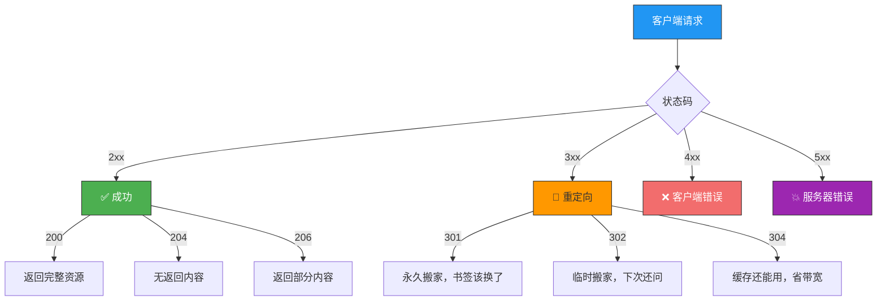
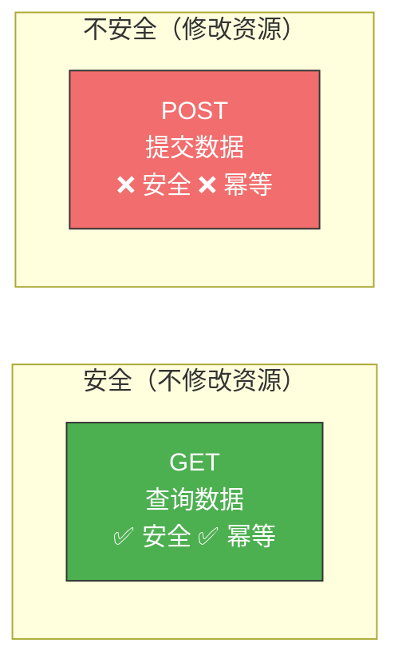
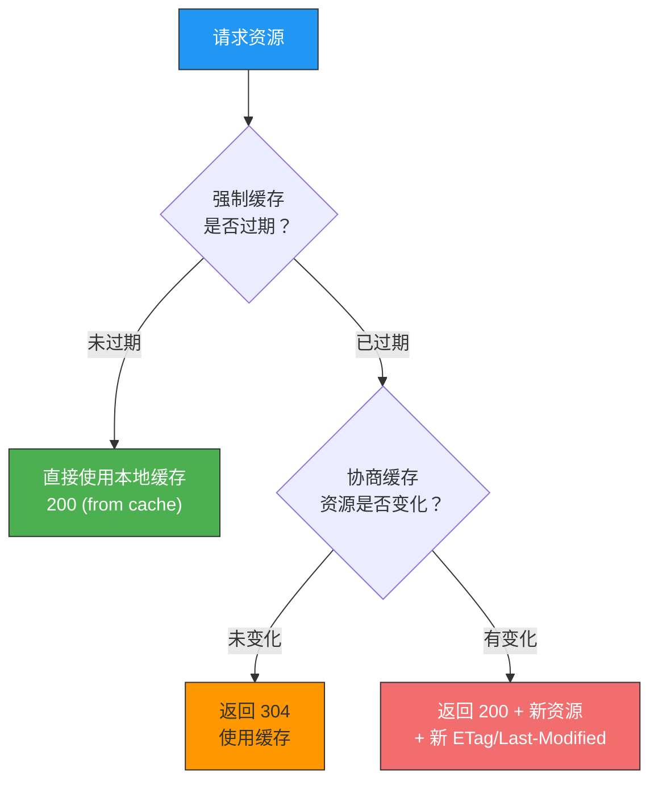
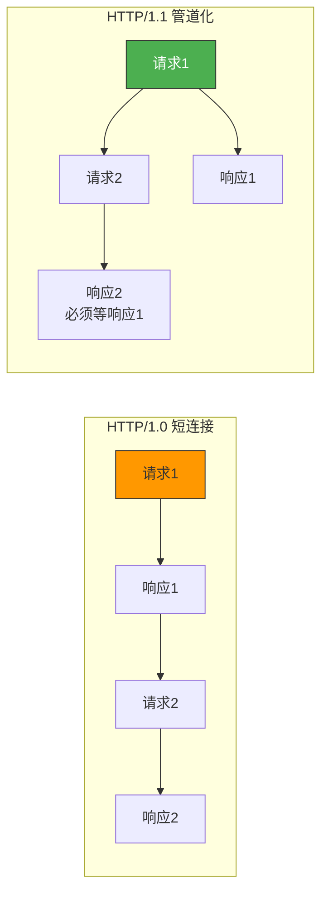
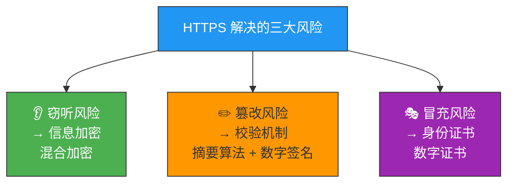
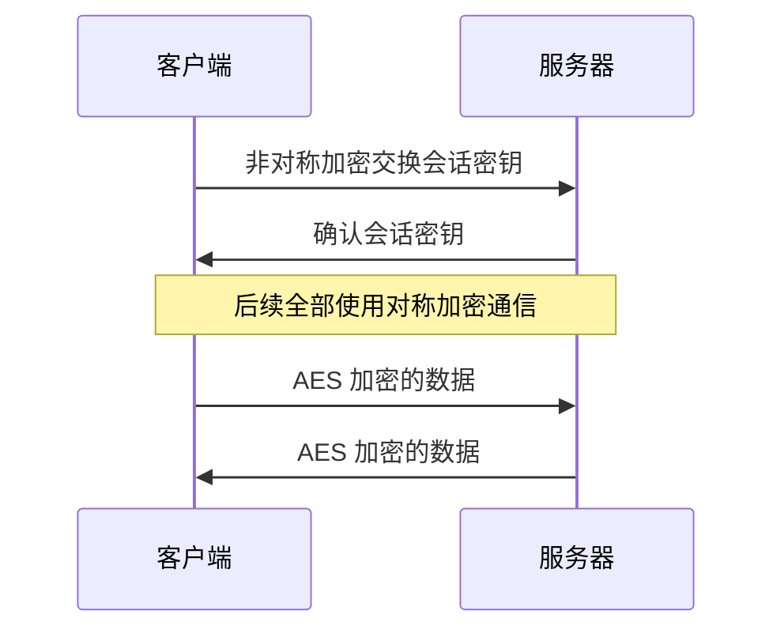
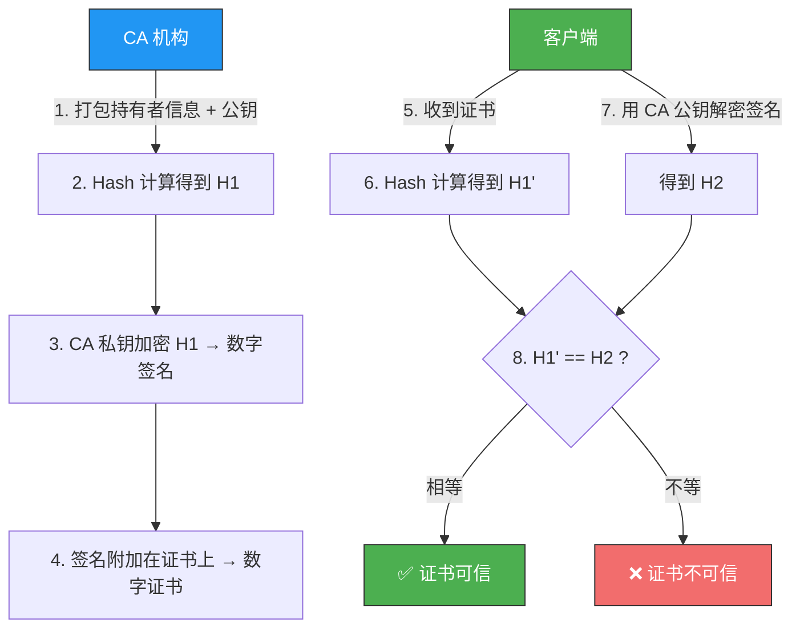
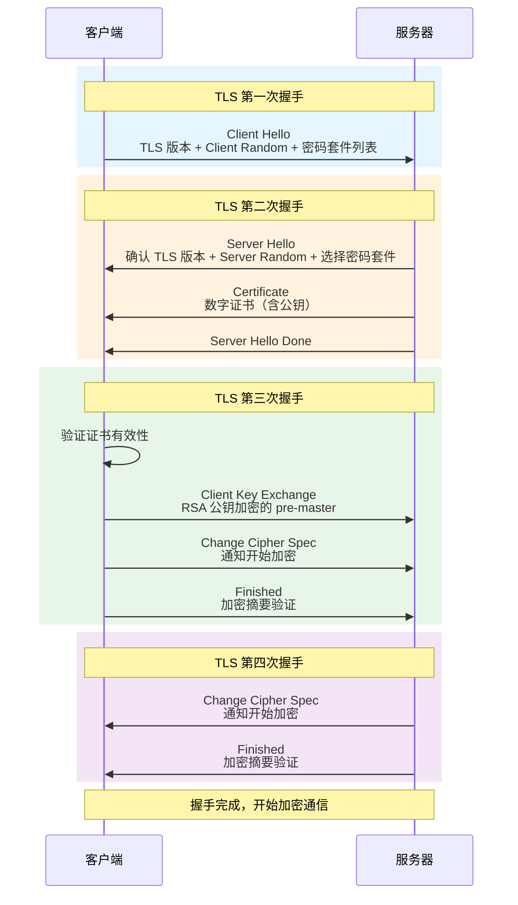

# HTTP常见面试题

> HTTP 面试题是网络方向的高频考点，几乎覆盖了从基本概念到 HTTPS 安全机制的方方面面。
> 掌握这些，面试中网络环节基本无压力。

## 一、HTTP 基本概念

### 1.1 HTTP 是什么？

HTTP 全称 **HyperText Transfer Protocol**（超文本传输协议），拆开理解三个关键词：

| 关键词 | 含义 |
|--------|------|
| **协议** | 必须有 ≥ 2 个参与者，且对参与者有行为约定和规范 |
| **传输** | 两点之间双向传输数据，中间允许中转/接力 |
| **超文本** | 超越普通文本——文字、图片、视频的混合体，最关键的是有**超链接**，能跳转到另一个超文本 |

::: important 常见误区
"HTTP 是用于从互联网服务器传输超文本到本地浏览器的协议"——这种说法**不准确**。HTTP 通信双方不一定非得是浏览器和服务器，也可以是服务器与服务器之间。应描述为**两点之间**传输超文本的约定和规范。
:::

### 1.2 HTTP 常见状态码

状态码是服务器对请求的处理结果"打分"，五大类一目了然：

| 类别 | 含义 | 常见状态码 |
|------|------|-----------|
| **1xx** | 提示信息，中间状态 | 较少使用 |
| **2xx** | 服务器成功处理请求 | **200 OK**（正常）、**204 No Content**（无 body）、**206 Partial Content**（断点续传） |
| **3xx** | 重定向 | **301**（永久重定向）、**302**（临时重定向）、**304**（缓存重定向） |
| **4xx** | 客户端报文有误 | **400**（笼统错误）、**403**（禁止访问）、**404**（资源不存在） |
| **5xx** | 服务器内部错误 | **500**（笼统错误）、**502**（网关错误）、**503**（服务忙） |



### 1.3 HTTP 常见字段

| 字段 | 作用 | 示例 |
|------|------|------|
| **Host** | 指定服务器域名 | `Host: www.example.com` |
| **Content-Length** | 表明回应数据长度 | `Content-Length: 1000` |
| **Connection** | 用于 Keep-Alive 长连接 | `Connection: Keep-Alive` |
| **Content-Type** | 告诉客户端数据格式 | `Content-Type: text/html; charset=utf-8` |
| **Accept** | 客户端声明可接受的数据格式 | `Accept: */*` |
| **Content-Encoding** | 说明数据压缩方法 | `Content-Encoding: gzip` |
| **Accept-Encoding** | 客户端声明可接受的压缩方法 | `Accept-Encoding: gzip, deflate` |

> HTTP 通过回车符/换行符作为 header 边界，Content-Length 作为 body 边界，**解决 TCP "粘包"问题**。

---

## 二、GET 与 POST

### 2.1 核心区别

| 对比项 | GET | POST |
|--------|-----|------|
| **语义** | 从服务器获取指定资源 | 根据请求负荷对资源做出处理 |
| **参数位置** | URL 中（查询字符串） | 报文 body 中 |
| **参数格式** | 只允许 ASCII 字符 | 任意格式，客户端服务端协商 |
| **长度限制** | 浏览器对 URL 长度有限制 | 浏览器不对 body 大小做限制 |
| **安全性** | 安全（不破坏服务器资源） | 不安全（会修改服务器资源） |
| **幂等性** | 幂等（多次操作结果相同） | 不幂等（多次提交创建多个资源） |
| **可缓存** | 可缓存，可保存为书签 | 一般不缓存，不能保存为书签 |

::: important 重要澄清
- RFC 规范**并没有禁止** GET 请求带 body
- URL 中的查询参数**也不是 GET 独有**，POST 请求 URL 也可以有参数
- POST 用 body 传输 ≠ 比 GET 更安全。HTTP 传输都是明文，抓包都能看到，**要用 HTTPS 才安全**
:::

### 2.2 GET 和 POST 的安全与幂等



---

## 三、HTTP 缓存技术

### 3.1 强制缓存

只要浏览器判断缓存没有过期，就直接使用本地缓存（返回 200，Size 标识 `from disk cache`）。

| 字段 | 类型 | 优先级 |
|------|------|--------|
| **Cache-Control** | 相对时间（如 `max-age=3600`） | 更高 |
| **Expires** | 绝对时间（如 `Wed, 21 Oct 2025 07:28:00 GMT`） | 更低 |

### 3.2 协商缓存

与服务器协商后，判断是否使用本地缓存（返回 304）。

| 实现方式 | 响应头 | 请求头 | 特点 |
|----------|--------|--------|------|
| 基于时间 | `Last-Modified` | `If-Modified-Since` | 粒度为秒级，可能不精确 |
| 基于标识 | `ETag` | `If-None-Match` | 唯一标识，更精确 |

::: tip ETag 优先级更高的原因
1. 文件内容未变但修改时间可能变（如重新保存）
2. 秒级以内修改无法检测
3. 某些服务器无法精确获取修改时间
:::

### 3.3 缓存工作流程



---

## 四、HTTP 特性

### 4.1 HTTP/1.1 优点

| 优点 | 说明 |
|------|------|
| **简单** | header + body，key-value 文本形式，易于理解 |
| **灵活和易于扩展** | 请求方法、URI、状态码、头字段都可自定义扩充；下层可随意变化（如 HTTPS 加了 SSL/TLS 层，HTTP/3 改用 UDP） |
| **应用广泛和跨平台** | 天然跨平台，从浏览器到移动端到 IoT 设备全覆盖 |

### 4.2 HTTP/1.1 缺点

| 缺点 | 说明 | 解决方案 |
|------|------|----------|
| **无状态** | 减轻服务器负担，但关联操作麻烦 | Cookie 技术 |
| **明文传输** | 方便调试但信息裸奔，容易泄露 | HTTPS |
| **不安全** | 窃听风险、篡改风险、冒充风险 | HTTPS |

### 4.3 HTTP/1.1 性能

**长连接**：解决了 HTTP/1.0 短连接反复建立 TCP 的开销。默认 `Connection: Keep-Alive`。

**管道网络传输**：可在同一 TCP 连接中，不必等第一个请求回来就发第二个。但服务器必须按顺序响应 → **响应队头阻塞**。



::: warning 管道化的局限
管道化技术**不是默认开启**的，浏览器基本都没有支持。因为队头阻塞问题太严重——前面一个请求卡住，后面全部排队等着。
:::

---

## 五、HTTP 与 HTTPS

### 5.1 区别一览

| 对比项 | HTTP | HTTPS |
|--------|------|-------|
| 传输方式 | 明文传输 | 加密传输（SSL/TLS） |
| 连接建立 | TCP 三次握手即可 | TCP 握手 + SSL/TLS 握手 |
| 默认端口 | 80 | 443 |
| 证书 | 不需要 | 需要 CA 数字证书 |

### 5.2 HTTPS 解决的三大风险



### 5.3 混合加密

HTTPS 采用**混合加密**策略：

- **非对称加密**（RSA/ECDHE）：交换密钥，保证密钥本身安全传输
- **对称加密**（AES）：用协商出的会话密钥加密实际数据，速度快



### 5.4 数字签名与数字证书

**数字签名原理**：

| 用途 | 操作 | 保证 |
|------|------|------|
| 内容加密 | 公钥加密，私钥解密 | 内容传输安全 |
| 身份认证 | 私钥加密（签名），公钥解密（验签） | 消息来源可靠 |

**数字证书验证流程**：



### 5.5 证书信任链

实际上证书通常不是根证书直接签发的，而是由**中间证书**签发，形成三级信任链：

```
根证书（GlobalSign Root CA）→ 中间证书 → 终端证书（baidu.com）
```

::: tip 为什么需要证书链？
根证书是整个信任体系的根基，一旦失守，所有下级证书都不可信。所以根证书被严格隔离，几乎不直接签发终端证书，而是通过中间证书间接签发——即使中间证书出问题，吊销即可，不影响根证书。
:::

---

## 六、TLS 握手过程（基于 RSA）



**三个随机数的作用**：Client Random + Server Random + pre-master → 协商算法生成**会话密钥**，用于后续对称加密。

::: warning RSA 握手的缺陷
RSA 握手**不支持前向保密（Forward Secrecy）**。一旦服务端私钥泄漏，过去被截获的所有 TLS 通信密文都可以被破解。这促使了 **ECDHE 密钥协商算法**的出现。
:::

---

## 七、HTTP/1.1 → HTTP/2 → HTTP/3 演变

| 版本 | 核心改进 | 遗留问题 |
|------|----------|----------|
| HTTP/1.1 | 长连接、管道化 | 队头阻塞、Header 冗余 |
| HTTP/2 | 头部压缩、二进制帧、多路复用、服务器推送 | TCP 层队头阻塞 |
| HTTP/3 | 基于 QUIC(UDP)，无队头阻塞、0-RTT、连接迁移 | 生态仍在发展中 |

---

::: tip 面试速查
- **Q：HTTP 是什么？** A：两点之间传输超文本数据的约定和规范，是超文本传输协议。
- **Q：GET 和 POST 的区别？** A：语义不同（获取 vs 处理）、参数位置不同（URL vs body）、安全/幂等/缓存属性不同。POST 用 body 不等于更安全，HTTPS 才安全。
- **Q：HTTP 状态码有哪些？** A：2xx 成功（200/204/206）、3xx 重定向（301/302/304）、4xx 客户端错（400/403/404）、5xx 服务端错（500/502/503）。
- **Q：强制缓存和协商缓存的区别？** A：强制缓存未过期直接用（200 from cache），协商缓存需问服务器（304）。ETag 优先于 Last-Modified。
- **Q：HTTPS 解决了什么问题？** A：窃听（混合加密）、篡改（摘要+签名）、冒充（数字证书）。
- **Q：RSA 握手的缺陷？** A：不支持前向保密，私钥泄漏可破解所有历史通信。
:::

---

::: info 原著参考
- 小林coding《图解网络》—— [HTTP 常见面试题](https://xiaolincoding.com/network/2_http/http_interview.html)
:::
