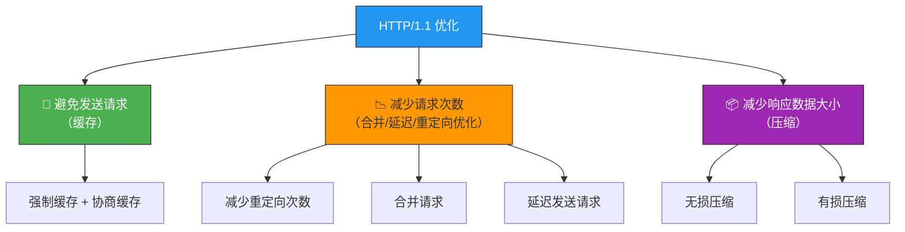
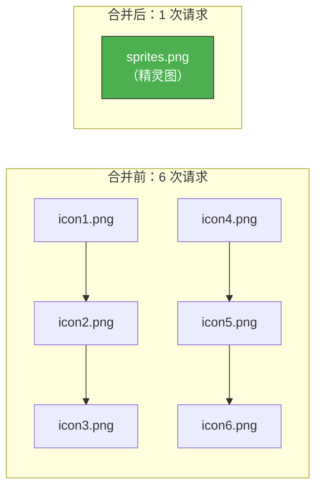

# HTTP/1.1 如何优化？

> 不管怎么优化 HTTP/1.1 协议都是有限的——这也是 HTTP/2 和 HTTP/3 出现的原因。
> 但在无法升级协议的场景下，掌握 HTTP/1.1 的优化手段依然是基本功。

## 一、优化三大思路

HTTP/1.1 的优化，归结起来就三条路：



---

## 二、避免发送请求——缓存

缓存是性能优化的"万能钥匙"，小到 CPU Cache、Page Cache，大到 HTTP 缓存，核心思想都是**用空间换时间**。

### 2.1 强制缓存

浏览器判断缓存未过期 → 直接使用本地缓存，不发送网络请求。

**关键字段**：

| 字段 | 类型 | 示例 |
|------|------|------|
| `Cache-Control: max-age=3600` | 相对时间，优先级更高 | 距上次请求 3600 秒内有效 |
| `Expires: Wed, 21 Oct 2025 07:28:00 GMT` | 绝对时间 | 到该时间点前有效 |

```
GET /index.html HTTP/1.1
Host: www.example.com

---

HTTP/1.1 200 OK
Cache-Control: max-age=3600
Content-Type: text/html
```

### 2.2 协商缓存

缓存过期后，客户端带上缓存标识问服务器："我的缓存还新鲜吗？"

- 服务器对比后没变化 → 返回 **304 Not Modified**（不含 body，省带宽）
- 有变化 → 返回 **200** + 最新资源 + 新的 ETag/Last-Modified

```
GET /index.html HTTP/1.1
Host: www.example.com
If-None-Match: "abc123"

---

HTTP/1.1 304 Not Modified
ETag: "abc123"
```

### 2.3 缓存决策流程

```mermaid
graph TB
    REQ["请求资源"] --> CC{Cache-Control<br/>是否过期？}
    CC -->|"未过期"| LOCAL["✅ 直接用本地缓存<br/>200 (from disk cache)"]
    CC -->|"已过期"| ETAG{发送协商缓存请求<br/>带 If-None-Match"}
    ETAG -->|"资源未变"| R304["304 Not Modified<br/>用缓存，省带宽"]
    ETAG -->|"资源已变"| R200["200 OK<br/>返回新资源 + 新 ETag"]

    style REQ fill:#2196F3,stroke:#333,color:#fff
    style LOCAL fill:#4CAF50,stroke:#333,color:#fff
    style R304 fill:#FF9800,stroke:#333,color:#333
    style R200 fill:#f26d6d,stroke:#333,color:#fff
```

::: tip 缓存策略建议
- 静态资源（JS/CSS/图片）：使用强制缓存 + 文件名加 hash（内容变则 hash 变，hash 变则 URL 变，绕过缓存）
- HTML 文件：使用协商缓存（确保用户总能拿到最新版本）
:::

---

## 三、减少请求次数

### 3.1 减少重定向请求次数

资源迁移后，服务器返回 `302` + `Location` 头部，客户端需再次发起新请求。如果中间有代理服务器，还会多一次消息传递。

**优化方案**：

| 方案 | 说明 |
|------|------|
| 代理服务器处理重定向 | 减少客户端与代理间的消息传递次数 |
| 使用 301/308 可缓存重定向 | 客户端缓存重定向规则，后续自动用新 URL 替代旧 URL |

**常见重定向状态码**：

| 状态码 | 类型 | 可缓存 | 是否允许改请求方法 |
|--------|------|--------|--------------------|
| 301 | 永久重定向 | ✅ | 否（POST→GET） |
| 302 | 临时重定向 | ❌ | 否（POST→GET） |
| 307 | 临时重定向 | ❌ | ✅ 保持原方法 |
| 308 | 永久重定向 | ✅ | ✅ 保持原方法 |

::: important 301 vs 302 的坑
301 是永久重定向，浏览器会**缓存**这个规则，下次直接访问新 URL。如果你的重定向只是临时的，千万别用 301，否则想改回来时用户浏览器还在访问旧地址。
:::

### 3.2 合并请求

将多个小资源请求合并为一个大资源请求：

| 方式 | 说明 |
|------|------|
| **CSS Sprite（精灵图）** | 多个小图标合并成大图片，用 CSS 裁切显示 |
| **Webpack 打包** | 将 JS、CSS 合并打包成大文件 |
| **Base64 编码嵌入** | 图片二进制用 base64 编码后嵌入 HTML，随 HTML 一并发送 |



::: warning 合并请求的代价
某一个小资源变化，客户端必须重新下载整个大资源文件。所以**不要过度合并**，按更新频率合理分组才是正道。
:::

### 3.3 延迟发送请求（按需获取）

- 只获取当前用户看到的页面资源
- 用户向下滚动时，再请求后续资源（**懒加载**）
- 图片进入可视区域再加载（`loading="lazy"`）

```html

```

---

## 四、压缩——减少响应数据大小

### 4.1 无损压缩

资源经压缩后信息不被破坏，可完全恢复原样。适合文本文件、源代码等。

**两步压缩过程**：


**HTTP 压缩协商**：

```
# 客户端告诉服务器：我支持这些压缩算法
GET /api/data HTTP/1.1
Accept-Encoding: gzip, deflate, br

---

# 服务器告诉客户端：我用了 gzip 压缩
HTTP/1.1 200 OK
Content-Encoding: gzip
```

| 压缩算法 | 说明 |
|----------|------|
| **gzip** | 最常见的无损压缩算法，兼容性好 |
| **deflate** | 另一种压缩算法，不如 gzip 普及 |
| **br（Brotli）** | Google 推出，**压缩效率更高**，推荐优先使用 |

### 4.2 有损压缩

压缩后数据与原始数据接近但不完全相同，牺牲质量换取更小体积。适合音频、视频、图片。

**图片压缩**：

| 格式 | 特点 |
|------|------|
| JPEG | 有损，适合照片 |
| PNG | 无损，适合图标/截图 |
| **WebP** | Google 推出，同质量下比 PNG 体积更小，推荐使用 |

**音视频压缩**：

利用帧间时序关系——连续帧之间变化通常很小，用一个**关键帧 + 增量数据**表达后续帧。

| 类型 | 编码格式 |
|------|----------|
| 视频 | H.264、H.265（HEVC） |
| 音频 | AAC、AC3 |

```
# 客户端用 Accept 头部声明期望质量
Accept: image/webp,image/apng,image/*,*/*;q=0.8
```

::: tip 选择压缩策略
- 文本资源（JS/CSS/HTML）：使用 **Brotli**（br）或 gzip 无损压缩
- 图片：优先使用 **WebP** 格式
- 视频：使用 **H.265** 编码（比 H.264 同质量体积小约 50%）
:::

---

## 五、实战：抓包验证压缩效果

用 `curl` 验证压缩效果：

```bash
# 不带压缩
curl -s -o /dev/null -w "Size: %{size_download} bytes\n" https://example.com

# 带 gzip 压缩
curl -s -o /dev/null -w "Size: %{size_download} bytes\n" -H "Accept-Encoding: gzip" https://example.com

# 带 Brotli 压缩
curl -s -o /dev/null -w "Size: %{size_download} bytes\n" -H "Accept-Encoding: br" https://example.com
```

---

## 六、总结速查表

| 优化思路 | 具体方法 | 关键技术/字段 |
|----------|----------|---------------|
| **避免发送请求** | 强制缓存 | `Cache-Control: max-age` |
| | 协商缓存 | `ETag` / `If-None-Match` → 304 |
| **减少请求次数** | 减少重定向 | 301/308 可缓存重定向 |
| | 合并请求 | CSS Sprite、Webpack、Base64 |
| | 延迟请求 | 懒加载、`loading="lazy"` |
| **减少响应大小** | 无损压缩 | gzip、**Brotli(br)** |
| | 有损压缩 | WebP 图片、H.265 视频、AAC 音频 |

---

::: tip 面试速查
- **Q：HTTP/1.1 优化的三大思路？** A：避免发送请求（缓存）、减少请求次数（合并/延迟/重定向优化）、减少响应数据大小（压缩）。
- **Q：强制缓存和协商缓存的区别？** A：强制缓存未过期直接用（200 from cache），协商缓存需问服务器（304）。
- **Q：gzip 和 Brotli 怎么选？** A：优先 Brotli（br），压缩率更高；兼容性要求高时用 gzip。
- **Q：合并请求有什么缺点？** A：一个小资源变化就要重新下载整个大资源文件，过度合并不划算。
:::

---

::: info 原著参考
- 小林coding《图解网络》—— [HTTP/1.1 如何优化？](https://xiaolincoding.com/network/2_http/http_optimize.html)
:::
