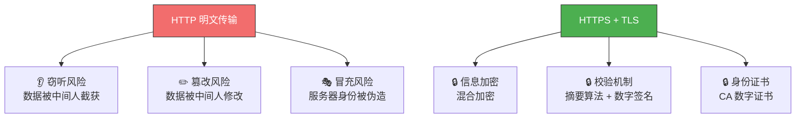
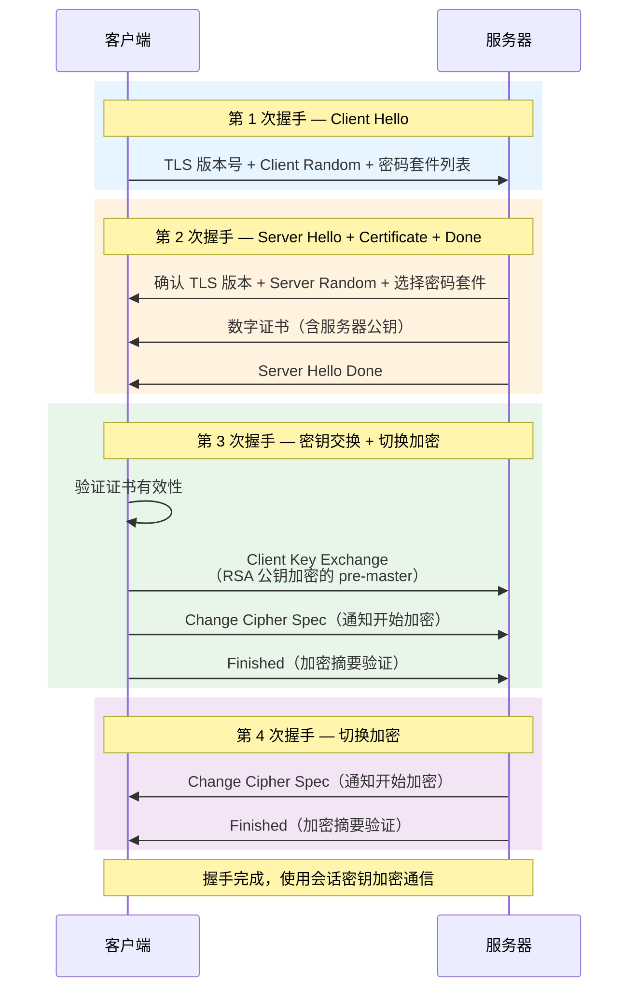
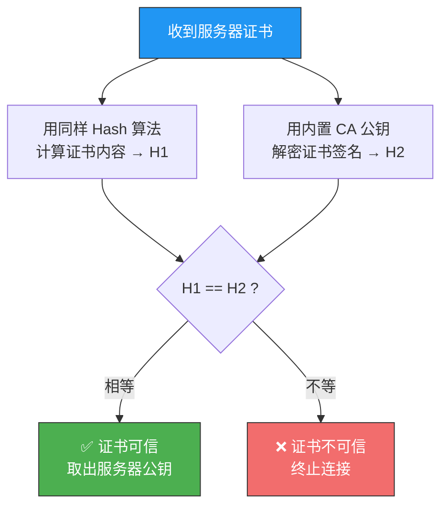
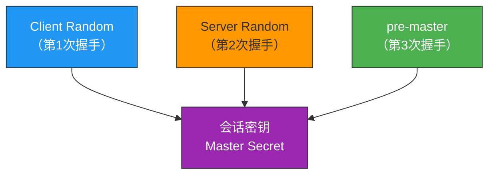
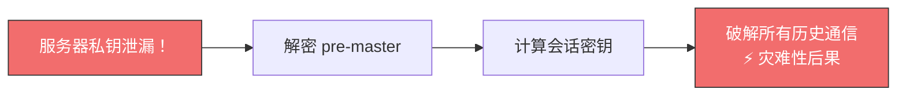

# HTTPS RSA 握手解析

> HTTPS = HTTP + SSL/TLS。TLS 握手是 HTTPS 安全通信的基石——双方如何在不安全的网络上协商出一个只有彼此知道的密钥？
> RSA 握手是最经典的方案，虽然正在被 ECDHE 取代，但理解它是理解后续方案的前提。

## 一、HTTPS 解决的三大风险

HTTP 明文传输，天生不安全。HTTPS 通过 TLS 协议加了三把锁：



| 风险 | 解决方案 | 技术手段 |
|------|----------|----------|
| **窃听风险** | 信息加密 | 混合加密（非对称加密交换密钥 + 对称加密传输数据） |
| **篡改风险** | 校验机制 | 摘要算法（哈希函数生成"指纹"）+ 数字签名 |
| **冒充风险** | 身份证书 | 数字证书（CA 机构签发，包含公钥） |

---

## 二、RSA 握手完整过程

RSA 握手需要**四次消息**（2 个 RTT），流程如下：



---

## 三、逐步拆解

### 3.1 第一次握手：Client Hello

客户端向服务器打招呼，告诉对方"我是谁、我能干什么"：

```
Client Hello
├── TLS 版本号（如 TLS 1.2）
├── Client Random（客户端随机数，32 字节）
└── 密码套件列表（客户端支持的所有加密组合）
```

> **密码套件**是什么？它是一组加密算法的组合，格式为：`密钥交换算法_签名算法_WITH_对称加密算法_摘要算法`

### 3.2 第二次握手：Server Hello + Certificate + Done

服务器回应三件事：

**① Server Hello**——确认协商结果：

```
Server Hello
├── 确认 TLS 版本号
├── Server Random（服务器随机数，32 字节）
└── 选择的密码套件（如 TLS_RSA_WITH_AES_128_GCM_SHA256）
```

以 `TLS_RSA_WITH_AES_128_GCM_SHA256` 为例拆解：

| 部分 | 含义 |
|------|------|
| `RSA` | 密钥交换和签名都用 RSA |
| `AES_128_GCM` | 对称加密算法，128 位密钥，GCM 分组模式 |
| `SHA256` | 摘要算法，用于消息认证和产生随机数 |

**② Certificate**——发送数字证书：

```
Certificate
└── 服务器数字证书（含服务器公钥 + CA 签名）
```

**③ Server Hello Done**——告知客户端：我这边说完了。

### 3.3 证书验证

客户端收到证书后，必须验证其真实性：



**证书链验证**——实际中证书通常形成三级信任链：

```
根证书（预装在操作系统/浏览器中）
  └── 中间证书（由根证书签发）
        └── 终端证书（服务器证书，由中间证书签发）
```

验证过程：终端证书 → 中间证书 → 根证书，逐级向上验证签名。

::: important 为什么需要证书链？
根证书是信任体系的根基，必须严格隔离。通过中间证书间接签发，即使中间证书出问题，只需吊销该中间证书，不影响根证书的安全。
:::

### 3.4 第三次握手：密钥交换

这是 RSA 握手的核心步骤：

1. 客户端生成新的随机数 **pre-master**（48 字节）
2. 用服务器**公钥加密** pre-master，通过 `Client Key Exchange` 消息发送
3. 服务器用**私钥解密**，得到 pre-master

至此，双方共享三个随机数：



::: tip 为什么要三个随机数？
一个随机数不够随机，两个也不够。TLS 设计者不信任伪随机数生成器，用三个来源不同的随机数混合，保证最终会话密钥的随机性足够强。
:::

4. 客户端发送 `Change Cipher Spec`——告知服务器后续开始使用加密通信
5. 客户端发送 `Finished`——将之前所有握手数据做摘要，用会话密钥加密，让服务器验证加密通信是否可用、握手信息是否被篡改

### 3.5 第四次握手：确认加密

服务器执行同样操作：
1. 发送 `Change Cipher Spec`
2. 发送 `Finished`

双方验证加密和解密无误 → **握手完成** → 后续使用会话密钥加解密 HTTP 数据。

::: important 关键分界点
`Change Cipher Spec` 之前的 TLS 握手数据均为**明文**，之后均为会话密钥加密的**密文**。
:::

---

## 四、用 tcpdump 抓包观察

```bash
# 抓取 HTTPS 握手包（需要服务器关闭加密或使用 keylog）
sudo tcpdump -i eth0 -s 0 -w https_rsa.pcap 'tcp port 443'

# 用 Wireshark 分析，过滤 tls.handshake
```

在 Wireshark 中可以看到完整的四次握手消息，每条消息的详细字段一目了然。

---

## 五、RSA 握手的致命缺陷

**不支持前向保密（Forward Secrecy）**



原因：pre-master 是用服务器公钥加密的，一旦私钥泄漏，攻击者就能解密过去截获的所有 TLS 通信。

::: warning
这就是为什么现代 HTTPS 已逐步从 RSA 密钥交换转向 **ECDHE**——后者支持前向保密，即使长期私钥泄漏，历史通信也无法被破解。
:::

---

## 六、完整消息速查表

| 握手阶段 | 方向 | 消息 | 关键内容 |
|---------|------|------|---------|
| 第 1 次 | C → S | Client Hello | TLS 版本、密码套件列表、Client Random |
| 第 2 次 | S → C | Server Hello | 确认 TLS 版本、选择密码套件、Server Random |
| 第 2 次 | S → C | Certificate | 数字证书（含公钥） |
| 第 2 次 | S → C | Server Hello Done | 打招呼完毕 |
| 第 3 次 | C → S | Client Key Exchange | RSA 公钥加密的 pre-master |
| 第 3 次 | C → S | Change Cipher Spec | 通知开始加密 |
| 第 3 次 | C → S | Finished | 加密摘要验证 |
| 第 4 次 | S → C | Change Cipher Spec | 通知开始加密 |
| 第 4 次 | S → C | Finished | 加密摘要验证 |

---

::: tip 面试速查
- **Q：RSA 握手需要几次消息？几个 RTT？** A：4 次消息，2 个 RTT。
- **Q：会话密钥是怎么生成的？** A：Client Random + Server Random + pre-master，三个随机数通过协商算法生成。
- **Q：RSA 握手的缺陷？** A：不支持前向保密。私钥泄漏可破解所有历史通信。
- **Q：证书验证的流程？** A：客户端用 CA 公钥解密证书签名得到 H2，自己 Hash 计算得到 H1，比较 H1 和 H2 是否相等。
- **Q：为什么需要证书链？** A：隔离根证书，保证信任体系的安全性。根证书一旦失守，整个信任链崩塌。
:::

---

::: info 原著参考
- 小林coding《图解网络》—— [HTTPS RSA 握手解析](https://xiaolincoding.com/network/2_http/https_rsa.html)
:::
