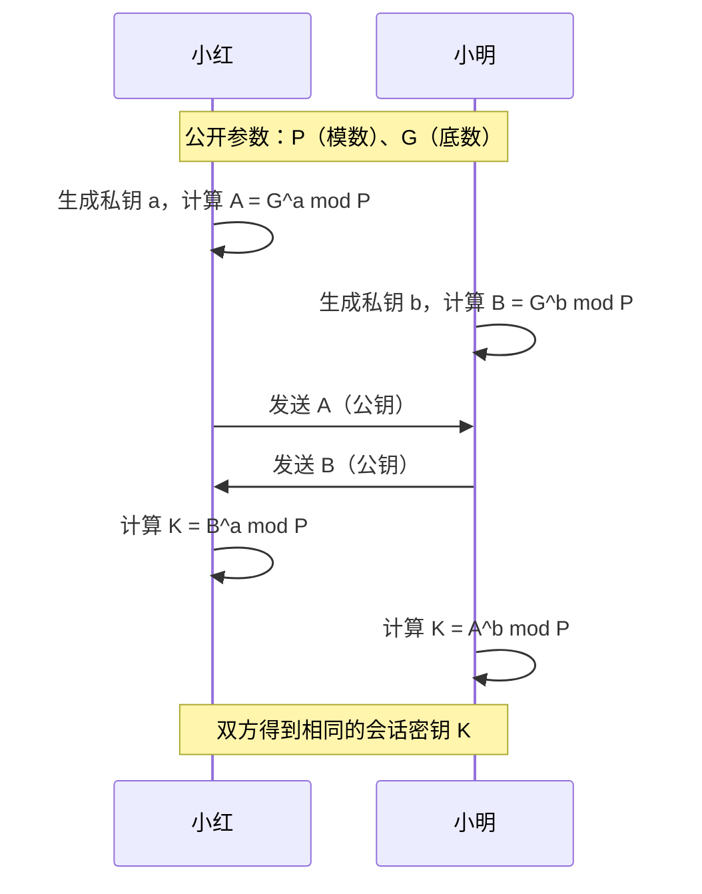
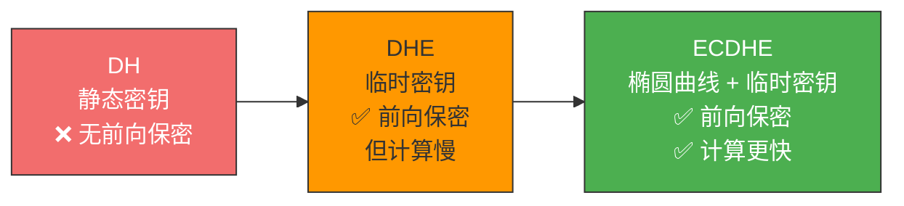
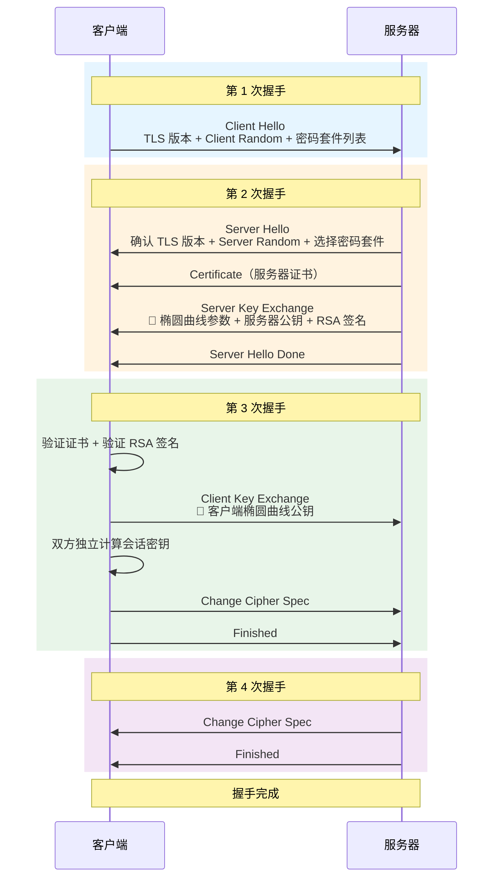
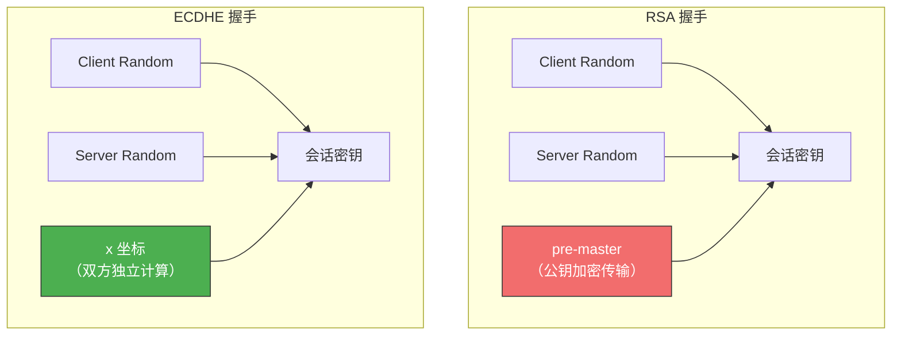
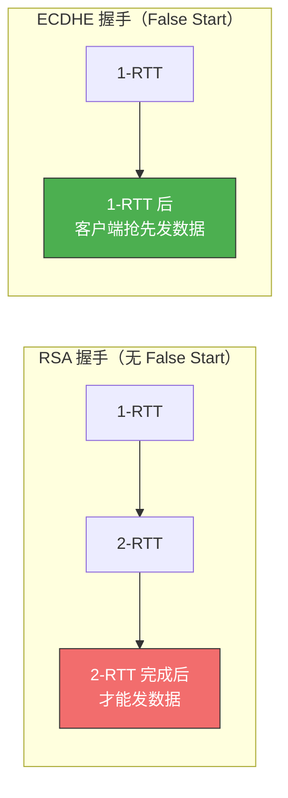
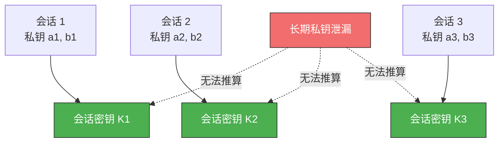

# HTTPS ECDHE 握手解析

> RSA 握手的致命伤是不支持前向保密——私钥一泄漏，历史通信全裸奔。
> ECDHE 握手通过"临时密钥协商"解决了这个问题，已经成为现代 HTTPS 的主流方案。

## 一、从数学原理说起

ECDHE 是 DH（Diffie-Hellman）密钥交换算法的椭圆曲线版本。理解 ECDHE，先要理解 DH，理解 DH，先要理解**离散对数**。

### 1.1 离散对数

普通对数：2 的 5 次方 = 32，所以 log₂(32) = 5。很简单。

**离散对数**在普通对数基础上加了**取模运算**：

```
b = a^i mod p
```

| 符号 | 含义 | 公开性 |
|------|------|--------|
| a | 底数 | 公开 |
| p | 模数（大素数） | 公开 |
| b | 真数 | 公开 |
| i | 离散对数 | **保密** |

**安全性基础**：知道 i 算 b 很容易，但知道 b 反推 i 极其困难。当 p 是很大的素数时，当前计算机几乎无法在合理时间内算出离散对数——这就是 DH 算法的数学根基。

### 1.2 DH 密钥交换



为什么双方算出的 K 相同？因为模幂运算的交换性：

```
K = B^a mod P = (G^b mod P)^a mod P = G^(ab) mod P
K = A^b mod P = (G^a mod P)^b mod P = G^(ab) mod P
```

::: important DH 的关键特性
私钥 a、b 从不在网络上传输，只交换公钥 A、B。即使攻击者截获了 A、B、P、G，也无法推算出 K（离散对数难题）。
:::

### 1.3 从 DH 到 DHE 再到 ECDHE

| 演进 | 全称 | 特点 |
|------|------|------|
| **DH** | Diffie-Hellman | 静态 DH：一方私钥固定不变，缺乏前向保密 |
| **DHE** | DH Ephemeral | 每次会话双方都生成**临时**私钥，保证前向保密 |
| **ECDHE** | Elliptic Curve DHE | 用椭圆曲线替代大整数运算，**更快的计算速度**，同等安全强度下密钥更短 |



### 1.4 ECDHE 的椭圆曲线运算

1. 双方约定一条椭圆曲线和基点 G（公开参数）
2. 各自生成随机私钥 d，计算公钥 Q = dG（椭圆曲线点乘运算）
3. 交换公钥 Q1、Q2
4. 双方独立计算共享点：(x, y) = d1 × Q2 = d2 × Q1
5. **x 坐标**即为共享密钥

---

## 二、ECDHE 握手完整过程

ECDHE 握手同样需要 4 次 TLS 消息（2 个 RTT），但与 RSA 握手有关键区别：



---

## 三、与 RSA 握手的关键区别

### 3.1 Server Key Exchange——ECDHE 独有

这是 ECDHE 握手与 RSA 握手最显著的区别。在第 2 次握手中，服务器额外发送 `Server Key Exchange` 消息：

```
Server Key Exchange
├── 选定的椭圆曲线（如 x25519）——隐含定义了基点 G
├── 服务器的椭圆曲线公钥（临时生成）
└── RSA 签名（对以上内容的签名，防篡改）
```

::: important 为什么 ECDHE 需要 Server Key Exchange？
RSA 握手中，密钥材料 pre-master 用证书中的公钥加密传输，不需要额外消息。而 ECDHE 中，服务器必须把**临时椭圆曲线公钥**发给客户端，这个公钥不在证书里，所以需要额外的 Server Key Exchange 消息。
:::

### 3.2 会话密钥的生成方式不同



**RSA**：pre-master 由客户端生成，用服务器公钥加密后传给服务器。

**ECDHE**：共享密钥（x 坐标）由双方各自用私钥和对方公钥独立计算，**从不在网络上传输**。

### 3.3 TLS False Start——抢跑优化

ECDHE 支持前向保密，因此可以开启 **TLS False Start**：



客户端在第 3 次握手后、第 4 次握手前，就提前发送加密的 HTTP 数据。因为 ECDHE 保证前向保密，所以"抢跑"是安全的。这把 TLS 握手从 **2 RTT 减少到 1 RTT**。

---

## 四、ECDHE 为什么支持前向保密？

核心原因：**每次握手双方都生成全新的临时私钥**。



- 每个会话的临时私钥用完即弃，不存在于任何持久存储中
- 长期私钥（证书中的 RSA 私钥）仅用于签名验证，**不参与密钥生成**
- 即使长期私钥泄漏，攻击者也无法反推各次会话的临时私钥

---

## 五、RSA vs ECDHE 完整对比

| 对比项 | RSA 握手 | ECDHE 握手 |
|--------|----------|------------|
| **前向保密** | ❌ 不支持 | ✅ 支持 |
| **密钥交换消息** | 无 Server Key Exchange | 有 Server Key Exchange |
| **pre-master 来源** | 客户端生成，公钥加密传输 | 双方独立计算（x 坐标） |
| **TLS False Start** | ❌ 不支持 | ✅ 支持（1 RTT） |
| **私钥泄漏影响** | 所有历史通信可被破解 | 仅影响身份认证，历史通信安全 |
| **计算性能** | RSA 加解密较慢 | 椭圆曲线运算更快 |
| **当前推荐度** | 逐渐被淘汰 | **主流方案** |

---

## 六、密码套件解读

以 ECDHE 握手常用的 `TLS_ECDHE_RSA_WITH_AES_256_GCM_SHA384` 为例：

| 部分 | 含义 |
|------|------|
| `ECDHE` | 密钥交换算法——用 ECDHE 协商会话密钥 |
| `RSA` | 签名算法——用 RSA 签名验证服务器身份 |
| `AES_256_GCM` | 对称加密算法——256 位密钥，GCM 模式 |
| `SHA384` | 摘要算法——用于消息认证码 |

::: tip 注意区分
`ECDHE_RSA` 中 ECDHE 负责密钥交换，RSA 负责身份签名。两者各司其职，不要混淆。
:::

---

## 七、抓包验证

```bash
# 使用 openssl 测试 ECDHE 握手
openssl s_client -connect www.example.com:443 -tls1_2 -cipher ECDHE

# 查看协商的密码套件
openssl s_client -connect www.example.com:443 -tls1_2 2>/dev/null | grep "Cipher"
```

---

::: tip 面试速查
- **Q：ECDHE 和 RSA 握手的核心区别？** A：① ECDHE 有 Server Key Exchange 消息；② pre-master 由双方独立计算而非加密传输；③ ECDHE 支持前向保密和 False Start。
- **Q：ECDHE 为什么支持前向保密？** A：每次握手双方都生成临时私钥，用完即弃，长期私钥不参与密钥生成。
- **Q：什么是 TLS False Start？** A：客户端在第 3 次握手后提前发送加密数据，将握手从 2 RTT 减到 1 RTT。只有支持前向保密的算法（如 ECDHE）才能开启。
- **Q：DH → DHE → ECDHE 的演进逻辑？** A：DH 静态密钥无前向保密 → DHE 临时密钥有前向保密但计算慢 → ECDHE 用椭圆曲线加速计算。
:::

---

::: info 原著参考
- 小林coding《图解网络》—— [HTTPS ECDHE 握手解析](https://xiaolincoding.com/network/2_http/https_ecdhe.html)
:::
