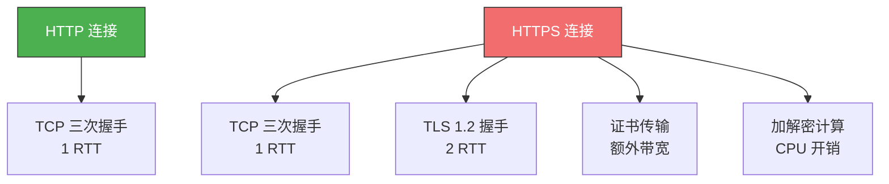
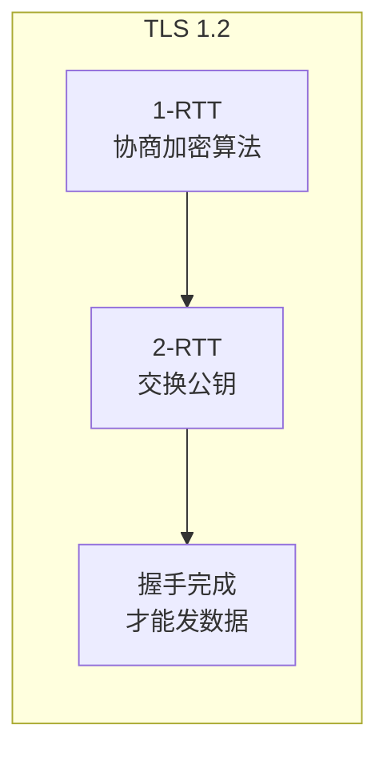
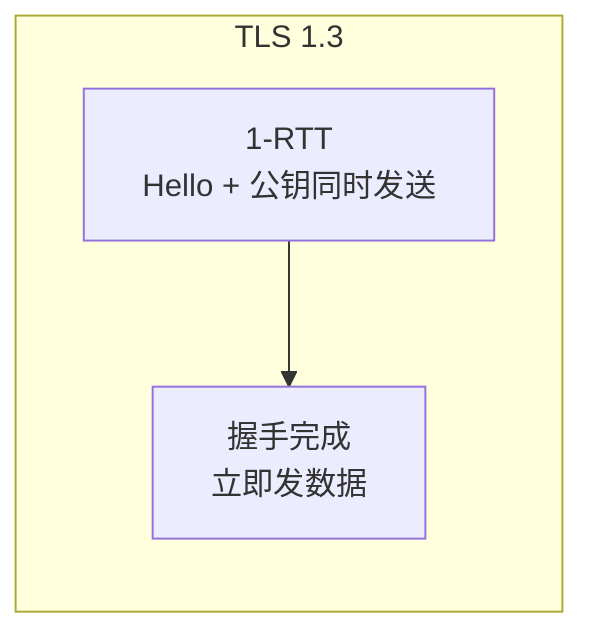
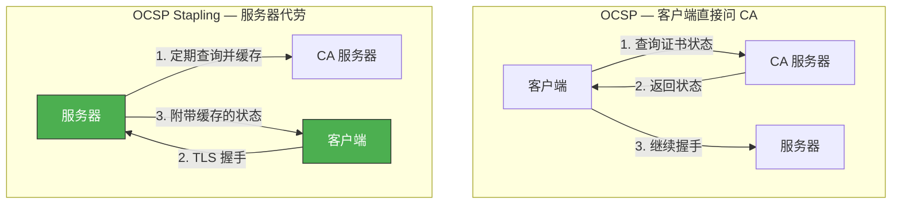
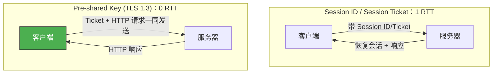
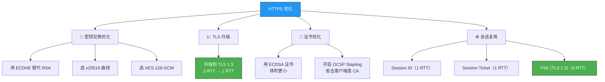

# HTTPS 如何优化？

> HTTPS 比 HTTP 多了 TLS 握手，连接建立更慢、传输数据更多。
> 优化 HTTPS 不是锦上添花，而是必须做——毫秒级的优化在高并发下会被放大千倍万倍。

## 一、HTTPS 的性能瓶颈



HTTPS 优化围绕四个方向展开：**密钥交换算法**、**TLS 升级**、**证书优化**、**会话复用**。

---

## 二、密钥交换算法优化

### 2.1 从 RSA 到 ECDHE

| 对比项 | RSA | ECDHE |
|--------|-----|-------|
| 前向保密 | ❌ | ✅ |
| False Start | ❌ | ✅（握手从 2 RTT → 1 RTT） |
| 计算速度 | 较慢 | 更快 |

**结论**：优先选择 ECDHE 算法。

### 2.2 椭圆曲线选择

不同椭圆曲线的计算速度差异明显：

| 曲线 | 特点 |
|------|------|
| **x25519** | 速度最快，推荐首选 |
| secp256r1 | 兼容性好，速度次之 |
| secp384r1 | 安全强度更高，但更慢 |

Nginx 配置：

```nginx
# 优先使用 x25519 曲线
ssl_ecdh_curve x25519:secp384r1;
```

### 2.3 对称加密算法选择

| 算法 | 密钥长度 | 速度 |
|------|----------|------|
| **AES_128_GCM** | 128 位 | 更快 |
| AES_256_GCM | 256 位 | 稍慢 |
| CHACHA20_POLY1305 | 256 位 | 无 AES 硬件加速时更快 |

```nginx
# 配置密码套件优先级
ssl_ciphers CHACHA20-POLY1305:AES_128_GCM:AES_256_GCM;
```

::: tip AES-128 vs AES-256
AES-128 的安全强度已经足够（暴力破解 2^128 几乎不可能），密钥更短意味着加密解密更快。除非有合规要求，否则优先选 AES-128-GCM。
:::

---

## 三、TLS 1.3 升级

TLS 1.3 是 HTTPS 优化的"核武器"级方案。

### 3.1 握手从 2 RTT → 1 RTT

**TLS 1.2（2 RTT）**：



**TLS 1.3（1 RTT）**：



**核心改动**：客户端在 `Client Hello` 中**直接带上支持的椭圆曲线及对应的公钥**，服务端选定参数后返回消息时带上服务端公钥。经过 1 个 RTT，双方已具备生成会话密钥的全部材料。

### 3.2 密码套件"减肥"

TLS 1.3 **废除**了不支持前向安全性的 RSA 和 DH 算法，只保留 5 种最安全的密码套件：

| 密码套件 | 对称加密 | 摘要算法 |
|----------|----------|----------|
| `TLS_AES_256_GCM_SHA384` | AES-256-GCM | SHA384 |
| `TLS_CHACHA20_POLY1305_SHA256` | CHACHA20 | SHA256 |
| `TLS_AES_128_GCM_SHA256` | AES-128-GCM | SHA256 |
| `TLS_AES_128_CCM_8_SHA256` | AES-128-CCM-8 | SHA256 |
| `TLS_AES_128_CCM_SHA256` | AES-128-CCM | SHA256 |

::: important 为什么要"减肥"？
密码套件越多，中间人攻击（降级攻击）的风险越大——攻击者可以伪造 Client Hello，把安全套件替换为不安全的。TLS 1.3 只保留最安全的 5 种，从根源上杜绝降级攻击。
:::

---

## 四、证书优化

### 4.1 证书传输优化

证书体积越大，握手时传输的数据越多，延迟越高。

| 证书类型 | RSA 2048 密钥长度 | ECDSA 256 密钥长度 |
|----------|-------------------|---------------------|
| 公钥大小 | 256 字节 | 32 字节 |
| 证书体积 | ~1.5 KB | ~0.8 KB |

**选择 ECDSA（椭圆曲线）证书**，相同安全强度下密钥更短，证书体积更小，节约带宽。

### 4.2 证书验证优化

客户端收到证书后需要验证其是否被吊销，有三种方式：

| 方式 | 原理 | 优点 | 缺点 |
|------|------|------|------|
| **CRL**（证书吊销列表） | CA 定期发布被吊销证书列表，客户端下载查询 | 简单 | 实时性差；列表越来越大；下载慢 |
| **OCSP**（在线证书状态协议） | 客户端向 CA 实时查询证书有效性 | 实时性好 | 额外网络请求，依赖 CA 服务器 |
| **OCSP Stapling** ✅ | 服务器周期性向 CA 查询并缓存结果，在 TLS 握手中直接发给客户端 | 无额外请求；签名保证不可篡改 | 需要服务器支持 |



Nginx 开启 OCSP Stapling：

```nginx
ssl_stapling on;
ssl_stapling_verify on;
ssl_trusted_certificate /path/to/chain.pem;
resolver 8.8.8.8 8.8.4.4 valid=300s;
```

---

## 五、会话复用

核心思想：缓存首次 TLS 握手协商的会话密钥，下次连接直接复用，跳过完整握手。

### 5.1 Session ID

| 项目 | 说明 |
|------|------|
| **原理** | 首次连接后，双方在内存缓存会话密钥，用唯一 Session ID 标识；重连时客户端带上 Session ID，服务器查找并恢复 |
| **恢复速度** | **1 RTT** |
| **缺点①** | 服务器必须保存每个客户端的会话密钥，客户端越多内存压力越大 |
| **缺点②** | 多服务器负载均衡下，客户端可能命中不同服务器，无法复用 |

### 5.2 Session Ticket

| 项目 | 说明 |
|------|------|
| **原理** | 服务器不再缓存会话密钥，而是将缓存工作交给客户端；首次连接时加密会话密钥作为 Ticket 发给客户端缓存；重连时客户端发 Ticket，服务器解密获取 |
| **恢复速度** | **1 RTT** |
| **集群要求** | 每台服务器加密 Ticket 的密钥必须一致，确保任意服务器都能解密 |
| **安全性** | ❌ 不具备前向安全性；❌ 存在重放攻击风险 |

### 5.3 Pre-shared Key（TLS 1.3 专属）

| 项目 | 说明 |
|------|------|
| **原理** | 客户端重连时，将 Ticket 和 HTTP 请求**一同发送** |
| **恢复速度** | **0 RTT** ⚡ |
| **安全性** | ❌ 不具备前向安全性；❌ 存在重放攻击风险 |



### 5.4 三种方案对比

| 方案 | 恢复速度 | 服务器存储 | 前向保密 | 重放攻击 |
|------|----------|-----------|----------|----------|
| Session ID | 1 RTT | 需要存储 | ✅ | 无风险 |
| Session Ticket | 1 RTT | 不需要 | ❌ | 有风险 |
| Pre-shared Key | **0 RTT** | 不需要 | ❌ | 有风险 |

::: warning 重放攻击风险
Session Ticket 和 Pre-shared Key 都存在重放攻击风险——中间人截获客户端的 Ticket 及 POST 报文，不断向服务器重放，导致数据被反复修改。

**防范措施**：
1. 对会话密钥设定合理的过期时间
2. 只对安全请求（GET/HEAD）使用会话复用，不对改变状态的 POST 请求使用
:::

---

## 六、优化方案总结



| 优化方向 | 具体手段 | 效果 |
|----------|----------|------|
| 密钥交换 | ECDHE + x25519 + AES-128-GCM | 支持 False Start，计算更快 |
| TLS 升级 | TLS 1.3 | 握手 2 RTT → 1 RTT |
| 证书 | ECDSA + OCSP Stapling | 证书更小，验证更快 |
| 会话复用 | PSK (TLS 1.3) | 恢复连接 0 RTT |

---

::: tip 面试速查
- **Q：HTTPS 优化有哪些方向？** A：密钥交换算法优化（ECDHE）、TLS 升级（1.3）、证书优化（ECDSA + OCSP Stapling）、会话复用（Session Ticket / PSK）。
- **Q：TLS 1.3 相比 1.2 的改进？** A：握手 2 RTT → 1 RTT；废除不安全的 RSA/DH 密码套件；0-RTT 会话恢复。
- **Q：OCSP Stapling 是什么？** A：服务器定期从 CA 获取证书状态并缓存，在 TLS 握手中直接发给客户端，省去客户端额外查询。
- **Q：Session ID 和 Session Ticket 的区别？** A：Session ID 服务器存储会话密钥，内存压力大，不支持集群；Session Ticket 客户端存储加密的会话密钥，服务器无状态，支持集群。
- **Q：0-RTT 有什么安全风险？** A：重放攻击。只应对安全请求（GET/HEAD）使用 0-RTT。
:::

---

::: info 原著参考
- 小林coding《图解网络》—— [HTTPS 如何优化？](https://xiaolincoding.com/network/2_http/https_optimize.html)
:::
