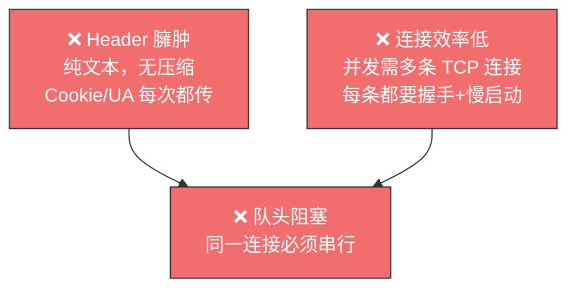
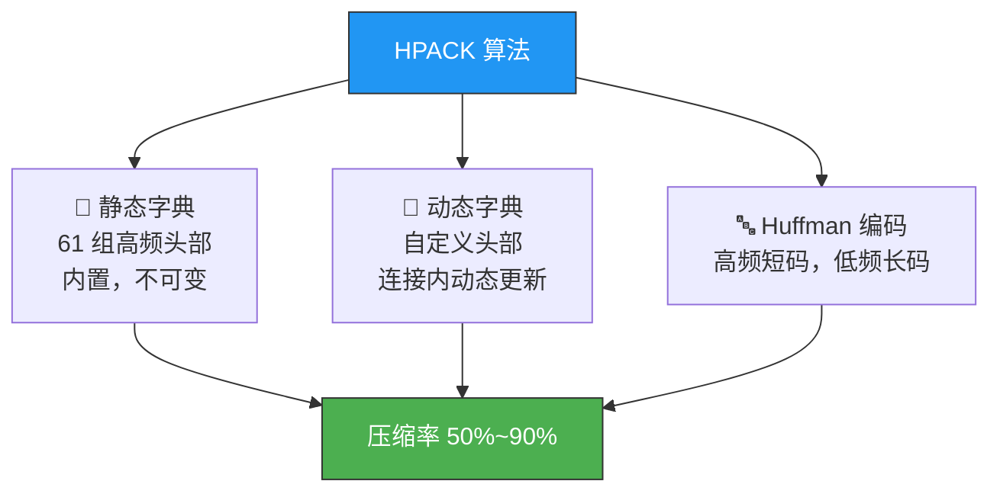
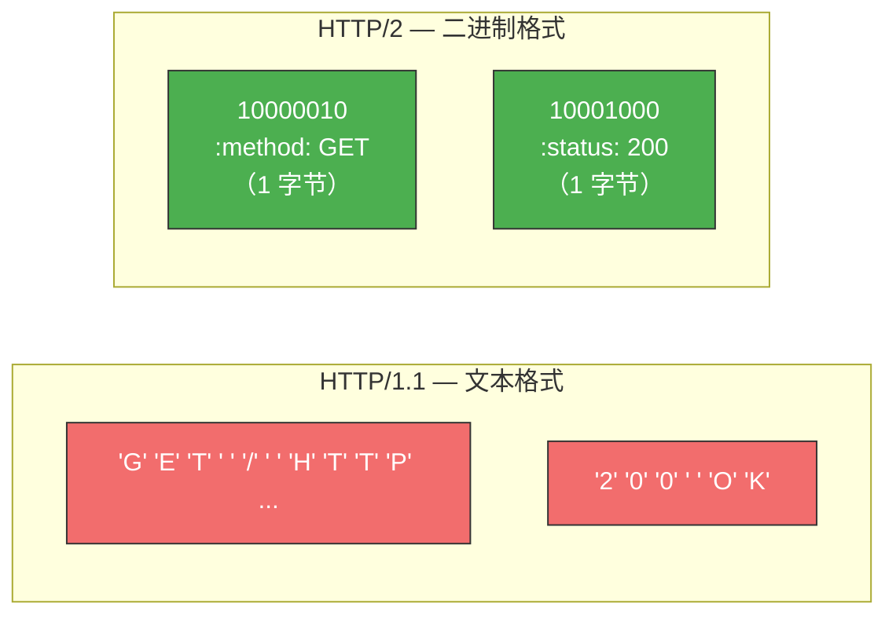
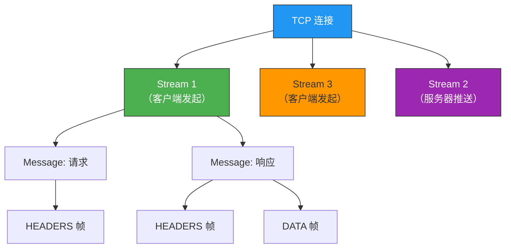
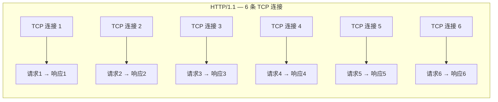
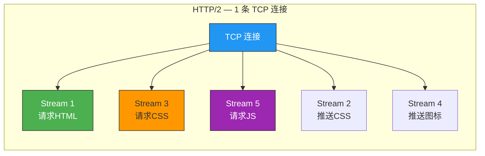
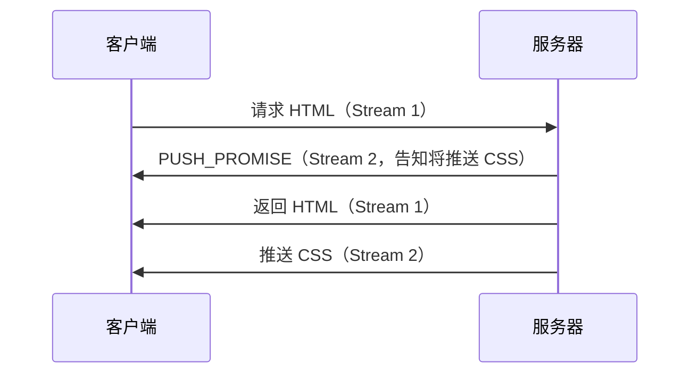
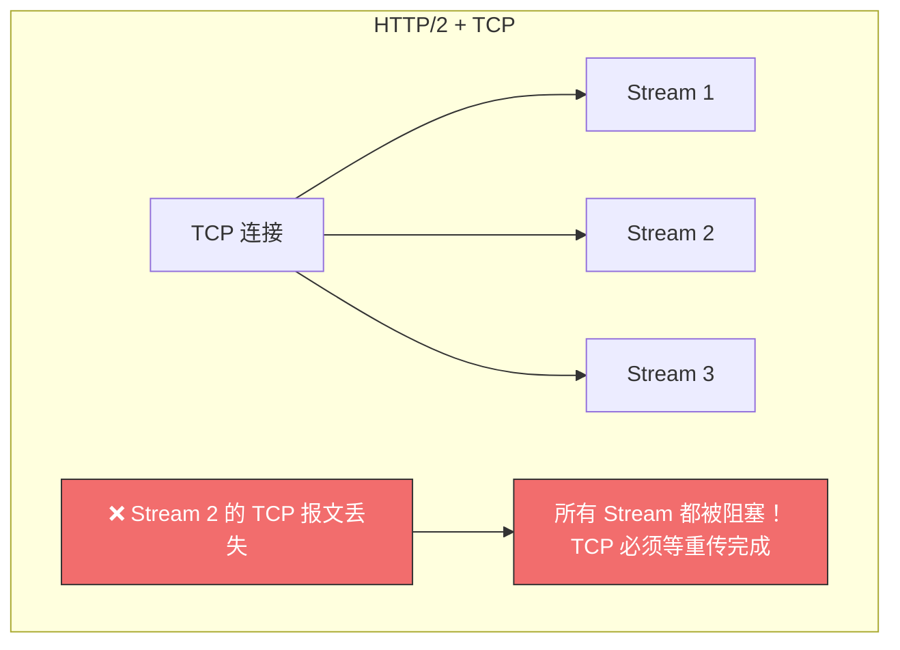

# HTTP/2 牛逼在哪？

> HTTP/1.1 用了快 20 年，队头阻塞、Header 臃肿、连接效率低——这些问题忍了太久。
> HTTP/2 不是小修小补，而是从文本协议彻底重构为二进制协议，带来了四大核心特性。

## 一、HTTP/1.1 的痛点

先看问题，再看 HTTP/2 怎么解决：



---

## 二、头部压缩——HPACK 算法

### 2.1 问题有多大？

HTTP/1.1 的 Header 纯文本传输，没有任何压缩手段。一个典型的请求头：

```
GET /api/data HTTP/1.1
Host: www.example.com
User-Agent: Mozilla/5.0 (Windows NT 10.0; Win64; x64) AppleWebKit/537.36 ...
Cookie: session_id=abc123def456ghi789jkl012mno345pqr678stu901vwx234yz...
Accept: text/html,application/xhtml+xml,application/xml;q=0.9,...
Accept-Encoding: gzip, deflate, br
Accept-Language: zh-CN,zh;q=0.9,en;q=0.8
```

Header 动辄几百甚至上千字节，而且大量字段在每次请求中**完全重复**。

### 2.2 HPACK 三板斧



**静态字典**——61 组预设的高频头部映射：

| Index | Header Name | Header Value |
|-------|-------------|--------------|
| 2 | `:method` | `GET` |
| 8 | `:status` | `200` |
| 14 | `:scheme` | `http` |
| 16 | `:authority` | （空值，需补充） |
| 31 | `content-type` | `text/html` |

一个完整的 `:method: GET` 在 HTTP/1.1 中至少占十几个字节，HPACK 只需 **1 个字节**（Index = 2）。

**动态字典**——不在静态表中的头部，首次发送后在双方动态表中分配新 Index：

```
首次发送：cookie: session_id=abc123  → 完整传输，双方缓存
后续发送：Index=62                   → 仅 1 个字节！
```

::: important 动态字典的前提
必须在**同一个连接**上重复传输**完全相同**的 HTTP 头部，动态字典才有效。连接断开，字典清空。
:::

---

## 三、二进制帧

### 3.1 从文本到二进制

HTTP/1.1 是文本协议，人能读懂但机器解析效率低。HTTP/2 彻底改为**二进制格式**：



状态码 `200`：HTTP/1.1 用 3 个 ASCII 字符，HTTP/2 只需 1 个字节——最高位 `1` 表示静态表命中，剩余位 `0001000` = 8 → `:status: 200`。

### 3.2 帧结构

HTTP/2 的最小通信单位是**帧（Frame）**，帧头固定 9 字节：

```
| 帧长度 (3B) | 帧类型 (1B) | 标志位 (1B) | 流标识符 (4B) | 帧数据 |
```

| 字段 | 大小 | 作用 |
|------|------|------|
| 帧长度 | 3 字节 | 标识 Frame Payload 的长度 |
| 帧类型 | 1 字节 | 区分 DATA 帧、HEADERS 帧、SETTINGS 帧等 |
| 标志位 | 1 字节 | END_HEADERS、END_STREAM 等 |
| 流标识符 | 4 字节 | 标识帧属于哪个 Stream |

### 3.3 帧 → 消息 → 流



- **Frame**（帧）：HTTP/2 最小单位
- **Message**（消息）：对应 HTTP/1 的一个请求或响应，由多个 Frame 组成
- **Stream**（流）：一条 TCP 连接上的双向字节流，可承载多个 Message

---

## 四、多路复用——并发传输

### 4.1 HTTP/1.1 的并发困境

浏览器为了并发请求，只能同时开多条 TCP 连接（通常 5-6 条）：



每条连接都要：TCP 握手 + TLS 握手 + 慢启动 → 巨大开销。

### 4.2 HTTP/2 的多路复用

**一条 TCP 连接，多个 Stream 并发**：



**并发规则**：

| 规则 | 说明 |
|------|------|
| 不同 Stream 的帧**可以乱序发送** | 所以可以并发不同的 Stream |
| 同一 Stream 内部的帧**必须严格有序** | 保证 HTTP 消息完整性 |
| 接收端根据 Stream ID 组装 | 乱序到达的帧也能正确拼装 |

**Stream ID 规则**：

| 建立方 | Stream ID | 示例 |
|--------|-----------|------|
| 客户端 | **奇数** | 1, 3, 5, 7, ... |
| 服务器 | **偶数** | 2, 4, 6, 8, ... |

::: important Stream ID 不可复用
同一连接中的 Stream ID 只能顺序递增，不能复用。耗尽后（约 21 亿），发送 `GOAWAY` 帧关闭连接，建立新连接。
:::

---

## 五、服务器推送

### 5.1 HTTP/1.1 的两次往返

```
1. 客户端请求 HTML → 服务器返回 HTML
2. 客户端解析 HTML，发现需要 CSS → 请求 CSS → 服务器返回 CSS
```

两次消息往返，浪费等待时间。

### 5.2 HTTP/2 的主动推送

客户端请求 HTML 时，服务器**直接主动推送** CSS 文件：



**推送流程**：
1. 客户端发起请求（奇数号 Stream）
2. 服务器先发 `PUSH_PROMISE` 帧，告知客户端将在哪个偶数号 Stream 推送
3. 服务器在奇数号 Stream 返回请求资源
4. 服务器在偶数号 Stream 推送额外资源

Nginx 配置：

```nginx
location /index.html {
    http2_push /style.css;
    http2_push /favicon.ico;
}
```

---

## 六、HTTP/2 的遗留问题——TCP 层队头阻塞

HTTP/2 解决了 HTTP 层的队头阻塞，但 TCP 层的队头阻塞仍在：



**根本原因**：HTTP/2 基于 TCP，TCP 是字节流协议，必须保证收到的字节数据**完整且连续**。前一个字节没到，后面的字节只能放在内核缓冲区里等。

::: warning
这是 TCP 协议的固有特性，HTTP/2 无论怎么设计都无法在应用层解决。唯一的出路是**替换传输层协议**——这正是 HTTP/3 选择 QUIC(UDP) 的原因。
:::

---

## 七、四大特性速查表

| 特性 | 解决的问题 | 核心机制 | 效果 |
|------|-----------|---------|------|
| **头部压缩** | Header 冗余大、重复多 | 静态表 + 动态表 + Huffman | 压缩率 50%~90% |
| **二进制帧** | 文本格式解析效率低 | 二进制编码 + 帧结构 | 状态码 200 从 3 字节 → 1 字节 |
| **多路复用** | HTTP 层队头阻塞 | Stream 并发 + 单 TCP 连接 | 100 并发仅需 1 个 TCP 连接 |
| **服务器推送** | 客户端需额外请求依赖资源 | PUSH_PROMISE + 偶数号 Stream | 减少消息往返 |

---

::: tip 面试速查
- **Q：HTTP/2 的四大核心特性？** A：头部压缩（HPACK）、二进制帧、多路复用（Stream）、服务器推送。
- **Q：HPACK 怎么压缩头部？** A：静态字典（61 组高频头部映射为 1 字节 Index）+ 动态字典（首次发送后缓存，后续只发 Index）+ Huffman 编码。
- **Q：HTTP/2 的多路复用是什么？** A：一条 TCP 连接上跑多个 Stream，不同 Stream 的帧可以乱序发送（并发），同一 Stream 内帧有序。
- **Q：HTTP/2 还有队头阻塞吗？** A：HTTP 层的队头阻塞已解决，但 TCP 层的队头阻塞仍在——一个 TCP 报文丢失会阻塞所有 Stream。
- **Q：服务器推送怎么实现的？** A：先发 PUSH_PROMISE 帧告知推送的 Stream ID，然后在偶数号 Stream 发送资源数据。
:::

---

::: info 原著参考
- 小林coding《图解网络》—— [HTTP/2 牛逼在哪？](https://xiaolincoding.com/network/2_http/http2.html)
:::
