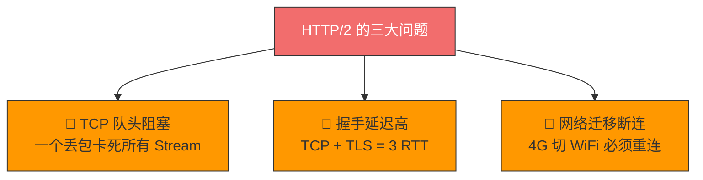
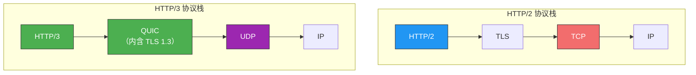
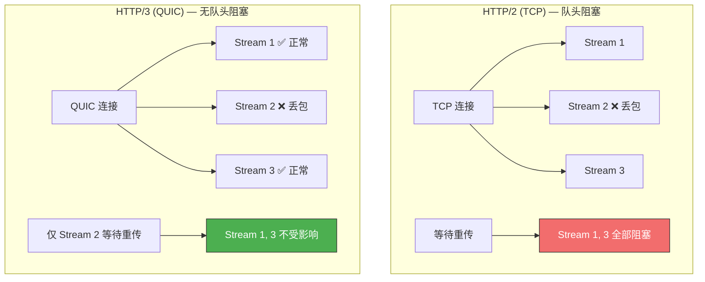
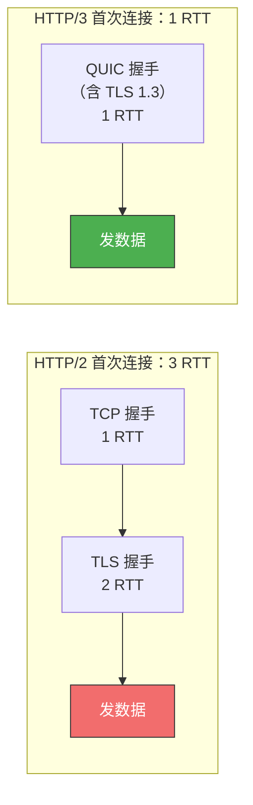
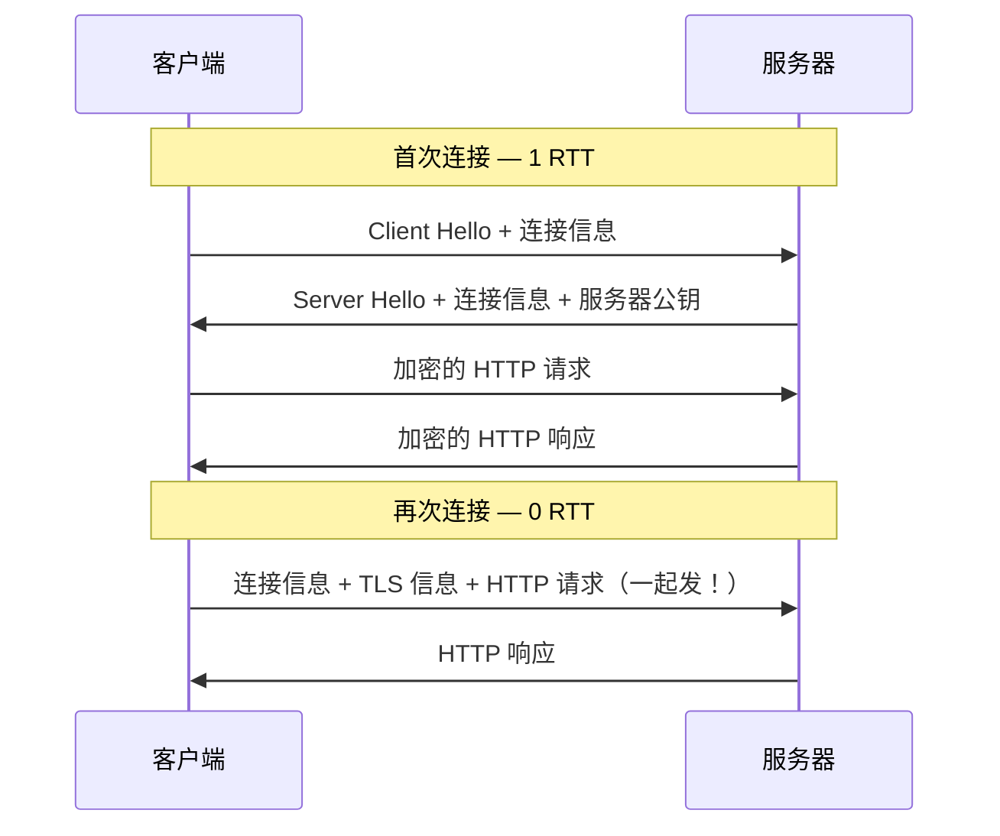
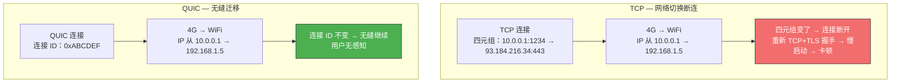
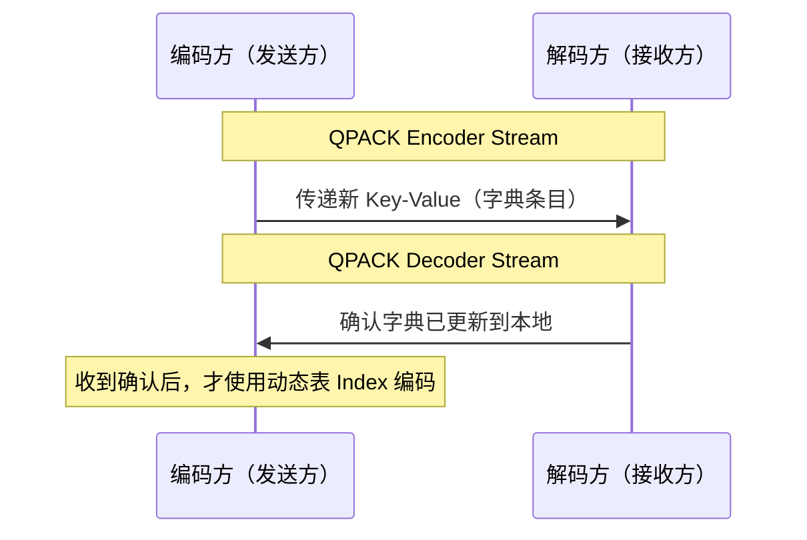

# HTTP/3 强势来袭

> HTTP/2 解决了 HTTP 层的队头阻塞，但 TCP 层的队头阻塞仍在——一个丢包卡死所有流。
> HTTP/3 的回答简单粗暴：既然 TCP 有病治不好，那就换掉它！

## 一、HTTP/2 的三大固有问题

HTTP/2 基于 TCP 实现，带来了 TCP 协议层面的三大硬伤：

| 问题 | 说明 |
|------|------|
| **TCP 队头阻塞** | 多个 Stream 跑在一个 TCP 连接上，一个 TCP 报文丢失，即使其他流的报文已到达，应用层也无法读取——所有流都被阻塞 |
| **握手延迟高** | TCP 三次握手（1 RTT）+ TLS 1.2 四次握手（2 RTT）= 3 RTT 才能发出第一个请求 |
| **网络迁移断连** | TCP 连接由四元组（源 IP、源端口、目标 IP、目标端口）确定，IP 变化（4G 切 WiFi）必须重新握手 |

::: important 根本原因
这三个问题是 **TCP 协议固有的**，无论应用层 HTTP/2 怎么设计都无法逃脱。唯一的出路是——**把传输层协议替换成 UDP**。
:::

---

## 二、QUIC 协议——HTTP/3 的基石

QUIC（Quick UDP Internet Connections）是基于 UDP 在**应用层**实现的"类 TCP"协议：

QUIC 在 UDP 之上实现了：
- **连接管理**（类似 TCP 的握手、挥手）
- **拥塞控制**（类似 TCP 的慢启动、拥塞避免）
- **流量控制**（类似 TCP 的滑动窗口）
- **可靠性**（类似 TCP 的 ACK 和重传）

> 可以理解为：QUIC = UDP 之上的"伪 TCP + TLS + HTTP/2 多路复用"

---

## 三、QUIC 的三大核心特性

### 3.1 无队头阻塞

HTTP/2 + TCP：一个丢包卡死所有 Stream。

HTTP/3 + QUIC：某个 Stream 丢包，只影响该 Stream 本身，其他 Stream 不受影响。

**原理**：QUIC 底层是 UDP，UDP 不关心数据包顺序。QUIC 自己保证每个数据包的可靠性（唯一递增序号 + ACK），但每个 Stream 独立维护自己的数据完整性。

### 3.2 更快的连接建立

**首次连接：1 RTT**

QUIC 握手只需 1 RTT（确认双方的连接 ID），且 QUIC 内部**包含了 TLS 1.3**——不是与 TLS 分层，而是在自己的帧中携带 TLS 记录。因此 1 RTT 就能同时完成建立连接与密钥协商。

**再次连接（会话恢复）：0 RTT**

客户端重连时，应用数据包可以和 QUIC 握手信息（连接信息 + TLS 信息）**一起发送**，达到 **0 RTT** 效果：

| 场景 | HTTP/1.1/2 (TLS 1.2) | HTTP/3 (QUIC + TLS 1.3) |
|------|----------------------|--------------------------|
| 首次连接 | 3 RTT | **1 RTT** |
| 再次连接 | 需重新握手 | **0 RTT** |

### 3.3 连接迁移

TCP 用**四元组**绑定连接 → IP/端口变化 = 断开重连。

QUIC 用**连接 ID** 标记通信端点 → 即使 IP 变化，连接 ID 不变，无缝继续。

::: tip 连接 ID 的设计
客户端和服务器各自选择一组连接 ID 来标记自己。即使网络切换导致 IP 地址变化，只要仍保有上下文信息（连接 ID、TLS 密钥等），就可以"无缝"复用原连接，消除重连成本。
:::

---

## 四、HTTP/3 协议层的变化

### 4.1 帧结构简化

HTTP/3 同样采用二进制帧结构，但比 HTTP/2 更简洁：

| 对比项 | HTTP/2 | HTTP/3 |
|--------|--------|--------|
| Stream 管理 | 自行定义 Stream | **直接使用 QUIC 的 Stream** |
| 帧头字段 | 帧长度 + 帧类型 + 标志位 + Stream ID | **类型 + 长度**（仅 2 个字段） |

HTTP/3 不需要自行定义 Stream，因为 QUIC 已经提供了 Stream 能力。

### 4.2 QPACK 头部压缩（替代 HPACK）

| 对比项 | HTTP/2 HPACK | HTTP/3 QPACK |
|--------|-------------|-------------|
| 静态表 | 61 项 | **99 项**（扩大） |
| Huffman 编码 | 有 | 基本相同 |
| 动态表 | 存在队头阻塞 | 通过特殊单向流解决 |

**QPACK 如何解决动态表队头阻塞**：

使用两个特殊的**单向流**同步双方动态表：

编码方**收到解码方更新确认后**，才使用动态表编码 HTTP 头部。如果某个字典条目的包丢失，编码方不会使用它，避免因丢包导致动态表未建立而无法解码的问题。

---

## 五、HTTP/2 vs HTTP/3 完整对比

| 特性 | HTTP/2 (TCP) | HTTP/3 (QUIC/UDP) |
|------|-------------|-------------------|
| 队头阻塞 | ✅ 存在（TCP 层面） | ❌ 无（Stream 独立） |
| 首次连接延迟 | 3 RTT | **1 RTT** |
| 再次连接延迟 | 需重新握手 | **0 RTT** |
| 网络切换 | 断连重连 | **无缝迁移** |
| 头部压缩 | HPACK | **QPACK**（解决动态表阻塞） |
| 传输层 | TCP | **UDP + QUIC** |
| 流量控制 | TCP 层 + HTTP/2 层 | QUIC 层统一 |
| 拥塞控制 | 内核态实现，升级困难 | 用户态实现，**易于迭代** |

::: important QUIC 拥塞控制在用户态
TCP 的拥塞控制在操作系统内核中实现，想要升级拥塞控制算法就得升级内核——这在服务器集群中非常困难。QUIC 在用户态实现拥塞控制，可以随时升级算法，灵活得多。
:::

---

## 六、QUIC 的现实挑战

| 挑战 | 说明 |
|------|------|
| **UDP 受限** | 部分网络环境对 UDP 限速或屏蔽，QUIC 连接可能失败 |
| **中间设备不友好** | 许多防火墙/负载均衡器对 UDP 支持不完善 |
| **调试困难** | Wireshark 等传统抓包工具对 QUIC 的支持不如 TCP 完善 |
| **生态成熟度** | 相比 HTTP/2，服务器、CDN、浏览器支持仍在推进中 |

---

::: tip 面试速查
- **Q：HTTP/3 为什么改用 UDP？** A：TCP 有三大固有问题——队头阻塞、握手延迟高、网络迁移断连。这些在 TCP 层面无法解决，所以用 UDP + QUIC 替代。
- **Q：QUIC 是什么？** A：基于 UDP 在应用层实现的可靠传输协议，包含连接管理、拥塞控制、流量控制、TLS 1.3 等能力。
- **Q：QUIC 如何实现无队头阻塞？** A：每个 Stream 独立维护数据完整性，某个 Stream 丢包只影响自己，其他 Stream 不受影响。
- **Q：QUIC 的连接迁移怎么实现？** A：用连接 ID（而非四元组）标记通信端点，IP 变化但连接 ID 不变，无需重连。
- **Q：HTTP/3 首次连接和再次连接各需几个 RTT？** A：首次 1 RTT，再次 0 RTT。
:::

---

::: info 原著参考
- 小林coding《图解网络》—— [HTTP/3 强势来袭](https://xiaolincoding.com/network/2_http/http3.html)
:::
