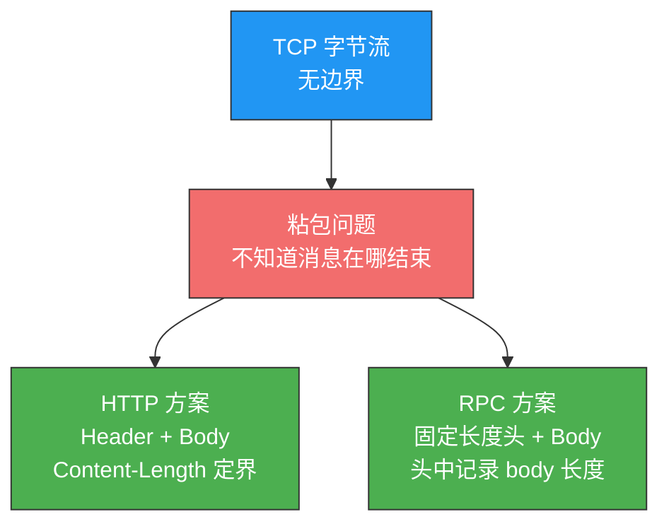
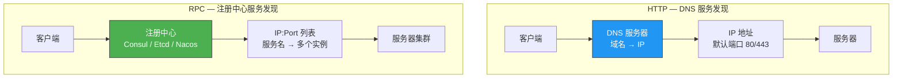
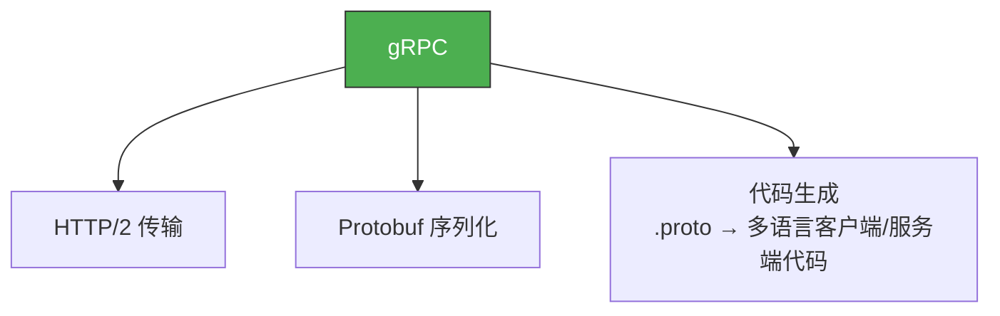
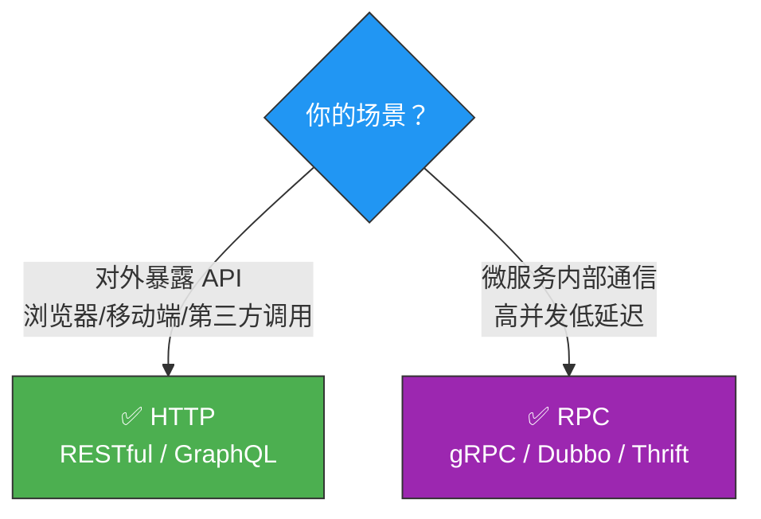

# 既然有 HTTP，为什么还要 RPC？

> 很多人以为 RPC 是 HTTP 的替代品，其实不对——RPC 出现得比 HTTP 还早。
> 真正的问题应该是：它们各自擅长什么？为什么微服务内部用 RPC，对外暴露用 HTTP？

## 一、先搞清楚：TCP 的"粘包"问题

HTTP 和 RPC 都是**应用层协议**，都基于 TCP。而 TCP 是无边界的字节流，你无法区分两个消息之间的边界——这就是"粘包"问题。

::: important 什么是粘包？
发送方连续发了两条消息 `Hello` 和 `World`，接收方可能读成 `HelloWorld`——两条消息"粘"在一起了。
:::

解决粘包的核心思路：**定义消息边界**。HTTP 和 RPC 的做法殊途同归——都是 **Header（含 body 长度）+ Body** 的格式。



---

## 二、历史渊源：RPC 比 HTTP 更早

| 时间 | 事件 |
|------|------|
| 1970s | TCP 协议诞生 |
| 1980s | **RPC** 诞生（Sun RPC、ONC RPC） |
| 1990s | **HTTP** 诞生（HTTP/0.9 → 1.0） |

> 所以"既然有 HTTP 为什么还要 RPC"这个问题本身就有问题——RPC 才是前辈。更准确的说法是：**既然有 RPC，为什么还要发明 HTTP？**

答案是**应用场景不同**：

| | HTTP | RPC |
|--|------|-----|
| **原始架构** | B/S（Browser/Server） | C/S（Client/Server） |
| **设计目的** | 统一标准，让浏览器能访问任何公司的服务器 | 单个公司内部软件间的通信 |
| **当前趋势** | B/S 和 C/S 在融合 | 主要用于**微服务内部通信** |

---

## 三、三大核心区别

### 3.1 服务发现



| | HTTP | RPC |
|--|------|-----|
| **机制** | DNS 解析域名 → IP 地址 | 注册中心（Consul/Etcd/Nacos）维护服务名 → IP:Port 映射 |
| **特点** | 简单通用 | 支持服务实例的动态注册与发现、健康检查、负载均衡 |

> 两者思路不同，但没有绝对的优劣。有些 RPC 实现也用 DNS（如 CoreDNS）。

### 3.2 底层连接形式

| | HTTP/1.1 | RPC |
|--|----------|-----|
| **连接类型** | TCP 长连接（Keep-Alive） | TCP 长连接 + **连接池** |
| **连接池** | 协议本身不提供，部分语言库自行实现（如 Go 的 net/http） | 内建连接池，多连接复用，按需借还 |

::: tip 实际差距不大
现代 HTTP 库大多也自带连接池（如 Go 的 net/http、Java 的 HttpClient），所以底层连接形式上 HTTP 和 RPC 的差距已经不大。
:::

### 3.3 传输内容——最本质的区别

这是 HTTP 和 RPC **最核心的差异**，也是微服务选择 RPC 的根本原因。

**HTTP/1.1 的传输内容**：

```
POST /api/user/create HTTP/1.1
Host: www.example.com
Content-Type: application/json
Content-Length: 52

{"name": "zhangsan", "age": 25, "email": "zhangsan@example.com"}
```

**RPC（以 gRPC + Protobuf 为例）的传输内容**：

```
| 方法索引(2B) | 请求体长度(4B) | 二进制序列化数据 |
```

| 对比项 | HTTP/1.1 | RPC (Protobuf) |
|--------|----------|----------------|
| **Header** | 文本格式，冗长（字段名每次完整发送） | 紧凑二进制，字段位置预约定，只发值 |
| **Body 序列化** | JSON（文本，可读但体积大） | Protobuf（二进制，紧凑高效） |
| **冗余** | 高——大量重复的 Key 名、完整的 HTTP 头 | 低——按 .proto 文件预生成编解码代码 |
| **浏览器兼容** | 必须考虑（302 重定向等） | 不需要 |
| **性能** | 较低 | **更高** |

```mermaid
graph LR
    subgraph "HTTP/1.1 — JSON"
        H_JSON['{"name":"zhangsan",<br/>"age":25,<br/>"email":"zhangsan@example.com"}']
        H_SIZE["约 60+ 字节"]
    end

    subgraph "RPC — Protobuf"
        R_BIN["0A 08 7A 68 61 6E 67 73 61 6E<br/>10 19 1A 16 ..."]
        R_SIZE["约 30 字节"]
    end

    style H_SIZE fill:#f26d6d,stroke:#333,color:#fff
    style R_SIZE fill:#4CAF50,stroke:#333,color:#fff
```

::: important 为什么微服务内部用 RPC？
1. **性能更好**：Protobuf 二进制序列化比 JSON 紧凑得多，网络传输量小，编解码速度快
2. **协议开销更小**：没有 HTTP 冗长的 Header，字段位置预约定，不需要每次传输字段名
3. **不需要浏览器兼容**：内部服务间通信无需考虑 302 重定向、Cookie 等浏览器行为
:::

---

## 四、那 HTTP/2 呢？

HTTP/2 做了大量优化（头部压缩、二进制帧、多路复用），性能已经逼近甚至超过很多 RPC 协议。

**gRPC** 就是基于 HTTP/2 实现的 RPC 框架：

```
gRPC = HTTP/2 + Protobuf + 代码生成
```



那为什么很多公司没有迁移到 gRPC/HTTP/2？

**历史惯性**——HTTP/2 在 2015 年才发布，很多公司的 RPC 框架（如 Thrift、Dubbo）已经用了多年，迁移成本高，现有方案也没有致命问题。

---

## 五、RPC 的一些澄清

::: important RPC 不是严格意义上的"协议"
RPC（Remote Procedure Call）是一种**调用范式**——让你像调用本地方法一样调用远程方法。具体的实现如 gRPC、Thrift、Dubbo 才是协议/框架。
:::

| 误解 | 事实 |
|------|------|
| RPC 必须用 TCP | RPC 也可以用 UDP 或 HTTP 作为传输层 |
| RPC 是一种协议 | RPC 是调用范式，gRPC/Thrift 才是具体实现 |
| RPC 会取代 HTTP | 两者场景不同：内部用 RPC，对外用 HTTP |
| HTTP 比 RPC 差 | HTTP/2 的性能已经很接近 RPC，gRPC 甚至基于 HTTP/2 |

---

## 六、怎么选？



| 场景 | 推荐 | 原因 |
|------|------|------|
| 对外暴露 API | HTTP | 浏览器直接调用，跨语言跨平台，生态成熟 |
| 微服务内部通信 | RPC | 性能更好，代码生成简化调用，连接池/服务发现内建 |
| 同时需要两者 | gRPC + gRPC-Gateway | 内部 gRPC，网关层转 HTTP 对外 |

---

::: tip 面试速查
- **Q：HTTP 和 RPC 的核心区别？** A：传输内容格式——HTTP/1.1 用文本 Header + JSON body（冗余大），RPC 用紧凑二进制 + Protobuf（性能高）。服务发现方式也不同：HTTP 用 DNS，RPC 用注册中心。
- **Q：为什么微服务内部用 RPC？** A：性能更好（Protobuf 比 JSON 紧凑）、协议开销更小、不需要浏览器兼容。
- **Q：gRPC 是什么？** A：基于 HTTP/2 + Protobuf 的 RPC 框架，兼具 HTTP/2 的传输优化和 Protobuf 的序列化效率。
- **Q：RPC 会取代 HTTP 吗？** A：不会，场景不同。对外用 HTTP（通用性），内部用 RPC（性能）。
:::

---

::: info 原著参考
- 小林coding《图解网络》—— [既然有 HTTP 协议，为什么还要有 RPC？](https://xiaolincoding.com/network/2_http/http_rpc.html)
:::
