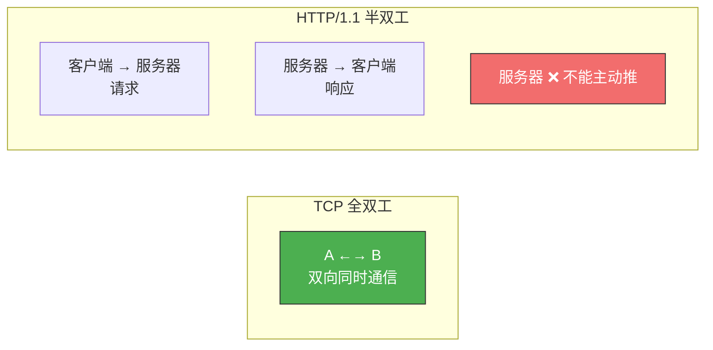
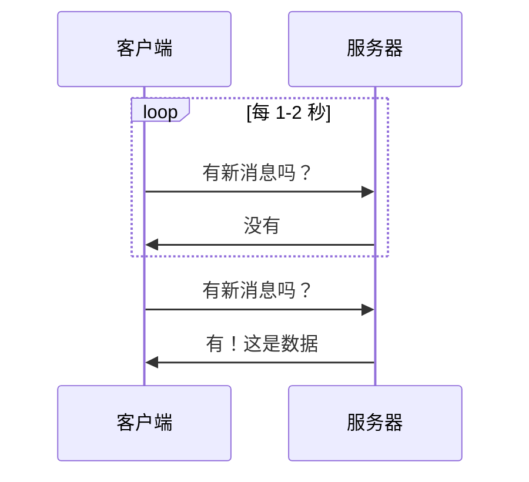
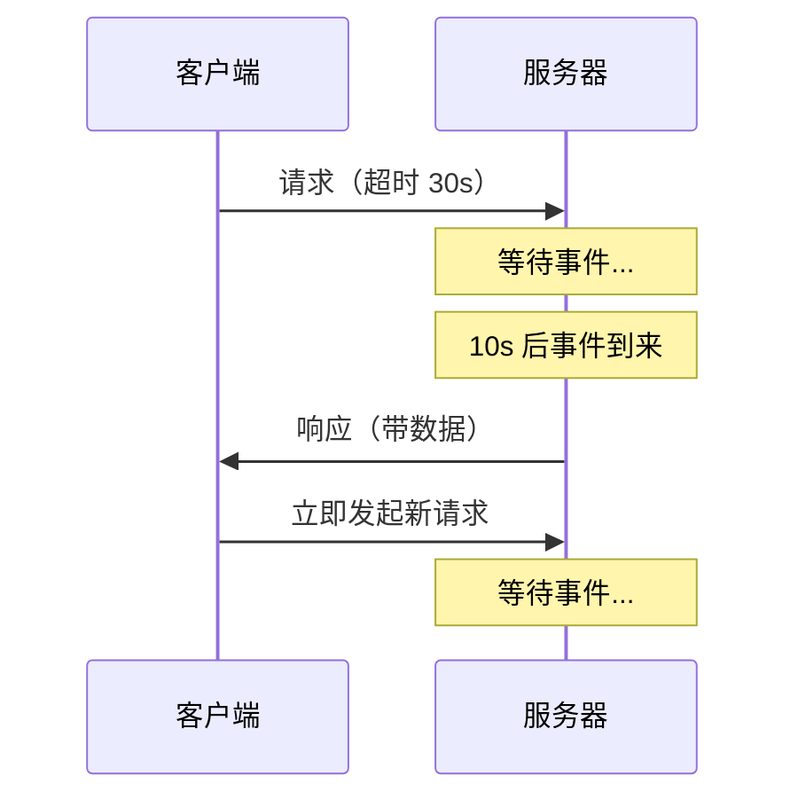
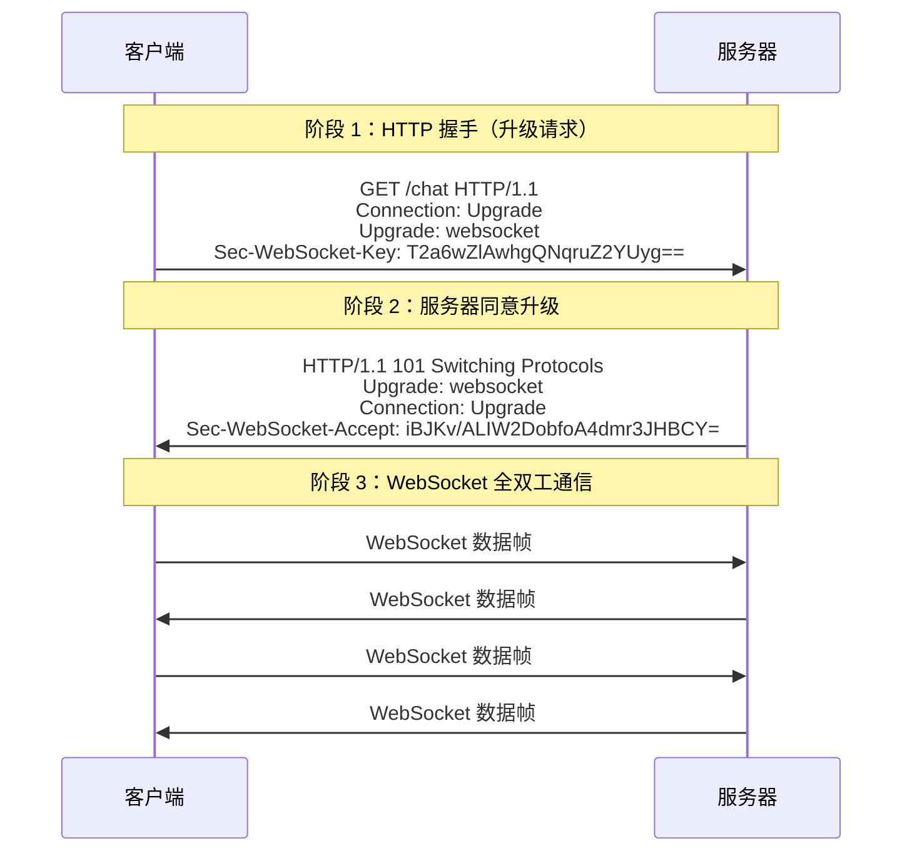
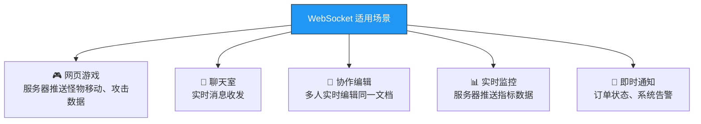

# 既然有 HTTP，为什么还要 WebSocket？

> TCP 本来就是全双工的——双方可以同时收发数据。
> 但 HTTP/1.1 硬生生把它用成了半双工：客户端不发请求，服务器就没法主动推数据。
> WebSocket 就是为了还 TCP 全双工本来的面目。

## 一、HTTP 的"半双工"困境

HTTP/1.1 基于 TCP，TCP 天然支持全双工通信。但 HTTP 的请求-响应模型，让服务器**只能被动应答**，永远无法主动向客户端推送数据。



> 好好的全双工 TCP，被 HTTP/1.1 用成了半双工。

HTTP 最初是为浏览网页设计的——用户点一个链接，服务器返回一个页面，这种请求-响应模式完全够用。但随着 Web 应用的发展，实时通信需求越来越多：聊天、游戏、协作编辑……

---

## 二、HTTP 的"伪推送"方案

在 WebSocket 出现之前，人们用各种 hack 来模拟服务器推送：

### 2.1 短轮询（Short Polling）

前端每隔固定时间（如 1~2 秒）发一次 HTTP 请求：



**问题**：
- 大量无效请求，浪费带宽和服务器资源
- 实时性差——用户扫码后可能要等 1-2 秒才轮到下一次请求

### 2.2 长轮询（Long Polling）

客户端发请求，服务器**不立即返回**，而是等到有事件或超时才响应：



**比短轮询好**：请求次数少，接近实时响应。

**但本质还是客户端主动**——"伪服务器推送"。每次响应后都要重新建立请求。

| 方案 | 实时性 | 请求次数 | 服务器压力 |
|------|--------|----------|-----------|
| 短轮询 | 差（1-2s 延迟） | 多 | 大 |
| 长轮询 | 较好 | 较少 | 中等 |
| **WebSocket** | **极好** | **1 次** | **小** |

---

## 三、WebSocket：真正的全双工

### 3.1 核心特性

| 特性 | HTTP/1.1 | WebSocket |
|------|----------|-----------|
| 通信模式 | 半双工（请求-响应） | **全双工**（双方随时发） |
| 协议基础 | TCP | TCP |
| 服务器推送 | 需轮询 hack | **原生支持** |
| 连接开销 | 每次交互都有请求头 | 持久连接，极低开销 |
| 适用场景 | 请求-响应型 | **频繁双向交互** |

### 3.2 连接建立——"借壳生蛋"

WebSocket 不是凭空建立连接的，它**借用 HTTP 完成初始握手，然后升级协议**：



**握手细节**：

1. 客户端发送 HTTP 请求，带三个特殊头部：

```
Connection: Upgrade          # 我要升级协议
Upgrade: websocket           # 升级为 WebSocket
Sec-WebSocket-Key: T2a6wZlAwhgQNqruZ2YUyg==   # 客户端随机数
```

2. 服务器返回 **101 Switching Protocols**，表示同意升级：

```
HTTP/1.1 101 Switching Protocols
Upgrade: websocket
Connection: Upgrade
Sec-WebSocket-Accept: iBJKv/ALIW2DobfoA4dmr3JHBCY=
```

3. `Sec-WebSocket-Accept` 是服务器用公开算法对客户端的 `Sec-WebSocket-Key` 计算得出的，客户端可验证。

::: important 关键认知
WebSocket **只有在建立连接时借用了 HTTP**，升级完成之后就跟 HTTP 没有任何关系了。它不是基于 HTTP 的协议——HTTP 只是握手工具。
:::

### 3.3 WebSocket 与 Socket 的关系

> Socket 和 WebSocket 之间，就跟雷峰和雷峰塔一样——二者**几乎毫无关系**。

| | Socket | WebSocket |
|--|--------|-----------|
| 层级 | 传输层 API（TCP/UDP 的编程接口） | 应用层协议 |
| 本质 | 一组 API 调用 | 一个完整协议（RFC 6455） |
| 用途 | 任意 TCP/UDP 通信 | 浏览器与服务器全双工通信 |

---

## 四、WebSocket 数据帧格式

WebSocket 通信的最小单位是**帧（Frame）**，格式如下：

```
 0                   1                   2                   3
 0 1 2 3 4 5 6 7 8 9 0 1 2 3 4 5 6 7 8 9 0 1 2 3 4 5 6 7 8 9 0 1
+-+-+-+-+-------+-+-------------+-------------------------------+
|F|R|R|R| opcode|M| Payload len |    Extended payload length    |
|I|S|S|S|  (4)  |A|     (7)     |            (16/64)            |
|N|V|V|V|       |S|             |   (if payload len==126/127)   |
| |1|2|3|       |K|             |                               |
+-+-+-+-+-------+-+-------------+-------------------------------+
|     Extended payload length continued, if payload len == 127  |
+-------------------------------+-------------------------------+
|                               |Masking-key, if MASK set to 1  |
+-------------------------------+-------------------------------+
| Masking-key (continued)       |          Payload Data         |
+-------------------------------+-------------------------------+
```

关键字段：

| 字段 | 作用 |
|------|------|
| **opcode** | 数据类型：`1` = 文本，`2` = 二进制，`8` = 关闭连接，`9` = ping，`10` = pong |
| **MASK** | 是否掩码（客户端→服务器必须掩码，服务器→客户端不掩码） |
| **Payload length** | 实际数据的长度 |

**Payload Length 编码**：

| 初始 7 位值 | 含义 |
|-------------|------|
| 0~125 | 这个值就是完整长度 |
| 126 | 后续 **16 位**表示真实长度（126~65535） |
| 127 | 后续 **64 位**表示真实长度（≥65536） |

::: tip 解决粘包的思路
和 HTTP、RPC 一样，WebSocket 也用 **Header（含 body 长度）+ Body** 的格式来定义消息边界，解决 TCP 粘包问题。这是应用层协议解决粘包的通用套路。
:::

---

## 五、WebSocket 实战示例

### 5.1 前端代码

```javascript
// 建立 WebSocket 连接
const ws = new WebSocket('wss://example.com/chat');

ws.onopen = () => {
    console.log('连接已建立');
    ws.send('Hello, WebSocket!');
};

ws.onmessage = (event) => {
    console.log('收到消息:', event.data);
};

ws.onclose = () => {
    console.log('连接已关闭');
};

ws.onerror = (error) => {
    console.error('连接出错:', error);
};
```

### 5.2 抓包观察 WebSocket

```bash
# 用 tcpdump 抓包
sudo tcpdump -i eth0 -w ws.pcap 'tcp port 443'

# 在 Wireshark 中过滤 WebSocket 帧
# 过滤器：websocket
```

---

## 六、典型应用场景



**判断标准**：凡是需要**频繁双向交互**的场景，WebSocket 都是更好的选择。

| 场景 | 推荐协议 | 原因 |
|------|----------|------|
| 普通 API 请求 | HTTP | 请求-响应模式够用 |
| 聊天/游戏/协作 | **WebSocket** | 需要服务器主动推送 |
| 文件上传/下载 | HTTP | 大文件传输 HTTP 更合适 |
| 实时数据看板 | **WebSocket** | 数据持续推送 |

---

## 七、三种方案完整对比

| 对比项 | HTTP 短轮询 | HTTP 长轮询 | WebSocket |
|--------|------------|------------|-----------|
| 通信模式 | 客户端主动 | 客户端主动 | **全双工** |
| 实时性 | 差（秒级延迟） | 较好 | **极好（毫秒级）** |
| 请求开销 | 大（每次完整 HTTP 请求） | 中等 | **极小（无 Header 开销）** |
| 服务器压力 | 大 | 中等 | **小** |
| 连接数 | 多 | 较少 | **1 条** |
| 实现复杂度 | 简单 | 中等 | 中等 |

---

::: tip 面试速查
- **Q：为什么需要 WebSocket？** A：HTTP/1.1 是半双工，服务器无法主动推送。WebSocket 提供全双工通信，服务器可以随时向客户端推送数据。
- **Q：WebSocket 连接是怎么建立的？** A：先发 HTTP 请求带 `Upgrade: websocket` 头部，服务器返回 101 Switching Protocols，升级完成后切换为 WebSocket 协议。
- **Q：WebSocket 和 HTTP 的关系？** A：WebSocket 只在握手时使用 HTTP，升级后与 HTTP 无关。
- **Q：WebSocket 和 Socket 的关系？** A：几乎没有关系。Socket 是传输层 API，WebSocket 是应用层协议。
- **Q：短轮询、长轮询、WebSocket 怎么选？** A：实时性要求不高用短轮询，较好实时性用长轮询，频繁双向交互用 WebSocket。
:::

---

::: info 原著参考
- 小林coding《图解网络》—— [既然有 HTTP 协议，为什么还要有 WebSocket？](https://xiaolincoding.com/network/2_http/http_websocket.html)
:::
