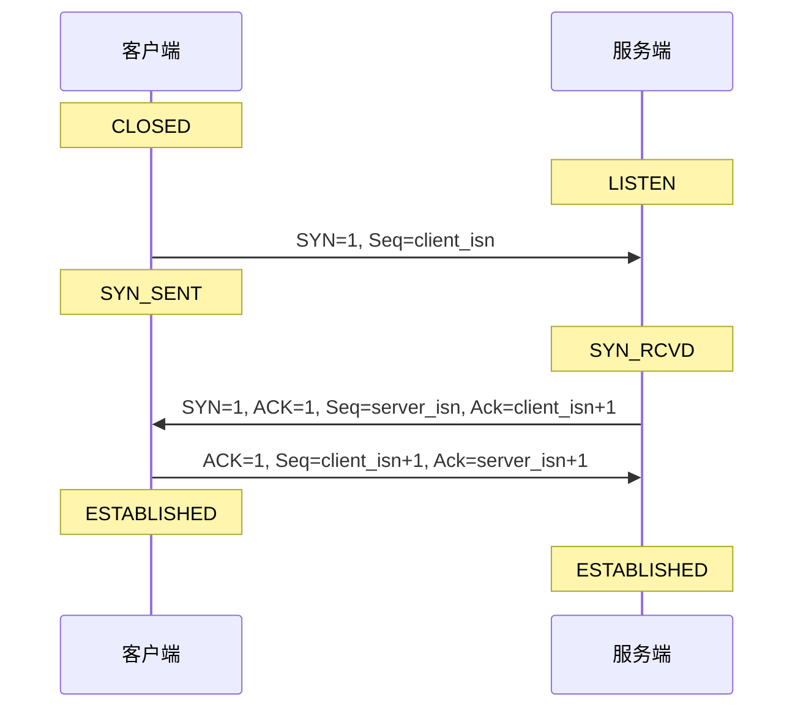
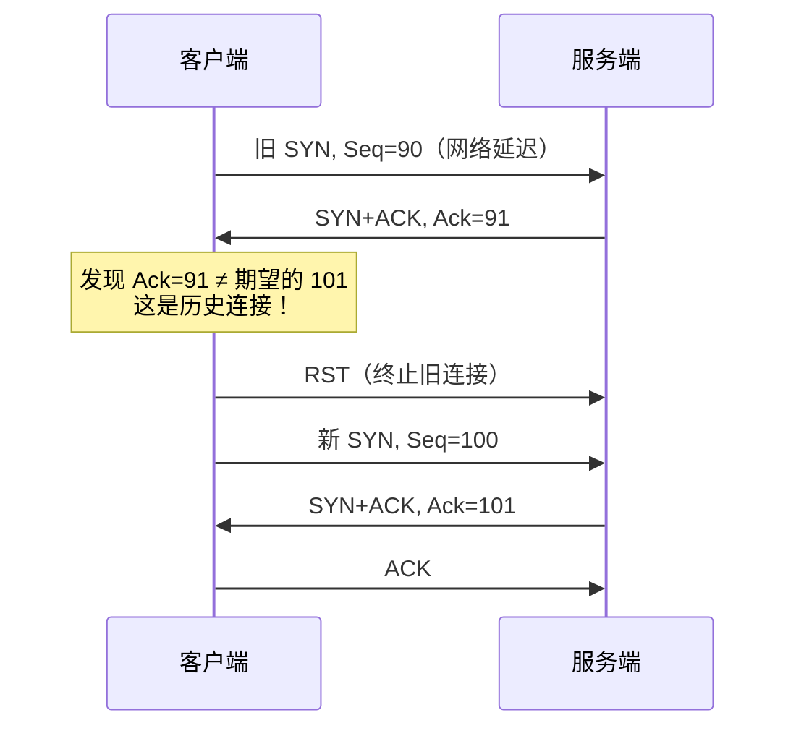
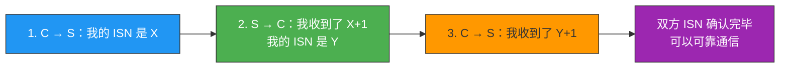
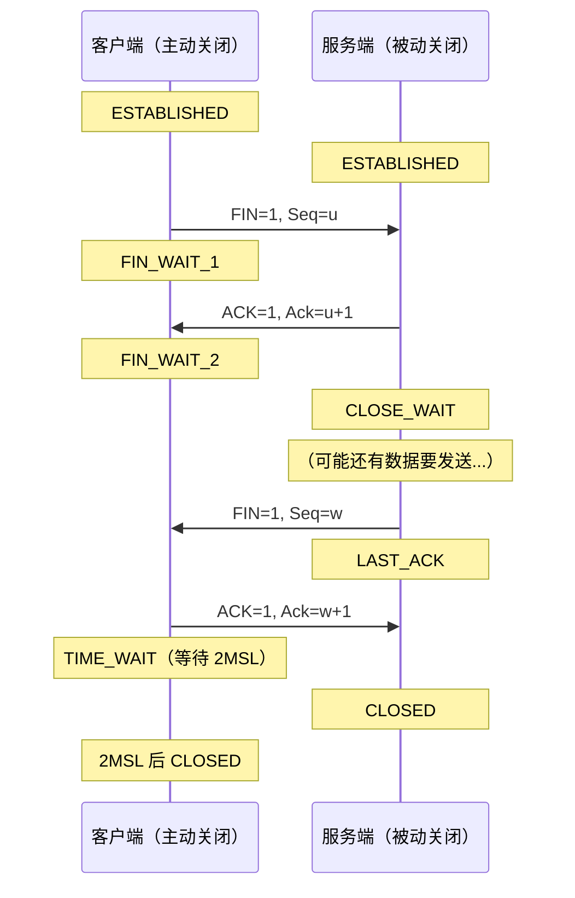
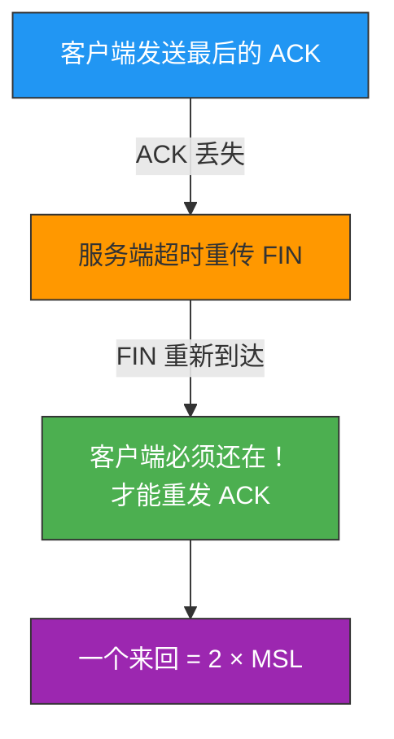
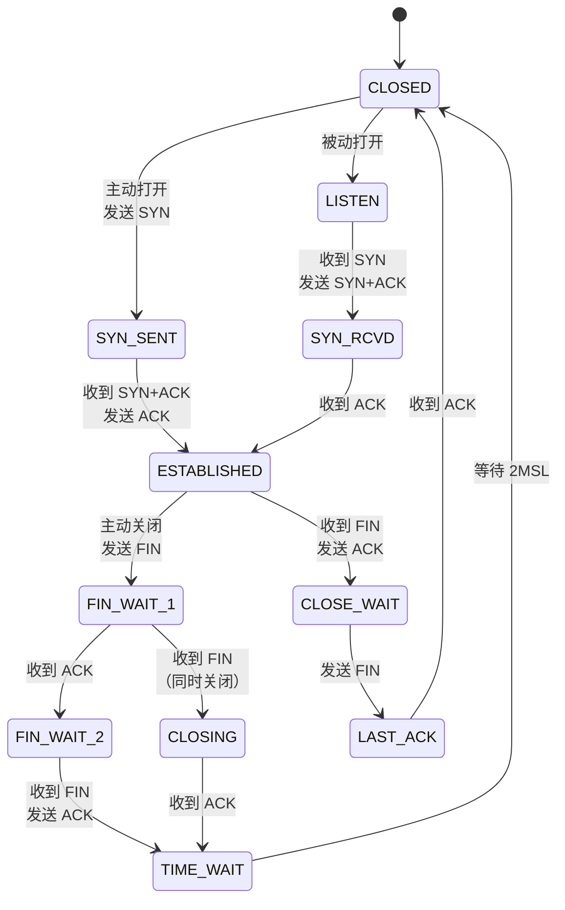

# TCP三次握手与四次挥手

> TCP 连接的建立和断开，是面试中出现频率最高的网络题目。理解三次握手和四次挥手，不仅是应对面试，更是排查线上连接问题的关键基础。

## 一、TCP 三次握手

### 1.1 完整过程

三次握手的核心目标：**双方确认彼此的发送和接收能力都正常**，同时同步初始序列号（ISN）。



**三个步骤拆解**：

| 步骤 | 方向 | 报文内容 | 客户端状态 | 服务端状态 |
|------|------|---------|------------|------------|
| 第一次 | C → S | SYN=1, Seq=client_isn | SYN_SENT | — |
| 第二次 | S → C | SYN=1, ACK=1, Seq=server_isn, Ack=client_isn+1 | SYN_SENT | SYN_RCVD |
| 第三次 | C → S | ACK=1, Seq=client_isn+1, Ack=server_isn+1 | ESTABLISHED | ESTABLISHED |

::: important 关键细节
- 前两次握手**不能携带数据**，第三次握手**可以携带数据**。
- SYN 报文不包含数据，但**消耗一个序列号**；纯 ACK 报文不消耗序列号。
- MSS（Maximum Segment Size）在握手阶段通过 TCP 选项协商，通常为 1460 字节。
:::

### 1.2 为什么是三次，不是两次？

这是面试最高频的问题，核心原因有两个：

**原因一：防止历史连接初始化**（RFC 793 给出的首要原因）

假设只有两次握手：客户端发送了一个"旧的" SYN（seq=90），由于网络延迟，这个 SYN 比"新的" SYN（seq=100）更晚到达服务端。



如果是**两次握手**，服务端收到 SYN 就直接进入 ESTABLISHED 并分配资源——万一这是个历史连接，服务端就白白浪费了资源，甚至可能把旧数据当成新数据处理。

**三次握手的优势**：客户端在收到 SYN+ACK 后还能"反悔"——发现不对就发 RST 终止，服务端还没分配太多资源。

**原因二：同步双方的初始序列号**

可靠传输的前提是双方都知道对方的初始序列号。三次握手恰好是确认双方 ISN 的最小次数：



::: tip 面试速查
- **为什么不是两次？** 无法防止历史连接，也无法确认双方 ISN。
- **为什么不是四次？** 第二次握手中的 SYN+ACK 可以合并为一次发送，四次握手浪费时间。
- **为什么不是三次挥手？** 因为 TCP 是全双工的，每个方向需要单独关闭。
:::

### 1.3 初始序列号（ISN）为什么每次不同？

如果 ISN 固定为 0，那么上一个连接中滞留在网络中的报文，可能恰好落在新连接的接收窗口内，导致数据错乱。

ISN 的生成方式（RFC 793）：

```
ISN = M + F(localhost, localport, remotehost, remoteport)
```

- `M`：一个每 4 微秒加 1 的计时器（约 4.55 小时循环一次）
- `F`：基于四元组的哈希函数（如 MD5），确保不同连接的 ISN 不同

::: warning 安全警告
早期的 ISN 生成算法可预测，攻击者可以伪造 TCP 报文（TCP 劫持）。现代操作系统使用更安全的随机数生成器。
:::

### 1.4 握手报文丢失会怎样？

| 丢失的报文 | 谁重传？ | 控制参数 | 默认值 |
|-----------|---------|---------|-------|
| 第一次 SYN | 客户端重传 SYN | `tcp_syn_retries` | 5 |
| 第二次 SYN+ACK | **双方都重传** | `tcp_synack_retries` | 5 |
| 第三次 ACK | 服务端重传 SYN+ACK | `tcp_synack_retries` | 5 |

::: important 核心原则
**ACK 报文永远不会被重传**。如果 ACK 丢了，对方会重传那个需要被确认的报文（SYN 或 SYN+ACK）。
:::

超时重传采用**指数退避**：1s → 2s → 4s → 8s → 16s + 最后一次等待 32s = **总共 63 秒**。

```bash
# 查看当前 SYN 重传次数
cat /proc/sys/net/ipv4/tcp_syn_retries
# 修改为 2（适合内网稳定环境）
sysctl -w net.ipv4.tcp_syn_retries=2
```

### 1.5 MSS 与 IP 分片

| 对比项 | TCP 层分段（MSS） | IP 层分片 |
|--------|------------------|----------|
| 发生层 | 传输层 | 网络层 |
| 大小 | MSS = MTU - IP头 - TCP头 ≈ 1460B | 超过 MTU 的 IP 包 |
| 重传 | 只重传丢失的段 | 一个分片丢失 → 整个 IP 包重传 |
| 效率 | 高 | 低 |

> MSS 在三次握手时通过 TCP 选项协商，避免 IP 层分片。

---

## 二、TCP 四次挥手

### 2.1 完整过程

TCP 是全双工通信，每个方向需要单独关闭，所以需要四次挥手。



**为什么需要四次而不是三次？**

- FIN 的含义是"我不再发送数据了"，但**仍然可以接收数据**
- 服务端收到 FIN 后可能还有数据要发，所以 ACK 和 FIN 不能合并
- 只有当服务端也没有数据要发时，ACK 和 FIN 才能合并——这时四次挥手变成了三次

::: tip 面试速查
- **为什么不能把服务端的 ACK 和 FIN 合并？** 因为服务端收到 FIN 后可能还有数据没发完，只能先回 ACK，等数据发完再发 FIN。
- **四次挥手可以变成三次吗？** 可以，当服务端没有数据要发时，ACK 和 FIN 合并为一次发送。
:::

### 2.2 挥手报文丢失会怎样？

| 丢失的报文 | 谁重传？ | 控制参数 |
|-----------|---------|---------|
| 第一次 FIN | 客户端重传 FIN | `tcp_orphan_retries` |
| 第二次 ACK | 客户端重传 FIN（ACK 不重传） | `tcp_orphan_retries` |
| 第三次 FIN | 服务端重传 FIN | `tcp_orphan_retries` |
| 第四次 ACK | 服务端重传 FIN（ACK 不重传） | `tcp_orphan_retries` |

---

## 三、TIME_WAIT 状态深度解析

TIME_WAIT 是面试和线上排障的"常客"，务必深入理解。

### 3.1 为什么需要等待 2MSL？

**MSL**（Maximum Segment Lifetime）是报文在网络中的最大生存时间。Linux 中 MSL = 30 秒，2MSL = **60 秒**（硬编码为 `TCP_TIMEWAIT_LEN`）。

为什么是 **2** 倍 MSL？考虑这个场景：



### 3.2 TIME_WAIT 存在的两个核心原因

**原因一：防止旧连接的延迟报文被新连接接收**

```
场景（没有 TIME_WAIT）：
1. 连接 A：服务端发送 Seq=301 的数据，网络延迟
2. 连接 A 关闭
3. 连接 B 用相同四元组建立
4. 延迟的 Seq=301 报文到达 → 落入新连接的接收窗口
5. 客户端把旧数据当新数据处理 → 数据错乱！
```

有了 2MSL 等待，旧连接的所有报文都已在网络中消亡。

**原因二：确保连接优雅关闭**

```
场景（没有 TIME_WAIT）：
1. 客户端发送最后的 ACK → 丢失
2. 客户端直接进入 CLOSED
3. 服务端重传 FIN
4. 客户端已 CLOSED → 回复 RST
5. 服务端收到 RST → 连接异常终止
```

有了 TIME_WAIT，客户端还能收到重传的 FIN 并回复 ACK。

### 3.3 TIME_WAIT 过多的危害

| 危害 | 说明 |
|------|------|
| 文件描述符耗尽 | 每个连接占一个 fd |
| 端口耗尽 | 客户端端口范围 32768-61000，TIME_WAIT 占用后无法复用 |
| 内存/CPU 消耗 | 大量连接消耗系统资源 |

**服务端 TIME_WAIT 过多的常见原因**：

| 原因 | 说明 | 解决 |
|------|------|------|
| HTTP 未开启 Keep-Alive | 每个请求建立新连接，服务端主动关闭 | 双方开启 Keep-Alive |
| Keep-Alive 超时 | Nginx 的 `keepalive_timeout` 触发关闭 | 检查客户端为何空闲 |
| Keep-Alive 请求上限 | Nginx 的 `keepalive_requests` 默认 100 | 高 QPS 场景适当调大 |

### 3.4 如何优化 TIME_WAIT？

| 方法 | 机制 | 风险 |
|------|------|------|
| `tcp_tw_reuse=1` + `tcp_timestamps=1` | 复用超过 1 秒的 TIME_WAIT 端口（仅出站连接） | 低（时间戳防混淆） |
| `tcp_max_tw_buckets` | 超过上限的 TIME_WAIT 强制关闭 | 中等（粗暴回收） |
| `SO_LINGER` + `l_linger=0` | close 时发 RST 跳过 TIME_WAIT | **高**（破坏 TCP 语义） |

```bash
# 方法 1：启用端口复用（推荐，仅客户端生效）
sysctl -w net.ipv4.tcp_tw_reuse=1
sysctl -w net.ipv4.tcp_timestamps=1

# 方法 2：限制 TIME_WAIT 数量
sysctl -w net.ipv4.tcp_max_tw_buckets=5000
```

::: warning 绝对不要用 tcp_tw_recycle
`tcp_tw_recycle` 在 NAT 环境下会导致 PAWS（Protection Against Wrapped Sequences）检查失败，客户端连接被拒绝。**已在 Linux 4.12 中移除**，切勿使用！
:::

::: tip 面试速查
- **TIME_WAIT 是客户端还是服务端的？** 主动关闭的一方进入 TIME_WAIT。通常是客户端，但如果服务端先调 `close()`，服务端也会有。
- **如何避免服务端 TIME_WAIT 过多？** 让客户端主动关闭，或开启 Keep-Alive。
- **tcp_tw_reuse 和 tcp_tw_recycle 的区别？** reuse 仅复用出站端口，安全；recycle 在 NAT 环境下有严重问题，已废弃。
:::

---

## 四、CLOSE_WAIT 问题排查

CLOSE_WAIT 表示**被动关闭方收到了 FIN，但应用层还没调 `close()`**。


**大量 CLOSE_WAIT 的根本原因：应用代码没有正确关闭连接。**

常见代码问题：

1. 没有把 socket 注册到 epoll → 无法感知对端关闭
2. `read()` 返回 0 时没有调 `close()`
3. 异常处理分支跳过了 `close()`
4. 线程死锁导致 `close()` 无法执行

::: warning CLOSE_WAIT 没有内核参数可以调
CLOSE_WAIT 的超时完全取决于应用层何时调 `close()`。看到大量 CLOSE_WAIT，一定是代码 bug，不要试图通过内核参数解决。
:::

---

## 五、TCP 连接状态机总览



| 状态 | 所在方 | 含义 |
|------|--------|------|
| LISTEN | 服务端 | 等待连接 |
| SYN_SENT | 客户端 | 已发 SYN，等待 SYN+ACK |
| SYN_RCVD | 服务端 | 已发 SYN+ACK，等待 ACK |
| ESTABLISHED | 双方 | 连接已建立 |
| FIN_WAIT_1 | 主动关闭方 | 已发 FIN，等待 ACK |
| FIN_WAIT_2 | 主动关闭方 | 收到 ACK，等待对方 FIN |
| CLOSE_WAIT | 被动关闭方 | 收到 FIN，等待应用 close() |
| LAST_ACK | 被动关闭方 | 已发 FIN，等待最后 ACK |
| TIME_WAIT | 主动关闭方 | 等待 2MSL |
| CLOSED | 双方 | 连接完全关闭 |

---

## 六、TCP 连接的唯一标识

一个 TCP 连接由**四元组**唯一确定：

```
{源 IP, 源端口, 目的 IP, 目的端口}
```

- 理论上，一个服务端端口最大连接数 = 2³² × 2¹⁶ ≈ 2⁴⁸
- 实际瓶颈：文件描述符、内存、CPU

::: tip 面试速查
- **一个 TCP 服务端能支持多少连接？** 理论上约 2⁴⁸（受四元组约束），实际上受 fd、内存限制，单机通常几十万。
- **TCP 和 UDP 能用同一个端口吗？** 可以。IP 头的协议字段区分 TCP/UDP，交给不同的内核模块处理。
:::

---

## 七、客户端/服务端故障场景

| 场景 | 发生什么 |
|------|---------|
| 客户端进程崩溃 | 操作系统回收资源，发送 FIN → 正常四次挥手 |
| 客户端主机断电 | 服务端无感知；TCP Keepalive（默认 2 小时）超时后回收 |
| 服务端进程崩溃 | 内核发送 FIN → 正常四次挥手 |
| 拔掉网线 | 取决于是否有数据传输；有数据则触发重传超时，无数据则靠 Keepalive |

```bash
# 查看 TCP Keepalive 参数
cat /proc/sys/net/ipv4/tcp_keepalive_time    # 7200s (2h)
cat /proc/sys/net/ipv4/tcp_keepalive_intvl   # 75s
cat /proc/sys/net/ipv4/tcp_keepalive_probes   # 9
# 总超时 = 7200 + 75 × 9 = 7875s ≈ 2h 11min
```

---

## 八、面试速查合集

::: tip 面试速查
- **Q：为什么三次握手不能是两次？**
  A：防止历史连接浪费服务端资源；确认双方 ISN 需要三次交互。

- **Q：为什么四次挥手不能是三次？**
  A：FIN 只是关闭一个方向的发送，服务端可能还有数据要发，ACK 和 FIN 无法合并。但如果服务端无数据要发，可以合并为三次。

- **Q：TIME_WAIT 为什么要等 2MSL？**
  A：确保最后的 ACK 能到达对方（对方重传 FIN 需要一个来回），同时让旧连接的报文在网络中消亡。

- **Q：TIME_WAIT 过多怎么办？**
  A：让客户端主动关闭；开启 `tcp_tw_reuse`；检查 Keep-Alive 配置。

- **Q：大量 CLOSE_WAIT 说明什么？**
  A：应用代码没有正确关闭连接，属于代码 bug。

- **Q：ACK 丢了怎么办？**
  A：ACK 不会重传，对方会重传被确认的报文（SYN/FIN）。

- **Q：ISN 为什么不能固定？**
  A：防止旧连接的延迟报文落入新连接的接收窗口，造成数据错乱。
:::

---

::: info 原著参考
- 小林coding《图解网络》—— [TCP 三次握手与四次挥手面试题](https://xiaolincoding.com/network/3_tcp/tcp_interview.html)
:::
