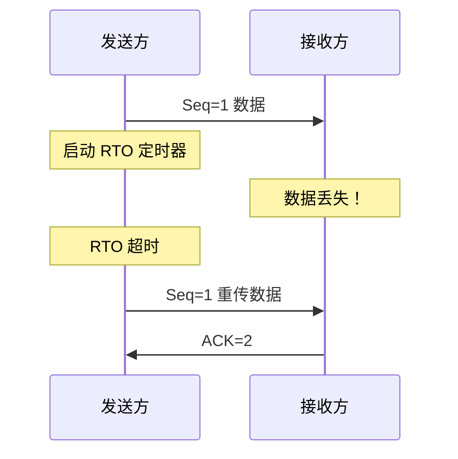
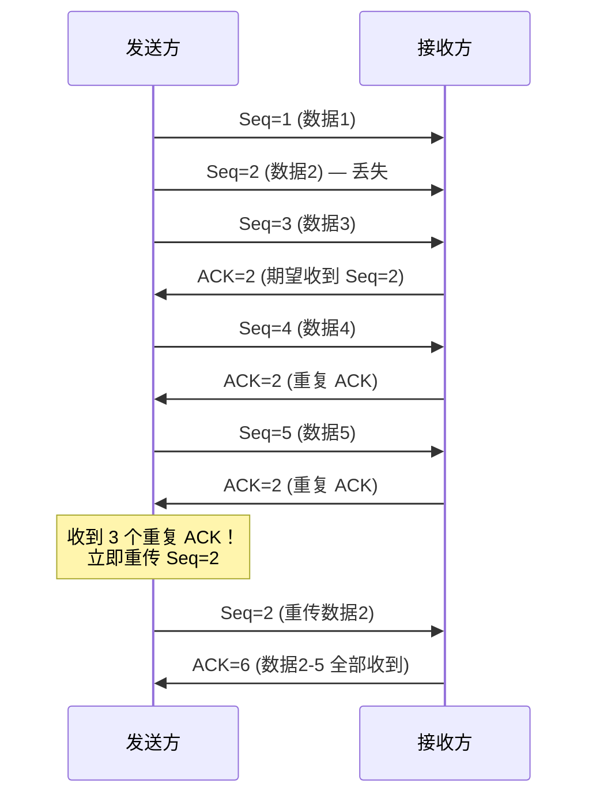
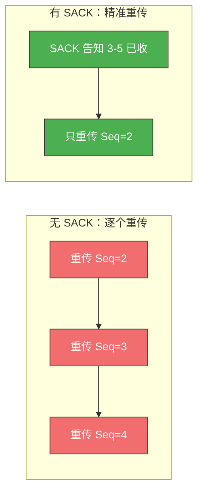
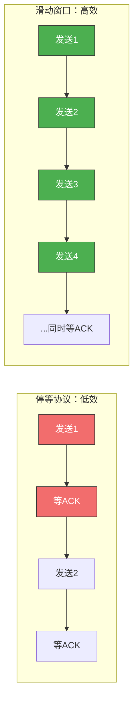
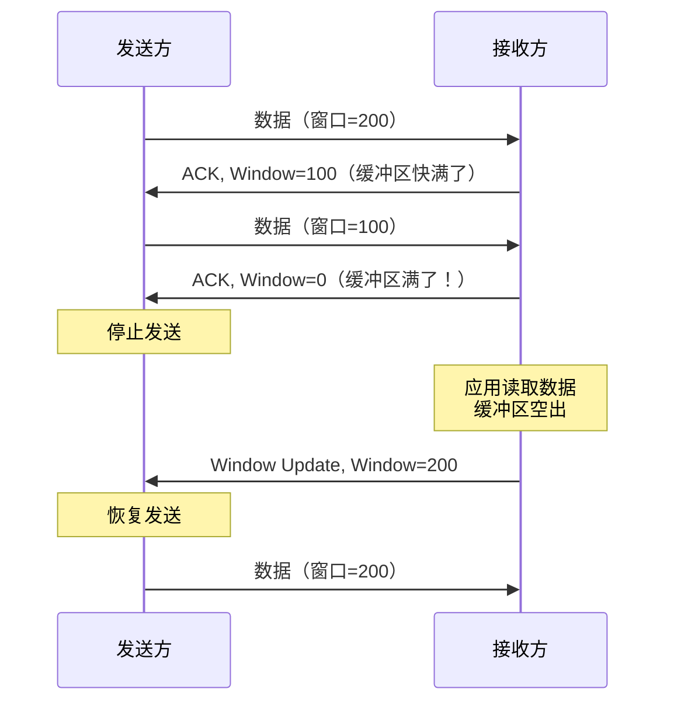
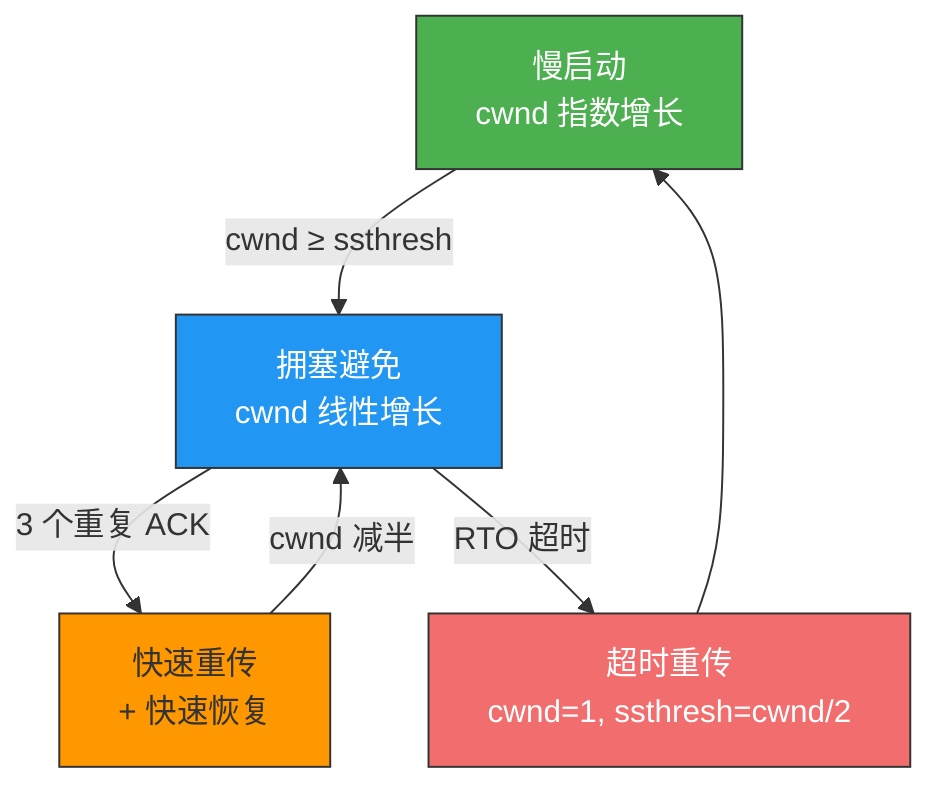
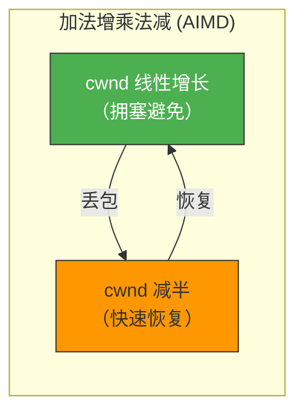
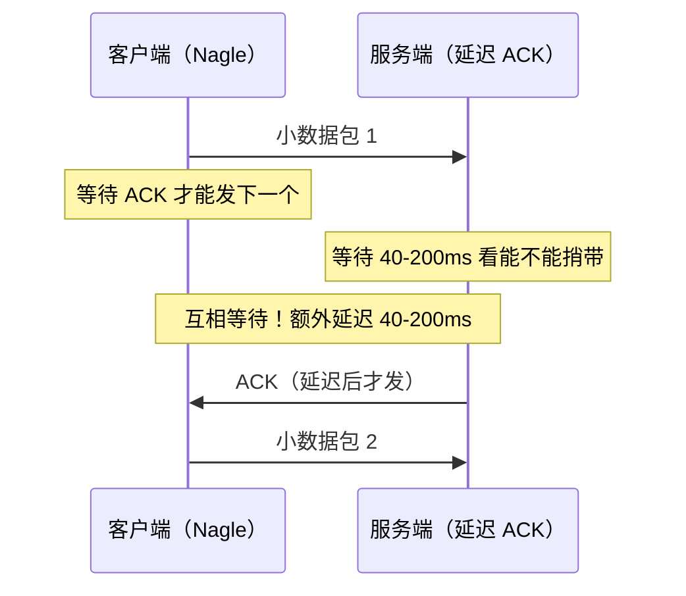

# TCP 重传、滑动窗口、流量控制、拥塞控制

> TCP 之所以"可靠"，靠的就是这四大机制：重传机制保证数据不丢，滑动窗口保证传输效率，流量控制保护接收方，拥塞控制保护网络。理解它们，就理解了 TCP 的灵魂。

## 一、重传机制

### 1.1 超时重传

发送方发出数据后启动定时器，如果在 **RTO**（Retransmission Timeout）内未收到 ACK，就重传该数据。



**RTO 的计算**：基于 **RTT**（Round-Trip Time）动态估算，略大于平滑 RTT。

```
SRTT = (1 - α) × SRTT + α × RTT'       （α 通常 = 0.125）
RTO  = SRTT + 4 × RTTVAR
```

::: warning RTO 不能太大也不能太小
- RTO 太大：丢包后等太久才重传，效率低
- RTO 太小：没丢就重传，浪费带宽
- Linux 使用动态 RTO，每次测量 RTT 后更新
:::

### 1.2 快速重传

超时重传的问题是"等太久"。快速重传利用**重复 ACK**来更早发现丢包：

> 收到 **3 个重复 ACK**（即同一个确认号被确认了 4 次），立即重传，不用等 RTO 超时。



### 1.3 SACK（选择性确认）

快速重传有一个问题：如果 Seq=2、3、4 都丢了，收到 3 个重复 ACK 后只知道 Seq=2 丢了，重传 Seq=2 后又得等重复 ACK 才知道 3 也丢了——效率低。

**SACK** 允许接收方告诉发送方"哪些数据已经收到了"，发送方只需重传缺失的部分。

```bash
# 检查 SACK 是否启用
sysctl net.ipv4.tcp_sack
# 默认值为 1（启用）
```



### 1.4 D-SACK（重复 SACK）

D-SACK 让接收方用 SACK 选项告诉发送方："你重传的数据我其实已经收到了"——即之前并不是真的丢了，只是延迟了。

**好处**：
- 发送方知道是延迟还是真丢包，可以更准确地调整 RTO
- 避免不必要的重传

---

## 二、滑动窗口

### 2.1 为什么需要滑动窗口？

如果没有窗口，TCP 就是"停等协议"——发一个包，等 ACK，再发下一个。RTT 越大，效率越低。



滑动窗口允许发送方在收到 ACK 之前**连续发送多个数据段**，大幅提升吞吐量。

### 2.2 窗口如何"滑动"？

发送方的窗口分为四个区域：


当收到 ACK 时，窗口向右"滑动"——已确认的数据移出窗口，新的数据进入可用窗口。

::: important 窗口大小由谁决定？
- **接收方**通过 TCP 头部的 Window 字段告知自己的接收缓冲区剩余空间
- **发送方**的实际发送量 = min(接收窗口 rwnd, 拥塞窗口 cwnd)
:::

### 2.3 窗口合拢与张开

| 操作 | 含义 |
|------|------|
| 窗口合拢 | 收到较小 rwnd，缩小发送窗口 |
| 窗口张开 | 收到较大 rwnd，扩大发送窗口 |
| 窗口收缩 | 右边界左移——**TCP 标准不允许**，但实践中可能发生 |

---

## 三、流量控制

### 3.1 目的：保护接收方

流量控制是**端到端**的：防止发送方发得太快，淹没接收方的缓冲区。



### 3.2 零窗口探测

当接收方通告 Window=0 后，发送方必须停止发送。但如何知道接收方的缓冲区什么时候有空位？

答案是**零窗口探测（Zero Window Probe）**：发送方定期发 1 字节的探测报文，触发接收方回复当前窗口大小。

```bash
# 零窗口探测相关参数
cat /proc/sys/net/ipv4/tcp_keepalive_intvl  # 探测间隔
```

探测间隔也采用指数退避，与 RTO 类似。

### 3.3 窗口关闭死锁问题

考虑这个场景：
1. 接收方发送 Window=0（缓冲区满）
2. 接收方应用读取数据，缓冲区空出
3. 接收方发送 Window Update 报文 → **丢失！**
4. 发送方以为窗口还是 0，继续等待
5. 接收方以为发送方知道了，也在等待
6. **死锁！**

零窗口探测机制正是为了解决这个死锁：即使 Window Update 丢了，探测报文也能触发接收方重新通告窗口。

### 3.4 糊涂窗口综合征

如果接收方应用每次只读 1 字节，缓冲区空出 1 字节就通告 Window=1，发送方就发 1 字节——大量小包充斥网络，效率极低。

**解决方案**：

| 方 | 策略 | 名称 |
|---|------|------|
| 接收方 | 缓冲区空出不够 MSS 时不通告 | Clark 解决方案 |
| 发送方 | 数据不够 MSS 或窗口不够大时不发 | Nagle 算法 |

---

## 四、拥塞控制

### 4.1 流量控制 vs 拥塞控制

| 对比 | 流量控制 | 拥塞控制 |
|------|---------|---------|
| 保护对象 | 接收方 | 整个网络 |
| 控制依据 | 接收方的 rwnd | 发送方的 cwnd |
| 作用范围 | 端到端 | 全局 |

> 有效发送窗口 = **min(rwnd, cwnd)**

### 4.2 四大算法



#### 4.2.1 慢启动（Slow Start）

连接刚建立时，发送方不知道网络能承受多大流量，所以从"小"开始试探。

- 初始 cwnd = **10 MSS**（Linux 3.0+ 默认值，RFC 6928）
- 每收到一个 ACK，cwnd 增加 1 MSS
- 效果：每个 RTT，cwnd **翻倍**（指数增长）

```
RTT 1: cwnd = 10 → 发 10 个段
RTT 2: cwnd = 20 → 发 20 个段
RTT 3: cwnd = 40 → 发 40 个段
...
```

#### 4.2.2 拥塞避免（Congestion Avoidance）

当 cwnd 达到**慢启动阈值 ssthresh** 时，增长方式从指数切换为线性：

- 每个 RTT，cwnd 只增加 1 MSS（加法增长）
- 小心试探网络的承载能力

#### 4.2.3 快速重传 + 快速恢复

当收到 3 个重复 ACK 时：
1. **快速重传**：立即重传丢失的报文
2. ssthresh = cwnd / 2
3. cwnd = ssthresh（减半，不是归零）
4. 进入拥塞避免（线性增长）

::: important 快速恢复 vs 超时重传
- **3 个重复 ACK** → 快速恢复：cwnd 减半，说明网络还没完全堵死
- **RTO 超时** → 慢启动：cwnd 归零，说明网络可能已经拥塞严重
:::

#### 4.2.4 超时重传后的处理

RTO 超时说明网络严重拥塞：
1. ssthresh = cwnd / 2
2. cwnd = 1 MSS
3. 重新进入慢启动

### 4.3 拥塞控制完整状态变化



AIMD（Additive Increase / Multiplicative Decrease）是 TCP 拥塞控制的核心哲学：
- 缓慢增加（线性）探测带宽
- 一旦拥塞就大幅减少（减半）
- 最终收敛到公平的带宽分配

### 4.4 实际 cwnd 变化示例

假设初始 cwnd=10，ssthresh=100：

```
时间线：
━━━━━━━━━ 慢启动（指数）━━━━━━━━━━━━━ 拥塞避免（线性）━━━━━ 快速恢复
cwnd: 10 → 20 → 40 → 80 → 100 → 101 → 102 → ... → 200
                                              ssthresh=100
                                              3重复ACK → ssthresh=100, cwnd=100
                                              → 101 → 102 → ... → 200
                                              → 3重复ACK → ssthresh=100, cwnd=100
```

---

## 五、Nagle 算法与延迟 ACK

这两个机制分别作用于发送方和接收方，目的是减少小报文，但组合使用可能导致性能问题。

### 5.1 Nagle 算法

**规则**：如果之前还有数据未确认，就先把小数据缓存起来，等确认回来再一起发。

- 条件 1：数据量 ≥ MSS → 立即发送
- 条件 2：之前所有数据都已确认 → 立即发送
- 否则：缓存，等条件满足再发

```bash
# 禁用 Nagle 算法（需要低延迟的场景）
int flag = 1;
setsockopt(sock, IPPROTO_TCP, TCP_NODELAY, &flag, sizeof(flag));
```

### 5.2 延迟 ACK

接收方收到数据后不立即回 ACK，而是等一小段时间（通常 40ms~200ms），看能不能"捎带"在出站数据上。

```bash
# 禁用延迟 ACK
int flag = 1;
setsockopt(sock, IPPROTO_TCP, TCP_QUICKACK, &flag, sizeof(flag));
```

### 5.3 Nagle + 延迟 ACK = 灾难



::: warning 解决方案
- 方案一：客户端禁用 Nagle（`TCP_NODELAY`）——适用于需要低延迟的交互式应用
- 方案二：服务端禁用延迟 ACK（`TCP_QUICKACK`）
- 方案三：应用层批量写入，减少小包产生
:::

---

## 六、总结对比

| 机制 | 保护对象 | 核心手段 | 控制变量 |
|------|---------|---------|---------|
| 超时重传 | 数据可靠性 | RTO 超时后重传 | RTO |
| 快速重传 | 数据可靠性 | 3 个重复 ACK 触发重传 | dupACK 阈值 |
| 滑动窗口 | 传输效率 | 连续发送多个段 | rwnd |
| 流量控制 | 接收方 | 接收方通告窗口大小 | rwnd |
| 拥塞控制 | 整个网络 | cwnd 动态调整 | cwnd, ssthresh |

::: tip 面试速查
- **Q：TCP 如何保证可靠传输？**
  A：校验和、序列号、确认应答、超时重传、快速重传、流量控制、拥塞控制。

- **Q：快速重传为什么比超时重传好？**
  A：不需要等 RTO 超时，3 个重复 ACK 就触发，延迟更低。

- **Q：SACK 的作用？**
  A：让接收方告知哪些数据已收到，发送方只重传缺失部分，避免不必要的重传。

- **Q：流量控制和拥塞控制的区别？**
  A：流量控制保护接收方（rwnd），拥塞控制保护网络（cwnd）。有效窗口 = min(rwnd, cwnd)。

- **Q：慢启动为什么"慢"？**
  A：起始窗口小（1~10 MSS），但增长是**指数级**的，其实并不慢——叫"慢启动"是因为起始值小。

- **Q：为什么 AIMD 能收敛到公平？**
  A：加法增保证缓慢探测带宽，乘法减保证一旦拥塞快速让出带宽，多次博弈后各方趋于公平分配。
:::

---

::: info 原著参考
- 小林coding《图解网络》—— [TCP 重传、滑动窗口、流量控制、拥塞控制](https://xiaolincoding.com/network/3_tcp/tcp_feature.html)
:::
