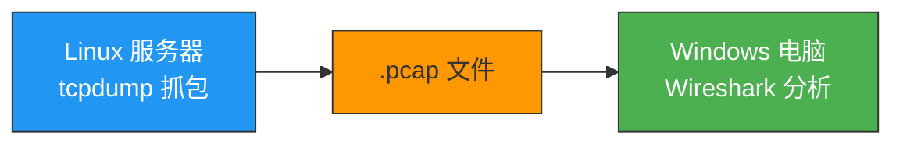
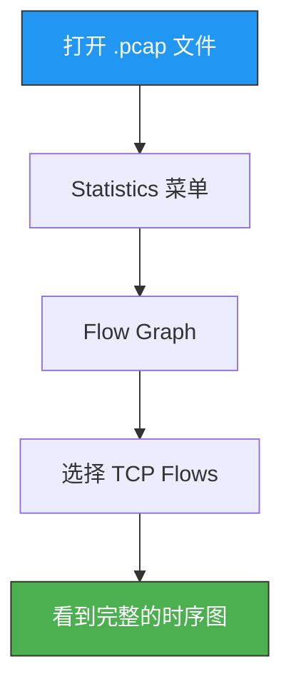
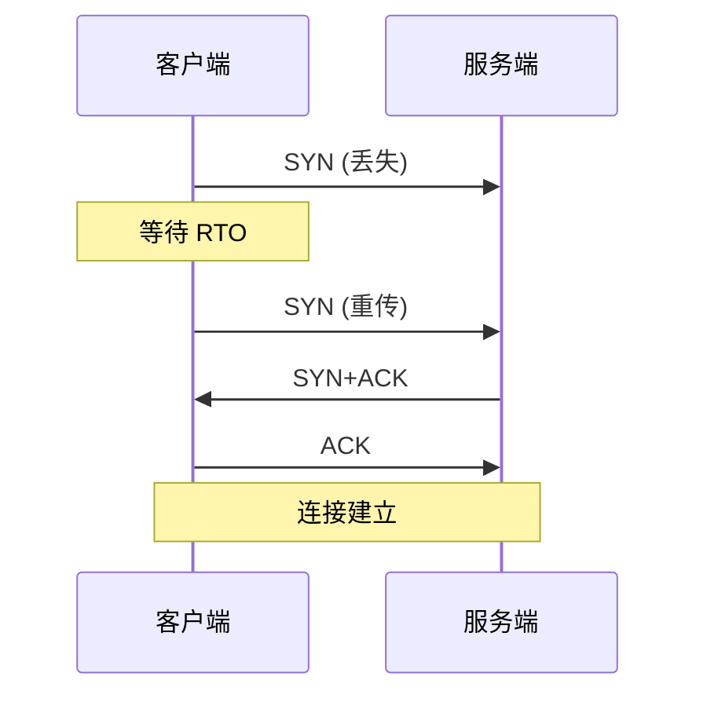
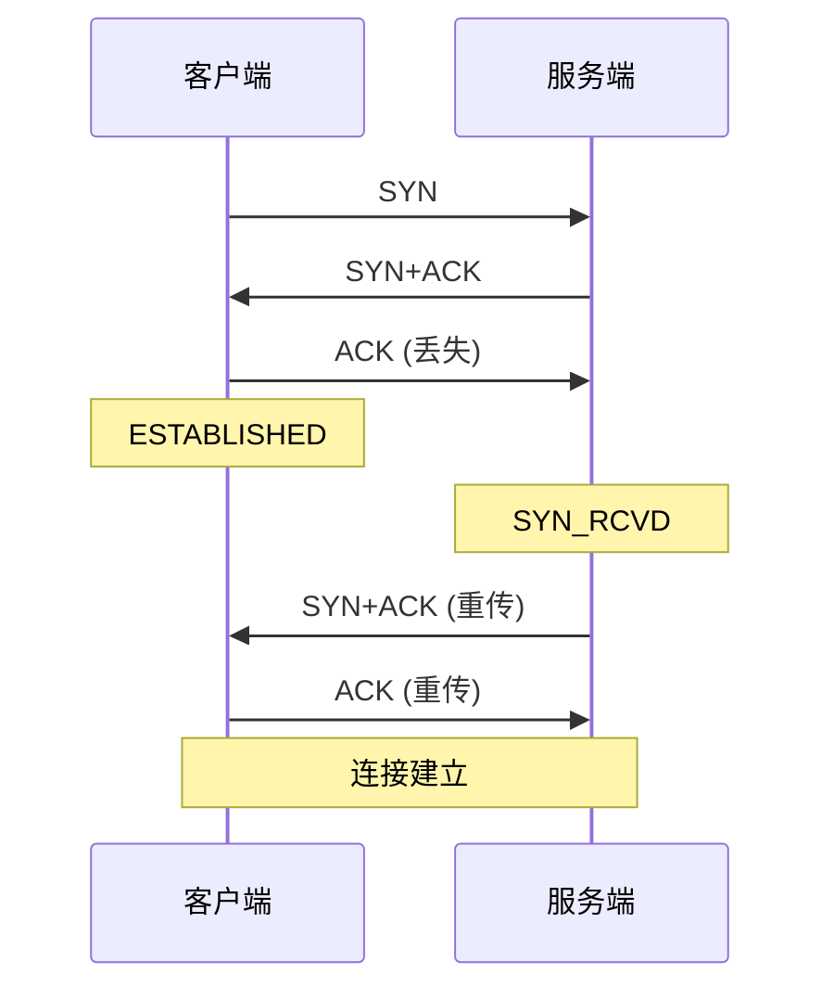
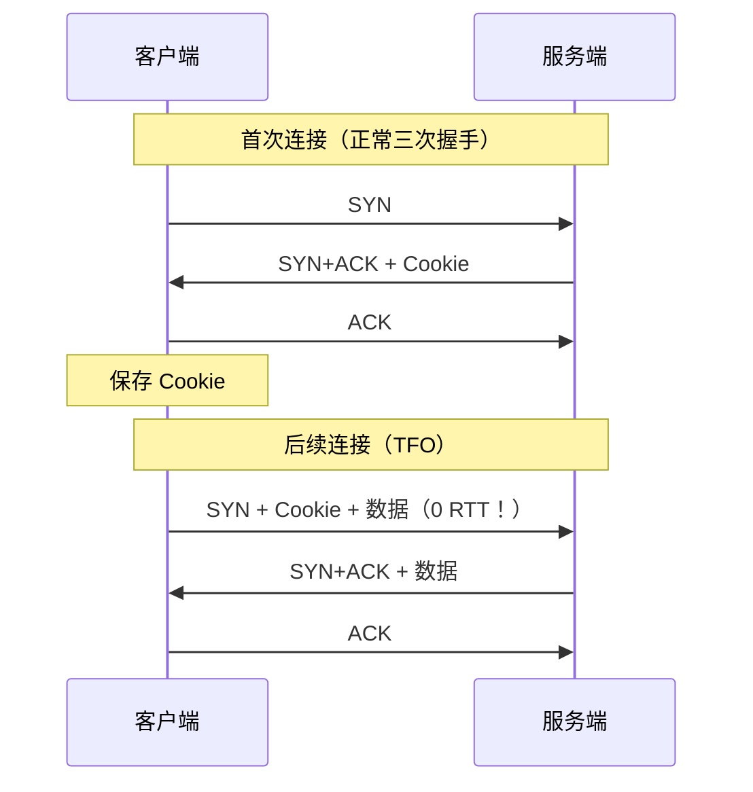

# TCP 实战抓包分析

> 网络问题光看理论是不够的，真正的排障能力来自抓包分析。tcpdump 和 Wireshark 是网络工程师的"显微镜"，让看不见的网络包变得一清二楚。

## 一、两大抓包利器

| 工具 | 环境 | 核心用途 |
|------|------|---------|
| **tcpdump** | Linux 命令行 | 服务端抓包，保存为 `.pcap` 文件 |
| **Wireshark** | Windows GUI | 可视化分析 `.pcap` 文件 |

**标准工作流**：在 Linux 服务器用 tcpdump 抓包 → 传输 `.pcap` 文件到 Windows → 用 Wireshark 可视化分析。



---

## 二、tcpdump 使用指南

### 2.1 常用选项

| 选项 | 含义 | 示例 |
|------|------|------|
| `-i` | 指定网卡 | `tcpdump -i eth0` |
| `-nn` | 不解析域名和端口名 | `tcpdump -nn` |
| `-c` | 抓包数量 | `tcpdump -c 100` |
| `-w` | 保存为文件 | `tcpdump -w capture.pcap` |
| `-r` | 读取文件 | `tcpdump -r capture.pcap` |
| `-v / -vv` | 显示详细信息 | `tcpdump -vv` |

### 2.2 常用过滤表达式

| 表达式 | 含义 |
|--------|------|
| `host 192.168.1.1` | 源或目的是该 IP |
| `src host 10.0.0.1` | 源是该 IP |
| `dst port 80` | 目的端口是 80 |
| `tcp` | 只抓 TCP |
| `icmp` | 只抓 ICMP |
| `port 443` | 端口是 443 |
| `tcp[tcpflags] & tcp-syn != 0` | 只抓 SYN 报文 |

### 2.3 实战抓包命令

```bash
# 抓取与 183.232.231.174 通信的 ICMP 包
tcpdump -i eth0 -nn icmp and host 183.232.231.174

# 抓取 80 端口的 TCP 包，保存到文件
tcpdump -i eth0 -nn -w http.pcap tcp port 80

# 抓取三次握手（SYN 报文）
tcpdump -i eth0 -nn 'tcp[tcpflags] & tcp-syn != 0'

# 抓取特定 IP 的所有 TCP 流量
tcpdump -i eth0 -nn -w debug.pcap host 10.0.0.1 and tcp

# 抓取完整 TCP 会话（包含建立、数据、关闭）
tcpdump -i eth0 -nn -vv -w full_session.pcap tcp port 8080
```

::: important tcpdump 抓包位置
tcpdump 工作在**内核协议栈**中，位于 iptables/netfilter **之前**。也就是说，即使 iptables 丢弃了某个包，tcpdump 仍然能抓到它。这在排查防火墙问题时很重要——tcpdump 看到的包不一定都被应用层收到。
:::

---

## 三、Wireshark 分析技巧

### 3.1 基本界面

Wireshark 将每个数据包按协议层级展开显示：

```
┌─ 数据链路层：源/目的 MAC 地址
├─ 网络层：源/目的 IP、TTL、协议类型
├─ 传输层：源/目的端口、Seq、Ack、Flags、Window
└─ 应用层：HTTP 请求/响应内容
```

### 3.2 常用过滤器

| 过滤器 | 含义 |
|--------|------|
| `tcp.port == 80` | TCP 端口为 80 |
| `tcp.flags.syn == 1` | SYN 报文 |
| `tcp.flags.reset == 1` | RST 报文 |
| `tcp.analysis.retransmission` | 重传报文 |
| `tcp.analysis.duplicate_ack` | 重复 ACK |
| `tcp.window_size == 0` | 零窗口 |
| `ip.addr == 10.0.0.1` | 与该 IP 相关 |
| `tcp.stream == 0` | 第 0 条 TCP 流 |

### 3.3 关键功能：TCP 流图

**路径**：`Statistics → Flow Graph → TCP Flows`

这个功能将整个 TCP 通信过程画成时序图，一目了然地看到：
- 三次握手
- 数据传输
- 重传情况
- 四次挥手



### 3.4 相对序列号

Wireshark 默认显示**相对序列号**（从 0 开始），便于阅读。要查看真实的 32 位序列号：

`右键 TCP 报文 → Protocol Preferences → 取消勾选 Relative Seq`

---

## 四、实战：抓取 TCP 三次握手与四次挥手

### 4.1 抓包命令

```bash
# 在服务端抓取 8080 端口的完整 TCP 会话
tcpdump -i eth0 -nn -vv -w handshake.pcap tcp port 8080
```

### 4.2 三次握手分析

一次典型的 HTTP 交互的抓包结果：

```
1. [SYN]     客户端 → 服务端  Seq=0, Len=0
2. [SYN,ACK] 服务端 → 客户端  Seq=0, Ack=1
3. [ACK]     客户端 → 服务端  Seq=1, Ack=1
```

::: tip 注意
Wireshark 显示的 Seq=0 是**相对序列号**。真实的 ISN 是一个 32 位随机数。
:::

### 4.3 四次挥手——可能变成三次！

如果被动关闭方没有数据要发，且开启了 **TCP 延迟 ACK**，那么第二次（ACK）和第三次（FIN）可能被合并：

```
正常四次挥手：
1. [FIN,ACK]  客户端 → 服务端  Seq=1000
2. [ACK]      服务端 → 客户端  Ack=1001
3. [FIN,ACK]  服务端 → 客户端  Seq=500
4. [ACK]      客户端 → 服务端  Ack=501

合并为三次挥手：
1. [FIN,ACK]  客户端 → 服务端  Seq=1000
2. [FIN,ACK]  服务端 → 客户端  Ack=1001  ← ACK 和 FIN 合并
3. [ACK]      客户端 → 服务端  Ack=501
```

---

## 五、实战：握手报文丢失场景

### 5.1 第一次 SYN 丢失



```bash
# 模拟 SYN 丢失（用 iptables 丢弃入站 SYN）
iptables -A INPUT -p tcp --dport 8080 --tcp-flags SYN SYN -j DROP

# 抓包观察重传行为
tcpdump -i eth0 -nn -vv tcp port 8080
```

**观察结果**：客户端每隔 RTO 时间重传 SYN，RTO 指数退避（1s → 2s → 4s...）。

### 5.2 第三次 ACK 丢失



**关键点**：ACK 丢失后，客户端已经进入 ESTABLISHED，但服务端还在 SYN_RCVD。服务端重传 SYN+ACK 触发客户端重传 ACK。

### 5.3 重传参数与超时时间

```bash
# SYN 重传次数（默认 5 次，总耗时 63 秒）
cat /proc/sys/net/ipv4/tcp_syn_retries

# SYN+ACK 重传次数
cat /proc/sys/net/ipv4/tcp_synack_retries
```

| 重传次数 | 超时时间 | 累计时间 |
|---------|---------|---------|
| 1 | 1s | 1s |
| 2 | 2s | 3s |
| 3 | 4s | 7s |
| 4 | 8s | 15s |
| 5 | 16s | 31s |
| 6 | 32s | 63s |

---

## 六、实战：快速重传分析

### 6.1 抓包特征

当发生快速重传时，Wireshark 中可以看到：

```
1. [PSH,ACK] 发送方 → 接收方  Seq=1000, Len=1460
2. [PSH,ACK] 发送方 → 接收方  Seq=2460, Len=1460  ← 这个包丢失
3. [PSH,ACK] 发送方 → 接收方  Seq=3920, Len=1460
4. [ACK]     接收方 → 发送方  Ack=2460  ← 重复 ACK #1
5. [PSH,ACK] 发送方 → 接收方  Seq=5380, Len=1460
6. [ACK]     接收方 → 发送方  Ack=2460  ← 重复 ACK #2
7. [PSH,ACK] 发送方 → 接收方  Seq=6840, Len=1460
8. [ACK]     接收方 → 发送方  Ack=2460  ← 重复 ACK #3
9. [PSH,ACK] 发送方 → 接收方  Seq=2460, Len=1460  ← 快速重传！
```

### 6.2 Wireshark 过滤

```
# 过滤重传包
tcp.analysis.retransmission

# 过滤重复 ACK
tcp.analysis.duplicate_ack

# 过滤特定流的快速重传
tcp.stream == 0 && tcp.analysis.retransmission
```

### 6.3 SACK 信息查看

在 Wireshark 中展开 TCP 层，如果启用了 SACK，可以看到类似：

```
TCP Options:
  Kind: SACK (5)
  Left Edge: 3920
  Right Edge: 6840
```

这表示接收方告诉发送方："Seq 3920-6840 的数据我已经收到了，你只需要重传 2460-3920 的部分。"

---

## 七、实战：流量控制与零窗口

### 7.1 零窗口场景

当接收方处理速度跟不上时，缓冲区会被填满，通告 Window=0：

```
1. [PSH,ACK] 发送方 → 接收方  Seq=1000, Win=65535
2. [ACK]     接收方 → 发送方  Ack=2000, Win=32768  ← 窗口缩小
3. [ACK]     接收方 → 发送方  Ack=3000, Win=8192   ← 继续缩小
4. [ACK]     接收方 → 发送方  Ack=4000, Win=0       ← 零窗口！
5. [ACK]     发送方 → 接收方  Seq=4000, Len=1        ← 零窗口探测
6. [ACK]     接收方 → 发送方  Ack=4001, Win=32768   ← 窗口恢复
```

### 7.2 Wireshark 过滤零窗口

```
tcp.window_size == 0
```

### 7.3 窗口缩放因子

TCP 头部的 Window 字段只有 16 位，最大 65535 字节（64KB）。但现代网络往往需要更大的窗口。

**Window Scaling** 在三次握手时协商，扩展窗口最大到 **1GB**（2^16 × 2^14 = 2^30）。

在 Wireshark 中，真实窗口大小 = `Window size value × Window size scaling factor`。

---

## 八、实战：TCP Fast Open

TCP Fast Open（TFO）可以将后续连接的握手延迟从 2 RTT 减少到 1 RTT——SYN 报文携带数据！



```bash
# 查看/设置 TFO
cat /proc/sys/net/ipv4/tcp_fastopen
# 0 = 关闭, 1 = 客户端, 2 = 服务端, 3 = 双方
sysctl -w net.ipv4.tcp_fastopen=3
```

---

## 九、常见排查思路

| 问题 | 排查方法 |
|------|---------|
| 连接建立慢 | 抓包看 SYN 重传，检查 `tcp_syn_retries` 和网络延迟 |
| 连接被拒 | 过滤 RST 报文，检查防火墙和 `tcp_abort_on_overflow` |
| 传输慢 | 看 Window 大小变化，检查零窗口和缓冲区 |
| 丢包重传 | 过滤 `tcp.analysis.retransmission`，检查 SACK |
| 大量 TIME_WAIT | `ss -s` 统计，检查 `tcp_tw_reuse` |
| 大量 CLOSE_WAIT | 检查应用代码是否正确 `close()` |

```bash
# 快速统计 TCP 连接状态
ss -s

# 查看各状态连接数
netstat -nat | awk '{print $6}' | sort | uniq -c | sort -rn

# 查看 TIME_WAIT 数量
ss -ant state time-wait | wc -l
```

::: tip 面试速查
- **Q：tcpdump 和 Wireshark 各自的优势？**
  A：tcpdump 适合在服务器上命令行抓包，Wireshark 适合可视化分析。

- **Q：tcpdump 抓到的包，应用层一定能收到吗？**
  A：不一定。tcpdump 在 iptables 之前抓包，被防火墙丢弃的包 tcpdump 能看到但应用层收不到。

- **Q：如何用 tcpdump 只抓 SYN 报文？**
  A：`tcpdump -i eth0 -nn 'tcp[tcpflags] & tcp-syn != 0'`

- **Q：Wireshark 中如何查看真实序列号？**
  A：右键 TCP 报文 → Protocol Preferences → 取消 Relative Seq。

- **Q：四次挥手为什么有时候变成三次？**
  A：被动关闭方没有数据要发时，ACK 和 FIN 可以合并为一次发送。
:::

---

::: info 原著参考
- 小林coding《图解网络》—— [TCP 实战抓包分析](https://xiaolincoding.com/network/3_tcp/tcp_tcpdump.html)
:::
