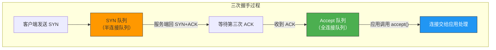
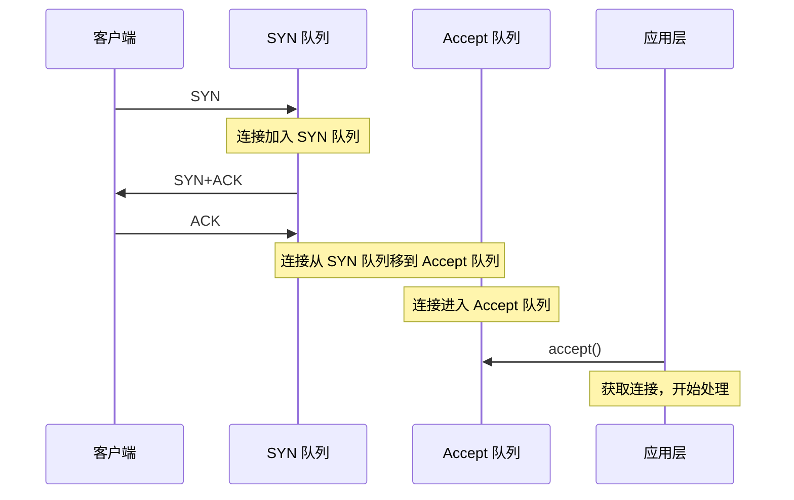
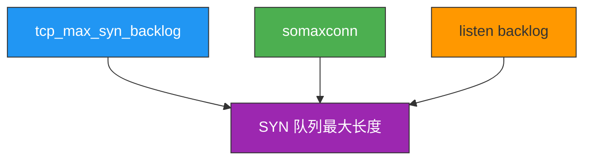
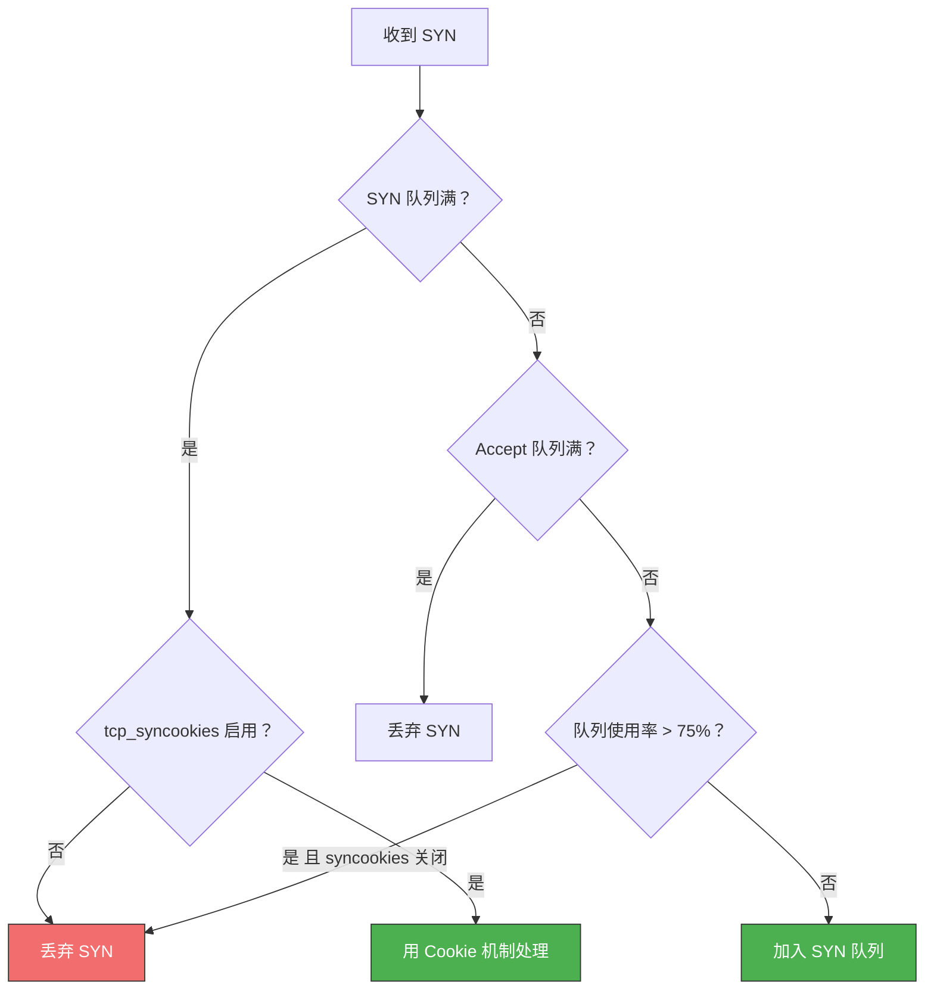
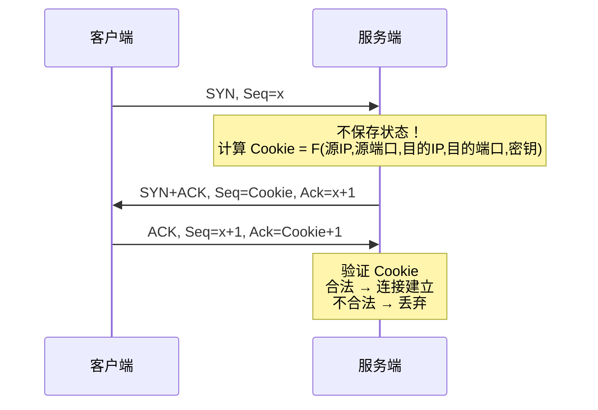
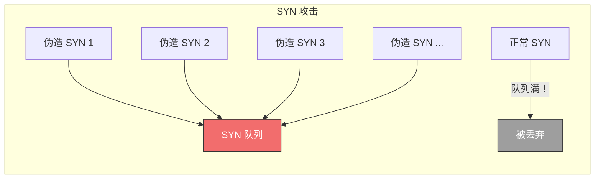
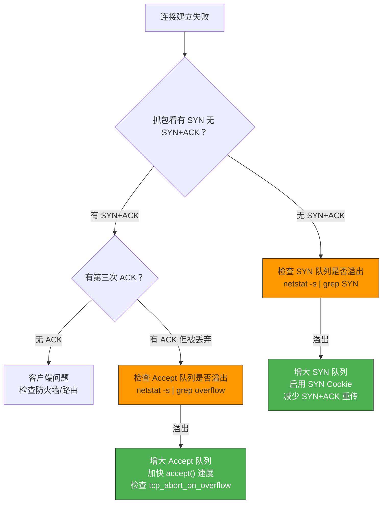

# TCP 半连接队列和全连接队列

> 三次握手过程中，Linux 内核维护了两个关键队列：半连接队列（SYN 队列）和全连接队列（Accept 队列）。理解它们的大小决定机制和溢出处理，是排查"连接建立失败"问题的关键。

## 一、两个队列是什么？



| 队列 | 又名 | 存储内容 | 状态 |
|------|------|---------|------|
| SYN 队列 | 半连接队列 | 收到 SYN 但未完成握手的连接 | SYN_RCVD |
| Accept 队列 | 全连接队列 | 已完成握手，等待应用 `accept()` 的连接 | ESTABLISHED |

### 1.1 连接在队列间的流转



---

## 二、全连接队列（Accept 队列）

### 2.1 队列最大长度

**全连接队列最大长度 = min(somaxconn, backlog)**

| 参数 | 说明 | 默认值 |
|------|------|-------|
| `somaxconn` | 内核参数 `/proc/sys/net/core/somaxconn` | 128 |
| `backlog` | 应用调用 `listen()` 时传入的参数 | Nginx 默认 511 |

::: important 增大队列必须两边都改
只增大 `somaxconn` 或只增大 `backlog` 是不够的，必须**同时增大**并重启服务（队列在 `listen()` 时初始化）。
:::

```bash
# 查看当前 somaxconn
cat /proc/sys/net/core/somaxconn

# 增大到 65535
sysctl -w net.core.somaxconn=65535

# Nginx 中设置 backlog
# nginx.conf:
# listen 80 backlog=65535;
```

### 2.2 监控队列状态

使用 `ss` 命令查看：

```bash
ss -ltn
```

输出示例：

```
State   Recv-Q  Send-Q  Local Address:Port  Peer Address:Port
LISTEN  0       128     *:80                *:*
LISTEN  5       511     *:8080              *:*
```

| 字段 | LISTEN 状态含义 | 非 LISTEN 状态含义 |
|------|----------------|-------------------|
| Recv-Q | 当前 Accept 队列中的连接数 | 未被应用读取的字节数 |
| Send-Q | Accept 队列最大长度 | 已发送未确认的字节数 |

**判断溢出**：如果 Recv-Q 持续接近 Send-Q，说明 Accept 队列快满了。

### 2.3 检测溢出

```bash
# 查看 Accept 队列溢出次数（累计值）
netstat -s | grep "overflow"
# 输出示例：1587 times the listen queue of a socket overflowed

# 实时监控是否还在增长
watch -n 1 "netstat -s | grep overflow"
```

### 2.4 溢出处理策略：tcp_abort_on_overflow

| 值 | 行为 | 适用场景 |
|----|------|---------|
| **0**（默认） | 默默丢弃客户端的 ACK | 适合突发流量——客户端重传 ACK 可以恢复 |
| **1** | 立即发送 RST 给客户端 | 适合确定会长期满载的场景——快速通知客户端 |

```bash
# 查看当前策略
cat /proc/sys/net/ipv4/tcp_abort_on_overflow

# 设为 1（谨慎使用）
sysctl -w net.ipv4.tcp_abort_on_overflow=1
```

::: warning 为什么默认值 0 更好？
设为 0 时，客户端的 ACK 被丢弃但不会收到 RST。客户端会重传 ACK，如果此时 Accept 队列有空位了，连接就能成功建立。设为 1 则直接 RST，客户端看到 "connection reset by peer"，连接彻底失败。
:::

---

## 三、半连接队列（SYN 队列）

### 3.1 队列大小——不是只看 tcp_max_syn_backlog

**这是很多人踩的坑**：以为只改 `tcp_max_syn_backlog` 就能增大半连接队列，实际上 SYN 队列的最大值取决于**多个参数**。



**计算公式**（Linux 2.6.32）：

| 条件 | SYN 队列最大长度 |
|------|-----------------|
| `tcp_max_syn_backlog > min(somaxconn, backlog)` | `min(somaxconn, backlog) × 2` |
| `tcp_max_syn_backlog < min(somaxconn, backlog)` | `tcp_max_syn_backlog × 2` |

::: important 必须同时调整三个参数
增大 SYN 队列需要同时增大：
1. `net.ipv4.tcp_max_syn_backlog`
2. `net.core.somaxconn`
3. 应用的 `listen()` backlog 参数

只改其中一个是**无效**的！
:::

### 3.2 监控 SYN 队列

没有直接的 `ss` 输出，但可以通过统计 SYN_RCVD 状态的连接数来间接观察：

```bash
# 查看 SYN_RCVD 状态的连接数
netstat -natp | grep SYN_RECV | wc -l

# 查看 SYN 队列溢出次数
netstat -s | grep "SYN"
# 输出示例：1587 SYNs to LISTEN sockets dropped
```

### 3.3 SYN 报文被丢弃的三种情况

从 Linux 内核源码分析，以下三种情况会导致 SYN 被丢弃：

| 条件 | 说明 |
|------|------|
| SYN 队列满且 `tcp_syncookies` 关闭 | 没有空间存新连接 |
| Accept 队列满且有超过 1 个连接未重传 SYN+ACK | Accept 队列满了会导致 SYN 队列也不接受新连接 |
| `tcp_syncookies` 关闭且 `max_syn_backlog - qlen < max_syn_backlog >> 2` | 队列使用超过 75% 就开始丢弃 |



---

## 四、SYN Cookie 机制

### 4.1 原理

正常情况下，服务端收到 SYN 后需要在 SYN 队列中保存连接状态。SYN Cookie 的巧妙之处在于：**不在队列中保存任何状态**，而是将状态信息编码到 SYN+ACK 的序列号中。



### 4.2 tcp_syncookies 参数

| 值 | 行为 |
|----|------|
| **0** | 禁用 |
| **1**（推荐） | 仅在 SYN 队列满时启用 |
| **2** | 始终启用 |

```bash
# 启用 SYN Cookie（推荐）
sysctl -w net.ipv4.tcp_syncookies=1
```

::: important SYN Cookie 的局限性
SYN Cookie 不支持 TCP 选项协商（如 Window Scaling、SACK），因为序列号空间被用来编码 Cookie 信息。所以只在队列满时作为应急机制使用。
:::

---

## 五、SYN 攻击与防御

### 5.1 攻击原理

攻击者发送大量**伪造源 IP 的 SYN**，服务端对每个 SYN 都分配资源并回 SYN+ACK，但源 IP 不可达导致 ACK 永远不会来。SYN 队列被塞满，正常连接无法建立。



### 5.2 防御方法汇总

| 方法 | 原理 | 命令 |
|------|------|------|
| 增大 SYN 队列 | 同时增大三个参数 | 见下方 |
| 启用 SYN Cookie | 队列满时用 Cookie 代替状态 | `sysctl -w net.ipv4.tcp_syncookies=1` |
| 减少 SYN+ACK 重传 | 更快清理无效半连接 | `sysctl -w net.ipv4.tcp_synack_retries=2` |
| 增大网卡队列 | 避免网卡层面丢包 | `sysctl -w net.core.netdev_max_backlog=5000` |

```bash
# 综合防御配置
sysctl -w net.ipv4.tcp_max_syn_backlog=8192
sysctl -w net.core.somaxconn=8192
sysctl -w net.ipv4.tcp_syncookies=1
sysctl -w net.ipv4.tcp_synack_retries=2
sysctl -w net.core.netdev_max_backlog=5000
```

---

## 六、完整排查流程

当遇到"连接建立失败"问题时，按以下步骤排查：



```bash
# 1. 查看 SYN 队列溢出
netstat -s | grep "SYNs to LISTEN"

# 2. 查看 Accept 队列溢出
netstat -s | grep "overflow"

# 3. 查看 Accept 队列当前状态
ss -ltn

# 4. 查看 SYN_RCVD 连接数
netstat -natp | grep SYN_RECV | wc -l

# 5. 查看当前参数
sysctl net.ipv4.tcp_max_syn_backlog
sysctl net.core.somaxconn
sysctl net.ipv4.tcp_syncookies
sysctl net.ipv4.tcp_synack_retries
```

---

## 七、面试速查

::: tip 面试速查
- **Q：半连接队列和全连接队列分别是什么？**
  A：半连接队列存放收到 SYN 但未完成握手的连接（SYN_RCVD）；全连接队列存放已完成握手但等待 accept() 的连接（ESTABLISHED）。

- **Q：如何增大半连接队列？**
  A：必须同时增大 `tcp_max_syn_backlog`、`somaxconn` 和应用 `backlog` 三个参数，只改一个是无效的。

- **Q：全连接队列满了会怎样？**
  A：默认（`tcp_abort_on_overflow=0`）默默丢弃 ACK，客户端重传后可能恢复；设为 1 则直接回 RST。

- **Q：SYN Cookie 的原理？**
  A：不在 SYN 队列存状态，而是将连接信息编码到 SYN+ACK 的序列号中，客户端回 ACK 时验证 Cookie。

- **Q：如何排查 SYN 攻击？**
  A：大量 SYN_RCVD 状态连接 + SYN 队列溢出计数持续增长 → 可能是 SYN 攻击。
:::

---

::: info 原著参考
- 小林coding《图解网络》—— [TCP 半连接队列和全连接队列](https://xiaolincoding.com/network/3_tcp/tcp_queue.html)
:::
