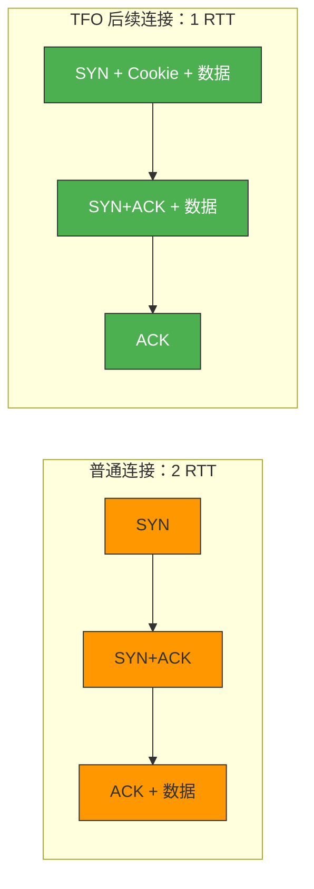
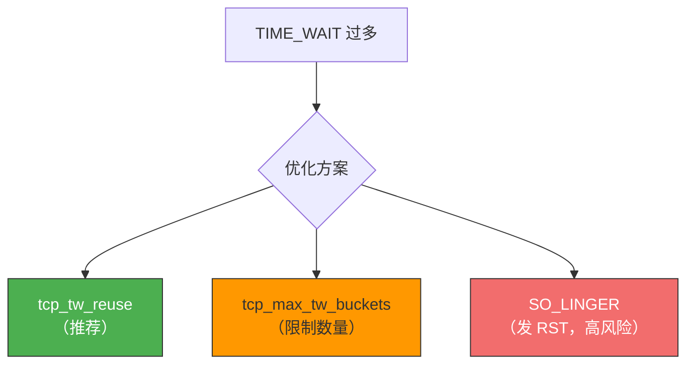
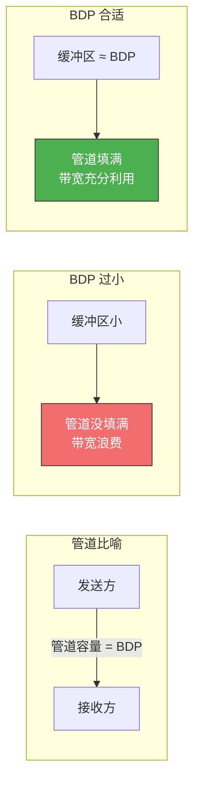
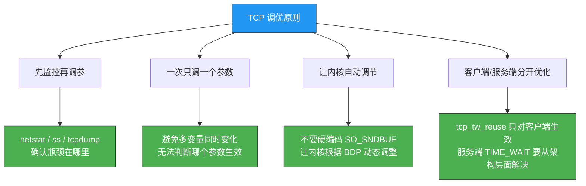

# 如何优化 TCP

> TCP 的默认参数是"通用型"的，不能兼顾所有场景。理解各个参数的含义，根据业务特点进行调优，是后端工程师的进阶技能。

## 一、三次握手优化

### 1.1 客户端：SYN 重传

| 参数 | 默认值 | 含义 |
|------|-------|------|
| `tcp_syn_retries` | 5 | SYN 重传次数，超时后放弃 |

超时时间呈指数退避：1s → 2s → 4s → 8s → 16s + 32s = **63 秒**。

```bash
# 内网稳定环境可减少，更快暴露问题
sysctl -w net.ipv4.tcp_syn_retries=2   # 最长 3s
```

### 1.2 服务端：SYN 队列

**三个参数必须同时调大**：

```bash
sysctl -w net.ipv4.tcp_max_syn_backlog=8192   # SYN 队列大小
sysctl -w net.core.somaxconn=8192              # 内核级 backlog
# 应用层 backlog 也要改（如 Nginx: listen 80 backlog=8192）
```

### 1.3 服务端：SYN+ACK 重传

| 参数 | 默认值 | 含义 |
|------|-------|------|
| `tcp_synack_retries` | 5 | SYN+ACK 重传次数 |

```bash
# 减少重传次数，更快清理无效半连接
sysctl -w net.ipv4.tcp_synack_retries=2
```

### 1.4 服务端：SYN Cookie

```bash
# 推荐值：队列满时自动启用
sysctl -w net.ipv4.tcp_syncookies=1
```

### 1.5 服务端：Accept 队列

```bash
# 查看 Accept 队列溢出
netstat -s | grep "overflow"

# 增大队列
sysctl -w net.core.somaxconn=8192

# 溢出处理策略
# 0（默认）：默默丢弃，客户端可重传恢复
# 1：发 RST，快速通知客户端
sysctl -w net.ipv4.tcp_abort_on_overflow=0
```

### 1.6 绕过三次握手：TCP Fast Open



```bash
# 启用 TFO（0=关, 1=客户端, 2=服务端, 3=双方）
sysctl -w net.ipv4.tcp_fastopen=3
```

---

## 二、四次挥手优化

### 2.1 主动关闭方参数

| 状态 | 参数 | 默认值 | 含义 |
|------|------|-------|------|
| FIN_WAIT_1 | `tcp_orphan_retries` | 0（实际=8） | FIN 重传次数 |
| FIN_WAIT_1 | `tcp_max_orphans` | 系统计算 | 最大孤儿连接数，超过则发 RST 代替 FIN |
| FIN_WAIT_2 | `tcp_fin_timeout` | 60s | FIN_WAIT_2 超时时间 |
| TIME_WAIT | `tcp_max_tw_buckets` | 系统计算 | TIME_WAIT 上限，超过则直接关闭 |

```bash
# 调整 FIN 重传次数
sysctl -w net.ipv4.tcp_orphan_retries=3

# 调整 FIN_WAIT_2 超时
sysctl -w net.ipv4.tcp_fin_timeout=30

# 限制 TIME_WAIT 数量
sysctl -w net.ipv4.tcp_max_tw_buckets=5000
```

### 2.2 TIME_WAIT 优化



#### 方案一：tcp_tw_reuse（推荐）

```bash
# 必须同时启用时间戳
sysctl -w net.ipv4.tcp_tw_reuse=1
sysctl -w net.ipv4.tcp_timestamps=1
```

- 仅对**出站连接**（`connect()`）有效
- 复用超过 1 秒的 TIME_WAIT 端口
- 时间戳保证旧报文不会被误接受

::: warning tcp_tw_reuse 只适用于客户端
服务端的 TIME_WAIT 用 `tcp_tw_reuse` 是无法复用的，因为服务端是 `accept()` 入站连接，不涉及 `connect()`。
:::

#### 方案二：限制 TIME_WAIT 数量

```bash
sysctl -w net.ipv4.tcp_max_tw_buckets=5000
```

超过上限的 TIME_WAIT 连接直接关闭，不经过 2MSL 等待。

#### 方案三：SO_LINGER（谨慎使用）

```c
struct linger ling;
ling.l_onoff = 1;
ling.l_linger = 0;
setsockopt(sock, SOL_SOCKET, SO_LINGER, &ling, sizeof(ling));
// close() 时发送 RST 而不是 FIN，跳过 TIME_WAIT
```

::: danger 高风险
SO_LINGER + `l_linger=0` 会发送 RST 而非 FIN，破坏 TCP 正常关闭语义。**仅建议客户端使用**，服务端使用会导致客户端看到 "connection reset by peer"。
:::

#### 绝对不要用的参数

```bash
# ❌ tcp_tw_recycle 已在 Linux 4.12 移除
# 在 NAT 环境下会导致 PAWS 检查失败，客户端连接被拒绝
# 千万不要用！
```

### 2.3 被动关闭方：CLOSE_WAIT

CLOSE_WAIT 没有内核超时参数，完全依赖应用层调用 `close()`。

::: warning CLOSE_WAIT 大量堆积 = 代码 bug
常见原因：
1. `read()` 返回 0 时没调 `close()`
2. 没把 socket 注册到 epoll
3. 异常处理跳过了 `close()`

这不能通过内核参数解决，必须修代码。
:::

### 2.4 close() vs shutdown()

| 操作 | 行为 |
|------|------|
| `close()` | 完全关闭（读写），变为"孤儿连接" |
| `shutdown(SHUT_WR)` | 半关闭（只关写端），发送 FIN 但仍可接收 |
| `shutdown(SHUT_RD)` | 关闭读端，丢弃缓冲区数据 |
| `shutdown(SHUT_RDWR)` | 等同 SHUT_RD + SHUT_WR |

---

## 三、数据传输优化

### 3.1 滑动窗口与 Window Scaling

TCP 头部 Window 字段 16 位，最大 65535 字节（64KB）。通过 Window Scaling 选项可扩展到最大 **1GB**。

```bash
# Window Scaling 默认已启用
sysctl net.ipv4.tcp_window_scaling
# 值为 1 表示启用
```

::: important Window Scaling 必须在三次握手时协商
如果 SYN 报文中没有携带 Window Scaling 选项，后续就无法启用。确保握手阶段不被拦截或修改。
:::

### 3.2 带宽延迟积（BDP）

```
BDP = 带宽 × RTT
```

**示例**：
- 带宽 100 MB/s，RTT 10ms → BDP = 100 × 0.01 = **1 MB**
- 这意味着"在途"数据约 1MB，发送缓冲区至少要有 1MB 才能充分利用带宽



### 3.3 缓冲区参数

| 参数 | 含义 | 格式（min/default/max） |
|------|------|------------------------|
| `tcp_wmem` | TCP 发送缓冲区 | `4096 / 16384 / 4194304`（字节） |
| `tcp_rmem` | TCP 接收缓冲区 | `4096 / 87380 / 6291456`（字节） |
| `tcp_mem` | TCP 整体内存压力阈值 | 三个值（4KB 页为单位） |
| `tcp_moderate_rcvbuf` | 启用接收缓冲区动态调整 | 1（启用） |

```bash
# 查看当前缓冲区配置
sysctl net.ipv4.tcp_wmem
sysctl net.ipv4.tcp_rmem
sysctl net.ipv4.tcp_mem

# 确保动态调整已开启
sysctl -w net.ipv4.tcp_moderate_rcvbuf=1
```

::: warning 不要在代码中硬编码 SO_SNDBUF / SO_RCVBUF
手动设置 socket 缓冲区大小会**禁用**内核的动态调整机制。让内核根据 BDP 自动调节通常效果更好。
:::

### 3.4 不同场景的调优策略

| 场景 | 策略 |
|------|------|
| **高并发服务** | 缓冲区 max 设为 BDP，min 保持 4K 默认；增大 `tcp_mem` 上限 |
| **内存受限服务** | 降低默认缓冲区值，支持更多并发连接 |
| **网络 I/O 密集型** | 增大 `tcp_mem` 上限，允许更多 TCP 内存使用 |

---

## 四、Keep-Alive 优化

### 4.1 TCP Keep-Alive 参数

| 参数 | 默认值 | 含义 |
|------|-------|------|
| `tcp_keepalive_time` | 7200s（2h） | 空闲多久开始探测 |
| `tcp_keepalive_intvl` | 75s | 探测间隔 |
| `tcp_keepalive_probes` | 9 | 探测次数 |

总超时 = 7200 + 75 × 9 = **7875s ≈ 2h 11min**

```bash
# 缩短 Keep-Alive 超时（适合需要快速检测断连的场景）
sysctl -w net.ipv4.tcp_keepalive_time=600
sysctl -w net.ipv4.tcp_keepalive_intvl=30
sysctl -w net.ipv4.tcp_keepalive_probes=3
# 新超时 = 600 + 30 × 3 = 690s ≈ 11.5min
```

### 4.2 应用层心跳 vs TCP Keep-Alive

| 对比 | TCP Keep-Alive | 应用层心跳 |
|------|---------------|-----------|
| 粒度 | 内核级，所有连接统一 | 应用级，可按连接定制 |
| 探测内容 | 空 ACK | 可携带业务数据 |
| 灵活性 | 低 | 高 |
| 典型配置 | 2h 空闲 + 探测 | Nginx `keepalive_timeout=60s` |

::: tip 推荐
对于 Web 服务，**应用层心跳**（如 HTTP Keep-Alive 超时）比 TCP Keep-Alive 更实用。TCP Keep-Alive 的 2 小时默认超时对大多数业务来说太长了。
:::

---

## 五、综合推荐配置

### 5.1 高并发 Web 服务器

```bash
# /etc/sysctl.conf 或 /etc/sysctl.d/tcp-tuning.conf

# === 连接建立 ===
net.ipv4.tcp_syn_retries = 2
net.ipv4.tcp_synack_retries = 2
net.ipv4.tcp_max_syn_backlog = 8192
net.ipv4.tcp_syncookies = 1
net.core.somaxconn = 8192

# === 连接关闭 ===
net.ipv4.tcp_fin_timeout = 30
net.ipv4.tcp_max_tw_buckets = 5000
net.ipv4.tcp_tw_reuse = 1
net.ipv4.tcp_timestamps = 1

# === 数据传输 ===
net.ipv4.tcp_window_scaling = 1
net.ipv4.tcp_moderate_rcvbuf = 1
net.ipv4.tcp_sack = 1

# === Keep-Alive ===
net.ipv4.tcp_keepalive_time = 600
net.ipv4.tcp_keepalive_intvl = 30
net.ipv4.tcp_keepalive_probes = 3

# === Fast Open ===
net.ipv4.tcp_fastopen = 3
```

### 5.2 应用配置

```nginx
# Nginx
listen 80 backlog=8192;
keepalive_timeout 60s;
keepalive_requests 1000;
```

```c
// C 代码：禁用 Nagle（低延迟场景）
int flag = 1;
setsockopt(sock, IPPROTO_TCP, TCP_NODELAY, &flag, sizeof(flag));

// 不要硬编码缓冲区大小，让内核自动调节
// ❌ setsockopt(sock, SOL_SOCKET, SO_SNDBUF, &size, sizeof(size));
```

---

## 六、调优原则



::: tip 面试速查
- **Q：如何优化 TIME_WAIT？**
  A：客户端开启 `tcp_tw_reuse` + `tcp_timestamps`；服务端让客户端主动关闭或开启 Keep-Alive。绝对不要用 `tcp_tw_recycle`。

- **Q：如何增大半连接队列？**
  A：同时增大 `tcp_max_syn_backlog`、`somaxconn` 和 `backlog`，只改一个无效。

- **Q：为什么不要手动设置 SO_SNDBUF？**
  A：会禁用内核的动态缓冲区调整机制，让内核根据 BDP 自动调节效果更好。

- **Q：TCP Fast Open 的原理？**
  A：首次连接获取 Cookie，后续连接在 SYN 中携带 Cookie + 数据，省去 1 RTT。

- **Q：大量 CLOSE_WAIT 怎么解决？**
  A：检查应用代码，确保 `read()` 返回 0 时调用 `close()`。这不是内核参数问题，是代码 bug。
:::

---

::: info 原著参考
- 小林coding《图解网络》—— [如何优化 TCP？](https://xiaolincoding.com/network/3_tcp/tcp_optimize.html)
:::
