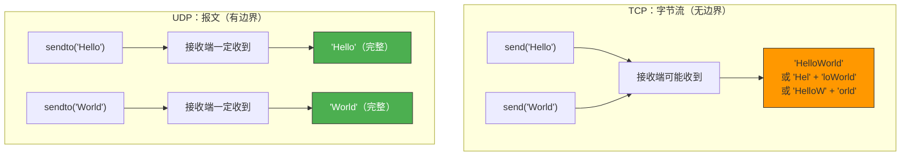
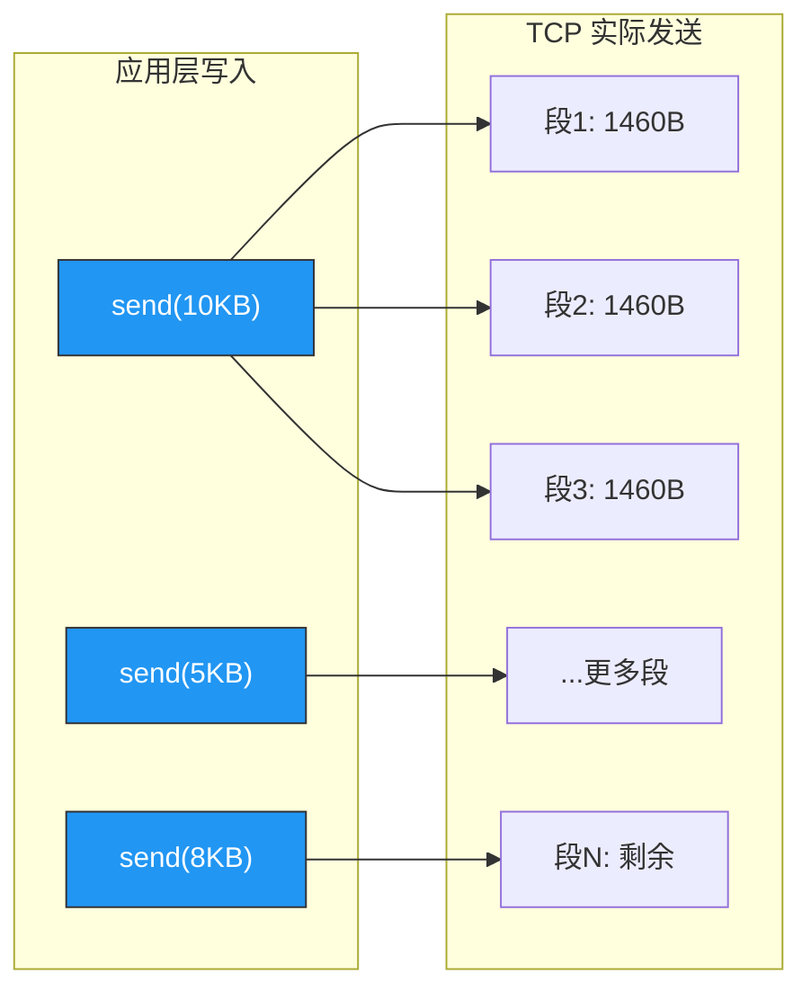
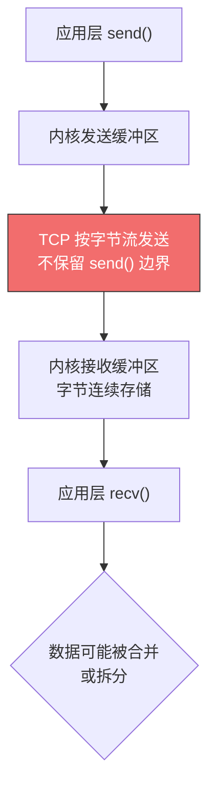
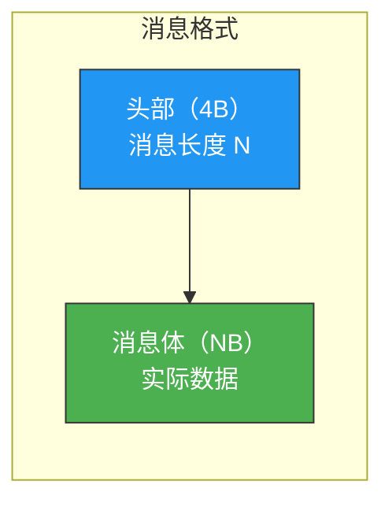
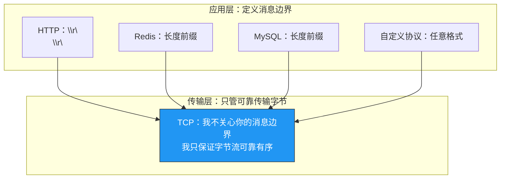

# 如何理解 TCP 面向字节流协议

> TCP 和 UDP 最本质的区别不是"可靠 vs 不可靠"，而是**字节流 vs 报文**。理解这个区别，才能理解为什么 TCP 有粘包问题、为什么应用层需要自己定义消息边界。

## 一、TCP vs UDP：本质区别

### 1.1 两种数据模型

| 特性 | TCP（字节流） | UDP（报文） |
|------|--------------|------------|
| 数据边界 | **不保留** | 保留 |
| 一次发送 | 任意长度字节流 | 一个完整报文 |
| 一次接收 | 可能只收到一部分 | 一定收到完整报文 |
| `send()` 次数 ≠ `recv()` 次数 | 是 | 否（一一对应） |



### 1.2 一个生动的比喻

把数据比作**水**：

- **TCP**：水龙头出来的水，你无法区分哪一滴是"第一杯水"的、哪一滴是"第二杯水"的——水是连续的流。
- **UDP**：快递员送包裹，一个包裹就是一个包裹，不会把两个包裹的内容混在一起。

---

## 二、TCP 字节流的实际行为

### 2.1 发送端：数据被切割

应用层调用 `send()` 时，数据进入内核发送缓冲区。TCP 根据以下条件决定实际发送的报文段：

1. 缓冲区中的数据是否 ≥ MSS
2. 发送窗口是否允许
3. Nagle 算法是否延迟发送



**关键点**：应用层调用 `send()` 的次数和 TCP 实际发送的报文段数量**没有对应关系**。

### 2.2 接收端：数据被拼合

接收端从内核接收缓冲区读取数据时：

- `recv()` 返回的数据量**不一定**等于对方 `send()` 的数据量
- 可能一次 `recv()` 读到**多个 `send()` 的数据**（粘包）
- 可能需要**多次 `recv()` 才能读完一个 `send()` 的数据**（拆包）

```
发送端：        send("AB")    send("CDE")    send("FGH")
                  ↓              ↓              ↓
TCP 传输：     [A B C D E]            [F G H]       （可能合并/拆分）
                  ↓              ↓              ↓
接收端：  recv() → "ABC"    recv() → "DEFGH"         （与发送不对应）
```

---

## 三、粘包问题

### 3.1 什么是粘包？

"粘包"是指接收端一次 `recv()` 读到了**多个发送端 `send()` 的数据**，看起来像数据"粘"在了一起。

::: important 准确地说，TCP 没有"包"的概念
"粘包"这个说法本身就有误导性。TCP 是字节流，本来就没有包边界。所谓"粘包"，只是应用层期望按消息边界读取，但 TCP 不提供这个保证。
:::

### 3.2 粘包产生的根本原因



### 3.3 为什么 UDP 没有粘包？

UDP 每次发送的是一个完整的**报文**（datagram），内核为每个报文保留边界。接收端 `recvfrom()` 一次只会读到一个完整的报文，不会合并也不会拆分。

| 操作 | TCP | UDP |
|------|-----|-----|
| 一次 `send()` / `sendto()` | 数据进入流 | 发送一个完整报文 |
| 一次 `recv()` / `recvfrom()` | 读到流的任意部分 | 读到一个完整报文 |
| 发送 100B + 200B | 接收端可能一次收到 300B | 接收端一定分两次收到 100B + 200B |

---

## 四、如何解决粘包问题

既然 TCP 不保留消息边界，应用层必须自己定义。常见的三种方案：

### 4.1 固定长度消息

每条消息固定 N 字节，不足的补齐。

```
发送：[Hello###] [World###] [TCP#####]
接收：每次读 8 字节
```

```c
// 发送端
char msg[8] = "Hello";
send(sock, msg, 8, 0);  // 固定 8 字节

// 接收端
char buf[8];
int total = 0;
while (total < 8) {
    int n = recv(sock, buf + total, 8 - total, 0);
    if (n <= 0) break;
    total += n;
}
```

**优点**：实现简单
**缺点**：浪费带宽（短消息要补齐），长度不灵活

### 4.2 分隔符

用特殊字符标记消息结束，如 HTTP 用 `\r\n\r\n`，FTP 用 `\r\n`。

```
发送：Hello\nWorld\nTCP\n
接收：按 \n 分割
```

```c
// 接收端：循环读取直到遇到 \n
char buf[1024];
int total = 0;
while (total < sizeof(buf) - 1) {
    int n = recv(sock, buf + total, 1, 0);  // 逐字节读
    if (n <= 0) break;
    if (buf[total] == '\n') {
        buf[total] = '\0';
        break;
    }
    total++;
}
```

**优点**：直观，适合文本协议
**缺点**：消息体中不能包含分隔符（需要转义），逐字节读取效率低

### 4.3 长度前缀（最常用）

每条消息前加一个固定长度的头部，表示消息体的长度。



```
发送：[00 00 00 05] [Hello] [00 00 00 05] [World]
       ↑ 长度=5      ↑数据    ↑ 长度=5      ↑数据
接收：先读 4B 得到长度，再读对应长度的数据
```

```c
// 发送端
void send_msg(int sock, const char *data, int len) {
    uint32_t net_len = htonl(len);  // 转网络字节序
    send(sock, &net_len, 4, 0);     // 先发长度
    send(sock, data, len, 0);       // 再发数据
}

// 接收端
int recv_msg(int sock, char *buf, int max_len) {
    uint32_t net_len;
    // 先读 4 字节长度
    int n = recv_all(sock, &net_len, 4);
    if (n <= 0) return n;

    int len = ntohl(net_len);  // 转主机字节序
    if (len > max_len) return -1;  // 防止缓冲区溢出

    // 再读 len 字节数据
    return recv_all(sock, buf, len);
}

// 确保读满 n 字节
int recv_all(int sock, void *buf, int n) {
    int total = 0;
    while (total < n) {
        int r = recv(sock, (char*)buf + total, n - total, 0);
        if (r <= 0) return r;
        total += r;
    }
    return total;
}
```

::: important 为什么长度前缀最常用？
- 不浪费带宽（无需补齐或转义）
- 支持二进制数据（不受特殊字符限制）
- 解析效率高（先读固定长度头部，再读已知长度的消息体）
- 大多数二进制协议（Redis RESP、MySQL 协议、Protobuf 等）都采用此方案
:::

---

## 五、为什么 TCP 选择字节流模型？

### 5.1 设计哲学

TCP 的目标是**可靠地传输字节流**，不关心字节流的"含义"——消息边界属于应用层的概念。

这种设计让 TCP 更加**通用**：不同应用可以定义自己的消息格式，而传输层不需要了解应用层的协议。



### 5.2 字节流的好处

| 好处 | 说明 |
|------|------|
| 通用性 | 任何应用协议都能跑在 TCP 上 |
| 效率 | TCP 可以自由合并/拆分数据，充分利用带宽 |
| 简洁 | 传输层不需要理解消息语义 |
| 灵活 | 应用层可以自由定义消息格式 |

### 5.3 字节流的代价

| 代价 | 说明 |
|------|------|
| 粘包问题 | 应用层必须自己处理消息边界 |
| 解析复杂 | 需要应用层协议来"断句" |
| 调试困难 | 抓包看到的不是"消息"，而是字节流 |

---

## 六、TCP 字节流对应用开发的影响

### 6.1 必须循环读取

TCP 的 `recv()` 可能只返回部分数据，必须循环读取直到读完预期长度：

```c
// ❌ 错误：假设一次 recv 就能读完
char buf[1024];
recv(sock, buf, 1024, 0);  // 可能只读到 500 字节

// ✅ 正确：循环读取直到读完
int recv_all(int sock, char *buf, int len) {
    int total = 0;
    while (total < len) {
        int n = recv(sock, buf + total, len - total, 0);
        if (n <= 0) return -1;  // 出错或连接关闭
        total += n;
    }
    return total;
}
```

### 6.2 必须处理部分写入

`send()` 也不保证一次写完所有数据：

```c
// ❌ 错误
send(sock, data, len, 0);  // 可能只发送了部分数据

// ✅ 正确
int send_all(int sock, const char *data, int len) {
    int total = 0;
    while (total < len) {
        int n = send(sock, data + total, len - total, 0);
        if (n <= 0) return -1;
        total += n;
    }
    return total;
}
```

### 6.3 高级语言的网络库已封装

在 Python、Java、Go 等高级语言中，网络库通常已经处理了部分读取问题，但**消息边界**仍需应用层解决：

```python
# Python：仍然可能粘包
data = sock.recv(1024)
# data 可能包含多条消息，也可能只有半条消息
```

---

## 七、常见应用层协议的消息边界方案

| 协议 | 方案 | 分隔符/格式 |
|------|------|------------|
| HTTP/1.1 | 分隔符 | `\r\n\r\n` 分隔头部，`Content-Length` 指定消息体长度 |
| Redis RESP | 长度前缀 | `$6\r\nHello!\r\n` |
| MySQL | 长度前缀 | 3 字节长度 + 1 字节序号 + 消息体 |
| WebSocket | 长度前缀 | 帧头包含 Payload Length |
| Protobuf | 长度前缀 | 通常前面加 4 字节 varint 长度 |
| gRPC | 长度前缀 | 5 字节头部（1B 压缩标志 + 4B 长度） |

---

## 八、面试速查

::: tip 面试速查
- **Q：TCP 和 UDP 的本质区别是什么？**
  A：TCP 是面向字节流的，不保留消息边界；UDP 是面向报文的，保留消息边界。

- **Q：什么是粘包？为什么 TCP 会粘包？**
  A：接收端一次 recv() 读到多个 send() 的数据。因为 TCP 是字节流，不保留 send() 的边界信息。

- **Q：如何解决粘包问题？**
  A：三种方案——固定长度、分隔符、长度前缀。最常用的是长度前缀（先发消息长度，再发消息体）。

- **Q：为什么 UDP 不会粘包？**
  A：UDP 每次发送的是一个完整报文，内核保留报文边界，recvfrom() 一次只读一个报文。

- **Q：TCP 为什么选择字节流模型？**
  A：通用性和效率。传输层不需要理解应用层协议，任何协议都能跑在 TCP 上。TCP 可以自由合并/拆分数据，充分利用带宽。

- **Q：为什么 TCP 的 recv() 不能假设一次读完？**
  A：TCP 是字节流，recv() 返回的数据量取决于内核接收缓冲区中当前有多少数据，可能少于请求量。必须循环读取。
:::

---

::: info 原著参考
- 小林coding《图解网络》—— [如何理解 TCP 面向字节流协议？](https://xiaolincoding.com/network/3_tcp/tcp_stream.html)
:::
