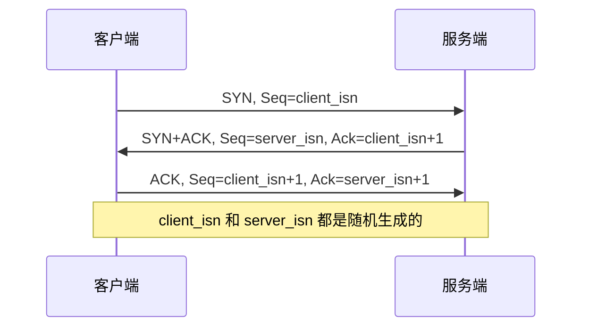
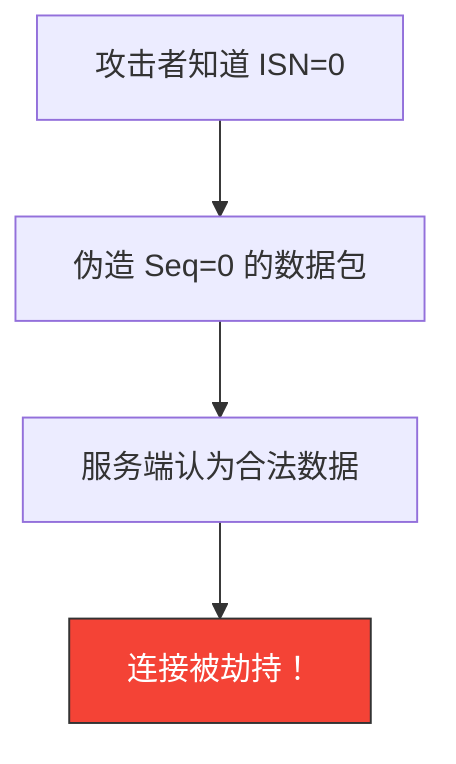
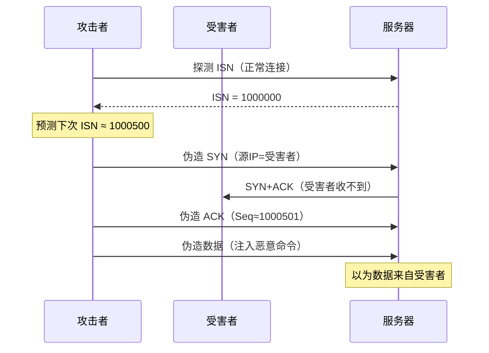
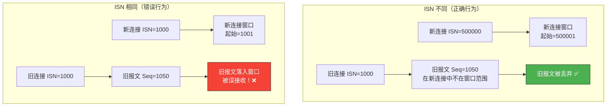
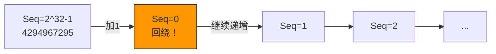

# TCP 初始化序列号为何不同

> 每次 TCP 建立连接，双方都会生成一个随机的初始序列号（ISN）。如果 ISN 固定不变或可预测，TCP 连接就面临被伪造、劫持的风险。理解 ISN 的生成逻辑，是理解 TCP 安全性的关键一环。

## 一、什么是初始序列号（ISN）

### 1.1 ISN 的角色

TCP 三次握手中，双方交换的就是各自的初始序列号：



ISN 不是从 0 或 1 开始，而是一个 **32 位伪随机数**，每次新建连接都会不同。

### 1.2 ISN 的生成方式

Linux 内核中 ISN 的生成公式大致为：

```
ISN = M + F(源IP, 源端口, 目的IP, 目的端口)
```

- **M**：一个每 4 微秒加 1 的计时器（约 64 秒回绕一次 32 位空间）
- **F**：基于四元组的哈希函数，使用密钥生成伪随机偏移

```c
// Linux 内核简化逻辑（net/ipv4/tcp_ipv4.c）
// ISN = clock_offset + md5_hash(secret, src_ip, src_port, dst_ip, dst_port)
u32 tcp_v4_init_sequence(const struct sk_buff *skb)
{
    return secure_tcp_sequence_number(ip_hdr(skb)->daddr,
                                      ip_hdr(skb)->saddr,
                                      tcp_hdr(skb)->dest,
                                      tcp_hdr(skb)->source);
}
```

::: tip 关键特性
同一对四元组（源IP、源端口、目的IP、目的端口）每次新建连接的 ISN 都不同，因为 M 随时间递增，且哈希函数引入了随机性。
:::

---

## 二、为什么 ISN 不能固定

### 2.1 假设 ISN 固定为 0

如果 ISN 永远从 0 开始，攻击者可以轻松伪造 TCP 报文：



### 2.2 历史上的 ISN 攻击

1996 年，Michal Zalewski 发现很多 TCP 实现的 ISN 生成算法是**线性递增**的，攻击者可以：

1. 探测当前 ISN 的值
2. 预测下一次连接的 ISN
3. 伪造 TCP 报文注入数据

这就是著名的 **TCP 序列号预测攻击**（TCP Sequence Prediction Attack）。



::: warning TCP 序列号预测攻击的危害
- 伪造 IP 地址进行 IP 欺骗
- 劫持 TCP 会话
- 绕过基于 IP 的认证
- RFC 1948 专门为此提出了 ISN 随机化方案
:::

---

## 三、ISN 不同的两大原因

### 3.1 防止旧连接的报文干扰新连接

同一个四元组（源IP、源端口、目的IP、目的端口）可能被反复使用。如果新连接的 ISN 和旧连接重叠，旧连接残留网络中的延迟报文可能被新连接误接收。



::: important MSL 与 ISN 的关系
TCP 规定 TIME_WAIT 持续 2MSL（通常 60 秒），确保旧连接的报文从网络中消失。而 ISN 随机化是**第二道防线**：即使 TIME_WAIT 未结束新连接就建立了，不同的 ISN 也能让旧报文被识别为无效。
:::

### 3.2 防止序列号预测攻击

ISN 的随机性使得攻击者无法猜测下一个连接的序列号，从而无法伪造合法报文。

| 安全等级 | ISN 生成方式 | 攻击难度 |
|----------|-------------|---------|
| 极危险 | 固定值 | 零难度 |
| 危险 | 简单递增 | 容易预测 |
| 较安全 | 基于时间的随机偏移 | 需大量探测 |
| 安全 | 密码学哈希 + 随机密钥 | 几乎不可预测 |

---

## 四、ISN 随机性的实现细节

### 4.1 Linux 内核实现

Linux 使用基于 MD5 的哈希方案生成 ISN：

```c
// 简化的 ISN 生成逻辑
// 1. 每 64 秒递增的计数器
// 2. 基于四元组的 MD5 哈希偏移
// 3. 两者相加得到最终 ISN

static u32 secure_tcp_seq(__be32 saddr, __be32 daddr,
                          __be16 sport, __be16 dport)
{
    // 时间戳部分：每 64 秒回绕
    u32 ts = tcp_clock_ms >> 6;  // 约 4us 精度

    // 哈希部分：基于四元组的 MD5
    u32 hash = md5_transform(secret_key, saddr, daddr, sport, dport);

    return ts + hash;  // 32 位加法，自然回绕
}
```

### 4.2 查看 ISN 的随机性

使用 tcpdump 抓包观察同一对端口多次连接的 ISN：

```bash
# 抓取 80 端口的 SYN 包，观察 ISN
sudo tcpdump -i eth0 'tcp port 80 and tcp[tcpflags] & tcp-syn != 0' -nn -c 10

# 输出示例：
# ISN = 3846279510
# ISN = 4128491037  （差异巨大，不可预测）
# ISN = 1567203948
```

```bash
# 使用 Python 脚本分析 ISN 的分布
import subprocess
import re

results = []
for i in range(20):
    # 每次新建连接获取 ISN
    proc = subprocess.run(
        ['tcpdump', '-i', 'lo', '-c', '1', '-nn',
         'tcp port 80 and tcp[tcpflags] & tcp-syn != 0'],
        capture_output=True, text=True, timeout=5
    )
    # 解析 ISN...
    print(f"Connection {i}: ISN varies randomly")
```

---

## 五、ISN 回绕问题

### 5.1 32 位序列号的空间

ISN 是 32 位无符号整数，取值范围 0 ~ 4,294,967,295。在高速网络中，序列号可能很快用完并**回绕**（wrap around）：



### 5.2 PAWS 机制

TCP 使用 **PAWS**（Protection Against Wrapped Sequence numbers）机制解决回绕问题：

- 每个报文段携带一个 32 位**时间戳选项**
- 接收端比较时间戳，丢弃过期的报文
- 即使序列号回绕了，时间戳仍能区分新旧数据

```bash
# 查看时间戳选项是否启用
cat /proc/sys/net/ipv4/tcp_timestamps
# 1 = 启用（默认）
```

::: important PAWS 依赖 tcp_timestamps
如果关闭 `tcp_timestamps`，PAWS 失效，高速网络中序列号回绕会导致数据混乱。生产环境**强烈建议**保持 `tcp_timestamps=1`。
:::

---

## 六、面试速查

::: tip 面试速查
- **Q：TCP 每次建立连接的初始序列号为什么不同？**
  A：两个原因——①防止旧连接的延迟报文被新连接误接收；②防止攻击者预测序列号进行 TCP 劫持攻击。

- **Q：ISN 是怎么生成的？**
  A：Linux 中 ISN = 递增计时器 + 基于四元组的哈希偏移。哈希函数使用随机密钥，使得 ISN 不可预测。

- **Q：如果 ISN 固定会有什么问题？**
  A：①同一四元组的新旧连接可能混淆；②攻击者可以伪造 TCP 报文劫持连接（TCP 序列号预测攻击）。

- **Q：序列号回绕怎么处理？**
  A：通过 PAWS 机制，利用 TCP 时间戳选项区分新旧报文，即使 32 位序列号回绕也不会混乱。

- **Q：ISN 随机性和 TIME_WAIT 有什么关系？**
  A：都是防止旧报文干扰新连接的机制。TIME_WAIT 等待 2MSL 让旧报文消失，ISN 随机化是第二道防线——即使旧报文还没消失，不同的 ISN 也能让它被识别为无效。
:::

---

::: info 原著参考
- 小林coding《图解网络》—— [TCP 每次建立连接，初始化序列号为什么不同？](https://xiaolincoding.com/network/3_tcp/isn.html)
:::
