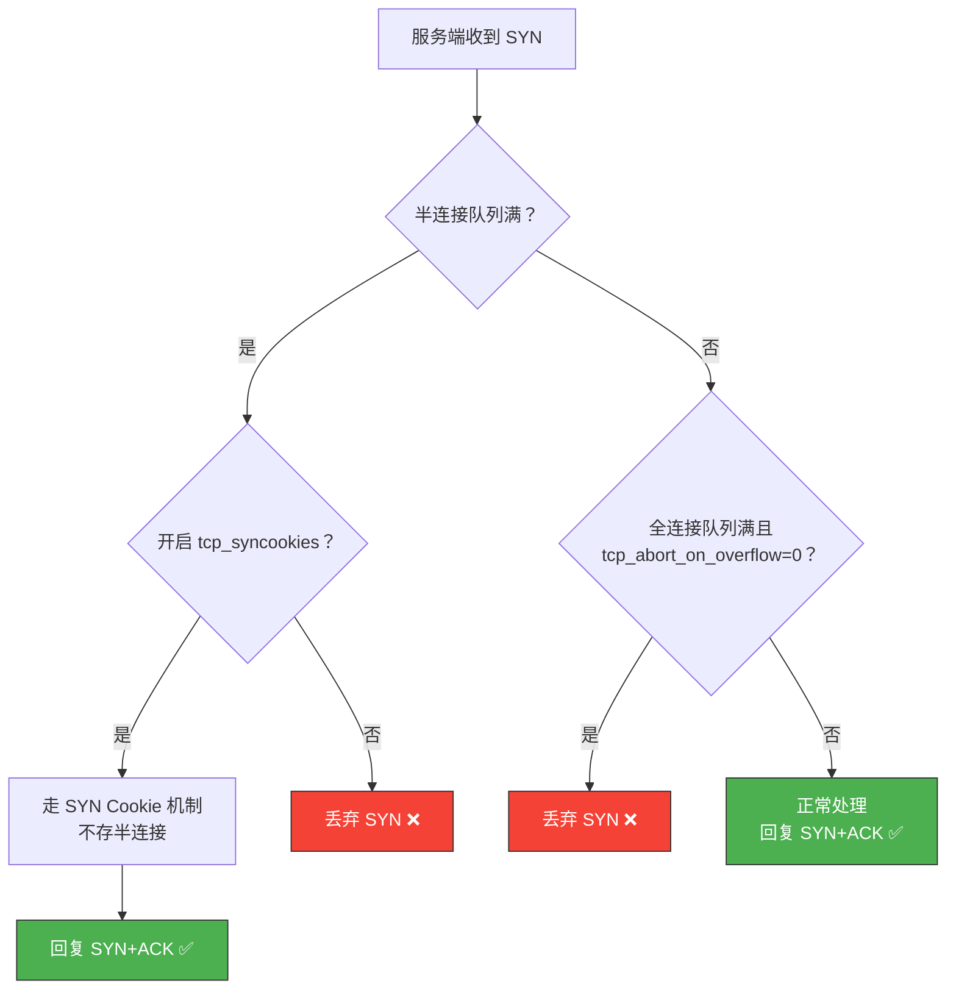
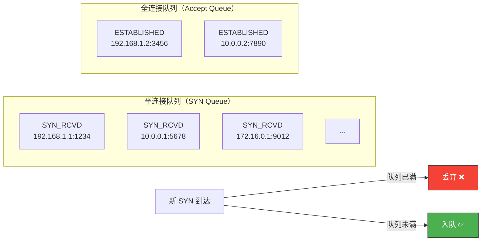
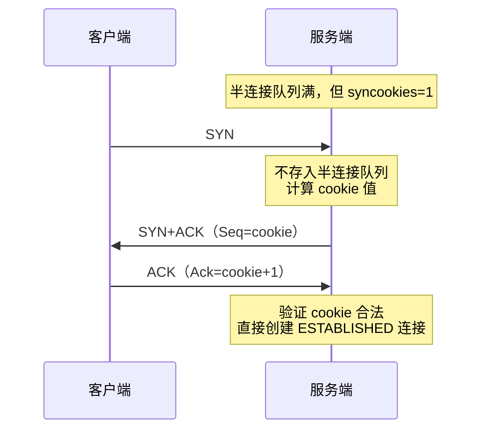
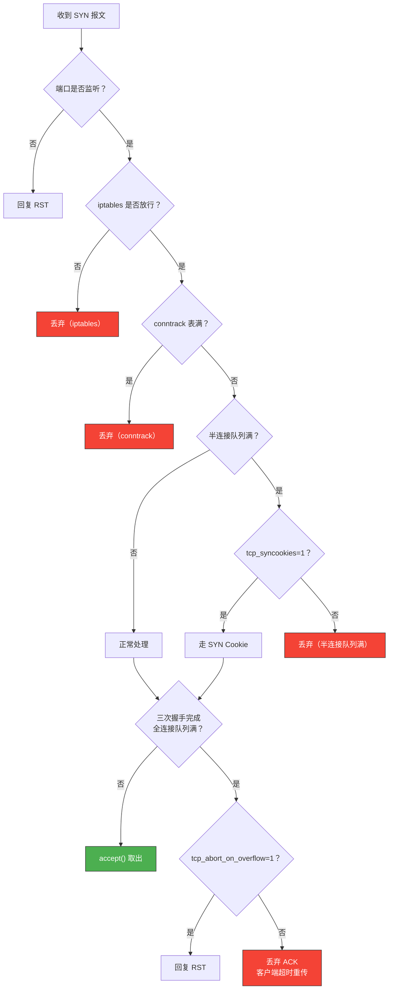

# SYN 报文什么情况下会被丢弃

> 服务端收到 SYN 报文后，并不是一定会回复 SYN+ACK。在很多边界条件下，SYN 会被默默丢弃——客户端收不到任何响应，只能等待超时重传。理解这些场景，是排查"连接建立失败"问题的关键。

## 一、SYN 被丢弃的整体视图



---

## 二、场景一：半连接队列满

### 2.1 什么是半连接队列

SYN 到达服务端后，内核会为这个连接分配一个 `request_sock` 结构，放入 **SYN 队列**（也叫半连接队列），同时回复 SYN+ACK。此时连接处于 SYN_RCVD 状态。



### 2.2 半连接队列的容量

```bash
# 查看半连接队列大小（取决于 tcp_max_syn_backlog 和 somaxconn）
cat /proc/sys/net/ipv4/tcp_max_syn_backlog
# 默认值：1024 或 2048（取决于内核版本）

cat /proc/sys/net/core/somaxconn
# 默认值：4096（Linux 5.4+）

# 实际队列大小 = min(tcp_max_syn_backlog, somaxconn, 应用层 listen backlog)
```

### 2.3 半连接队列满时 SYN Cookie 的作用

当半连接队列满时，如果开启了 `tcp_syncookies`，内核不会丢弃 SYN，而是用 **SYN Cookie** 机制绕过半连接队列：



```bash
# SYN Cookie 开关
cat /proc/sys/net/ipv4/tcp_syncookies
# 0 = 关闭（SYN 队列满则丢弃）
# 1 = 开启（默认，SYN 队列满时走 cookie）
# 2 = 始终使用 SYN Cookie
```

::: warning SYN Cookie 的代价
SYN Cookie 绕过了半连接队列，但也丢失了部分 TCP 选项信息（如 Window Scale、SACK），可能影响性能。它是一种**应急机制**，不应依赖它来处理大量正常流量。
:::

---

## 三、场景二：全连接队列满

### 3.1 全连接队列满时的行为

三次握手完成后，连接从半连接队列移到全连接队列。如果全连接队列已满，且应用层来不及 `accept()`，新完成的连接将无法入队。

此时对 SYN 的处理取决于 `tcp_abort_on_overflow`：

```bash
# tcp_abort_on_overflow 的值
cat /proc/sys/net/ipv4/tcp_abort_on_overflow
# 0 = 默认，丢弃 SYN（客户端超时重传）
# 1 = 直接回复 RST（客户端立即报错）
```

| tcp_abort_on_overflow | 全连接队列满时对 SYN 的处理 | 客户端感受 |
|----------------------|--------------------------|-----------|
| 0（默认） | 丢弃 SYN，不回复任何内容 | 连接超时 |
| 1 | 不丢弃 SYN，但在 ACK 到达时回复 RST | Connection reset |

::: important 为什么默认是丢弃而不是 RST？
丢弃 SYN 让客户端超时重传，给了服务端应用"喘息"的时间去消费全连接队列。如果直接 RST，客户端会立即报错，可能引发更严重的级联故障。
:::

### 3.2 观察全连接队列溢出

```bash
# 查看全连接队列溢出次数
netstat -s | grep "overflow"
# 例：12345 times the listen queue of a socket overflowed

# 查看各监听端口的全连接队列使用情况
ss -lnt
# Recv-Q = 当前全连接队列中的连接数
# Send-Q = 全连接队列最大容量

# State   Recv-Q  Send-Q  Local:Port  Peer:Port
# LISTEN  0       128     *:80        *:*
# LISTEN  50      100     *:8080      *:*    ← 50/100，半满
# LISTEN  100     100     *:9090      *:*    ← 100/100，已满！
```

---

## 四、场景三：防火墙/iptables 丢弃

### 4.1 iptables 规则丢弃 SYN

```bash
# 丢弃来自某个 IP 的 SYN 包
sudo iptables -A INPUT -s 10.0.0.1 -p tcp --syn -j DROP

# 限制每秒新建连接数（防 SYN Flood）
sudo iptables -A INPUT -p tcp --syn -m limit --limit 10/s --limit-burst 20 -j ACCEPT
sudo iptables -A INPUT -p tcp --syn -j DROP
```

### 4.2 conntrack 表满

Linux 的连接跟踪表（conntrack）有容量上限，满了之后新 SYN 会被丢弃：

```bash
# 查看 conntrack 表使用情况
cat /proc/sys/net/netfilter/nf_conntrack_count
cat /proc/sys/net/netfilter/nf_conntrack_max

# 如果 count 接近 max，新连接的 SYN 会被丢弃
# 增大 conntrack 表容量
echo 262144 > /proc/sys/net/netfilter/nf_conntrack_max

# 查看 conntrack 表满的丢包统计
dmesg | grep "nf_conntrack: table full"
```

---

## 五、场景四：TCP Twilight Zone

### 5.1 目标端口未监听

如果 SYN 报文的目的端口没有进程在监听，服务端会回复 **RST** 而不是丢弃：

```bash
# 连接未监听的端口
curl http://192.168.1.1:9999
# curl: (7) Failed to connect: Connection refused

# tcpdump 抓包可以看到 RST
sudo tcpdump -i eth0 'tcp port 9999' -nn -c 4
# [S] 客户端 → 服务端     Seq=123456
# [S.] 服务端 → 客户端    Seq=0, Ack=123457  ← 如果端口开放
# [R] 服务端 → 客户端     Seq=0              ← 端口未监听，回复 RST
```

::: tip 注意
端口未监听回复的是 RST（不是丢弃），客户端会立即收到 "Connection refused"。而前面几种场景是**静默丢弃**，客户端只能等待超时。
:::

---

## 六、排查 SYN 丢弃的实战方法

### 6.1 使用 tcpdump 确认 SYN 是否到达服务端

```bash
# 服务端抓包：看 SYN 是否到达
sudo tcpdump -i eth0 'tcp[tcpflags] & tcp-syn != 0 and dst port 80' -nn

# 如果看到 SYN 到达但没有 SYN+ACK 回复，说明被丢弃了
```

### 6.2 使用内核跟踪工具

```bash
# 使用 bpftrace 追踪 SYN 丢弃原因
# 需要安装 bpftrace
sudo bpftrace -e '
kprobe:tcp_v4_conn_request {
    @syn_received[args->sk] = count();
}
'

# 使用 dropwatch 查看内核丢包点
sudo dropwatch -l kas
# 输出内核丢包的函数位置
```

### 6.3 检查关键内核参数

```bash
# 一键检查所有相关参数
echo "=== 半连接队列 ==="
cat /proc/sys/net/ipv4/tcp_max_syn_backlog
echo "=== 全连接队列 ==="
cat /proc/sys/net/core/somaxconn
echo "=== SYN Cookie ==="
cat /proc/sys/net/ipv4/tcp_syncookies
echo "=== 溢出行为 ==="
cat /proc/sys/net/ipv4/tcp_abort_on_overflow
echo "=== 连接跟踪 ==="
cat /proc/sys/net/netfilter/nf_conntrack_count
cat /proc/sys/net/netfilter/nf_conntrack_max
echo "=== 队列溢出统计 ==="
netstat -s | grep -i overflow
netstat -s | grep -i "SYN to LISTEN"
```

---

## 七、完整决策流程



---

## 八、面试速查

::: tip 面试速查
- **Q：SYN 报文什么情况下会被丢弃？**
  A：主要有 4 种情况——①半连接队列满且未开启 SYN Cookie；②全连接队列满且 tcp_abort_on_overflow=0；③防火墙/iptables 规则丢弃；④conntrack 表满。

- **Q：半连接队列满了怎么办？**
  A：开启 tcp_syncookies（默认已开启），内核会使用 SYN Cookie 机制绕过半连接队列。但 SYN Cookie 有功能限制，建议同时增大 tcp_max_syn_backlog。

- **Q：全连接队列满了 SYN 会被丢弃吗？**
  A：不一定。SYN 会被正常处理（进入半连接队列），但三次握手完成后的 ACK 会被丢弃（tcp_abort_on_overflow=0 时），客户端会超时重传。

- **Q：tcp_abort_on_overflow=0 和 =1 的区别？**
  A：=0 时丢弃 ACK，客户端超时重传；=1 时回复 RST，客户端立即报错。默认是 0，给服务端应用恢复的机会。

- **Q：如何排查 SYN 被丢弃？**
  A：tcpdump 确认 SYN 是否到达 → netstat -s 查看溢出统计 → ss -lnt 查看队列使用 → 检查 conntrack 和 iptables。
:::

---

::: info 原著参考
- 小林coding《图解网络》—— [SYN 报文什么情况下会被丢弃？](https://xiaolincoding.com/network/3_tcp/syn_drop.html)
:::
