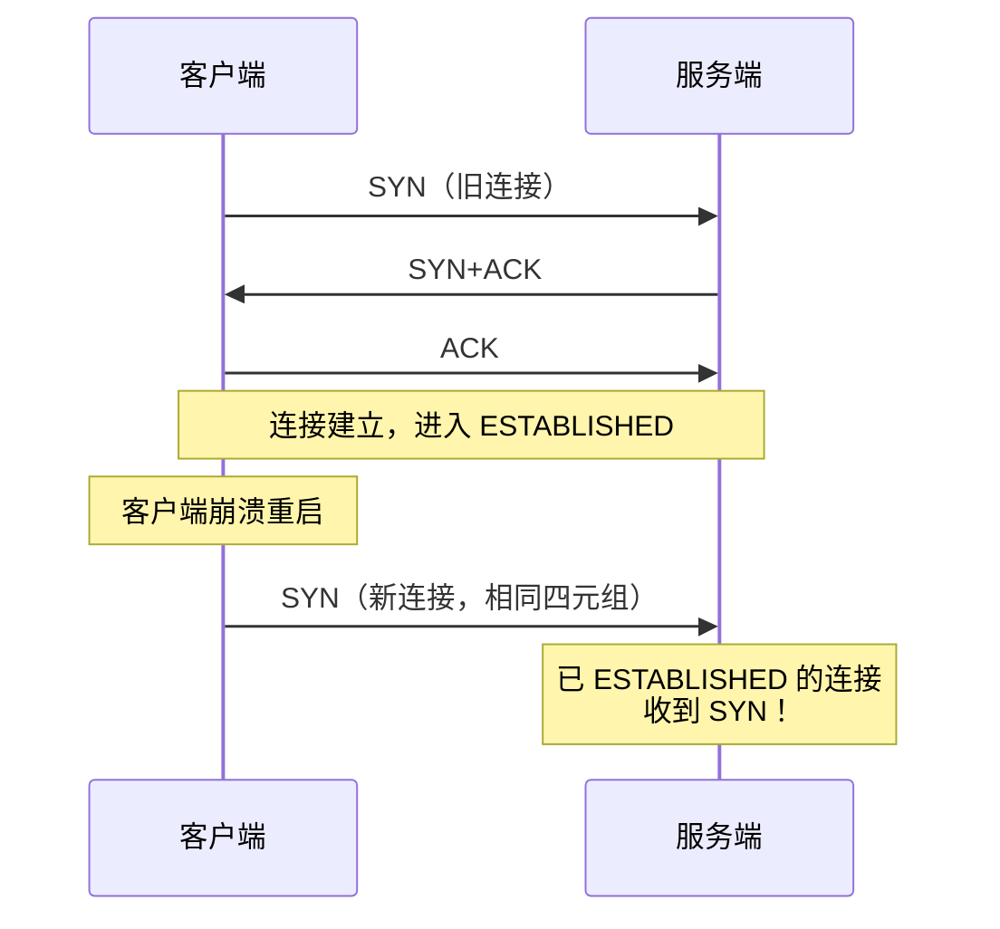
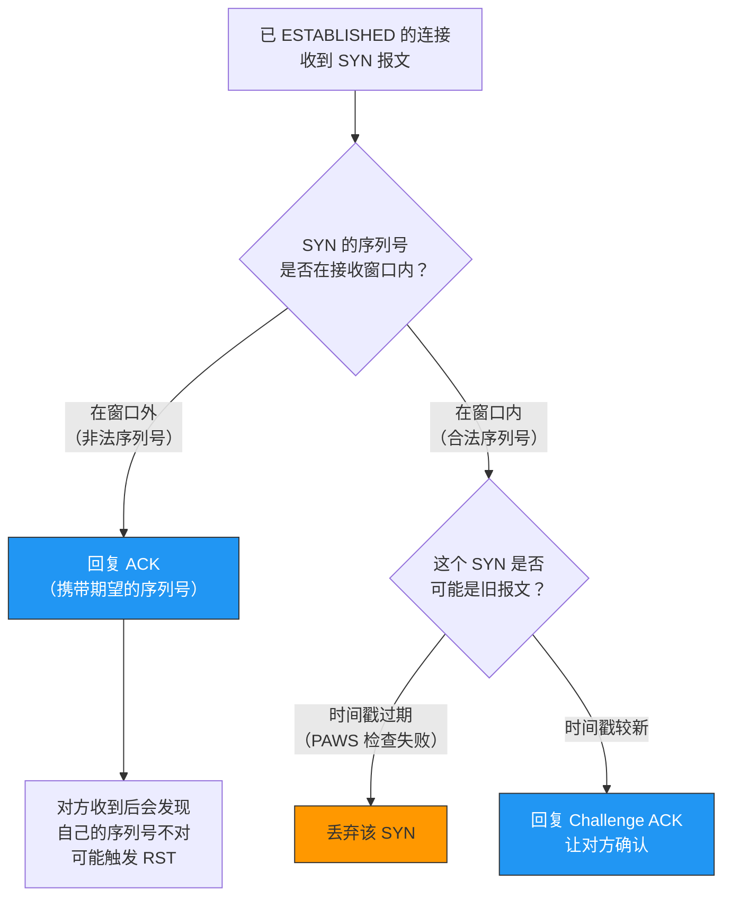
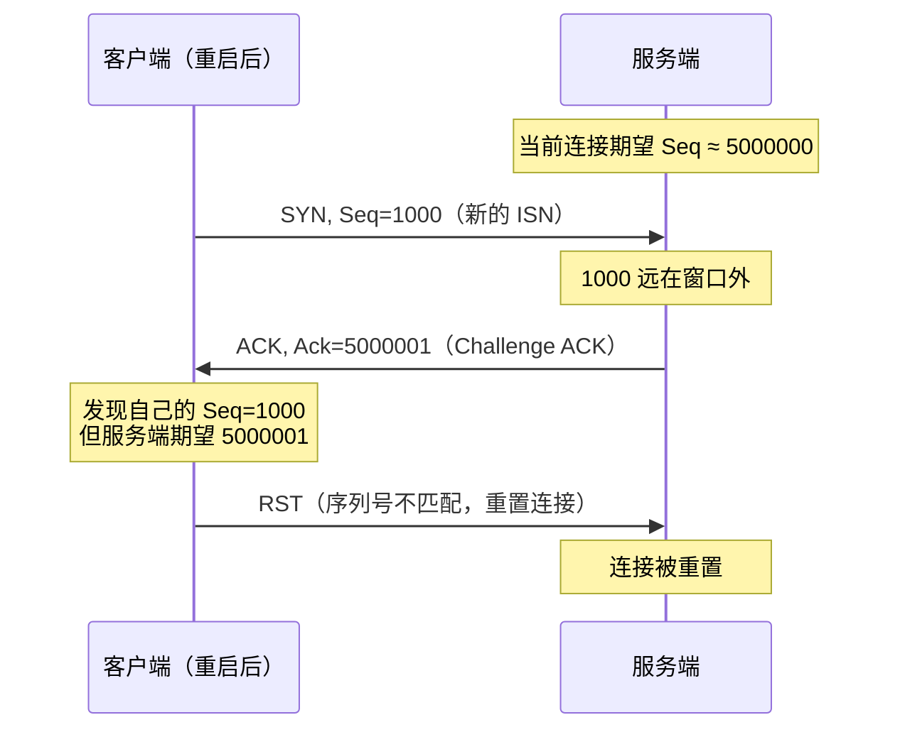
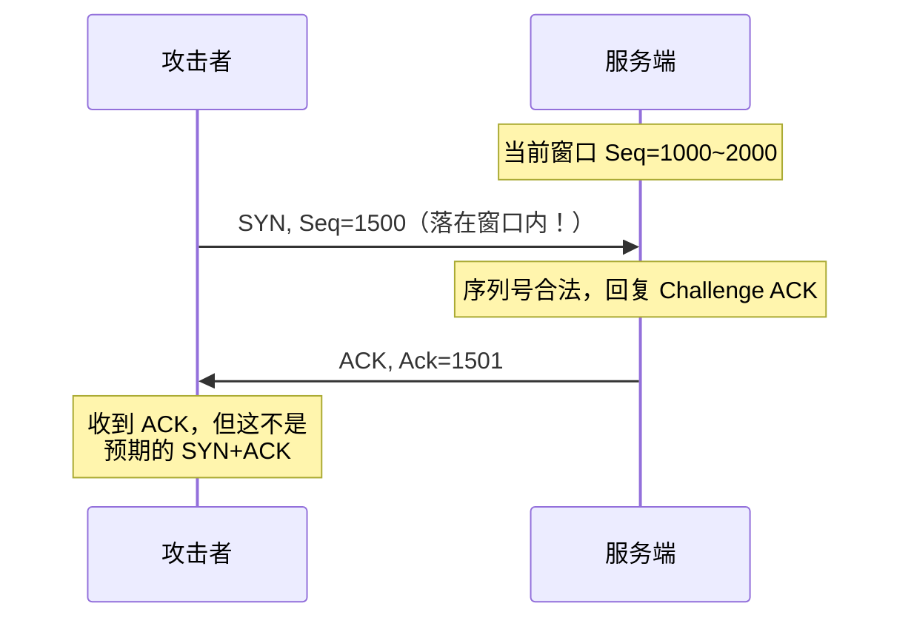

# 已建立连接的 TCP 收到 SYN 会发生什么

> 一个已经处于 ESTABLISHED 状态的 TCP 连接，突然收到一个 SYN 报文，TCP 会怎么处理？这个看似奇怪的场景，在实际网络中并不罕见——可能是客户端崩溃重启后用相同的四元组重连，也可能是恶意攻击。

## 一、场景分析

### 1.1 为什么已建立连接会收到 SYN

这个场景通常发生在以下情况：

- **客户端崩溃重启**：客户端进程崩溃后快速重启，使用相同的源端口发起新连接
- **NAT 设备端口复用**：NAT 网关将不同客户端映射到相同的源端口
- **连接劫持攻击**：攻击者伪造 SYN 报文试图重置或劫持连接
- **网络延迟**：旧连接的 SYN 重传报文在网络中滞留很久才到达



---

## 二、TCP 的处理逻辑

### 2.1 核心判断：SYN 的序列号是否合法

TCP 收到 SYN 报文时，关键判断逻辑是**该 SYN 的序列号是否落在接收窗口内**：



### 2.2 Linux 内核的处理

Linux 内核对这种情况的处理是回复一个 **Challenge ACK**：

```c
// net/ipv4/tcp_input.c（简化逻辑）
int tcp_rcv_state_process(struct sock *sk, struct sk_buff *skb)
{
    // 如果在 ESTABLISHED 状态收到 SYN
    if (th->syn && !before(TCP_SKB_CB(skb)->seq, tp->rcv_nxt)) {
        // 回复 Challenge ACK，让对方知道当前序列号期望
        tcp_send_ack(sk);
        return 0;
    }
    // ...
}
```

**Challenge ACK** 的作用是告诉对方："我期望的下一个序列号是 X，你的 SYN 序列号与我不匹配"。

---

## 三、两种情况详解

### 3.1 情况一：SYN 序列号在窗口外（非法）

这是最常见的场景——新 SYN 的序列号与当前连接的序列号空间不匹配。



::: tip 这就是"连接被重置"的常见原因
客户端崩溃重启后用相同四元组重连，服务端的旧连接还在，收到新 SYN 后回复 Challenge ACK，客户端发现序列号不对就发送 RST，旧连接被重置。之后客户端可以正常发起新连接。
:::

### 3.2 情况二：SYN 序列号在窗口内（合法但异常）

如果 SYN 的序列号碰巧落在当前接收窗口内，情况就复杂了：



这种情况下，真正的客户端会收到这个 Challenge ACK，发现自己的数据未被确认，可能触发重传或 RST。

::: warning 安全风险：RST 注入攻击
如果攻击者能猜测出窗口范围内的序列号，就可以伪造 RST 报文重置连接。TCP 的序列号随机化正是为了降低这种风险。Linux 内核还限制了 Challenge ACK 的发送速率，防止被利用进行攻击。
:::

---

## 四、Challenge ACK 速率限制

### 4.1 为什么要限速

2016 年，研究人员发现可以利用 Challenge ACK 进行**盲窗口攻击**（Blind TCP Attack）：

1. 攻击者向已建立连接的服务端发送大量伪造 SYN
2. 服务端对每个 SYN 回复 Challenge ACK
3. Challenge ACK 泄露了当前序列号信息
4. 攻击者利用这些信息伪造 RST 或数据注入

### 4.2 内核参数

Linux 4.6+ 引入了 Challenge ACK 速率限制：

```bash
# Challenge ACK 每秒发送上限
cat /proc/sys/net/ipv4/tcp_challenge_ack_limit
# 默认值：1000（每秒最多 1000 个 Challenge ACK）
```

```c
// net/ipv4/tcp_input.c
// Challenge ACK 速率限制逻辑
static void tcp_send_challenge_ack(struct sock *sk)
{
    static u32 challenge_timestamp;
    static unsigned int challenge_count;
    u32 now = (u32)tcp_time_stamp;

    if (now != challenge_timestamp) {
        challenge_timestamp = now;
        challenge_count = 0;
    }
    if (++challenge_count <= READ_ONCE(sysctl_tcp_challenge_ack_limit))
        tcp_send_ack(sk);
}
```

---

## 五、与 TIME_WAIT 的对比

| 场景 | 收到 SYN 的处理 | 原因 |
|------|---------------|------|
| ESTABLISHED 收到 SYN | 回复 Challenge ACK | 保护现有连接，让对方自行判断 |
| TIME_WAIT 收到 SYN | 可能接受并重用连接 | 主动方已关闭，可以安全重用 |
| LISTEN 收到 SYN | 正常回复 SYN+ACK | 这是正常的三次握手 |
| CLOSE_WAIT 收到 SYN | 回复 RST | 本端已关闭，拒绝新数据 |

---

## 六、实战抓包分析

### 6.1 模拟客户端崩溃重启

```bash
# 终端1：启动服务端
nc -l 8080

# 终端2：客户端连接
nc 127.0.0.1 8080

# 终端3：抓包
sudo tcpdump -i lo port 8080 -nn -S

# 终端2：强制断开客户端（模拟崩溃）
kill -9 <pid>

# 终端2：立即用相同端口重连
nc -p 12345 127.0.0.1 8080

# 观察抓包：可以看到 Challenge ACK → RST 的过程
```

### 6.2 典型抓包输出

```
# 旧的 ESTABLISHED 连接
12:00:01 client:12345 → server:8080 [S] Seq=1000000
12:00:01 server:8080 → client:12345 [S.] Seq=2000000 Ack=1000001
12:00:01 client:12345 → server:8080 [.] Ack=2000001

# 客户端崩溃重启后，发送新 SYN
12:00:05 client:12345 → server:8080 [S] Seq=3000000

# 服务端回复 Challenge ACK（期望旧序列号）
12:00:05 server:8080 → client:12345 [.] Ack=2000001

# 客户端发现序列号不匹配，发送 RST
12:00:05 client:12345 → server:8080 [R] Seq=3000000
```

---

## 七、面试速查

::: tip 面试速查
- **Q：已建立连接的 TCP 收到 SYN 会怎么处理？**
  A：先检查 SYN 的序列号是否在接收窗口内。如果在窗口外，回复 Challenge ACK（告知期望序列号）；如果在窗口内且时间戳有效，同样回复 Challenge ACK。对方收到后会发现序列号不匹配，通常会发送 RST 重置连接。

- **Q：什么是 Challenge ACK？**
  A：TCP 在收到异常报文时回复的 ACK，携带当前期望的序列号，让对方自行判断连接状态。这是一种保护机制，不直接重置连接。

- **Q：为什么要对 Challenge ACK 限速？**
  A：防止攻击者利用大量伪造 SYN 触发 Challenge ACK，从中获取序列号信息，进而伪造 RST 或数据注入攻击。

- **Q：客户端崩溃重启用相同端口重连，会发生什么？**
  A：新 SYN 到达服务端 → 服务端回复 Challenge ACK → 客户端发现序列号不匹配 → 发送 RST → 旧连接被重置 → 客户端可以重新三次握手建立新连接。

- **Q：如何防止 TCP 连接被伪造 RST 攻击？**
  A：① ISN 随机化使序列号难以预测；② PAWS 机制利用时间戳过滤旧报文；③ Challenge ACK 速率限制减少信息泄露。
:::

---

::: info 原著参考
- 小林coding《图解网络》—— [已建立连接的 TCP 收到 SYN 会发生什么？](https://xiaolincoding.com/network/3_tcp/est_syn.html)
:::
