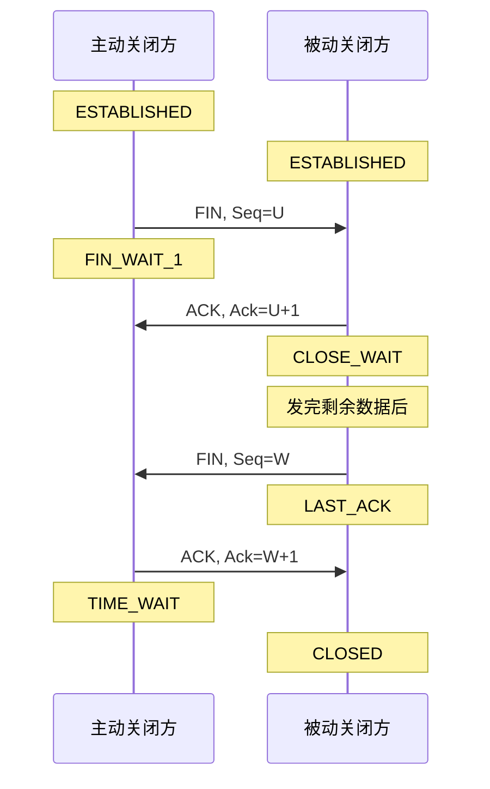
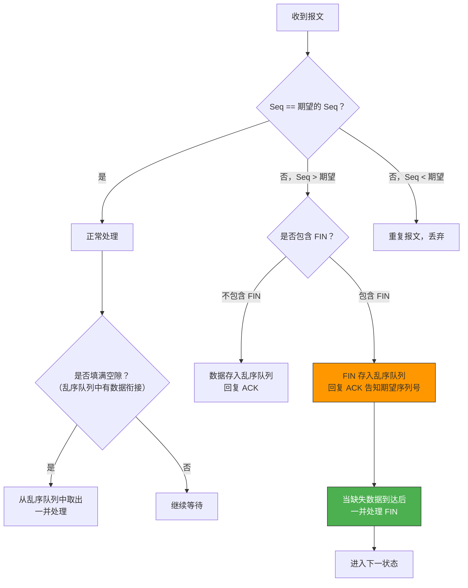
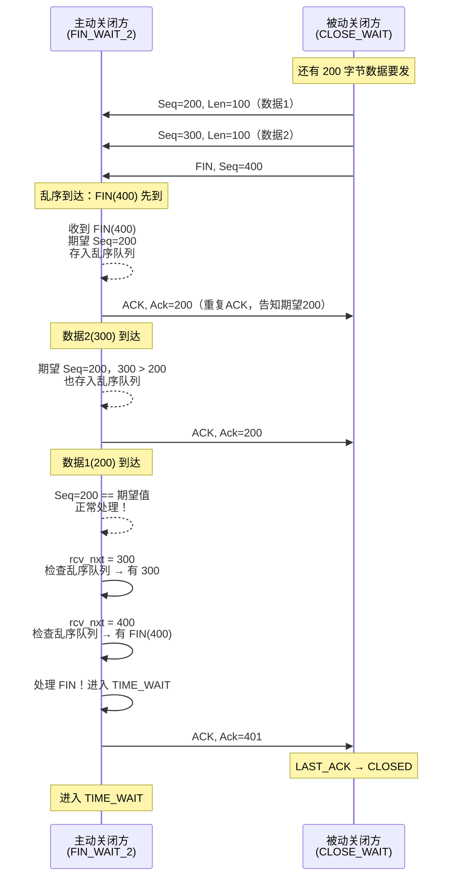
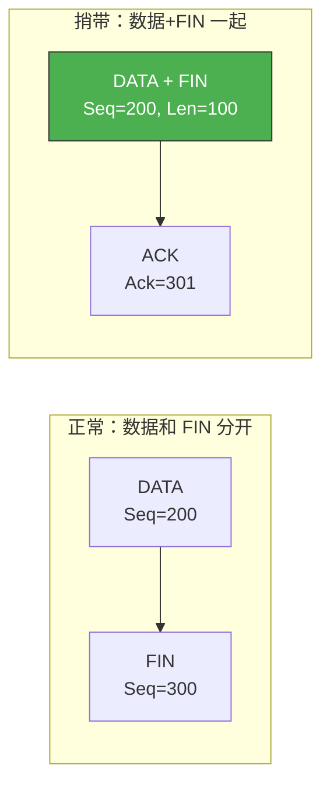

# 四次挥手中收到乱序 FIN 包如何处理

> TCP 四次挥手的过程并非总是一帆风顺——FIN 和数据包可能在网络中乱序到达。如果 FIN 先于数据到达，接收端该如何处理？理解这个问题，需要深入 TCP 对乱序报文的处理机制。

## 一、四次挥手的正常流程

先回顾正常流程：



四次挥手的核心：**FIN 和 ACK 是分开的**，因为被动方可能还有数据要发。

---

## 二、什么是乱序 FIN

### 2.1 场景描述

在四次挥手中，如果网络出现乱序，可能发生以下情况：

- 被动方先发了数据包，再发 FIN，但 **FIN 先于数据到达**主动方
- 主动方收到的报文序列号不连续，FIN "跳"到了前面

```mermaid
sequenceDiagram
    participant A as 主动关闭方
    participant B as 被动关闭方

    A->>B: FIN, Seq=100
    B->>A: ACK, Ack=101

    Note over B: 还有数据要发
    B->>A: DATA, Seq=200, Len=100
    B->>A: FIN, Seq=300

    Note over A: 乱序！FIN(300) 先到<br/>DATA(200) 后到

    A-)>>A: FIN 到达但 Seq=300<br/>期望 Seq=200<br/>存入乱序队列
```

### 2.2 乱序产生的原因

| 原因 | 说明 |
|------|------|
| 网络多路径 | 不同报文走不同路由，延迟不同 |
| 链路拥塞 | 某些报文被排队，后续报文先到 |
| 重排设备 | 交换机/路由器的包重排 |
| 无线网络 | 无线链路的重传导致乱序 |

---

## 三、TCP 对乱序 FIN 的处理机制

### 3.1 核心原则：序列号驱动

TCP 的所有处理逻辑都以**序列号**为准。收到任何报文，先检查序列号：



### 3.2 具体处理步骤

1. **收到乱序 FIN**：存入乱序队列（out-of-order queue），不立即处理 FIN 标志
2. **回复重复 ACK**：告知对方期望的序列号（触发快速重传）
3. **等待缺失数据**：当中间缺失的数据到达后，连同 FIN 一起处理
4. **处理 FIN**：进入对应的状态转换

```c
// 简化的内核处理逻辑
void tcp_data_queue(struct tcp_sock *tp, struct sk_buff *skb)
{
    // 序列号在期望范围之前 → 重复数据，丢弃
    if (before(TCP_SKB_CB(skb)->seq, tp->rcv_nxt))
        return;

    // 序列号正好是期望的 → 正常处理
    if (TCP_SKB_CB(skb)->seq == tp->rcv_nxt) {
        // 处理数据
        tp->rcv_nxt += skb->len;
        // 如果包含 FIN，处理 FIN
        if (tcp_hdr(skb)->fin)
            tcp_fin(tp);
        // 检查乱序队列是否有衔接的数据
        tcp_ofo_queue(tp);
    }
    // 序列号在期望之后 → 乱序，存入乱序队列
    else {
        tcp_ofo_queue(tp, skb);  // 存入乱序队列
        tcp_send_dupack(tp);     // 回复重复 ACK
    }
}
```

---

## 四、完整示例

### 4.1 乱序 FIN 处理全过程



### 4.2 tcpdump 验证

```bash
# 抓包观察乱序 FIN 的处理
sudo tcpdump -i eth0 'tcp port 8080' -nn -S

# 可能看到：
# B → A: FIN, Seq=400            ← FIN 先到
# A → B: ACK, Ack=200            ← 期望 Seq=200（重复ACK）
# B → A: Seq=300, Len=100        ← 数据2 后到
# A → B: ACK, Ack=200            ← 仍然期望 200
# B → A: Seq=200, Len=100        ← 数据1 最后到
# A → B: ACK, Ack=401            ← 数据+FIN 一起确认
```

---

## 五、FIN 与数据的边界

### 5.1 FIN 占一个序列号

FIN 标志占用一个序列号。如果最后一个数据包的 Seq=399，那么：

- FIN 的 Seq=400（如果 399 之前的数据长度为 200）
- 确认 FIN 的 Ack = 400 + 1 = 401

```
数据范围：Seq=200, Len=200  →  占用序列号 200~399
FIN：    Seq=400            →  占用序列号 400
确认：   Ack=401            →  确认数据+FIN
```

### 5.2 FIN 可以捎带数据

FIN 可以和最后一个数据包合在一起发送：



::: tip 捎带 FIN 可以减少报文数
如果应用层调用 `close()` 时发送缓冲区还有数据，TCP 会将 FIN 和最后一批数据一起发出，减少一个报文。这也是四次挥手可以变成三次的条件之一。
:::

---

## 六、乱序对四次挥手状态转换的影响

| 阶段 | 乱序情况 | 处理 |
|------|---------|------|
| FIN_WAIT_1 收到 FIN+ACK | ACK 丢失，只有 FIN 先到 | FIN 存入乱序队列，等 ACK 到达后一起处理 |
| FIN_WAIT_2 收到 FIN | FIN 先于数据到达 | FIN 存入乱序队列，等数据到达后处理 |
| CLOSING 收到 ACK | ACK 乱序 | 存入等处理 |
| LAST_ACK 收到 ACK | 数据+ACK 乱序 | 正常按序处理 |

::: important 关键结论
TCP 不会因为 FIN 乱序就丢弃 FIN。所有乱序报文（包括带 FIN 标志的）都会被存入乱序队列，等缺失数据到达后一并处理。TCP 的状态转换**只在序列号连续后才发生**。
:::

---

## 七、面试速查

::: tip 面试速查
- **Q：四次挥手中收到乱序 FIN 怎么处理？**
  A：FIN 存入乱序队列，回复重复 ACK 告知期望的序列号。等缺失的数据到达后，连同 FIN 一起处理，然后才进行状态转换。

- **Q：FIN 会被丢弃吗？**
  A：不会。即使 FIN 乱序到达，TCP 也会将它保存在乱序队列中，不会丢弃。只有当序列号完全不在窗口范围内才会丢弃。

- **Q：FIN 占序列号吗？**
  A：占。FIN 消耗一个序列号，所以确认 FIN 的 Ack = FIN 的 Seq + 1。SYN 也一样占一个序列号。

- **Q：FIN 可以和数据一起发吗？**
  A：可以。如果调用 close() 时发送缓冲区还有数据，TCP 会将 FIN 和数据一起发出，这就是四次挥手变三次的条件之一。

- **Q：乱序 FIN 会影响状态转换吗？**
  A：不会立即影响。TCP 的状态转换只在序列号连续后才会发生。乱序 FIN 存在队列中，等前面的数据到齐后才触发状态转换。
:::

---

::: info 原著参考
- 小林coding《图解网络》—— [四次挥手中收到乱序 FIN 包如何处理？](https://xiaolincoding.com/network/3_tcp/out_of_order_fin.html)
:::
