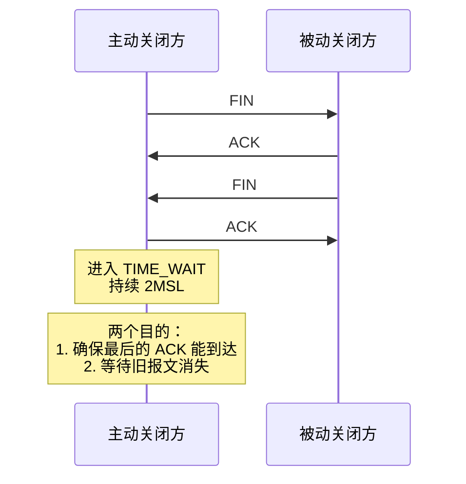
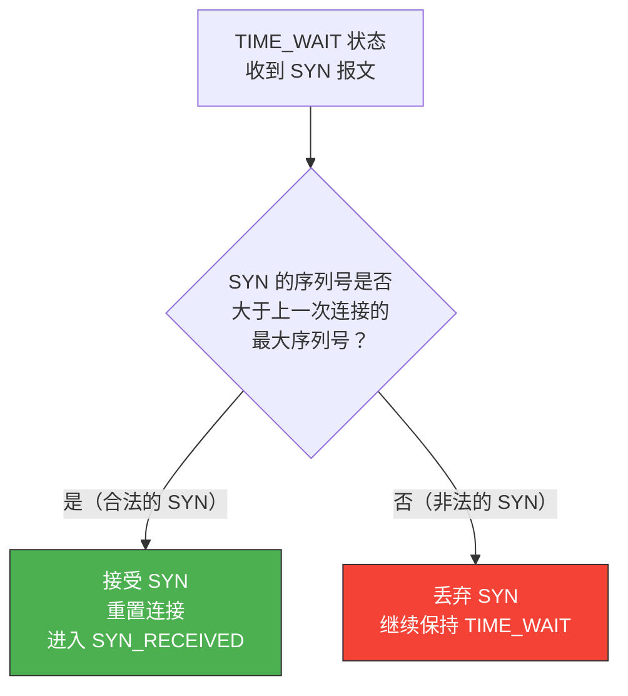
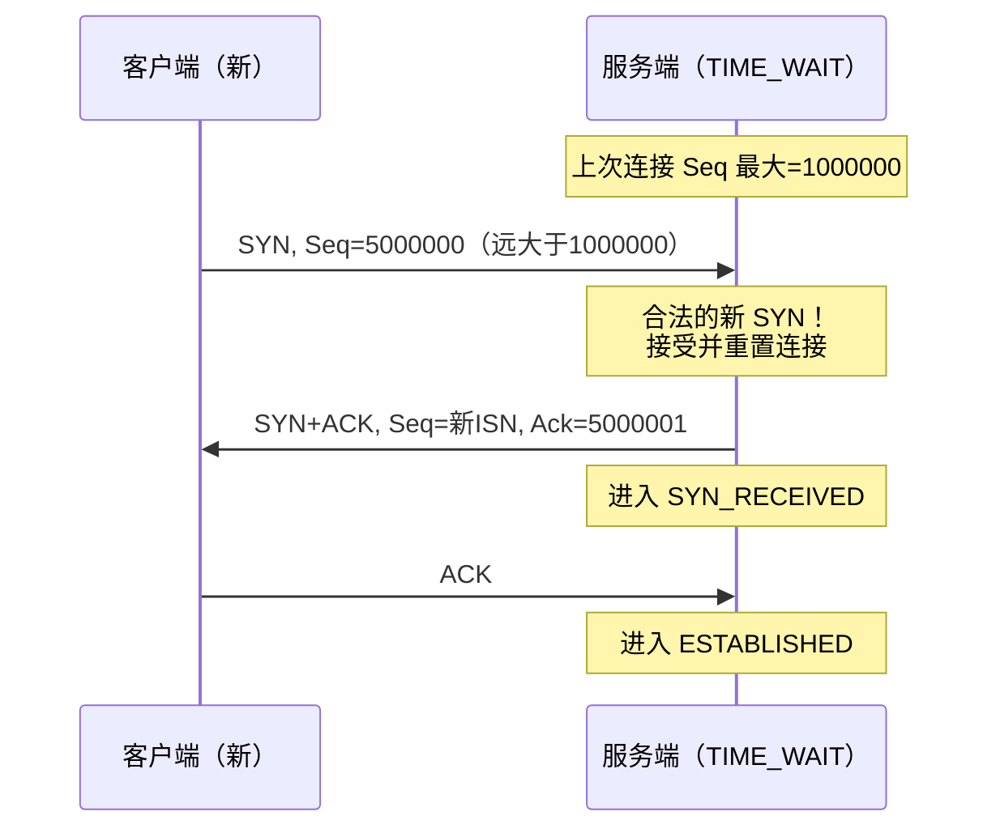
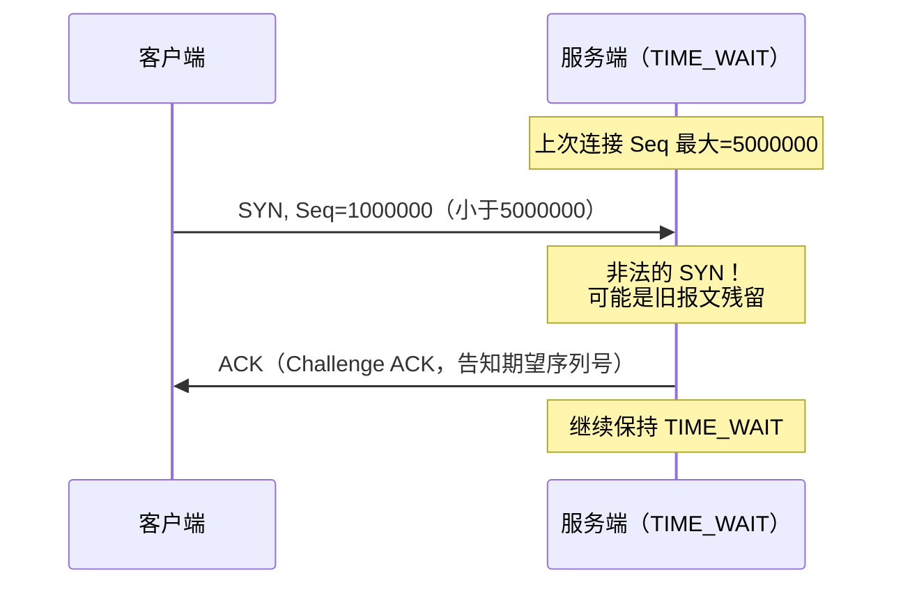
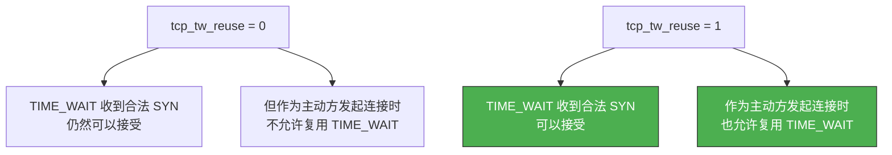
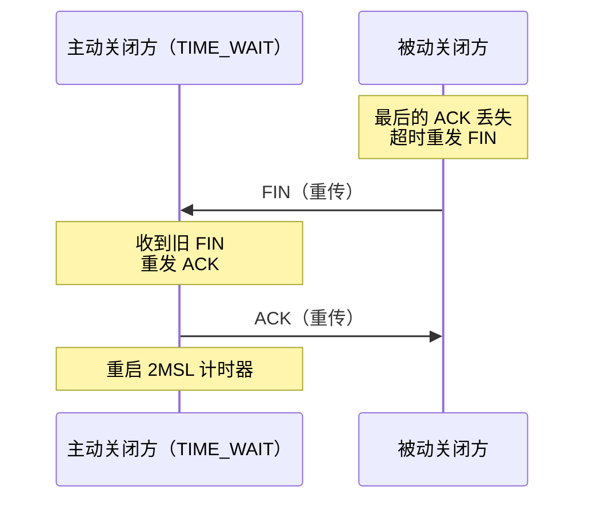
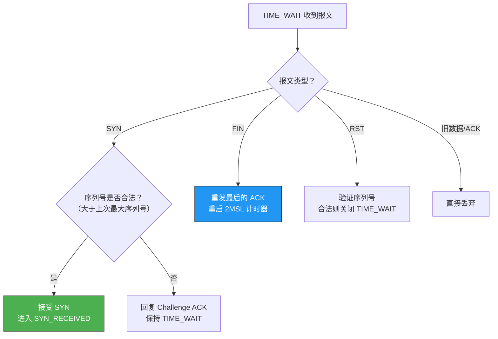

# TIME_WAIT 状态的 TCP 收到 SYN 会发生什么

> TIME_WAIT 是主动关闭方在四次挥手后进入的状态，持续 2MSL。在此期间，如果收到一个 SYN 报文，TCP 是直接丢弃还是另有处理？答案取决于 SYN 的序列号——这直接决定了连接能否被复用。

## 一、TIME_WAIT 状态回顾

### 1.1 为什么要进入 TIME_WAIT



TIME_WAIT 存在的两个核心目的：

1. **保证最后的 ACK 到达**：如果最后的 ACK 丢失，被动方会重发 FIN，TIME_WAIT 状态可以重发 ACK
2. **让旧连接的报文消亡**：2MSL 后网络中的旧报文一定被丢弃

---

## 二、TIME_WAIT 收到 SYN 的两种情况

### 2.1 关键判断：SYN 序列号是否合法



### 2.2 情况一：合法的 SYN（序列号正确）

如果 SYN 的序列号**大于**上一次连接结束时的最大序列号，说明这是一个**新的连接请求**，不是旧报文的残留。



::: tip 连接被复用了
当 TIME_WAIT 状态收到合法的 SYN，Linux 会**直接复用**这个 TIME_WAIT 连接，跳过 2MSL 等待，直接进入新的三次握手。这就是 `tcp_tw_reuse` 的底层原理。
:::

### 2.3 情况二：非法的 SYN（序列号错误）

如果 SYN 的序列号**小于或等于**上次连接的最大序列号，说明这可能是旧报文的残留或伪造报文，应该丢弃。



---

## 三、与 tcp_tw_reuse 的关系

### 3.1 tcp_tw_reuse 的工作原理

`tcp_tw_reuse` 允许在 TIME_WAIT 期间复用连接，其底层机制就是本节讨论的"合法 SYN 接受"逻辑：

```bash
# 查看 tcp_tw_reuse 的值
cat /proc/sys/net/ipv4/tcp_tw_reuse
# 0 = 关闭（默认）
# 1 = 开启（仅对客户端生效，作为发起方时允许复用）
# 2 = 开启（对双方生效）
```



::: important 注意区分
- **收到 SYN**：TIME_WAIT 状态的被动方收到 SYN，无论 `tcp_tw_reuse` 是否开启，只要序列号合法就可以接受
- **发起连接**：主动方在 TIME_WAIT 期间想用相同四元组发起新连接，需要 `tcp_tw_reuse=1`
:::

### 3.2 tcp_timestamps 是前提

`tcp_tw_reuse` 依赖时间戳来判断 SYN 的合法性：

```bash
# tcp_tw_reuse 需要 tcp_timestamps 开启
cat /proc/sys/net/ipv4/tcp_timestamps
# 必须为 1

# 如果 tcp_timestamps=0，tcp_tw_reuse 不生效
```

时间戳提供比序列号更精确的"新旧"判断——即使序列号回绕，时间戳仍能区分新旧连接。

---

## 四、TIME_WAIT 收到其他报文的处理

为了完整理解，我们看看 TIME_WAIT 收到其他类型报文的行为：

| 收到的报文 | 处理方式 | 原因 |
|-----------|---------|------|
| 合法 SYN | 接受，进入 SYN_RECEIVED | 新连接请求 |
| 非法 SYN | 丢弃，回复 Challenge ACK | 可能是旧报文 |
| 旧 FIN | 重发 ACK | 保证最后的 ACK 到达 |
| 旧数据 | 丢弃 | 不再处理旧连接的数据 |
| RST | 立即关闭 TIME_WAIT | 对方要求重置 |
| 旧 ACK | 丢弃 | 无需处理 |

### 4.1 收到旧 FIN 的处理



这正是 TIME_WAIT 存在的第一个目的：确保最后的 ACK 能到达。如果 ACK 丢失，被动方重发 FIN，TIME_WAIT 状态可以重发 ACK。

### 4.2 收到 RST 的处理

```bash
# 如果 TIME_WAIT 期间收到 RST，连接立即关闭
# 可以通过 tcp_rst_reuse 控制
cat /proc/sys/net/ipv4/tcp_rst_reuse
# 0 = 不允许被 RST 缩短 TIME_WAIT
```

::: warning RST 攻击风险
攻击者可以伪造 RST 报文来缩短服务端的 TIME_WAIT 时间，破坏 TCP 的可靠性保证。内核通过序列号验证来降低此风险。
:::

---

## 五、完整决策流程



---

## 六、实战验证

### 6.1 观察 TIME_WAIT 收到 SYN 的行为

```bash
# 开启 tcp_tw_reuse
sudo sysctl -w net.ipv4.tcp_tw_reuse=1
sudo sysctl -w net.ipv4.tcp_timestamps=1

# 终端1：启动服务端
nc -l 8080

# 终端2：客户端连接后主动关闭
nc 127.0.0.1 8080
# 输入 Ctrl+C 关闭

# 终端3：抓包
sudo tcpdump -i lo port 8080 -nn -S -tt

# 终端2：快速重连（相同四元组）
nc -p 12345 127.0.0.1 8080

# 观察抓包：可以看到 TIME_WAIT 被复用
# 新 SYN → SYN+ACK → ACK，没有等待 2MSL
```

### 6.2 查看 TIME_WAIT 连接数

```bash
# 统计 TIME_WAIT 连接数
ss -ant | grep TIME-WAIT | wc -l

# 查看具体 TIME_WAIT 连接
ss -ant | grep TIME-WAIT
```

---

## 七、面试速查

::: tip 面试速查
- **Q：TIME_WAIT 状态收到 SYN 会怎么处理？**
  A：看 SYN 的序列号是否合法。如果序列号大于上次连接的最大序列号，说明是新连接，接受并进入 SYN_RECEIVED；否则丢弃，保持 TIME_WAIT。

- **Q：TIME_WAIT 收到旧 FIN 怎么处理？**
  A：重发最后的 ACK，并重启 2MSL 计时器。这就是 TIME_WAIT 存在的意义——确保最后的 ACK 能到达被动方。

- **Q：tcp_tw_reuse 和 TIME_WAIT 收到 SYN 有什么关系？**
  A：tcp_tw_reuse 控制的是主动方在 TIME_WAIT 期间能否用相同四元组发起新连接。而 TIME_WAIT 被动方收到合法 SYN 时，无论 tcp_tw_reuse 是否开启都可以接受。

- **Q：tcp_timestamps 和 TIME_WAIT 有什么关系？**
  A：tcp_tw_reuse 依赖 tcp_timestamps 来判断 SYN 的新旧。时间戳比序列号更可靠——即使序列号回绕，时间戳仍能区分新旧连接。

- **Q：TIME_WAIT 收到 RST 会怎样？**
  A：如果 RST 的序列号合法，TIME_WAIT 会立即关闭，不再等待 2MSL。但这有安全风险，攻击者可能伪造 RST 缩短 TIME_WAIT。
:::

---

::: info 原著参考
- 小林coding《图解网络》—— [TIME_WAIT 状态的 TCP 收到 SYN 会发生什么？](https://xiaolincoding.com/network/3_tcp/tw_syn.html)
:::
