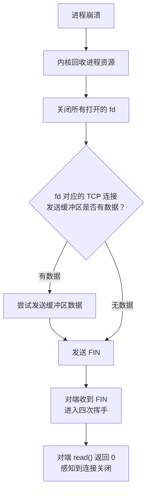
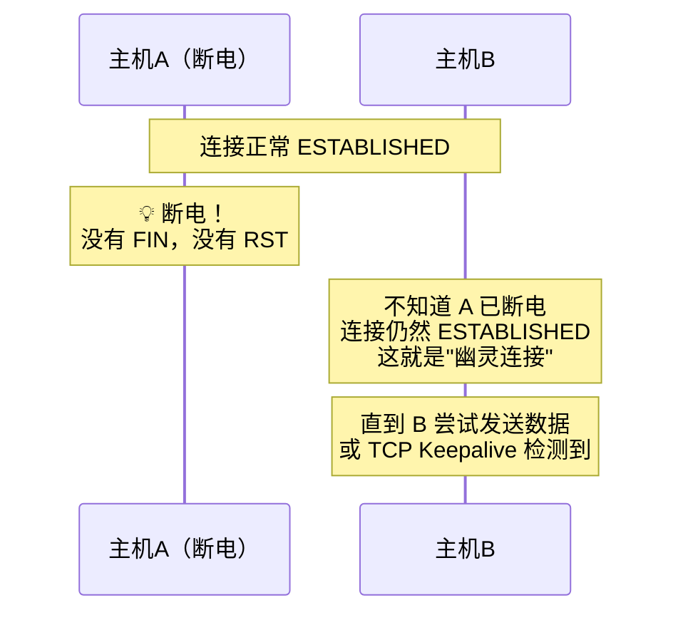
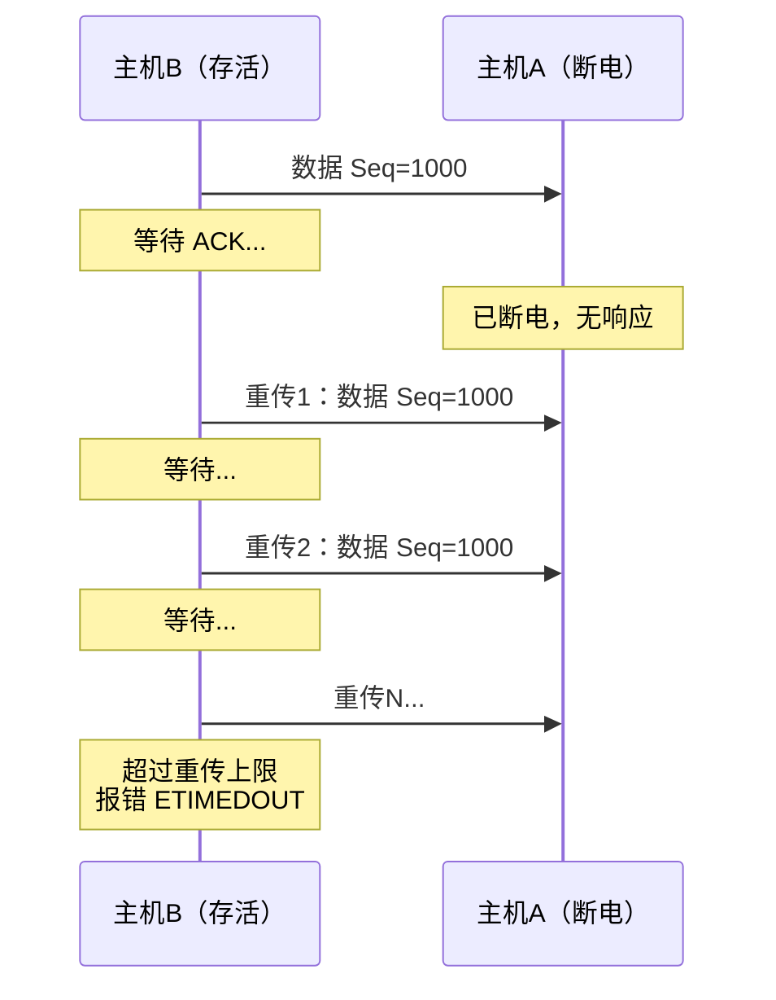

# TCP 连接一端断电和进程崩溃有什么区别

> 同样是"连接断了"，断电和进程崩溃对 TCP 的影响截然不同。进程崩溃是"软故障"，操作系统会帮忙善后；断电是"硬故障"，对端完全无法感知。理解这个区别，才能设计出可靠的连接检测机制。

## 一、两种故障的本质区别


---

## 二、进程崩溃的详细分析

### 2.1 操作系统的善后流程

当进程崩溃（如 `kill -9`、段错误、`abort()`），操作系统会执行以下清理操作：



### 2.2 用 tcpdump 观察进程崩溃

```bash
# 终端1：启动服务端
nc -l 8080

# 终端2：客户端连接
nc 127.0.0.1 8080 &

# 终端3：抓包
sudo tcpdump -i lo port 8080 -nn

# 终端2：杀掉客户端进程
kill -9 <pid>

# 抓包输出：
# 客户端 → 服务端: FIN, Seq=X    ← 操作系统自动发送
# 服务端 → 客户端: ACK, Ack=X+1
# 服务端 → 客户端: FIN, Seq=Y
# 客户端 → 服务端: ACK, Ack=Y+1
```

### 2.3 进程崩溃的特殊情况

| 情况 | 行为 | 对端感知 |
|------|------|---------|
| 发送缓冲区为空 | 发送 FIN，正常四次挥手 | `read()` 返回 0 |
| 发送缓冲区有数据 | 先尝试发送数据，再发 FIN | `read()` 先收到数据，再返回 0 |
| 设置了 SO_LINGER | 可能发送 RST 而不是 FIN | `read()` 返回 -1，errno=ECONNRESET |
| 进程被 kill -9 | 同正常崩溃，操作系统善后 | 收到 FIN |

```c
// SO_LINGER 设置导致发送 RST
struct linger ling;
ling.l_onoff = 1;
ling.l_linger = 0;  // 超时为 0，直接 RST
setsockopt(sock, SOL_SOCKET, SO_LINGER, &ling, sizeof(ling));
// close() 时不发 FIN，直接发 RST
```

::: warning SO_LINGER 的危险
设置 `SO_LINGER` 且 `l_linger=0` 时，`close()` 不走四次挥手，直接发送 RST。对端会收到 Connection reset by peer。这在某些需要快速关闭连接的场景下有用，但可能导致数据丢失。
:::

---

## 三、断电的详细分析

### 3.1 断电后的"幽灵连接"

断电时操作系统没有机会发送任何报文，对端完全无法感知：



### 3.2 对端如何发现断电

断电后，对端发现连接断开的方式取决于对端的行为：

| 对端行为 | 发现时间 | 原理 |
|---------|---------|------|
| 发送数据 | 几秒~几分钟 | 数据重传超时后报错 |
| TCP Keepalive 开启 | 配置的探测间隔 | 探测包无响应后关闭连接 |
| TCP Keepalive 关闭 | **永远不会发现** | 没有任何探测机制 |
| 应用层心跳 | 心跳超时后 | 应用层检测到超时 |

### 3.3 TCP Keepalive 检测断电

```bash
# 查看 TCP Keepalive 参数
cat /proc/sys/net/ipv4/tcp_keepalive_time
# 默认 7200（秒）= 2小时，多久开始探测

cat /proc/sys/net/ipv4/tcp_keepalive_intvl
# 默认 75（秒），探测间隔

cat /proc/sys/net/ipv4/tcp_keepalive_probes
# 默认 9 次，探测失败次数

# 总时间 = 7200 + 75 × 9 = 7875 秒 ≈ 2小时11分钟
# 默认配置下，断电后需要 2 小时以上才能发现！
```

```c
// 应用层设置更短的 Keepalive
int keepalive = 1;
int keepidle = 60;   // 60 秒后开始探测
int keepintvl = 10;  // 每 10 秒探测一次
int keepcnt = 3;     // 探测 3 次失败后关闭

setsockopt(sock, SOL_SOCKET, SO_KEEPALIVE, &keepalive, sizeof(keepalive));
setsockopt(sock, IPPROTO_TCP, TCP_KEEPIDLE, &keepidle, sizeof(keepidle));
setsockopt(sock, IPPROTO_TCP, TCP_KEEPINTVL, &keepintvl, sizeof(keepintvl));
setsockopt(sock, IPPROTO_TCP, TCP_KEEPCNT, &keepcnt, sizeof(keepcnt));

// 最快 60 + 10 × 3 = 90 秒后发现断电
```

---

## 四、数据发送场景下的超时检测

### 4.1 对端尝试发送数据

如果对端在断电后尝试发送数据，TCP 重传机制会触发超时：



### 4.2 TCP 重传超时的计算

```bash
# 查看重传相关参数
cat /proc/sys/net/ipv4/tcp_retries1
# 默认 3，超过后报告网络问题

cat /proc/sys/net/ipv4/tcp_retries2
# 默认 15，超过后关闭连接

# 实际超时时间取决于 RTO（Retransmission Timeout）
# RTO 采用指数退避：1s → 2s → 4s → 8s → ...
# tcp_retries2=15 时，总超时约 924.6 秒 ≈ 15 分钟
```

::: important 断电后发送数据的发现时间
- 如果发送数据，TCP 重传超时大约 15 分钟后报错
- 如果不发送数据，且 Keepalive 关闭，**永远不会发现**
- 实际生产中，应用层心跳（5~30 秒间隔）是最快的检测手段
:::

---

## 五、对比总结

### 5.1 完整对比

| 维度 | 进程崩溃 | 断电/拔网线 |
|------|---------|-----------|
| 操作系统善后 | 有 | 无 |
| 发送 FIN | 有 | 无 |
| 发送 RST | 可能有（SO_LINGER） | 无 |
| 对端感知方式 | 收到 FIN/RST | 数据超时 / Keepalive / 心跳 |
| 对端感知时间 | 毫秒级 | 秒级~小时级 |
| 幽灵连接 | 不会产生 | 会产生 |
| 内核资源释放 | 立即 | 需等超时 |

### 5.2 比喻理解

- **进程崩溃**：好比一个人搬家，走之前会告诉邻居"我搬走了"（发 FIN），邻居马上知道。
- **断电**：好比一个人突然失踪，什么都没说。邻居只有去敲门（发数据/探测）没人应答，才意识到人不在了。

---

## 六、最佳实践

### 6.1 应用层心跳

```c
// 推荐的应用层心跳设计
void* heartbeat_thread(void* arg) {
    int sock = *(int*)arg;
    while (1) {
        sleep(5);  // 每 5 秒发一次心跳
        if (send_heartbeat(sock) < 0) {
            // 心跳失败，关闭连接
            close(sock);
            break;
        }
        if (check_heartbeat_timeout(sock, 15)) {
            // 15 秒没收到心跳响应，认为断开
            close(sock);
            break;
        }
    }
    return NULL;
}
```

### 6.2 合理配置 Keepalive

```bash
# 生产环境推荐配置
sysctl -w net.ipv4.tcp_keepalive_time=60
sysctl -w net.ipv4.tcp_keepalive_intvl=10
sysctl -w net.ipv4.tcp_keepalive_probes=3
# 最快 60 + 10 × 3 = 90 秒检测到断电
```

### 6.3 设置合理的重传参数

```bash
# 减少重传超时时间（谨慎修改）
sysctl -w net.ipv4.tcp_retries2=8
# 超时时间从约 15 分钟降到约 100 秒
```

---

## 七、面试速查

::: tip 面试速查
- **Q：TCP 连接一端断电和进程崩溃有什么区别？**
  A：进程崩溃时操作系统会发送 FIN，对端立即感知；断电时没有 FIN/RST，对端无法立即感知，需要依赖 Keepalive 或数据超时来发现。

- **Q：进程崩溃时 TCP 会发送什么？**
  A：正常发送 FIN（走四次挥手）。如果设置了 SO_LINGER 且 l_linger=0，则发送 RST。

- **Q：断电后对端如何发现连接断开？**
  A：三种方式——①发送数据后等待 TCP 重传超时（约 15 分钟）；②TCP Keepalive 探测（默认 2 小时+）；③应用层心跳超时（最快，推荐）。

- **Q：什么是幽灵连接？**
  A：断电后对端不知道连接已断开，连接仍处于 ESTABLISHED 状态，占用内核资源。如果不发送数据且未开启 Keepalive，幽灵连接永远不会被清除。

- **Q：如何快速检测对端断电？**
  A：应用层心跳（推荐 5~30 秒间隔）+ 配置较短的 TCP Keepalive 参数。
:::

---

::: info 原著参考
- 小林coding《图解网络》—— [TCP 连接，一端断电和进程崩溃有什么区别？](https://xiaolincoding.com/network/3_tcp/down_and_crash.html)
:::
