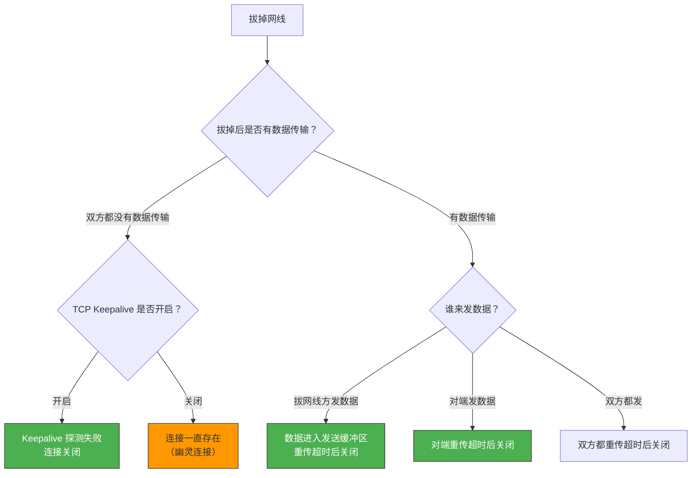
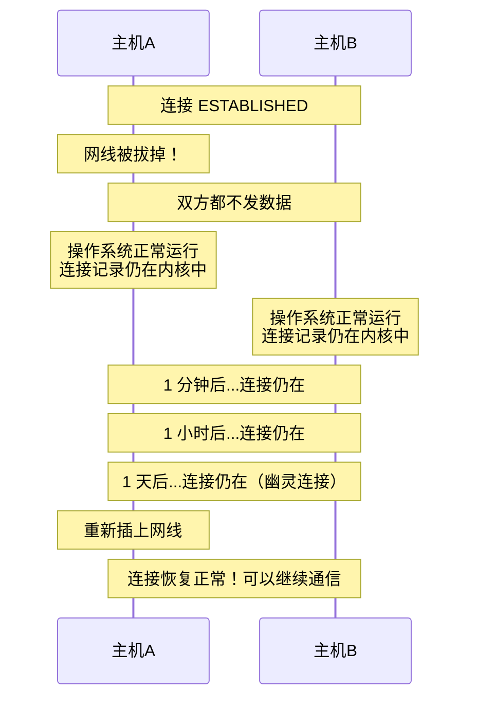
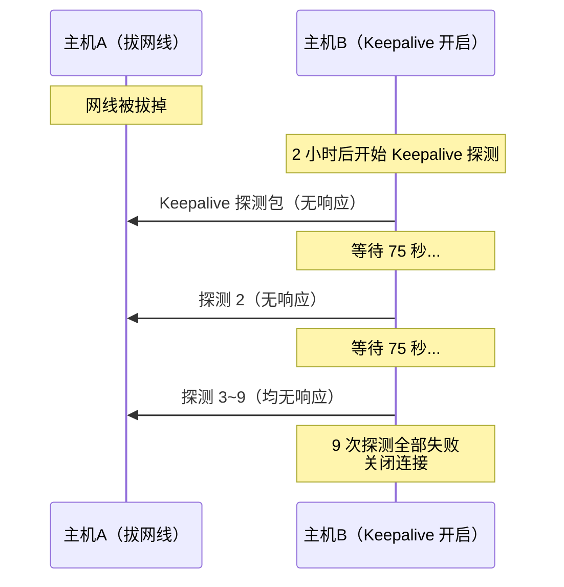
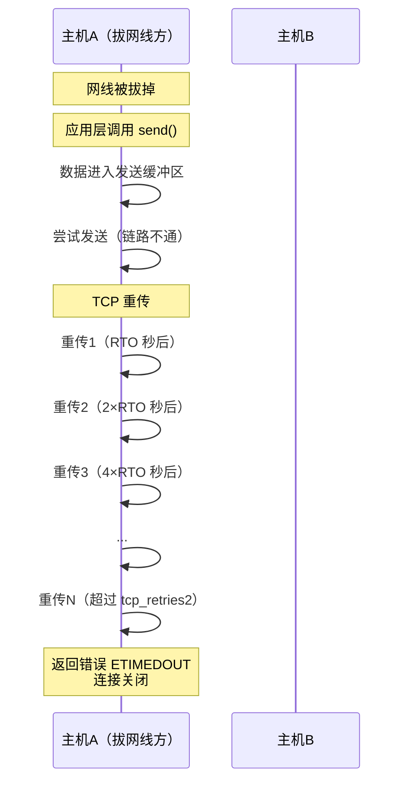
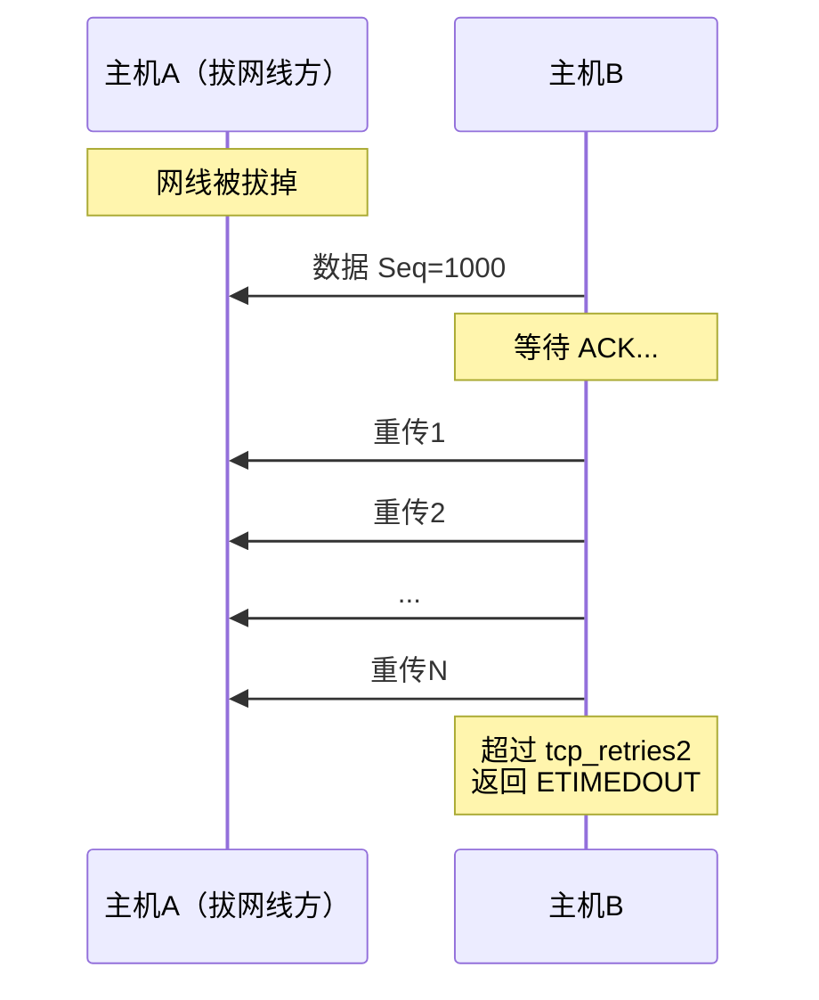
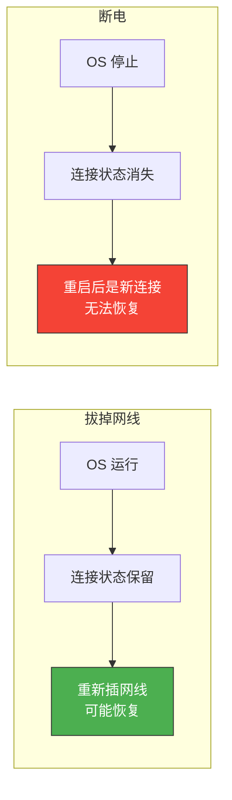

# 拔掉网线后原本的 TCP 连接还存在吗

> 拔掉网线和断电不同——断电是机器彻底没了，而拔掉网线只是链路断开，操作系统仍在运行。那 TCP 连接还在吗？答案取决于拔掉网线后双方是否有数据交互，以及是否配置了 TCP Keepalive。

## 一、核心结论



---

## 二、场景一：拔掉网线后双方都不发数据

### 2.1 没有 Keepalive 的情况

如果 TCP Keepalive 关闭（默认），且双方都不发数据，连接会**一直存在**：



::: important 网线重新插上后连接可以恢复
TCP 连接是内核维护的状态，只要操作系统还在运行，连接状态就不会消失。如果网线重新插上，且双方都没有超时关闭连接，通信可以继续。
:::

### 2.2 开启 Keepalive 的情况

```bash
# 默认 Keepalive 参数
tcp_keepalive_time  = 7200  # 2 小时后开始探测
tcp_keepalive_intvl = 75    # 探测间隔 75 秒
tcp_keepalive_probes = 9    # 探测 9 次失败后关闭
```



---

## 三、场景二：拔掉网线后有数据传输

### 3.1 拔网线方尝试发送数据

如果拔掉网线的一方尝试发送数据，数据会进入内核发送缓冲区，然后触发 TCP 重传：



### 3.2 对端尝试发送数据

对端不知道网线被拔掉，发送数据后会触发重传：



### 3.3 拔掉网线方收到路由通知

如果操作系统感知到链路断开（如网卡 down），可能提前通知应用层：

```bash
# 查看网卡状态
ip link show eth0
# eth0: <BROADCAST,MULTICAST> mtu 1500 qdisc noop state DOWN

# 网卡 down 后，内核可能：
# 1. 立即关闭该网卡上的所有 TCP 连接
# 2. 发送 ENETUNREACH 错误给应用层

# 但这只在操作系统感知到链路断开时才有效
# 如果是中间路由器故障，操作系统不会感知到
```

::: warning 注意
并不是所有"拔网线"都能被操作系统感知。如果是交换机/路由器端的问题，本地网卡仍显示 UP，操作系统不会主动关闭连接。
:::

---

## 四、与断电的关键区别

| 维度 | 拔掉网线 | 断电 |
|------|---------|------|
| 操作系统状态 | 仍在运行 | 停止 |
| TCP 连接状态 | 内核中保留 | 随系统消失 |
| 发 FIN/RST | 不会 | 不会 |
| 重新恢复网络 | 连接可能恢复 | 不可能（系统已重启） |
| 应用层数据 | 仍在缓冲区 | 丢失 |
| 内核发送缓冲区 | 数据保留 | 丢失 |



---

## 五、不同网卡状态下的行为

### 5.1 本地网卡检测到链路断开

```bash
# 网卡状态变为 DOWN
ip link set eth0 down

# 内核行为：
# 1. 路由表中删除相关路由
# 2. 正在发送的数据返回 ENETUNREACH
# 3. 但已建立的 TCP 连接不一定立即关闭
#    需要等应用层操作或 Keepalive 超时
```

### 5.2 本地网卡仍 UP（中间链路故障）

```bash
# 网卡显示 UP，但对端不可达
ip link show eth0
# eth0: <BROADCAST,MULTICAST,UP> state UP

# 这种情况下，操作系统无法感知链路故障
# TCP 连接一直存在，直到：
# 1. Keepalive 超时
# 2. 应用层发送数据触发重传超时
# 3. 应用层心跳超时
```

---

## 六、生产环境的最佳实践

### 6.1 必须开启 Keepalive 或应用层心跳

```c
// 推荐：应用层心跳 + Keepalive 双保险
// 应用层心跳（5~30 秒）检测快速故障
// Keepalive（60~90 秒）兜底检测

int sock = socket(AF_INET, SOCK_STREAM, 0);

// 设置 Keepalive
int keepalive = 1;
setsockopt(sock, SOL_SOCKET, SO_KEEPALIVE, &keepalive, sizeof(keepalive));

// 缩短 Keepalive 参数
int keepidle = 30;    // 30 秒后开始探测
int keepintvl = 5;    // 每 5 秒探测一次
int keepcnt = 3;      // 探测 3 次
setsockopt(sock, IPPROTO_TCP, TCP_KEEPIDLE, &keepidle, sizeof(keepidle));
setsockopt(sock, IPPROTO_TCP, TCP_KEEPINTVL, &keepintvl, sizeof(keepintvl));
setsockopt(sock, IPPROTO_TCP, TCP_KEEPCNT, &keepcnt, sizeof(keepcnt));

// 最快 30 + 5 × 3 = 45 秒检测到网线断开
```

### 6.2 设置合理的重传参数

```bash
# 缩短重传超时（谨慎）
sysctl -w net.ipv4.tcp_retries2=5
# 超时时间约 100 秒

# 开启 TCP Fast Open 减少连接建立时间
sysctl -w net.ipv4.tcp_fastopen=3
```

### 6.3 应用层设计连接恢复机制

```c
// 断线重连逻辑
int reconnect(int *sock, struct sockaddr_in *addr) {
    close(*sock);

    int retry = 0;
    while (retry < MAX_RETRY) {
        *sock = socket(AF_INET, SOCK_STREAM, 0);
        if (connect(*sock, (struct sockaddr*)addr, sizeof(*addr)) == 0) {
            // 重新设置 Keepalive
            setup_keepalive(*sock);
            return 0;  // 重连成功
        }
        close(*sock);
        retry++;
        sleep(retry);  // 指数退避
    }
    return -1;  // 重连失败
}
```

---

## 七、面试速查

::: tip 面试速查
- **Q：拔掉网线后 TCP 连接还在吗？**
  A：还在。TCP 连接是内核维护的状态，拔掉网线只是链路断开，操作系统仍在运行，连接状态不会消失。

- **Q：拔掉网线后重新插上，连接能恢复吗？**
  A：如果双方都没有超时关闭连接（没有 Keepalive 超时、没有重传超时），重新插上网线后连接可以恢复正常通信。

- **Q：拔掉网线和断电有什么区别？**
  A：拔掉网线时操作系统仍在运行，连接状态保留在内核中，重新插网线可能恢复；断电时操作系统停止，连接状态消失，无法恢复。

- **Q：如何快速检测网线被拔掉？**
  A：①应用层心跳（最快，5~30 秒）；②缩短 Keepalive 参数（30~90 秒）；③缩短 TCP 重传超时。默认配置下可能需要 2 小时以上才能检测到。

- **Q：网线被拔掉后，发送数据会怎样？**
  A：数据进入发送缓冲区，TCP 触发重传。如果本地网卡检测到链路断开，可能立即返回 ENETUNREACH；否则等待重传超时（约 15 分钟）后返回 ETIMEDOUT。
:::

---

::: info 原著参考
- 小林coding《图解网络》—— [拔掉网线后，原本的 TCP 连接还存在吗？](https://xiaolincoding.com/network/3_tcp/unplug_cable.html)
:::
