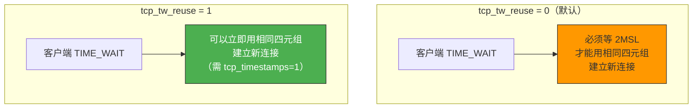
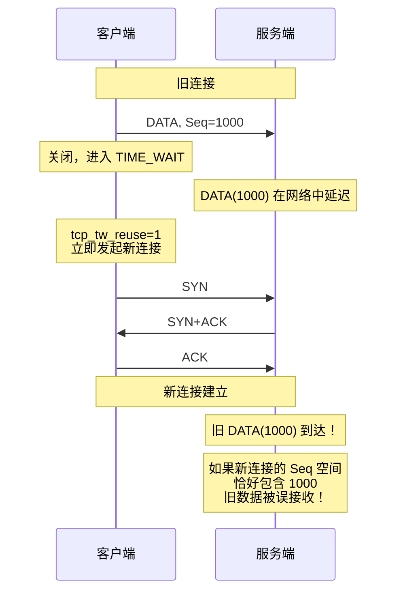
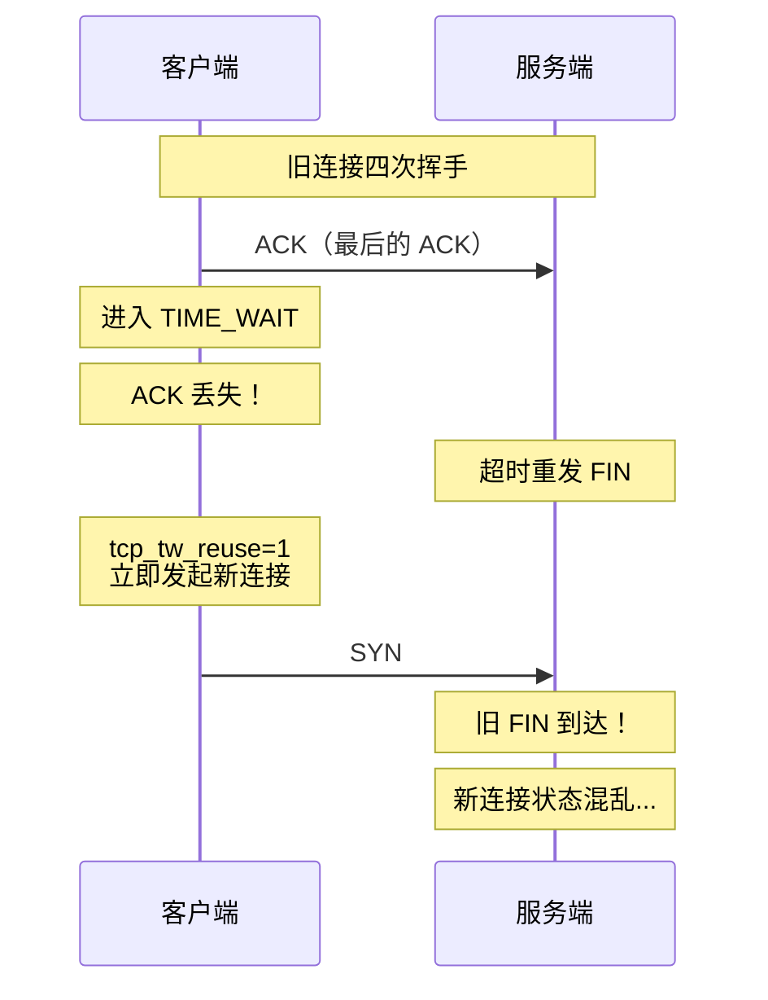
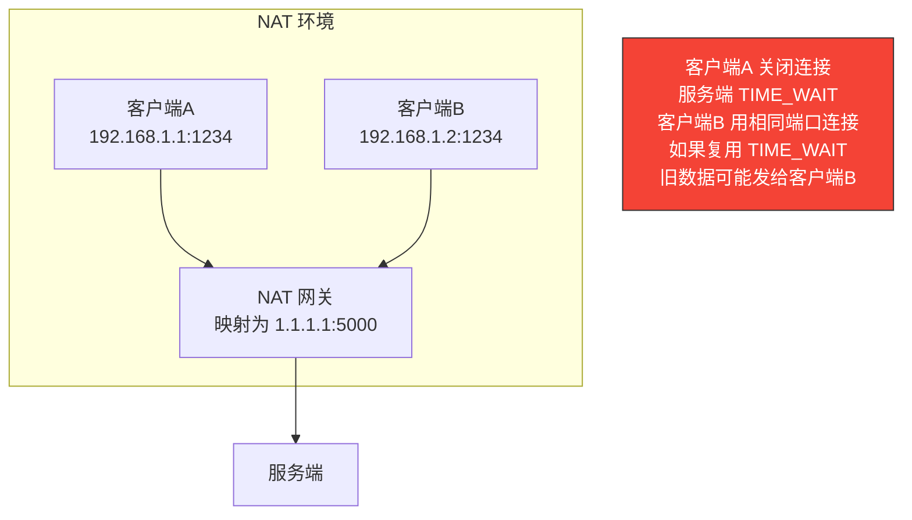
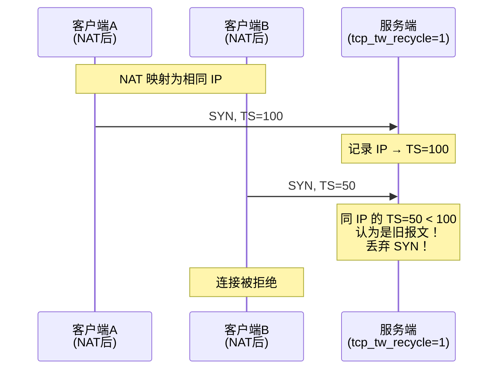

# tcp_tw_reuse 为什么默认是关闭的

> `tcp_tw_reuse` 可以让客户端在 TIME_WAIT 期间复用连接，减少 TIME_WAIT 连接堆积。但这样一个"好事"，Linux 默认却是关闭的——因为复用 TIME_WAIT 连接有潜在的安全风险和数据混乱风险。

## 一、tcp_tw_reuse 是什么

### 1.1 问题背景

高并发短连接场景下，客户端频繁建立和关闭 TCP 连接，会产生大量 TIME_WAIT 状态：

```bash
# 查看当前 TIME_WAIT 连接数
ss -ant | grep TIME-WAIT | wc -l
# 可能看到几千甚至几万个

# TIME_WAIT 持续 2MSL = 60 秒
cat /proc/sys/net/ipv4/tcp_fin_timeout
# 默认 60 秒
```

大量 TIME_WAIT 占用端口和内核资源，可能导致新连接无法建立。

### 1.2 tcp_tw_reuse 的作用



```bash
# 开启 tcp_tw_reuse
sysctl -w net.ipv4.tcp_tw_reuse=1

# 前提：必须开启 tcp_timestamps
sysctl -w net.ipv4.tcp_timestamps=1
```

---

## 二、为什么默认关闭

### 2.1 原因一：可能导致旧数据被新连接接收

TIME_WAIT 存在的核心目的之一是**等待旧报文消亡**。如果复用连接，旧报文可能被新连接误收：



::: warning 这就是为什么需要 tcp_timestamps
`tcp_tw_reuse` 强制要求 `tcp_timestamps=1`，因为时间戳可以区分新旧报文。即使序列号重叠，时间戳过期的旧报文会被 PAWS 机制丢弃。
:::

### 2.2 原因二：最后的 ACK 可能丢失

TIME_WAIT 的另一个目的是**重发最后的 ACK**。如果复用连接，最后的 ACK 丢失时被动方会重发 FIN，但此时新连接已经建立：



### 2.3 原因三：NAT 环境下的风险

在 NAT 环境中，多个客户端可能映射到相同的源 IP 和源端口。如果服务端复用 TIME_WAIT，可能把旧连接的数据发给新客户端：



::: important NAT 场景最危险
在 NAT 环境中，`tcp_tw_reuse` 的风险被放大。NAT 后的多个客户端可能映射到相同四元组，服务端无法区分是旧连接还是新客户端。这就是为什么 `tcp_tw_reuse` 仅对客户端（发起方）生效，不对服务端生效。
:::

### 2.4 原因四：违反协议规范

RFC 793 明确规定 TIME_WAIT 必须持续 2MSL。`tcp_tw_reuse` 缩短了这个时间，是一种对协议的"务实妥协"，但不是标准行为，可能影响与其他 TCP 实现的互操作性。

---

## 三、tcp_tw_reuse vs tcp_tw_recycle

### 3.1 两者对比

| 参数 | tcp_tw_reuse | tcp_tw_recycle |
|------|-------------|----------------|
| 作用 | 允许复用 TIME_WAIT 连接 | 加速回收 TIME_WAIT |
| 作用方 | 仅客户端（发起方） | 双方 |
| 前提 | tcp_timestamps=1 | tcp_timestamps=1 |
| 安全性 | 相对安全 | **有严重问题** |
| 状态 | 可用 | **Linux 4.12 已删除** |

### 3.2 tcp_tw_recycle 为什么被删除

`tcp_tw_recycle` 使用时间戳判断连接是否可以回收，但在 NAT 环境中会导致严重问题：



::: warning tcp_tw_recycle 的致命缺陷
NAT 后的多个客户端时间戳可能不同步，服务端按 IP 缓存最近时间戳，会丢弃时间戳"回退"的 SYN。这在 NAT 环境下导致大量连接失败。因此 Linux 4.12 彻底删除了这个参数。
:::

---

## 四、什么时候可以开启 tcp_tw_reuse

### 4.1 适合开启的场景

| 场景 | 是否适合 | 原因 |
|------|---------|------|
| 客户端高并发短连接 | 适合 | 减少端口耗尽 |
| 服务端 | 不适合 | 仅对客户端生效 |
| NAT 后的客户端 | 谨慎 | 可能影响同 NAT 的其他客户端 |
| 长连接 | 不需要 | 很少产生 TIME_WAIT |

### 4.2 更好的替代方案

```bash
# 方案1：增大端口范围（最推荐）
sysctl -w net.ipv4.ip_local_port_range="1024 65535"

# 方案2：开启 tcp_tw_reuse（客户端场景）
sysctl -w net.ipv4.tcp_tw_reuse=1
sysctl -w net.ipv4.tcp_timestamps=1

# 方案3：缩短 TIME_WAIT 时间（但不低于 2MSL）
sysctl -w net.ipv4.tcp_fin_timeout=30

# 方案4：使用长连接替代短连接（根本方案）
# 连接池、HTTP Keep-Alive 等
```

### 4.3 完整配置建议

```bash
# /etc/sysctl.conf 高并发客户端推荐配置
net.ipv4.tcp_tw_reuse = 1
net.ipv4.tcp_timestamps = 1
net.ipv4.ip_local_port_range = 1024 65535
net.ipv4.tcp_fin_timeout = 30
net.ipv4.tcp_max_tw_buckets = 5000
```

---

## 五、验证 tcp_tw_reuse 的效果

### 5.1 压测对比

```bash
# 关闭 tcp_tw_reuse
sysctl -w net.ipv4.tcp_tw_reuse=0

# 使用 wrk 压测
wrk -t4 -c1000 -d30s http://127.0.0.1:8080/

# 观察 TIME_WAIT 数量
ss -ant | grep TIME-WAIT | wc -l
# 可能看到大量 TIME_WAIT

# 开启 tcp_tw_reuse
sysctl -w net.ipv4.tcp_tw_reuse=1

# 再次压测
wrk -t4 -c1000 -d30s http://127.0.0.1:8080/

# TIME_WAIT 数量显著减少
ss -ant | grep TIME-WAIT | wc -l
```

### 5.2 使用 tcpdump 观察

```bash
# 开启 tcp_tw_reuse 后，新连接可以复用 TIME_WAIT 的四元组
sudo tcpdump -i eth0 'tcp port 8080' -nn -c 20

# 可以看到相同四元组的连接在 TIME_WAIT 期间被复用
```

---

## 六、面试速查

::: tip 面试速查
- **Q：tcp_tw_reuse 为什么默认关闭？**
  A：四个原因——①旧报文可能被新连接误收；②最后的 ACK 丢失时新连接会混乱；③NAT 环境下风险更大；④违反 RFC 协议规范。

- **Q：tcp_tw_reuse 需要什么前提？**
  A：必须开启 tcp_timestamps。时间戳用于 PAWS 机制，区分新旧报文，防止旧数据被新连接误收。

- **Q：tcp_tw_reuse 和 tcp_tw_recycle 的区别？**
  A：tcp_tw_reuse 仅对客户端生效，允许复用 TIME_WAIT 连接；tcp_tw_recycle 对双方生效，加速回收 TIME_WAIT，但因 NAT 环境下的严重问题已在 Linux 4.12 删除。

- **Q：如何解决 TIME_WAIT 过多的问题？**
  A：①增大端口范围（ip_local_port_range）；②开启 tcp_tw_reuse（仅客户端）；③使用长连接/连接池（根本方案）；④缩短 tcp_fin_timeout。

- **Q：tcp_tw_recycle 为什么被删除？**
  A：它按 IP 缓存时间戳，NAT 后的多个客户端时间戳不同步，会导致时间戳"回退"的 SYN 被丢弃，大量连接失败。
:::

---

::: info 原著参考
- 小林coding《图解网络》—— [tcp_tw_reuse 为什么默认是关闭的？](https://xiaolincoding.com/network/3_tcp/tcp_tw_reuse.html)
:::
