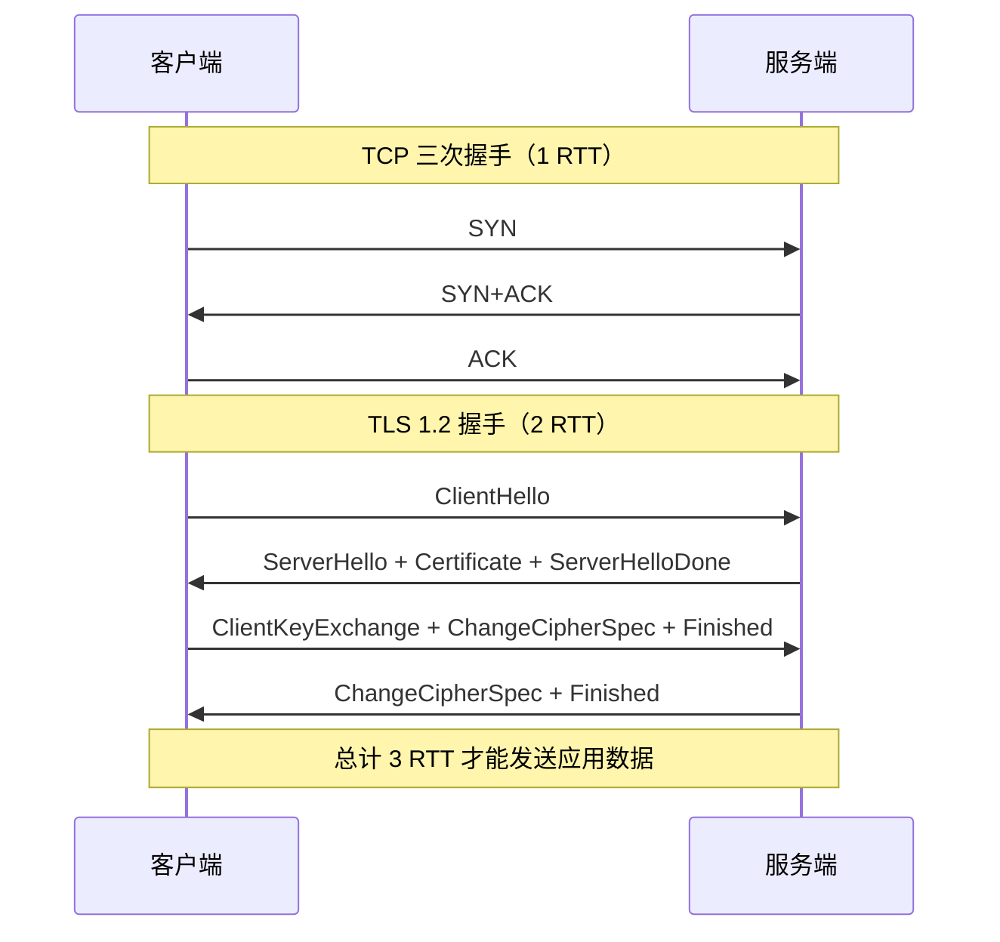
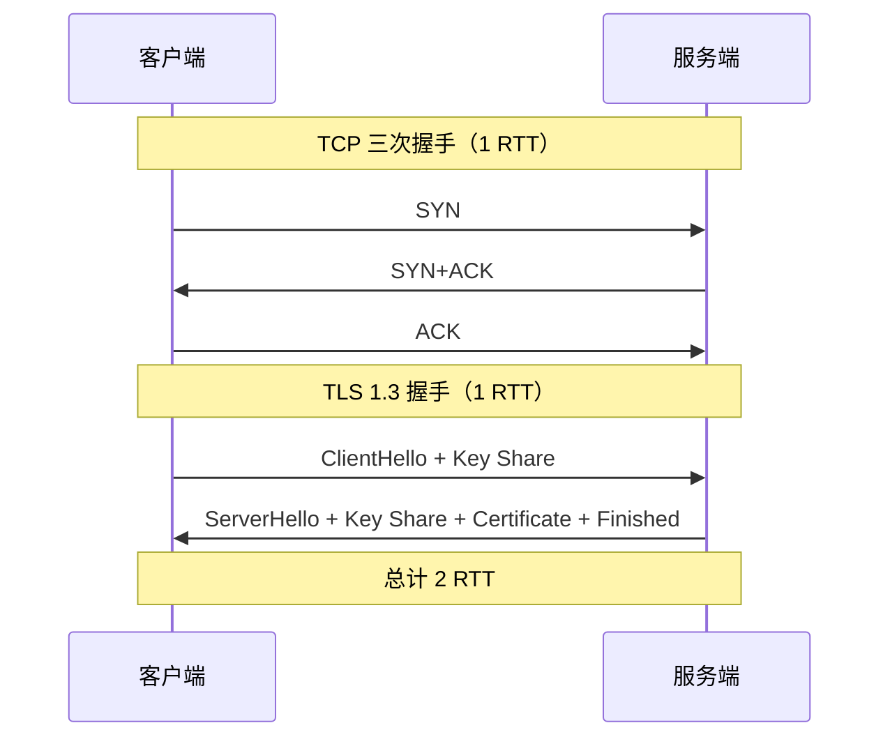
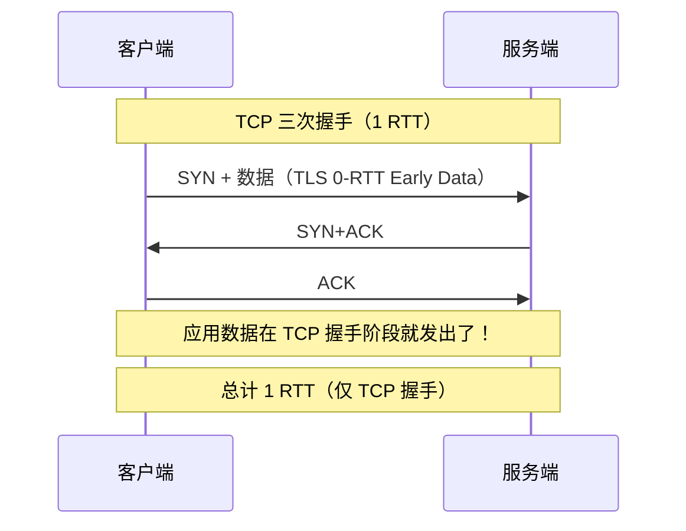
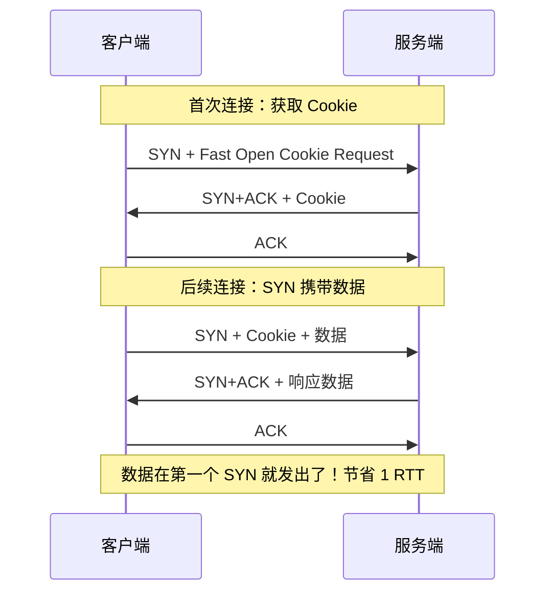
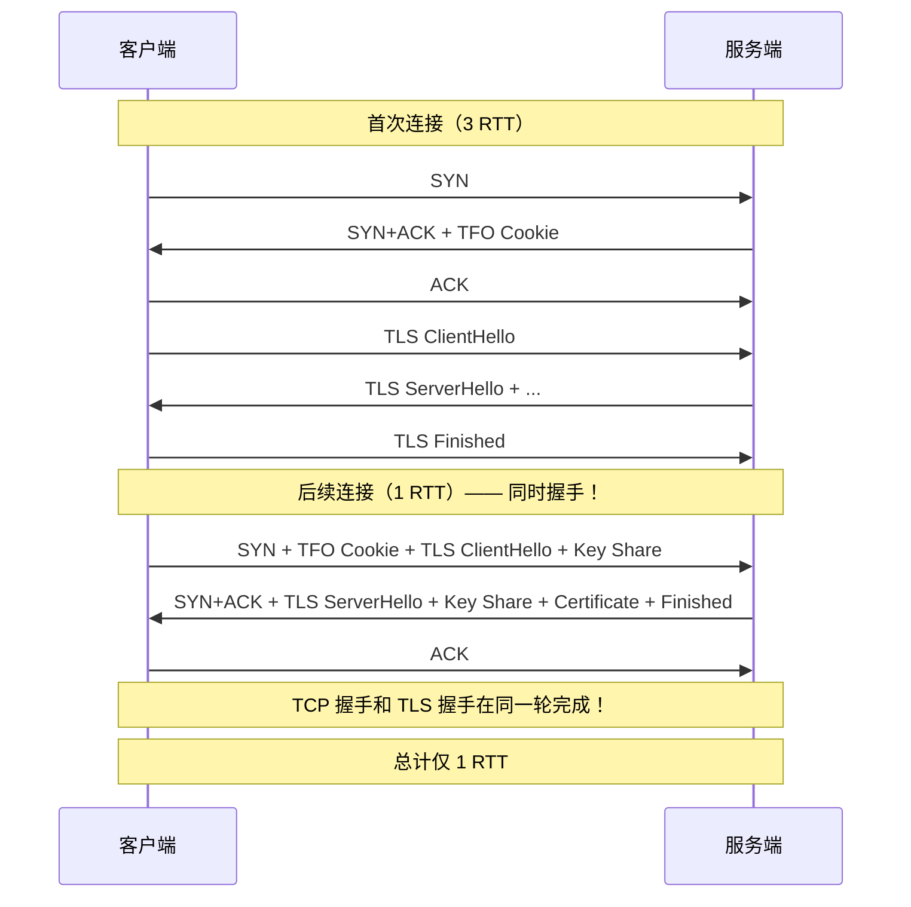
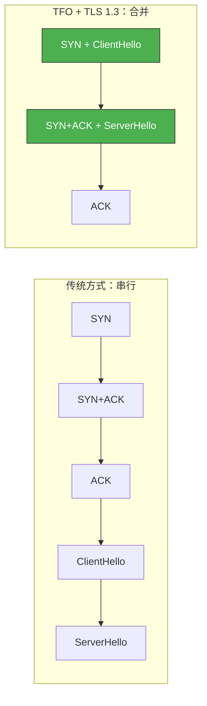

# HTTPS 中 TLS 和 TCP 能同时握手吗

> 传统的 HTTPS 建立连接需要先完成 TCP 三次握手，再进行 TLS 握手，总共需要 3 个 RTT。能不能让 TCP 和 TLS 同时握手，减少延迟？答案是：可以，但需要特定条件——TCP Fast Open 和 TLS 1.3。

## 一、传统的 HTTPS 连接建立

### 1.1 TCP + TLS 1.2 的完整流程



**总计 3 RTT**：TCP 1 RTT + TLS 1.2 2 RTT = 3 RTT

### 1.2 延迟计算

假设 RTT = 50ms：

| 阶段 | RTT 数 | 耗时 |
|------|--------|------|
| TCP 三次握手 | 1 | 50ms |
| TLS 1.2 握手 | 2 | 100ms |
| **总计** | **3** | **150ms** |

对于移动网络（RTT ≈ 100ms），延迟达到 300ms，用户体感明显。

---

## 二、TLS 1.3 的优化

### 2.1 TLS 1.3 减少到 1-RTT

TLS 1.3 将握手简化为 1-RTT：



TLS 1.3 的关键改进：

- 客户端在 ClientHello 中直接发送密钥共享（Key Share）
- 服务端在 ServerHello 中完成密钥交换
- 握手从 2-RTT 减少到 1-RTT

### 2.2 TLS 1.3 的 0-RTT（恢复会话）

如果之前建立过 TLS 会话，TLS 1.3 支持 0-RTT 恢复：



::: warning TLS 1.3 0-RTT 的安全风险
0-RTT 数据容易被**重放攻击**。攻击者可以截获 0-RTT 数据并重复发送。因此 0-RTT 只适合幂等请求（如 GET），不适合有副作用的操作（如 POST 支付请求）。
:::

---

## 三、TCP Fast Open（TFO）

### 3.1 TFO 的原理

TCP Fast Open 允许在 SYN 包中携带数据，减少一个 RTT：



### 3.2 TFO 的内核参数

```bash
# 查看 TFO 设置
cat /proc/sys/net/ipv4/tcp_fastopen
# 0 = 关闭
# 1 = 客户端启用
# 2 = 服务端启用
# 3 = 双方启用（推荐）

# 开启 TFO
sysctl -w net.ipv4.tcp_fastopen=3
```

```c
// 客户端使用 TFO
int sock = socket(AF_INET, SOCK_STREAM, 0);

// 发送数据时使用 MSG_FASTOPEN
sendto(sock, data, len, MSG_FASTOPEN, addr, addrlen);
// 首次连接：SYN 不带数据，获取 Cookie
// 后续连接：SYN 携带数据
```

---

## 四、TLS 和 TCP 同时握手

### 4.1 TFO + TLS 1.3 = 同时握手

当 TCP Fast Open 和 TLS 1.3 组合使用时，TLS ClientHello 可以在 SYN 包中携带：



::: tip 这就是"同时握手"
TCP 的 SYN 包携带了 TLS 的 ClientHello，服务端的 SYN+ACK 携带了 TLS 的 ServerHello 等响应。TCP 握手和 TLS 握手在**同一个 RTT** 内完成。
:::

### 4.2 各方案延迟对比

| 方案 | 首次连接 | 恢复连接 |
|------|---------|---------|
| TCP + TLS 1.2 | 3 RTT | 2 RTT（会话恢复） |
| TCP + TLS 1.3 | 2 RTT | 1 RTT |
| TFO + TLS 1.3 | 2 RTT | **1 RTT** |
| TFO + TLS 1.3 0-RTT | 2 RTT | **1 RTT**（数据更早） |

### 4.3 为什么不是真正的同时

严格来说，TLS 和 TCP 并不是"同时"握手，而是**TLS 的数据被塞进了 TCP 的握手报文中**：



---

## 五、同时握手的条件

### 5.1 必须满足的条件

| 条件 | 说明 |
|------|------|
| TCP Fast Open | 客户端和服务端都开启 |
| TLS 1.3 | 服务端支持 TLS 1.3 |
| 非首次连接 | 客户端已有 TFO Cookie |
| 内核支持 | Linux 3.7+（TFO），应用层适配 |
| 应用层支持 | 使用 MSG_FASTOPEN 发送数据 |

### 5.2 限制和注意事项

```bash
# TFO 不是万能的
# 1. 首次连接无法使用（需要先获取 Cookie）
# 2. SYN 携带的数据有大小限制（MSS 以内）
# 3. 部分中间设备可能丢弃带数据的 SYN
# 4. Cookie 过期后需要重新获取
```

::: warning 中间设备兼容性
部分老旧的防火墙、NAT 设备、负载均衡器可能丢弃携带数据的 SYN 包，导致 TFO 失败。生产环境需要充分测试。
:::

---

## 六、实战配置

### 6.1 Nginx 配置 TLS 1.3 + TFO

```nginx
server {
    listen 443 ssl http2 fastopen=256;

    # TLS 1.3
    ssl_protocols TLSv1.2 TLSv1.3;
    ssl_prefer_server_ciphers on;

    # TLS 1.3 0-RTT
    ssl_early_data on;

    # 0-RTT 防重放
    proxy_set_header Early-Data $ssl_early_data;
}
```

### 6.2 内核参数配置

```bash
# /etc/sysctl.conf
net.ipv4.tcp_fastopen = 3          # 开启 TFO
net.ipv4.tcp_timestamps = 1        # TFO 依赖时间戳
```

### 6.3 验证

```bash
# 使用 curl 测试 TLS 1.3
curl -vvv --tls13-ciphers TLS_AES_128_GCM_SHA256 https://example.com

# 查看 TFO 统计
cat /proc/sys/net/ipv4/tcp_fastopen
cat /proc/net/netstat | grep TcpExtFO

# 使用 tcpdump 验证 SYN 携带数据
sudo tcpdump -i eth0 'tcp[tcpflags] & tcp-syn != 0' -nn -X -c 5
# 如果 SYN 包长度大于 MSS 头部，说明携带了数据
```

---

## 七、面试速查

::: tip 面试速查
- **Q：HTTPS 中 TLS 和 TCP 能同时握手吗？**
  A：可以，但需要 TCP Fast Open + TLS 1.3，且不是首次连接。TLS ClientHello 塞进 SYN 包中，SYN+ACK 携带 TLS ServerHello，在同一 RTT 内完成 TCP 和 TLS 握手。

- **Q：传统 HTTPS 建立连接需要几个 RTT？**
  A：TCP 三次握手 1 RTT + TLS 1.2 握手 2 RTT = 3 RTT。TLS 1.3 减到 2 RTT。

- **Q：TLS 1.3 相比 1.2 有什么优化？**
  A：握手从 2-RTT 减到 1-RTT，支持 0-RTT 恢复。简化了密码套件，移除了不安全的算法。

- **Q：什么是 TCP Fast Open？**
  A：TFO 允许 SYN 包携带数据，跳过三次握手的等待。首次连接获取 Cookie，后续连接 SYN 携带 Cookie 和数据。

- **Q：TLS 1.3 的 0-RTT 有什么风险？**
  A：0-RTT 数据容易被重放攻击，只适合幂等请求。有副作用的操作（如支付）不应使用 0-RTT。
:::

---

::: info 原著参考
- 小林coding《图解网络》—— [HTTPS 中 TLS 和 TCP 能同时握手吗？](https://xiaolincoding.com/network/3_tcp/tls_tcp.html)
:::
