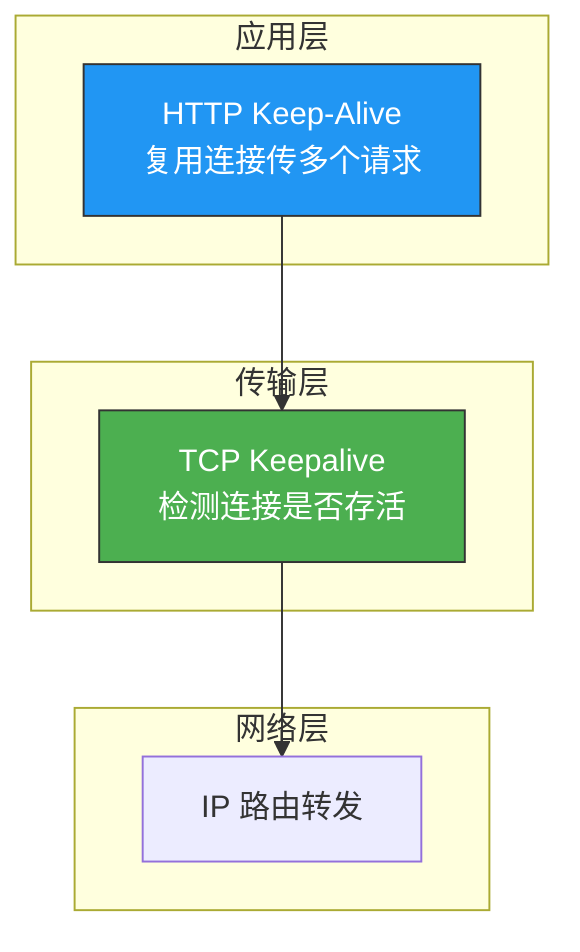
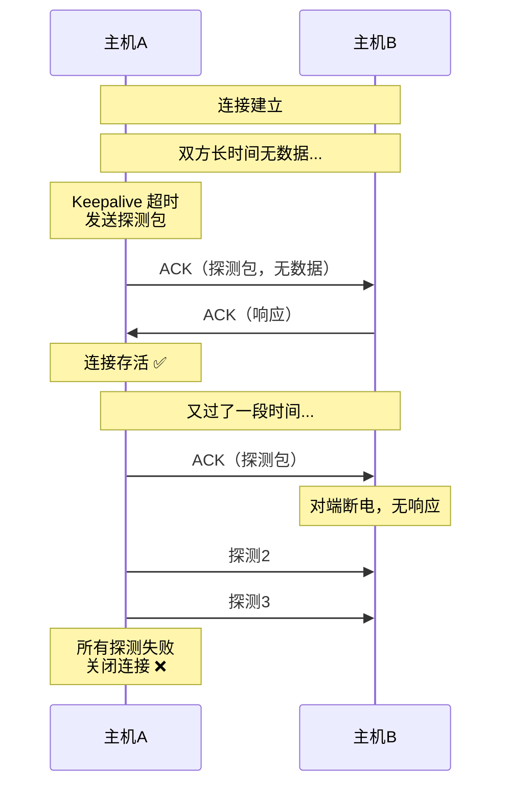
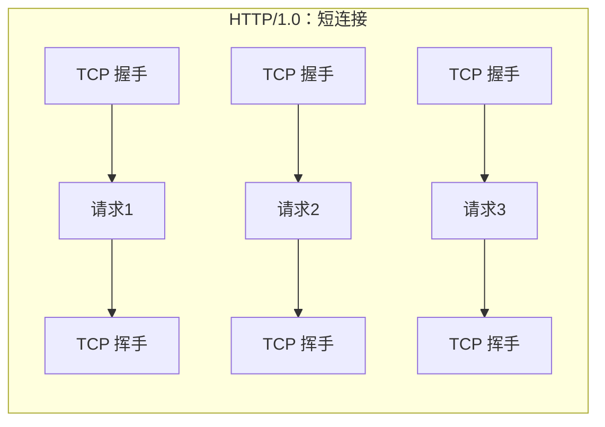
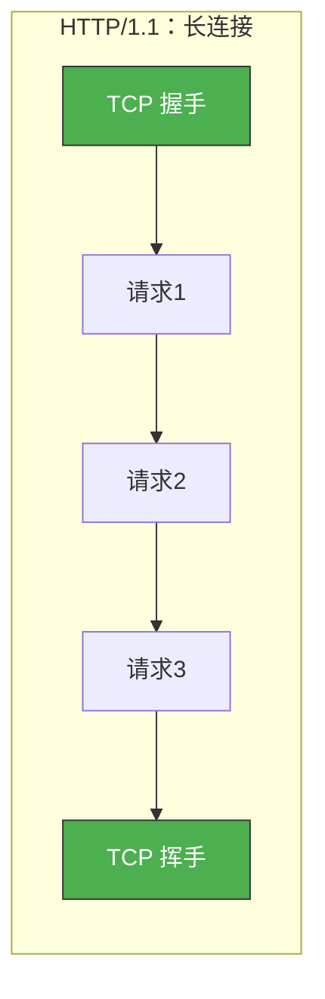
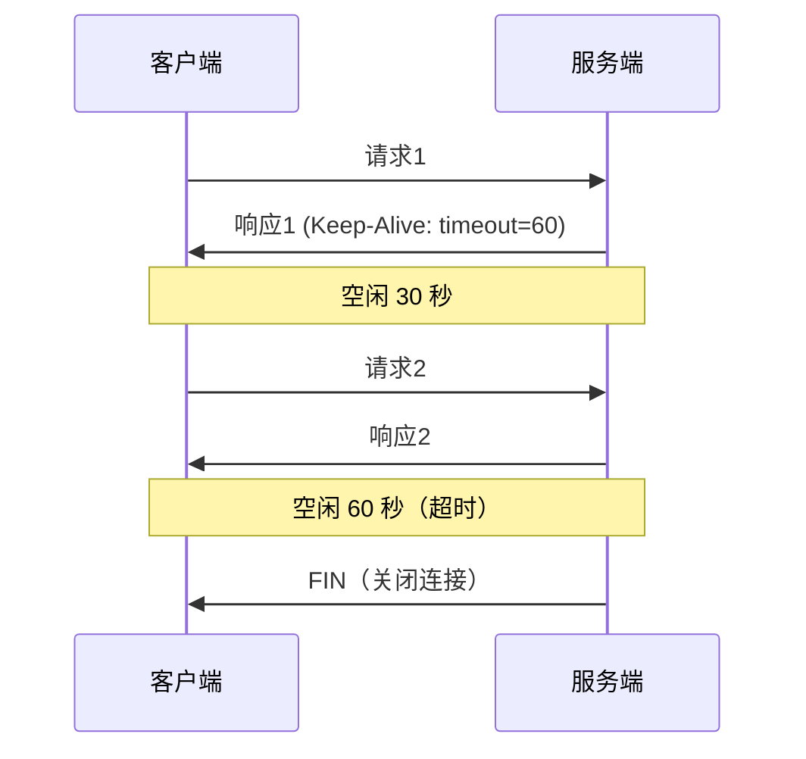
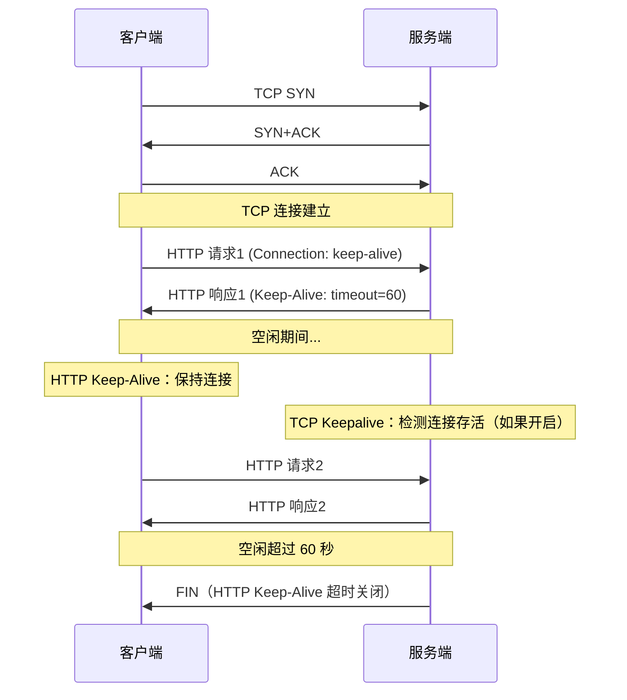
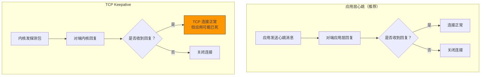

# TCP Keepalive 和 HTTP Keep-Alive 是一个东西吗

> 名字这么像，它们是一回事吗？不是。TCP Keepalive 是传输层的连接检测机制，HTTP Keep-Alive 是应用层的连接复用机制。两者虽然都涉及"连接保持"，但层次不同、目的不同、行为也不同。

## 一、一句话区分

| 维度 | TCP Keepalive | HTTP Keep-Alive |
|------|-------------|-----------------|
| 层次 | 传输层（内核） | 应用层（用户态） |
| 目的 | 检测连接是否存活 | 复用 TCP 连接传输多个请求 |
| 机制 | 发送探测包，无响应则关闭 | 不发 FIN，连接保持复用 |
| 默认状态 | 关闭 | HTTP/1.1 默认开启 |
| 涉及数据 | 不传应用数据 | 传完整的 HTTP 请求/响应 |



---

## 二、TCP Keepalive 详解

### 2.1 为什么需要 TCP Keepalive

TCP 连接建立后，如果双方都不发数据，连接会一直存在——即使中间链路已经断开。Keepalive 用来**检测这种"幽灵连接"**。



### 2.2 TCP Keepalive 参数

```bash
# 查看 Keepalive 参数
cat /proc/sys/net/ipv4/tcp_keepalive_time
# 7200 秒 = 2小时，多久开始探测

cat /proc/sys/net/ipv4/tcp_keepalive_intvl
# 75 秒，探测间隔

cat /proc/sys/net/ipv4/tcp_keepalive_probes
# 9 次，探测失败次数

# 默认检测时间：7200 + 75 × 9 = 7875 秒 ≈ 2小时11分钟
```

### 2.3 应用层开启 Keepalive

```c
// TCP Keepalive 默认关闭，需要显式开启
int sock = socket(AF_INET, SOCK_STREAM, 0);

int keepalive = 1;
setsockopt(sock, SOL_SOCKET, SO_KEEPALIVE, &keepalive, sizeof(keepalive));

// 自定义参数（需 root 或 CAP_NET_ADMIN）
int keepidle = 60;    // 60 秒后开始探测
int keepintvl = 10;   // 每 10 秒探测一次
int keepcnt = 3;      // 探测 3 次失败后关闭

setsockopt(sock, IPPROTO_TCP, TCP_KEEPIDLE, &keepidle, sizeof(keepidle));
setsockopt(sock, IPPROTO_TCP, TCP_KEEPINTVL, &keepintvl, sizeof(keepintvl));
setsockopt(sock, IPPROTO_TCP, TCP_KEEPCNT, &keepcnt, sizeof(keepcnt));

// 最快 60 + 10 × 3 = 90 秒检测到对端断开
```

::: important TCP Keepalive 的特点
- 由内核实现，应用层无需编写代码
- 发送的是不带数据的 ACK 包（探测包）
- 默认关闭，需要 `SO_KEEPALIVE` 开启
- 参数是全局的，也可 per-socket 设置
:::

---

## 三、HTTP Keep-Alive 详解

### 3.1 为什么需要 HTTP Keep-Alive

HTTP/1.0 中，每个请求/响应后 TCP 连接就关闭。多次请求需要反复建立 TCP 连接，开销巨大：



HTTP/1.1 引入 Keep-Alive，一个 TCP 连接可以传多个请求：



### 3.2 HTTP Keep-Alive 的实现

```
# HTTP/1.0 需要显式声明
Connection: Keep-Alive

# HTTP/1.1 默认 Keep-Alive，关闭需显式声明
Connection: close
```

```
# HTTP 响应示例
HTTP/1.1 200 OK
Connection: keep-alive
Keep-Alive: timeout=60, max=100
Content-Length: 1234

<body>
```

| Keep-Alive 参数 | 含义 |
|----------------|------|
| timeout=60 | 空闲 60 秒后关闭连接 |
| max=100 | 最多复用 100 次请求后关闭 |

### 3.3 HTTP Keep-Alive 的超时

HTTP Keep-Alive 的超时由**服务端**控制，不是 TCP Keepalive：



---

## 四、两者如何协作

### 4.1 典型协作场景



### 4.2 超时时间的关系

| 场景 | TCP Keepalive | HTTP Keep-Alive | 实际行为 |
|------|-------------|-----------------|---------|
| 都开启 | 7200 秒 | 60 秒 | HTTP 超时先到，连接关闭 |
| 都开启（调整后） | 30 秒 | 60 秒 | TCP 探测先到，检测连接存活 |
| TCP 开，HTTP 关 | 7200 秒 | 无 | TCP 探测维持连接，直到应用关闭 |
| 都关闭 | - | - | 连接永远保持（幽灵连接） |

::: tip 实际影响
HTTP Keep-Alive 的超时通常远短于 TCP Keepalive，所以大多数情况下是 HTTP 先关闭连接。TCP Keepalive 更像是"兜底"机制。
:::

---

## 五、容易混淆的场景

### 5.1 "连接保活"是谁在工作？

| 问题 | 答案 |
|------|------|
| 浏览器打开网页后不操作，连接多久关闭？ | HTTP Keep-Alive 超时（通常 60 秒） |
| 服务端进程崩溃，客户端怎么发现？ | TCP Keepalive 探测失败 或 下次 HTTP 请求失败 |
| 长时间无数据，连接还在吗？ | 取决于 HTTP Keep-Alive 和 TCP Keepalive 的超时设置 |
| SSH 长时间空闲没断开？ | SSH 有自己的心跳机制（不是 HTTP Keep-Alive） |

### 5.2 应用层心跳 vs TCP Keepalive



::: warning TCP Keepalive 的盲区
TCP Keepalive 只能检测 TCP 连接是否存活，**不能检测对端应用是否正常**。如果对端进程死锁（内核还在），TCP Keepalive 仍然成功，但应用已经无法响应请求。因此，**应用层心跳比 TCP Keepalive 更可靠**。
:::

---

## 六、最佳实践

### 6.1 推荐配置

```bash
# TCP Keepalive：缩短检测时间
sysctl -w net.ipv4.tcp_keepalive_time=60
sysctl -w net.ipv4.tcp_keepalive_intvl=10
sysctl -w net.ipv4.tcp_keepalive_probes=3

# 应用层：使用心跳 + 连接池
```

```c
// 综合方案
int setup_connection(int sock) {
    // 1. 开启 TCP Keepalive
    int keepalive = 1;
    setsockopt(sock, SOL_SOCKET, SO_KEEPALIVE, &keepalive, sizeof(keepalive));

    int keepidle = 60;
    int keepintvl = 10;
    int keepcnt = 3;
    setsockopt(sock, IPPROTO_TCP, TCP_KEEPIDLE, &keepidle, sizeof(keepidle));
    setsockopt(sock, IPPROTO_TCP, TCP_KEEPINTVL, &keepintvl, sizeof(keepintvl));
    setsockopt(sock, IPPROTO_TCP, TCP_KEEPCNT, &keepcnt, sizeof(keepcnt));

    // 2. 应用层心跳（5~30 秒）
    // 由应用逻辑实现，比 TCP Keepalive 更快检测故障

    return 0;
}
```

---

## 七、面试速查

::: tip 面试速查
- **Q：TCP Keepalive 和 HTTP Keep-Alive 是一个东西吗？**
  A：不是。TCP Keepalive 是传输层机制，检测连接是否存活；HTTP Keep-Alive 是应用层机制，复用 TCP 连接传多个请求。

- **Q：TCP Keepalive 默认开启吗？**
  A：默认关闭，需要设置 SO_KEEPALIVE 开启。默认参数很保守（2 小时才开始探测）。

- **Q：HTTP Keep-Alive 默认开启吗？**
  A：HTTP/1.1 默认开启，HTTP/1.0 需要显式声明 Connection: Keep-Alive。

- **Q：TCP Keepalive 能检测对端应用死锁吗？**
  A：不能。TCP Keepalive 只检测 TCP 连接是否存活。对端应用死锁时内核仍在运行，TCP 探测会成功，但应用已无法响应。需要应用层心跳来检测。

- **Q：两者超时冲突怎么办？**
  A：通常 HTTP Keep-Alive 超时（60 秒）远短于 TCP Keepalive（2 小时），HTTP 先关闭连接。TCP Keepalive 作为兜底机制。
:::

---

::: info 原著参考
- 小林coding《图解网络》—— [TCP Keepalive 和 HTTP Keep-Alive 是一个东西吗？](https://xiaolincoding.com/network/3_tcp/tcp_http_keepalive.html)
:::
