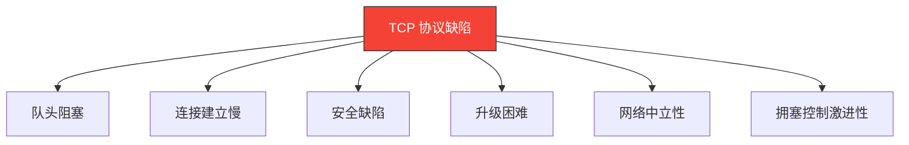
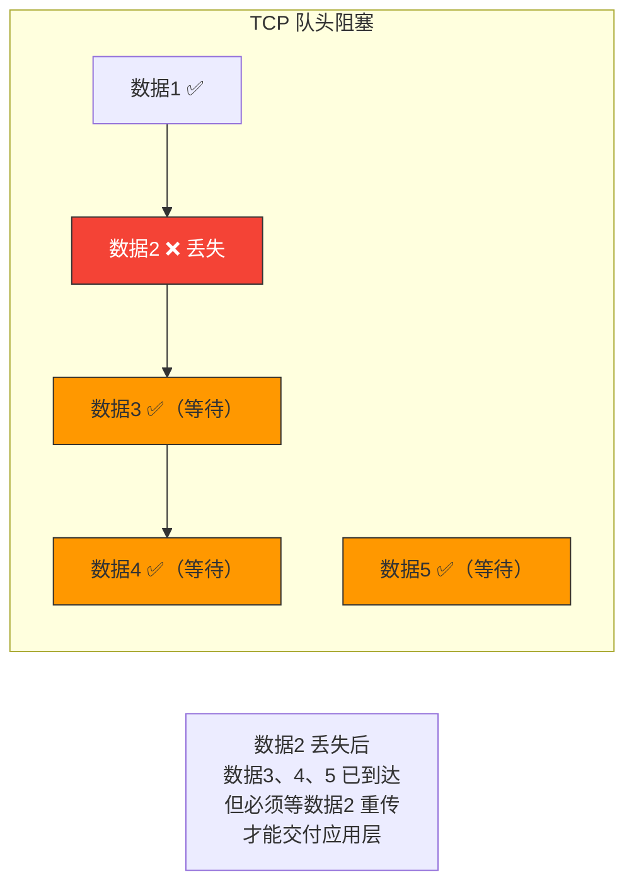
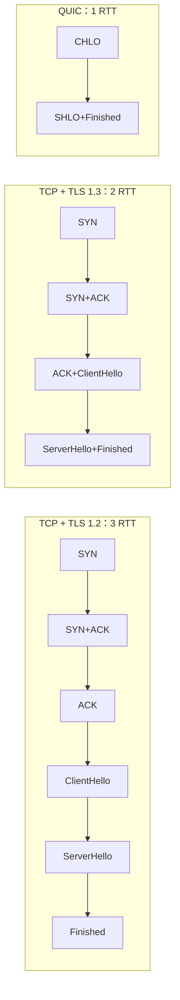
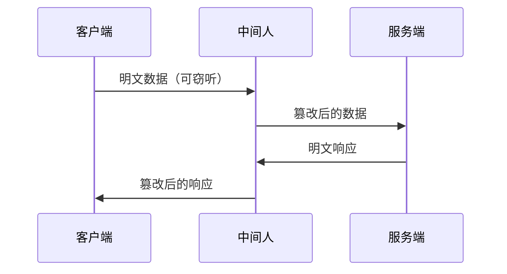
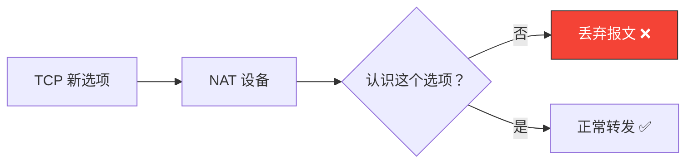
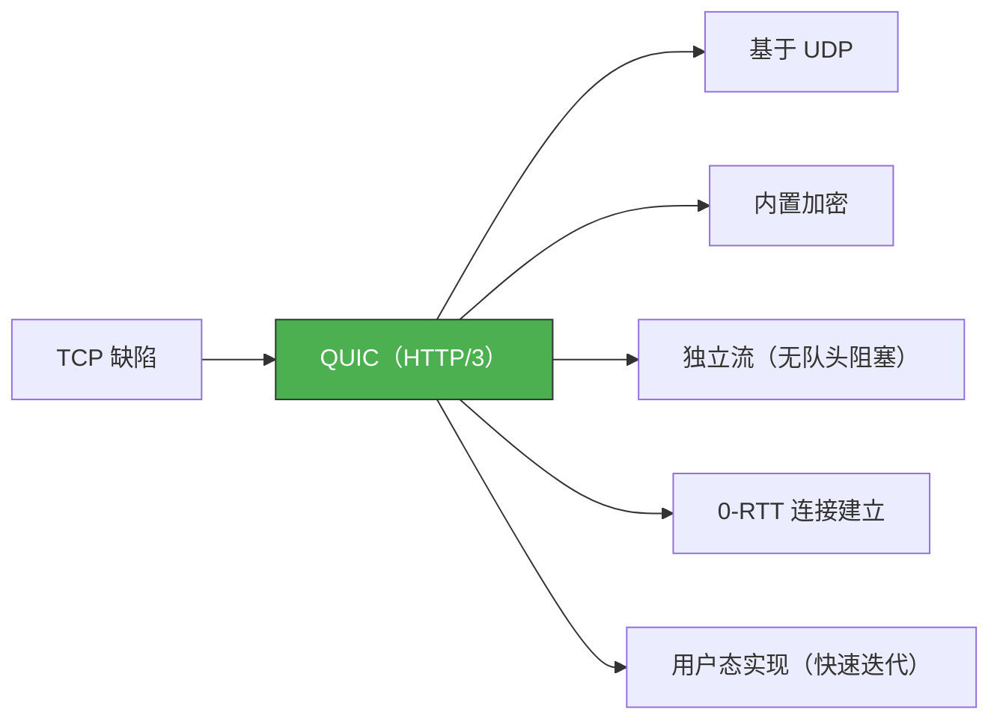

# TCP 协议有什么缺陷

> TCP 作为互联网的基石已经运行了 40 多年，但它并非完美。从队头阻塞到连接建立慢，从安全漏洞到升级困难，TCP 的很多"设计缺陷"正在催生新的协议和解决方案。

## 一、TCP 的主要缺陷概览



---

## 二、队头阻塞（Head-of-Line Blocking）

### 2.1 什么是队头阻塞

TCP 是**字节流**协议，数据必须按序交付。如果某个报文丢失，后续所有报文即使已经到达，也必须等待重传后才能交付应用层。



### 2.2 队头阻塞的影响

| 场景 | 影响 |
|------|------|
| HTTP/1.1 长连接 | 前一个响应未完成，后一个响应无法开始 |
| HTTP/2 多路复用 | TCP 层队头阻塞仍存在，一个流丢包阻塞所有流 |
| 实时音视频 | 丢包导致后续帧全部延迟，卡顿明显 |
| WebSocket | 二进制帧按序交付，一个丢包阻塞所有消息 |

::: important HTTP/2 没有解决 TCP 队头阻塞
HTTP/2 在应用层实现了多路复用，但底层仍是 TCP。一个 TCP 连接上的丢包会阻塞所有 HTTP/2 流。这正是 QUIC（HTTP/3）要解决的问题——在 UDP 上实现独立流，消除队头阻塞。
:::

---

## 三、连接建立慢

### 3.1 TCP 三次握手的延迟

TCP 建立连接需要 1 RTT，加上 TLS 握手更是 2~3 RTT：



### 3.2 慢启动的影响

连接建立后，TCP 拥塞控制从慢启动开始，初始窗口小，带宽利用慢：

```
慢启动过程（假设初始 cwnd=10，ssthresh=∞）：

RTT 1: cwnd=10  → 发送 10 个包
RTT 2: cwnd=20  → 发送 20 个包
RTT 3: cwnd=40  → 发送 40 个包
RTT 4: cwnd=80  → ...

// 需要多个 RTT 才能充分利用带宽
// 短连接（如 HTTP 请求）可能在慢启动阶段就结束了
```

::: tip 初始窗口的演进
RFC 2581 规定初始 cwnd=1 MSS；RFC 6928 将其增大到 10 MSS。现代 Linux 内核默认 initcwnd=10。但即便如此，短连接仍可能在带宽未充分利用时结束。
:::

---

## 四、安全缺陷

### 4.1 明文传输

TCP 本身不加密，数据可被中间人窃听和篡改：



### 4.2 连接劫持

TCP 序列号可预测时，攻击者可以：

| 攻击类型 | 原理 | 防御 |
|---------|------|------|
| RST 注入 | 伪造 RST 报文重置连接 | ISN 随机化 + Challenge ACK 限速 |
| 数据注入 | 伪造数据报文注入恶意内容 | ISN 随机化 + 时间戳验证 |
| 会话劫持 | 预测序列号接管连接 | 加密（TLS） |
| SYN Flood | 大量 SYN 占满半连接队列 | SYN Cookie |

### 4.3 TCP 指纹识别

TCP 实现的细微差异可以被用于指纹识别：

```bash
# 使用 nmap 识别操作系统
nmap -O target_host
# 基于 ISN 生成模式、窗口大小、选项顺序等特征

# 防御：随机化 ISN、窗口大小等
sysctl -w net.ipv4.tcp_window_scaling=1
```

---

## 五、升级困难

### 5.1 中间设备固化

TCP 的头部格式和选项被大量中间设备（NAT、防火墙、负载均衡器）硬编码识别。任何对 TCP 协议的修改都可能导致报文被丢弃。



::: important 为什么 QUIC 基于 UDP
正是因为 TCP 升级困难，QUIC 选择基于 UDP 实现。UDP 几乎不被中间设备检查，新功能可以在用户态快速迭代，不受内核和中间设备的限制。
:::

### 5.2 内核升级慢

TCP 在操作系统内核中实现，新功能需要升级内核：

| 问题 | 说明 |
|------|------|
| 部署周期长 | 内核升级需要重启，生产环境不敢轻易升级 |
| 功能迭代慢 | 一个 TCP 新特性从 RFC 到内核支持可能需要数年 |
| 无法 A/B 测试 | 内核协议栈是全局的，无法对不同应用使用不同策略 |
| QUIC 的优势 | 在用户态实现，可以快速迭代、灰度发布 |

---

## 六、网络中立性

### 6.1 公平性问题

TCP 的拥塞控制假设所有连接"公平"地共享带宽，但现实并非如此：

| 行为 | 是否公平 | 说明 |
|------|---------|------|
| 标准 TCP Reno | 公平 | AIMD 保证公平收敛 |
| TCP Cubic | 较公平 | Linux 默认，对高带宽长距离网络更友好 |
| BBR | 有争议 | 可能抢占标准 TCP 的带宽 |
| UDP 洪流 | 完全不公平 | 不做拥塞控制，霸占带宽 |

### 6.2 多路径问题

TCP 一条连接只能走一条路径，无法同时利用多个网络接口：

```
手机同时连接 WiFi 和 4G：
- TCP：只能选其中一个
- MPTCP：可以同时使用两条路径（但部署困难）
- QUIC/MP-QUIC：正在探索多路径传输
```

---

## 七、各缺陷的解决方案

| 缺陷 | 传统方案 | 现代方案 |
|------|---------|---------|
| 队头阻塞 | 多个 TCP 连接 | QUIC 独立流 |
| 连接建立慢 | TFO + TLS 1.3 | QUIC 0-RTT |
| 安全缺陷 | TLS 加密 | QUIC 内置加密 |
| 升级困难 | 内核升级 | QUIC 用户态实现 |
| 网络中立性 | 拥塞控制算法 | BBRv2、COPA 等 |
| 多路径 | MPTCP | MP-QUIC |



---

## 八、面试速查

::: tip 面试速查
- **Q：TCP 有什么缺陷？**
  A：主要缺陷包括——①队头阻塞：一个丢包阻塞后续所有数据；②连接建立慢：三次握手+TLS 需 2~3 RTT；③安全缺陷：明文传输、可被劫持；④升级困难：内核实现、中间设备固化；⑤网络中立性：拥塞控制假设公平。

- **Q：什么是 TCP 队头阻塞？**
  A：TCP 保证按序交付，一个报文丢失后，后续已到达的报文必须在缓冲区等待重传完成才能交付。HTTP/2 的多路复用在应用层消除了请求级队头阻塞，但 TCP 层的队头阻塞仍存在。

- **Q：QUIC 如何解决 TCP 的缺陷？**
  A：基于 UDP 实现（绕过中间设备限制）、内置加密（安全）、独立流（无队头阻塞）、0-RTT 连接建立（快速）、用户态实现（快速迭代）。

- **Q：为什么 TCP 升级这么难？**
  A：TCP 在内核中实现，升级需要重启；中间设备（NAT、防火墙）对 TCP 头部硬编码识别，新选项可能被丢弃。

- **Q：HTTP/2 解决了队头阻塞吗？**
  A：只解决了应用层的请求级队头阻塞，没有解决 TCP 层的队头阻塞。一个 TCP 丢包仍会阻塞所有 HTTP/2 流。
:::

---

::: info 原著参考
- 小林coding《图解网络》—— [TCP 协议有什么缺陷？](https://xiaolincoding.com/network/3_tcp/tcp_problem.html)
:::
