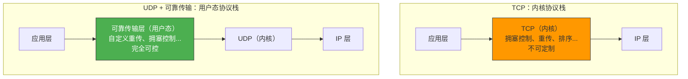
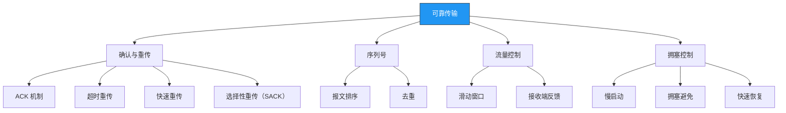
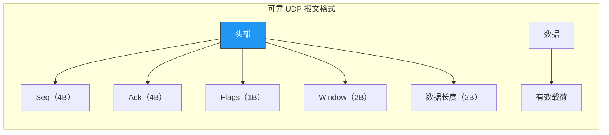
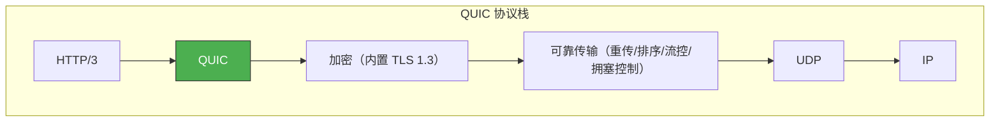
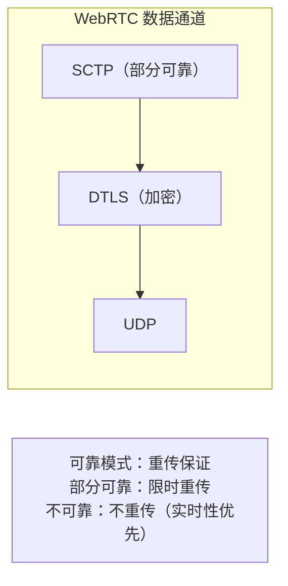

# 如何基于 UDP 协议实现可靠传输

> UDP 是不可靠的传输协议，但许多现代协议（QUIC、KCP、WebRTC）都在 UDP 之上实现了可靠传输。既然 TCP 已经是可靠的，为什么还要"重复造轮子"？因为基于 UDP 实现可靠传输可以**绕过 TCP 的各种限制**，获得更好的性能和灵活性。

## 一、为什么要在 UDP 上实现可靠传输

### 1.1 TCP 的限制

| TCP 限制 | 具体问题 |
|---------|---------|
| 队头阻塞 | 一个丢包阻塞整条连接 |
| 内核实现 | 升级慢，无法快速迭代 |
| 连接建立慢 | 三次握手至少 1 RTT |
| 拥塞控制保守 | 无法针对场景优化 |
| 中间设备干扰 | NAT、防火墙可能篡改 TCP 选项 |

### 1.2 UDP 的优势

| 优势 | 说明 |
|------|------|
| 灵活 | 用户态实现，可以自由定义协议 |
| 快速迭代 | 不依赖内核升级 |
| 无队头阻塞 | 可以实现独立流 |
| 避开中间设备 | UDP 很少被中间设备干扰 |
| 可选择性可靠 | 部分数据可靠，部分数据不可靠 |



---

## 二、可靠传输需要实现什么

### 2.1 核心机制

要实现可靠传输，至少需要以下机制：



### 2.2 各机制的作用

| 机制 | TCP 中的对应 | 自定义时的灵活点 |
|------|------------|----------------|
| 确认与重传 | ACK + RTO | 可选 NACK、更激进的重传策略 |
| 序列号 | 32 位字节流序列号 | 可用报文序列号，更简单 |
| 流量控制 | 滑动窗口 | 可调整窗口粒度 |
| 拥塞控制 | Cubic/BBR | 可选 BBR、KCP 等更激进的算法 |

---

## 三、实现可靠传输的核心设计

### 3.1 报文格式设计



```c
// 报文头部结构
#pragma pack(push, 1)
typedef struct {
    uint32_t seq;       // 序列号
    uint32_t ack;       // 确认号
    uint8_t  flags;     // 标志位：SYN/ACK/FIN/DATA/NACK
    uint16_t window;    // 接收窗口大小
    uint16_t length;    // 数据长度
} rudp_header_t;
#pragma pack(pop)

// 标志位定义
#define FLAG_SYN  0x01
#define FLAG_ACK  0x02
#define FLAG_FIN  0x04
#define FLAG_DATA 0x08
#define FLAG_NACK 0x10  // 否定确认（TCP 没有）
```

### 3.2 确认与重传机制

#### 超时重传

```c
// 超时重传逻辑
void retransmit_check(rudp_conn_t *conn) {
    uint64_t now = get_time_ms();

    for (int i = 0; i < conn->send_window_size; i++) {
        rudp_packet_t *pkt = &conn->send_window[i];
        if (pkt->sent && !pkt->acked) {
            if (now - pkt->send_time > conn->rto) {
                // 超时，重传
                send_packet(conn, pkt);
                pkt->send_time = now;

                // 指数退避 RTO
                conn->rto = min(conn->rto * 2, MAX_RTO);
            }
        }
    }
}
```

#### 快速重传 + NACK

```c
// NACK：告诉发送方哪个包丢了（比 TCP 的 3 个重复 ACK 更精确）
void send_nack(rudp_conn_t *conn, uint32_t missing_seq) {
    rudp_header_t hdr = {
        .seq = conn->next_seq,
        .ack = 0,
        .flags = FLAG_NACK,
        .window = conn->recv_window_size,
        .length = sizeof(uint32_t)
    };
    // NACK 报文携带丢失的序列号
    send(conn->sock, &hdr, sizeof(hdr), MSG_MORE);
    send(conn->sock, &missing_seq, sizeof(missing_seq), 0);
}

// 发送方收到 NACK 后立即重传指定报文
void handle_nack(rudp_conn_t *conn, uint32_t missing_seq) {
    rudp_packet_t *pkt = find_packet(conn, missing_seq);
    if (pkt) {
        send_packet(conn, pkt);  // 立即重传，不等超时
    }
}
```

::: tip NACK vs 重复 ACK
- **TCP 的方式**：接收方收到乱序报文后发送重复 ACK，发送方收到 3 个重复 ACK 后重传
- **NACK 方式**：接收方直接告诉发送方"我缺 Seq=X 的报文"，更精确、更快
:::

### 3.3 滑动窗口

```c
// 发送窗口
typedef struct {
    rudp_packet_t packets[WINDOW_SIZE];
    uint32_t base;         // 窗口起始序列号
    uint32_t next_seq;     // 下一个待发送的序列号
    int window_size;       // 当前窗口大小
} send_window_t;

// 接收窗口
typedef struct {
    rudp_packet_t packets[WINDOW_SIZE];  // 乱序缓冲
    int received[WINDOW_SIZE];            // 标记已接收
    uint32_t expected_seq;                // 期望的下一个序列号
} recv_window_t;

// 发送数据
int rudp_send(rudp_conn_t *conn, const void *data, int len) {
    while (len > 0) {
        // 检查窗口是否已满
        if (conn->send_win.next_seq - conn->send_win.base >= conn->send_win.window_size) {
            // 窗口满，等待 ACK
            wait_for_ack(conn);
            continue;
        }

        int pkt_len = min(len, MSS);
        rudp_packet_t *pkt = &conn->send_win.packets[
            conn->send_win.next_seq % WINDOW_SIZE
        ];

        pkt->hdr.seq = conn->send_win.next_seq;
        pkt->hdr.flags = FLAG_DATA;
        memcpy(pkt->data, data, pkt_len);
        pkt->hdr.length = pkt_len;
        pkt->sent = true;
        pkt->acked = false;
        pkt->send_time = get_time_ms();

        send_packet(conn, pkt);
        conn->send_win.next_seq++;
        data += pkt_len;
        len -= pkt_len;
    }
    return 0;
}
```

### 3.4 拥塞控制

```c
// 简化的拥塞控制（类似 TCP Cubic，但可自定义）
typedef struct {
    int cwnd;           // 拥塞窗口
    int ssthresh;       // 慢启动阈值
    int state;          // SLOW_START / CONGESTION_AVOIDANCE / FAST_RECOVERY
} congestion_ctrl_t;

void on_ack(congestion_ctrl_t *cc) {
    switch (cc->state) {
    case SLOW_START:
        cc->cwnd += MSS;  // 每个 ACK 增加一个 MSS
        if (cc->cwnd >= cc->ssthresh)
            cc->state = CONGESTION_AVOIDANCE;
        break;
    case CONGESTION_AVOIDANCE:
        cc->cwnd += MSS * MSS / cc->cwnd;  // 线性增长
        break;
    }
}

void on_loss(congestion_ctrl_t *cc) {
    cc->ssthresh = cc->cwnd / 2;
    cc->cwnd = cc->ssthresh + 3 * MSS;
    cc->state = FAST_RECOVERY;
}
```

---

## 四、知名实现案例

### 4.1 QUIC

Google 开发的传输协议，HTTP/3 的底层协议：



| 特性 | QUIC vs TCP |
|------|------------|
| 连接建立 | 1-RTT（含加密），TCP+TLS 需要 2~3 RTT |
| 队头阻塞 | 独立流，无队头阻塞 |
| 连接迁移 | Connection ID，切换网络不断连 |
| 加密 | 内置，TCP 本身不加密 |
| 拥塞控制 | Cubic/BBR，可插拔 |

### 4.2 KCP

专注于低延迟的可靠传输协议：

```c
// KCP 的核心特性
// 1. 跳过 TCP 的慢启动
// 2. 更激进的快速重传（跳过 2 个重复 ACK 即重传，TCP 需要 3 个）
// 3. 可选的拥塞控制（可以关闭，只做可靠不做拥塞控制）
// 4. UNA vs ACK：KCP 以包为单位确认，TCP 以字节为单位

// KCP 使用示例
ikcpcb *kcp = ikcp_create(conv, user);
ikcp_setmtu(kcp, 1400);
ikcp_wndsize(kcp, 256, 256);

// 关闭拥塞控制（纯可靠，不限速）
ikcp_nodelay(kcp, 1, 10, 2, 1);

// 发送数据
ikcp_send(kcp, data, len);

// 接收数据
ikcp_recv(kcp, buf, sizeof(buf));
```

### 4.3 WebRTC

实时音视频通信，选择性可靠：



---

## 五、与 TCP 的对比

| 维度 | TCP | 基于 UDP 的可靠传输 |
|------|-----|------------------|
| 实现位置 | 内核 | 用户态 |
| 队头阻塞 | 有 | 可消除（独立流） |
| 连接建立 | 1 RTT | 可 0-RTT |
| 加密 | 无（需 TLS） | 可内置 |
| 拥塞控制 | 固定算法 | 可插拔 |
| 升级 | 需内核升级 | 用户态迭代 |
| 选择性可靠 | 不支持 | 可支持 |
| 开发成本 | 零 | 高（需自己实现） |

::: warning 不要轻易重新发明轮子
实现一个"能用"的可靠传输不难，但实现一个**生产级**的可靠传输极难——需要处理各种边界情况、安全风险、性能优化。除非有明确需求，否则优先使用 QUIC、KCP 等成熟方案。
:::

---

## 六、面试速查

::: tip 面试速查
- **Q：如何基于 UDP 实现可靠传输？**
  A：需要实现确认与重传（ACK/NACK + 超时重传 + 快速重传）、序列号（排序+去重）、流量控制（滑动窗口）、拥塞控制（慢启动+拥塞避免+快速恢复）。

- **Q：为什么要在 UDP 上实现可靠传输，而不是用 TCP？**
  A：TCP 有队头阻塞、内核实现升级慢、连接建立慢、拥塞控制不可定制等限制。基于 UDP 可以在用户态灵活实现，支持独立流、0-RTT、选择性可靠等特性。

- **Q：QUIC 和 KCP 有什么区别？**
  A：QUIC 是 Google 开发的标准化协议（HTTP/3 底层），内置 TLS 1.3 加密，支持连接迁移；KCP 是专注于低延迟的可靠传输，可关闭拥塞控制，适合游戏/实时场景。

- **Q：NACK 和重复 ACK 有什么区别？**
  A：重复 ACK 是 TCP 的方式，接收方对乱序报文重复确认上一个正确序列号，发送方收到 3 个重复 ACK 后重传；NACK 直接告诉发送方"Seq=X 丢了"，更精确、更快。

- **Q：实现可靠传输需要注意什么？**
  A：报文格式设计、RTO 计算、拥塞控制算法选择、安全防护（防伪造 ACK）、性能优化（批处理、零拷贝）。生产环境建议使用 QUIC/KCP 等成熟方案。
:::

---

::: info 原著参考
- 小林coding《图解网络》—— [如何基于 UDP 协议实现可靠传输？](https://xiaolincoding.com/network/3_tcp/udp_reliable.html)
:::
