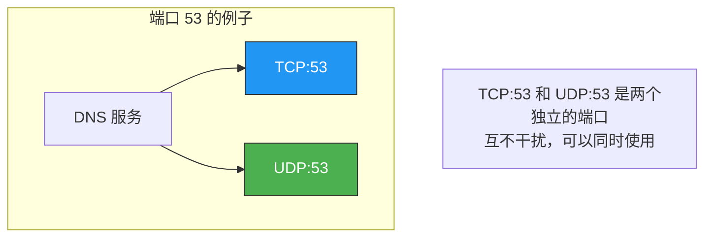
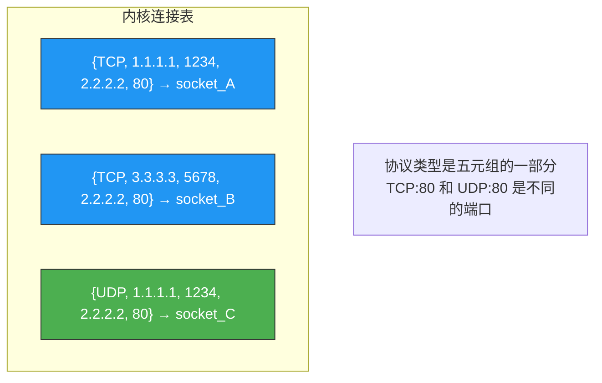
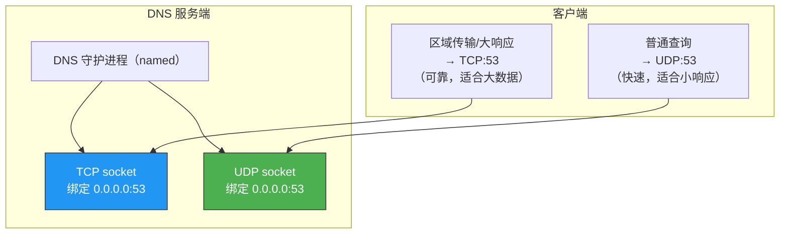
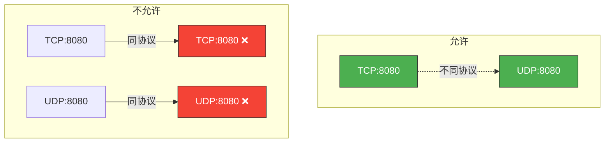

# TCP 和 UDP 可以使用同一个端口吗

> 答案是：**可以**。TCP 和 UDP 的端口号是独立的命名空间，互不影响。一个端口可以同时被 TCP 和 UDP 绑定，它们是两个完全不同的"通信通道"。

## 一、核心结论



TCP 和 UDP 的端口号是**各自独立的**，通过五元组（协议、源IP、源端口、目的IP、目的端口）来区分连接。协议类型（TCP/UDP）是五元组的一部分，所以同一个端口号在 TCP 和 UDP 中可以同时使用。

---

## 二、为什么可以共用端口

### 2.1 五元组区分连接

内核通过五元组来唯一标识一个连接：

```
五元组 = {协议, 源IP, 源端口, 目的IP, 目的端口}

TCP 连接 A = {TCP, 192.168.1.1, 12345, 10.0.0.1, 80}
TCP 连接 B = {TCP, 192.168.1.2, 12345, 10.0.0.1, 80}  ← 不同（源IP不同）
UDP 连接 C = {UDP, 192.168.1.1, 12345, 10.0.0.1, 80}  ← 不同（协议不同）
```



### 2.2 内核数据结构的分离

Linux 内核中，TCP 和 UDP 的 socket 是完全独立的数据结构：

```c
// TCP socket 查找
struct sock *tcp_v4_lookup(__be32 saddr, __be16 sport,
                            __be32 daddr, __be16 dport);

// UDP socket 查找
struct sock *udp_v4_lookup(__be32 saddr, __be16 sport,
                            __be32 daddr, __be16 dport);

// 两个查找在不同的哈希表中进行，互不影响
```

---

## 三、实际案例：DNS 服务

### 3.1 DNS 同时使用 TCP 和 UDP 的 53 端口

DNS 是最经典的例子——同时监听 TCP:53 和 UDP:53：



### 3.2 验证 DNS 使用 TCP 和 UDP

```bash
# 查看 DNS 服务监听的端口
ss -lntup | grep :53

# 输出：
# udp  UNCONN 0 0  0.0.0.0:53  0.0.0.0:*  users:(("named",pid=1234,fd=5))
# tcp  LISTEN 0 128 0.0.0.0:53  0.0.0.0:*  users:(("named",pid=1234,fd=6))

# UDP 和 TCP 都在监听 53 端口
```

```bash
# 使用 dig 查询（默认 UDP）
dig example.com @8.8.8.8
# 可以看到查询走了 UDP

# 使用 dig +tcp 查询（强制 TCP）
dig +tcp example.com @8.8.8.8
# 可以看到查询走了 TCP

# 使用 tcpdump 抓包验证
sudo tcpdump -i eth0 'port 53' -nn
# UDP: 查询和响应
# TCP: 当响应超过 512 字节时自动切换
```

---

## 四、更多实际案例

### 4.1 常见同时使用 TCP/UDP 的服务

| 服务 | TCP 端口 | UDP 端口 | 用途 |
|------|---------|---------|------|
| DNS | 53 | 53 | 查询用 UDP，区域传输/大响应用 TCP |
| NTP | - | 123 | 仅 UDP（时间同步对可靠性要求低） |
| HTTP | 80/443 | - | 仅 TCP |
| SNMP | 161 | 161 | 通常仅 UDP |
| TFTP | - | 69 | 仅 UDP |
| SMTP | 25 | - | 仅 TCP |
| NFS | 2049 | 2049 | TCP 和 UDP 都支持 |
| Echo/Daytime | 7/13 | 7/13 | 测试服务，两者都支持 |

### 4.2 自己的程序同时绑定 TCP 和 UDP

```c
// 同时绑定 TCP 和 UDP 的 8080 端口
int tcp_sock = socket(AF_INET, SOCK_STREAM, 0);
int udp_sock = socket(AF_INET, SOCK_DGRAM, 0);

struct sockaddr_in addr;
addr.sin_family = AF_INET;
addr.sin_port = htons(8080);
addr.sin_addr.s_addr = INADDR_ANY;

// TCP 绑定
bind(tcp_sock, (struct sockaddr*)&addr, sizeof(addr));
listen(tcp_sock, 128);

// UDP 绑定（同一端口，完全没问题）
bind(udp_sock, (struct sockaddr*)&addr, sizeof(addr));

// 现在两个 socket 都在 8080 端口上监听
// TCP 连接到 8080 和 UDP 发送到 8080 互不干扰
```

---

## 五、不能共用的情况

### 5.1 同协议同端口不能共用

TCP 和 TCP 之间（或 UDP 和 UDP 之间）**不能**绑定同一个端口：



```bash
# 两个进程绑定同一个 TCP 端口
# 进程1
nc -l 8080  # 成功

# 进程2
nc -l 8080  # 报错：Address already in use
```

### 5.2 例外：SO_REUSEADDR / SO_REUSEPORT

```c
// 使用 SO_REUSEADDR 允许重用地址
int reuse = 1;
setsockopt(sock, SOL_SOCKET, SO_REUSEADDR, &reuse, sizeof(reuse));

// 使用 SO_REUSEPORT 允许多个 socket 绑定同协议同端口
// （Linux 3.9+，用于多进程负载均衡）
int reuse_port = 1;
setsockopt(sock, SOL_SOCKET, SO_REUSEPORT, &reuse_port, sizeof(reuse_port));
```

```bash
# SO_REUSEPORT 的典型应用：Nginx 多 worker
# 每个 worker 进程都绑定同一个 TCP:80
# 内核自动负载均衡到不同 worker

# nginx.conf
# worker_processes auto;
```

::: important SO_REUSEADDR vs SO_REUSEPORT
- `SO_REUSEADDR`：允许绑定处于 TIME_WAIT 的地址，不同进程仍不能同时监听
- `SO_REUSEPORT`：允许多个 socket 同时绑定相同地址和端口，内核负载均衡
:::

---

## 六、防火墙中的端口规则

防火墙规则中 TCP 和 UDP 端口也是分开管理的：

```bash
# 开放 TCP 8080
sudo iptables -A INPUT -p tcp --dport 8080 -j ACCEPT

# 开放 UDP 8080（需要单独配置）
sudo iptables -A INPUT -p udp --dport 8080 -j ACCEPT

# 如果只开放了 TCP:8080，UDP:8080 仍然会被阻止
```

---

## 七、面试速查

::: tip 面试速查
- **Q：TCP 和 UDP 可以使用同一个端口吗？**
  A：可以。TCP 和 UDP 的端口号是独立的命名空间，协议类型是五元组的一部分。TCP:8080 和 UDP:8080 是两个不同的端口，互不影响。

- **Q：为什么 TCP 和 UDP 可以共用端口？**
  A：因为内核通过五元组（协议、源IP、源端口、目的IP、目的端口）区分连接，协议类型是五元组的组成部分。TCP 和 UDP 使用不同的哈希表，查找时互不干扰。

- **Q：什么服务同时使用 TCP 和 UDP 的同一端口？**
  A：DNS 是最典型的例子，同时监听 TCP:53 和 UDP:53。普通查询走 UDP（快速），区域传输和大响应走 TCP（可靠）。

- **Q：两个 TCP 进程能绑定同一个端口吗？**
  A：默认不能。但使用 SO_REUSEPORT（Linux 3.9+）可以让多个进程绑定同一端口，内核自动负载均衡。Nginx 多 worker 就是这种用法。

- **Q：SO_REUSEADDR 和 SO_REUSEPORT 的区别？**
  A：SO_REUSEADDR 允许绑定 TIME_WAIT 状态的地址；SO_REUSEPORT 允许多个 socket 同时绑定相同地址和端口。
:::

---

::: info 原著参考
- 小林coding《图解网络》—— [TCP 和 UDP 可以使用同一个端口吗？](https://xiaolincoding.com/network/3_tcp/tcp_udp_port.html)
:::
