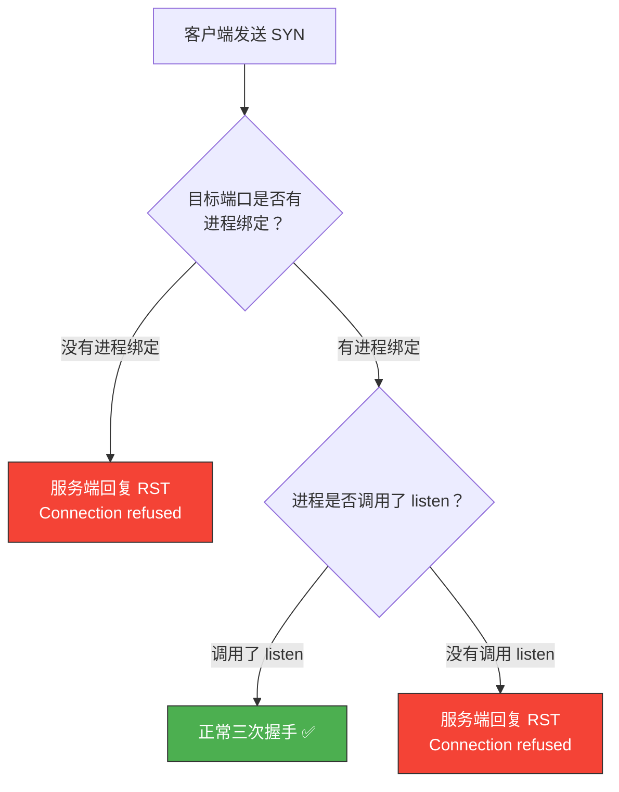
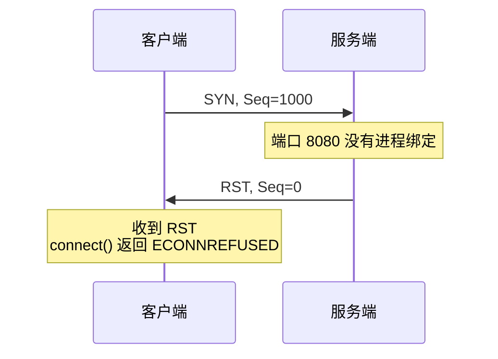
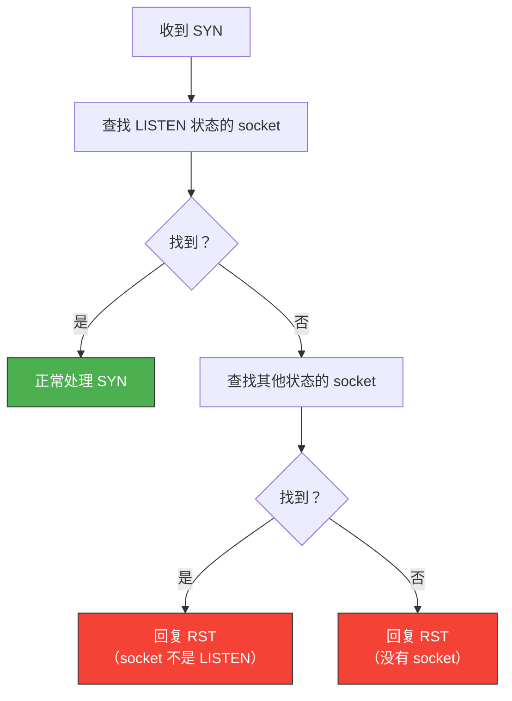
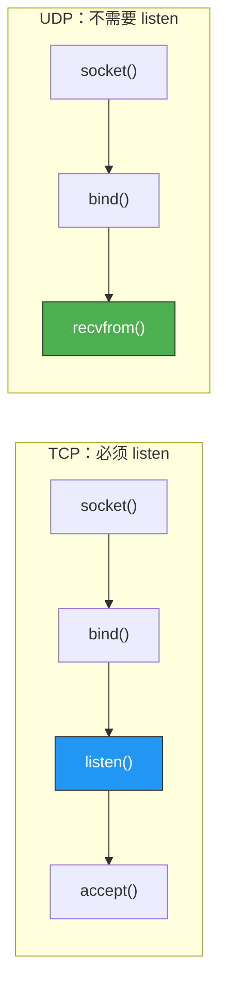
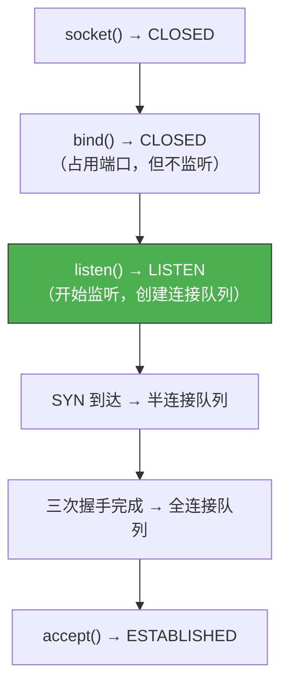
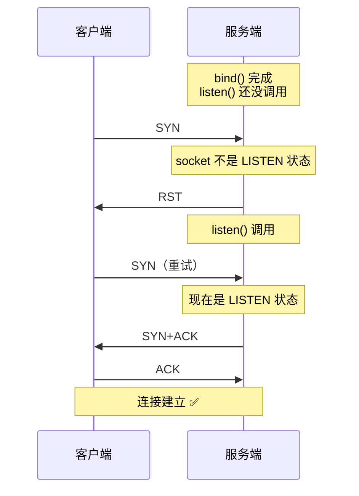

# 服务端没有 listen 客户端发起连接会怎样

> 服务端如果没有调用 `listen()`，客户端发来 SYN 会发生什么？直觉上可能会认为"连接失败"，但实际行为取决于客户端连接的目标端口是否被绑定——不同的场景，结果截然不同。

## 一、三种场景



---

## 二、场景一：端口没有被绑定

### 2.1 客户端收到 RST

如果目标端口没有任何进程绑定，内核会回复 RST：



```bash
# 验证：连接一个没有服务的端口
curl http://127.0.0.1:9999
# curl: (7) Failed to connect to 127.0.0.1 port 9999: Connection refused

# 使用 tcpdump 抓包
sudo tcpdump -i lo port 9999 -nn
# [S] 客户端 → 服务端  Seq=1000
# [R] 服务端 → 客户端  Seq=0  ← 内核直接回复 RST
```

### 2.2 内核为什么回复 RST

当内核收到 SYN 报文时，会查找端口是否有对应的 socket。如果找不到，说明目标端口没有服务在监听，直接回复 RST 是最合理的做法——告诉客户端"这里没有服务"。

```c
// Linux 内核逻辑（简化）
int tcp_v4_rcv(struct sk_buff *skb)
{
    // 查找目标端口的 socket
    struct sock *sk = __inet_lookup(skb);

    if (!sk) {
        // 没有找到对应的 socket
        // 回复 RST
        tcp_v4_send_reset(NULL, skb);
        return 0;
    }
    // ...
}
```

---

## 三、场景二：端口绑定了但没有 listen

### 3.1 进程只 bind 没有 listen

如果进程调用了 `bind()` 但没有调用 `listen()`，SYN 仍然会被拒绝：

```c
// 服务端代码：只 bind，不 listen
int sock = socket(AF_INET, SOCK_STREAM, 0);

struct sockaddr_in addr;
addr.sin_family = AF_INET;
addr.sin_port = htons(8080);
addr.sin_addr.s_addr = INADDR_ANY;

bind(sock, (struct sockaddr*)&addr, sizeof(addr));
// 忘记调用 listen(sock, backlog)！

// 此时客户端连接 8080 端口会被拒绝
```

### 3.2 为什么 bind 不 listen 也会 RST

`bind()` 只是告诉内核"我要使用这个端口"，但 socket 的状态仍然不是 LISTEN。内核查找时只看 LISTEN 状态的 socket，非 LISTEN 状态的 socket 不会匹配 SYN：



### 3.3 验证

```c
// 服务器端：bind 但不 listen
#include <sys/socket.h>
#include <netinet/in.h>

int main() {
    int sock = socket(AF_INET, SOCK_STREAM, 0);
    struct sockaddr_in addr = {
        .sin_family = AF_INET,
        .sin_port = htons(8080),
        .sin_addr.s_addr = INADDR_ANY
    };
    bind(sock, (struct sockaddr*)&addr, sizeof(addr));
    // 没有 listen

    while(1) sleep(1);  // 阻塞
    return 0;
}
```

```bash
# 客户端尝试连接
curl http://127.0.0.1:8080
# curl: (7) Failed to connect: Connection refused

# 查看 socket 状态
ss -ant | grep 8080
# 没有任何 LISTEN 状态的 socket
# 但端口被占用（bind 了）

ss -anp | grep 8080
# 可以看到 socket 存在，但状态不是 LISTEN
```

---

## 四、场景三：UDP 不需要 listen

### 4.1 UDP 的不同之处

UDP 没有"连接"的概念，不需要 `listen()`。只要 `bind()` 了端口，就可以接收数据：

```c
// UDP 服务端：只需要 bind
int sock = socket(AF_INET, SOCK_DGRAM, 0);

struct sockaddr_in addr = {
    .sin_family = AF_INET,
    .sin_port = htons(8080),
    .sin_addr.s_addr = INADDR_ANY
};

bind(sock, (struct sockaddr*)&addr, sizeof(addr));

// 直接 recvfrom 就能接收数据
char buf[1024];
recvfrom(sock, buf, sizeof(buf), 0, NULL, NULL);
```



### 4.2 为什么 UDP 不需要 listen

| 原因 | 说明 |
|------|------|
| 无连接 | UDP 不需要建立连接，直接收发数据 |
| 无 backlog | 不需要维护连接队列 |
| 无状态 | 每个 UDP 报文独立处理 |

---

## 五、listen 的作用

### 5.1 listen 做了什么

```c
// listen 的两个作用
int listen(int sockfd, int backlog);

// 1. 将 socket 状态从 CLOSED 转换为 LISTEN
//    内核开始在这个 socket 上监听连接请求

// 2. 设置全连接队列的长度（backlog）
//    等待 accept() 的已完成连接队列
```



### 5.2 backlog 参数

```c
// backlog 控制全连接队列的大小
listen(sock, 128);

// 实际队列大小 = min(backlog, somaxconn)
```

```bash
# 查看系统最大 backlog
cat /proc/sys/net/core/somaxconn
# 默认 4096

# Nginx 默认配置
# listen 80 backlog=511;
```

---

## 六、常见错误场景

### 6.1 忘记调用 listen

这是初学者最常见的错误：

```c
// ❌ 错误：忘记 listen
int sock = socket(AF_INET, SOCK_STREAM, 0);
bind(sock, ...);
// 忘记 listen！
accept(sock, ...);  // 会报错：Invalid argument

// ✅ 正确
int sock = socket(AF_INET, SOCK_STREAM, 0);
bind(sock, ...);
listen(sock, 128);  // 必须在 accept 之前调用
accept(sock, ...);
```

### 6.2 listen 之前收到 SYN

如果在 `bind()` 和 `listen()` 之间有 SYN 到达：



::: tip 竞态窗口
`bind()` 到 `listen()` 之间有一个很小的窗口，这期间如果收到 SYN 会被拒绝。实际生产中这个窗口极短，通常不会造成问题。但如果服务启动时流量很大，可能需要关注。
:::

---

## 七、面试速查

::: tip 面试速查
- **Q：服务端没有 listen，客户端发起连接会怎样？**
  A：如果端口没有被 bind，内核回复 RST；如果端口被 bind 但没有 listen，内核也回复 RST。两种情况客户端都会收到 Connection refused。

- **Q：为什么 bind 了但不 listen 也会被拒绝？**
  A：内核收到 SYN 时只查找 LISTEN 状态的 socket。bind 只是占用端口，不会让 socket 进入 LISTEN 状态，所以 SYN 无法匹配。

- **Q：UDP 需要 listen 吗？**
  A：不需要。UDP 是无连接的，只需要 bind 就可以接收数据。

- **Q：listen 的作用是什么？**
  A：两个作用——①将 socket 状态转为 LISTEN，允许接收连接；②设置全连接队列大小（backlog）。

- **Q：bind 和 listen 之间收到 SYN 会怎样？**
  A：收到 RST，因为 socket 还不是 LISTEN 状态。客户端重试后（listen 已完成）可以正常连接。
:::

---

::: info 原著参考
- 小林coding《图解网络》—— [服务端没有 listen，客户端发起连接会怎样？](https://xiaolincoding.com/network/3_tcp/tcp_no_listen.html)
:::
