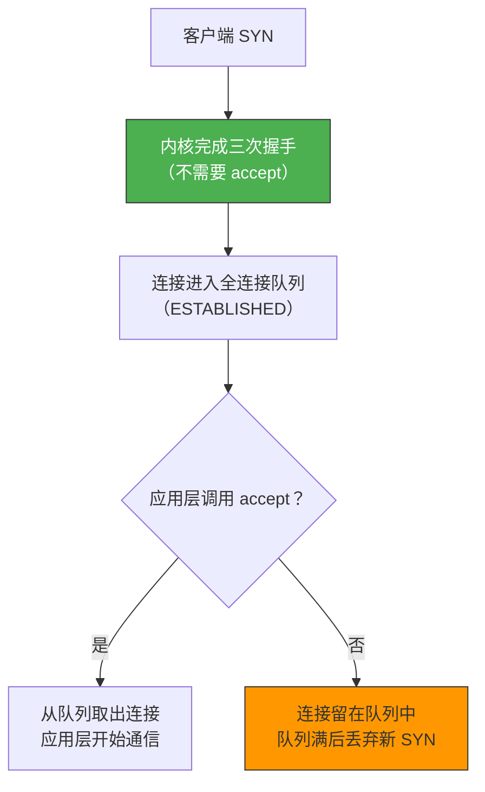
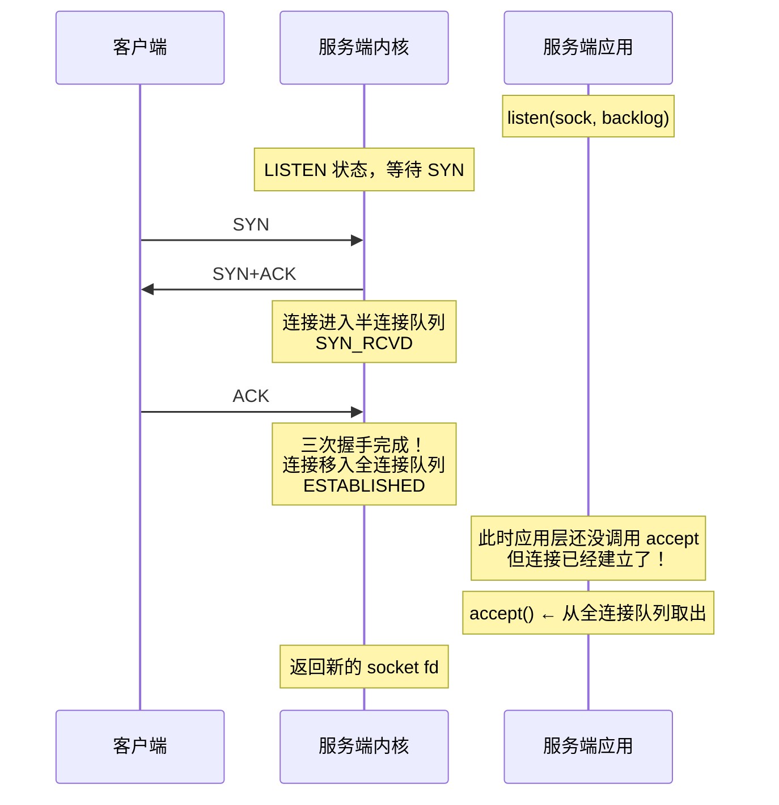
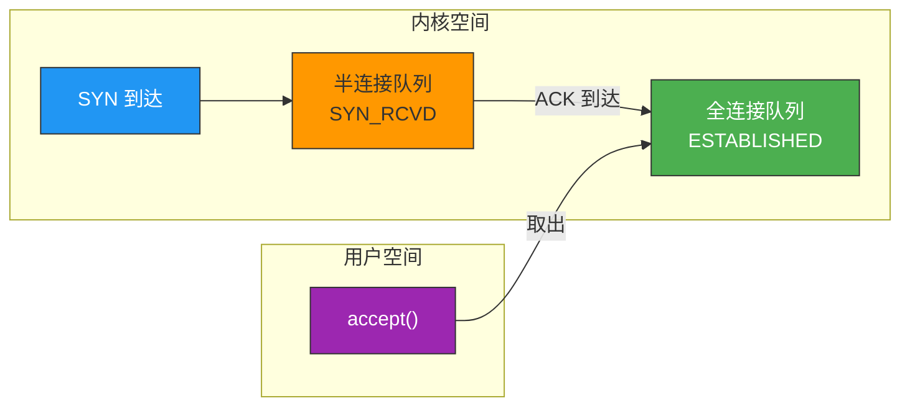
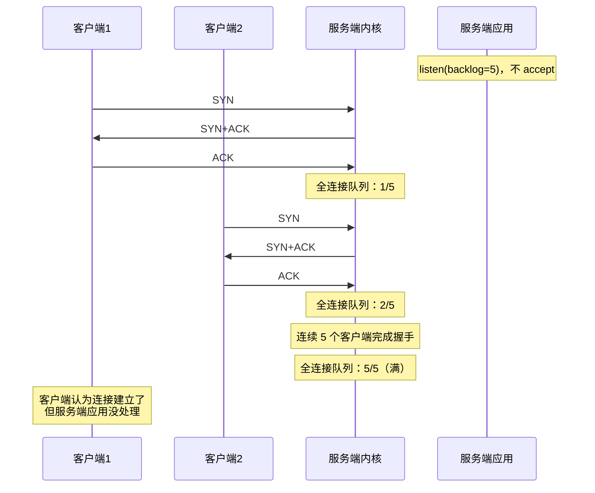
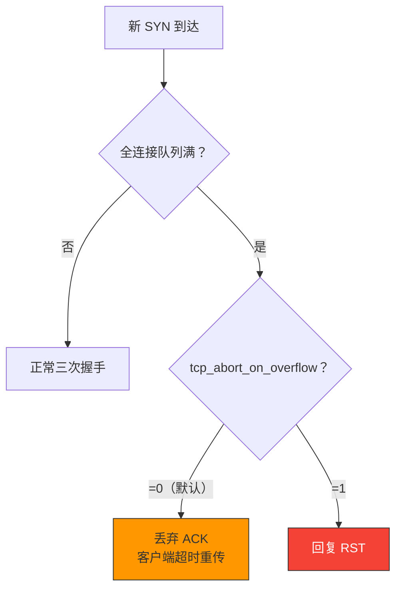

# 没有 accept 能建立 TCP 连接吗

> 答案是：**能**。TCP 三次握手由内核完成，`accept()` 只是从全连接队列中取出已建立的连接。即使不调用 `accept()`，三次握手照常完成，连接照常建立——只是应用层拿不到这个连接。

## 一、核心结论



::: important 关键理解
`accept()` 不是建立连接的操作，而是**获取已建立连接**的操作。三次握手完全由内核协议栈完成，与应用层的 `accept()` 无关。
:::

---

## 二、三次握手与 accept 的关系

### 2.1 内核完成三次握手



### 2.2 各角色职责

| 操作 | 执行者 | 作用 |
|------|-------|------|
| SYN/SYN+ACK/ACK | 内核 | 完成三次握手，建立连接 |
| 半连接队列管理 | 内核 | 存储 SYN_RCVD 状态的连接 |
| 全连接队列管理 | 内核 | 存储 ESTABLISHED 状态的连接 |
| accept() | 应用层 | 从全连接队列取出一个连接 |



---

## 三、不调用 accept 会怎样

### 3.1 连接堆积在全连接队列

```c
// 服务端：只 listen，不 accept
int sock = socket(AF_INET, SOCK_STREAM, 0);
bind(sock, ...);
listen(sock, 5);  // backlog=5

while (1) {
    sleep(1);  // 不调用 accept
}
```



### 3.2 全连接队列满后新 SYN 被丢弃



### 3.3 客户端的视角

从客户端角度看，三次握手已经完成，连接是 ESTABLISHED 的。但服务端应用没有 accept，所以：

- 客户端发数据 → 数据到达服务端内核缓冲区
- 服务端应用不处理 → 数据堆积在内核接收缓冲区
- 缓冲区满 → 服务端通告窗口为 0
- 客户端停止发送 → 零窗口探测

```bash
# 观察全连接队列情况
ss -lnt
# Recv-Q = 全连接队列中未 accept 的连接数
# Send-Q = 全连接队列最大容量

# State   Recv-Q  Send-Q  Local:Port  Peer:Port
# LISTEN  5       5       *:8080      *:*    ← 队列已满
```

---

## 四、验证实验

### 4.1 不 accept 的服务端

```c
// no_accept_server.c
#include <sys/socket.h>
#include <netinet/in.h>
#include <unistd.h>

int main() {
    int sock = socket(AF_INET, SOCK_STREAM, 0);

    int reuse = 1;
    setsockopt(sock, SOL_SOCKET, SO_REUSEADDR, &reuse, sizeof(reuse));

    struct sockaddr_in addr = {
        .sin_family = AF_INET,
        .sin_port = htons(8080),
        .sin_addr.s_addr = INADDR_ANY
    };

    bind(sock, (struct sockaddr*)&addr, sizeof(addr));
    listen(sock, 5);

    printf("Listening on 8080, but never accept...\n");

    // 不调用 accept，只休眠
    while (1) sleep(1);

    return 0;
}
```

```bash
# 编译运行
gcc -o no_accept_server no_accept_server.c
./no_accept_server

# 另一个终端：客户端连接
nc 127.0.0.1 8080
# 连接成功！三次握手已完成

# 再开几个客户端
nc 127.0.0.1 8080  # 也成功
nc 127.0.0.1 8080  # 也成功
# 直到超过 backlog+1

# 查看全连接队列
ss -lnt | grep 8080
# Recv-Q 会显示未 accept 的连接数
```

### 4.2 使用 tcpdump 验证

```bash
# 抓包：即使不 accept，三次握手仍然完成
sudo tcpdump -i lo port 8080 -nn -S

# 输出：
# [S] 客户端 → 服务端  Seq=1000
# [S.] 服务端 → 客户端 Seq=2000, Ack=1001
# [.] 客户端 → 服务端  Seq=1001, Ack=2001
# 三次握手完成，连接建立！
```

---

## 五、与 select/epoll 的关系

### 5.1 epoll 检测 LISTEN socket 可读

```c
// epoll 模式下，LISTEN socket 可读 = 全连接队列有连接
int epfd = epoll_create1(0);

struct epoll_event ev;
ev.events = EPOLLIN;
ev.data.fd = listen_sock;
epoll_ctl(epfd, EPOLL_CTL_ADD, listen_sock, &ev);

while (1) {
    int n = epoll_wait(epfd, events, MAX_EVENTS, -1);
    for (int i = 0; i < n; i++) {
        if (events[i].data.fd == listen_sock) {
            // LISTEN socket 可读 → 有新连接
            // 可以延迟 accept，连接已经在全连接队列中
            int conn = accept(listen_sock, NULL, NULL);
        }
    }
}
```

::: tip 延迟 accept 的场景
有些高性能服务器会故意延迟 accept（如 Redis），先只监听可读事件，等有空闲工作线程时再 accept。连接在全连接队列中等待，不会丢失。
:::

### 5.2 Thundering Herd 问题

```c
// 多进程/多线程同时 epoll_wait 同一个 LISTEN socket
// 当新连接到来时，所有进程都被唤醒（惊群）
// 但只有一个能 accept 成功

// 解决方案：
// 1. Nginx：使用 accept_mutex
// 2. Linux 4.5+：EPOLLEXCLUSIVE 标志
ev.events = EPOLLIN | EPOLLEXCLUSIVE;
```

---

## 六、面试速查

::: tip 面试速查
- **Q：没有 accept 能建立 TCP 连接吗？**
  A：能。TCP 三次握手由内核完成，与 accept 无关。accept 只是从全连接队列中取出已建立的连接。

- **Q：不调用 accept 会怎样？**
  A：连接完成三次握手后堆积在全连接队列中。队列满后新的 SYN 会被丢弃（tcp_abort_on_overflow=0）或收到 RST（=1）。客户端可能以为连接建立成功，但服务端不处理数据。

- **Q：accept 的作用是什么？**
  A：从全连接队列中取出一个 ESTABLISHED 的连接，返回新的 socket fd 供应用层使用。它不是建立连接，而是获取连接。

- **Q：客户端连接成功但服务端不处理，数据会怎样？**
  A：数据到达服务端内核接收缓冲区。缓冲区满后窗口变为 0，客户端停止发送。如果持续不处理，最终可能超时断开。

- **Q：epoll 中 LISTEN socket 可读意味着什么？**
  A：全连接队列中有已建立的连接，可以调用 accept 取出。
:::

---

::: info 原著参考
- 小林coding《图解网络》—— [没有 accept 能建立 TCP 连接吗？](https://xiaolincoding.com/network/3_tcp/tcp_no_accept.html)
:::
