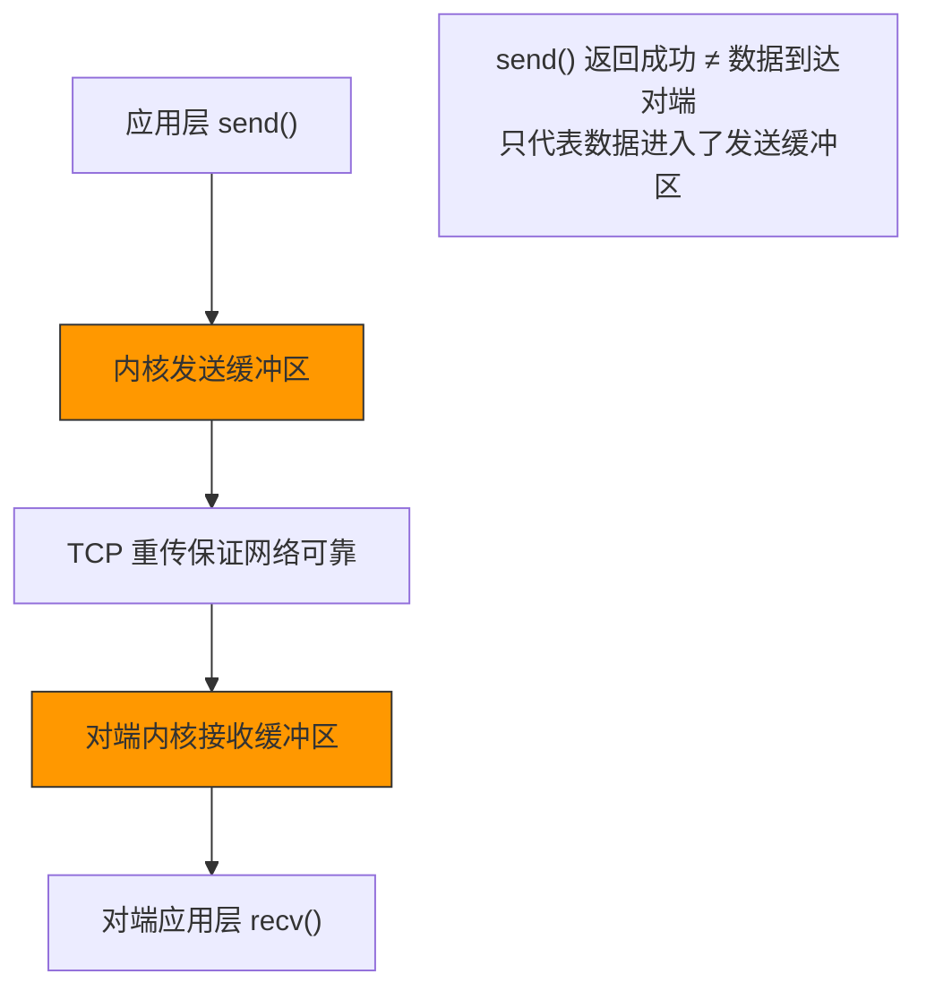
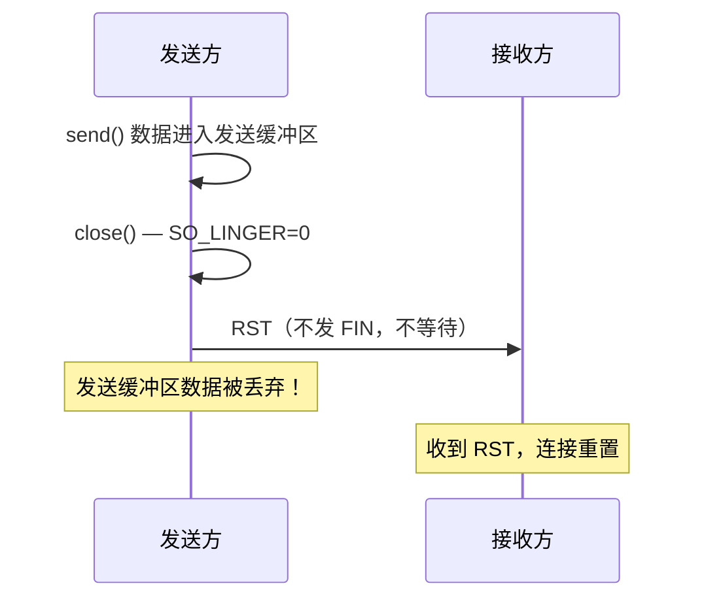
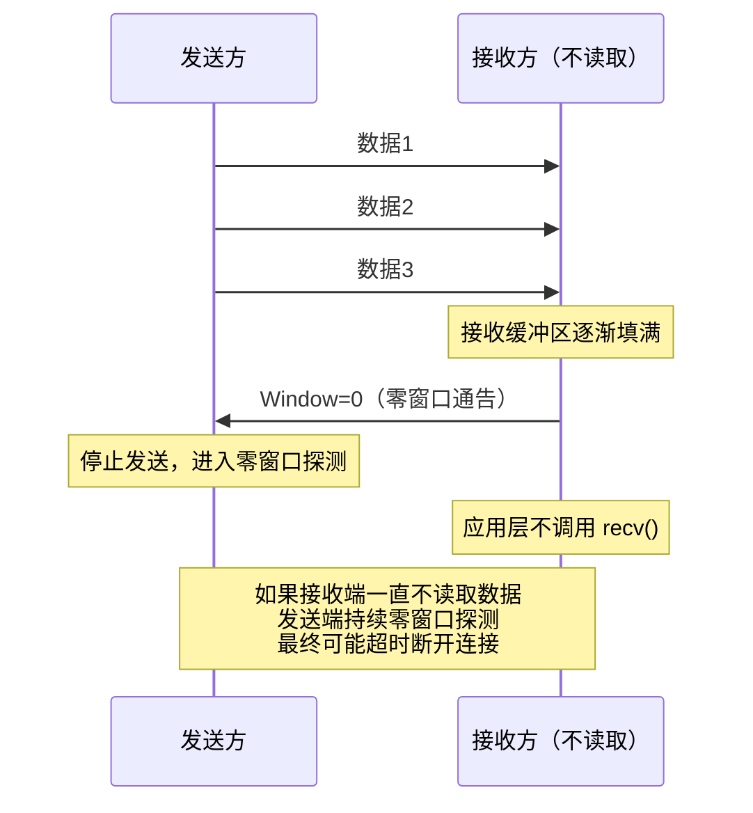
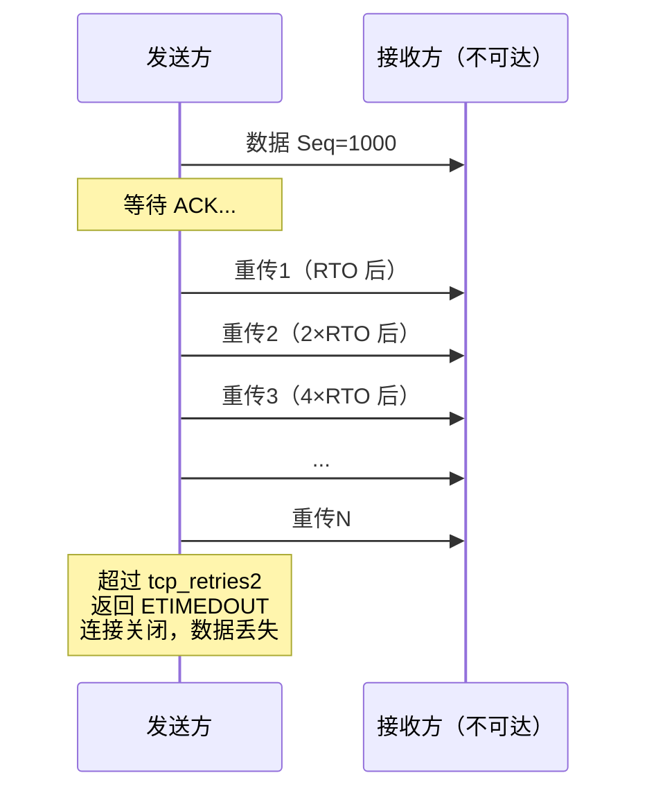
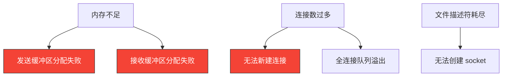
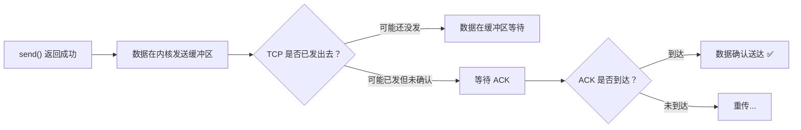
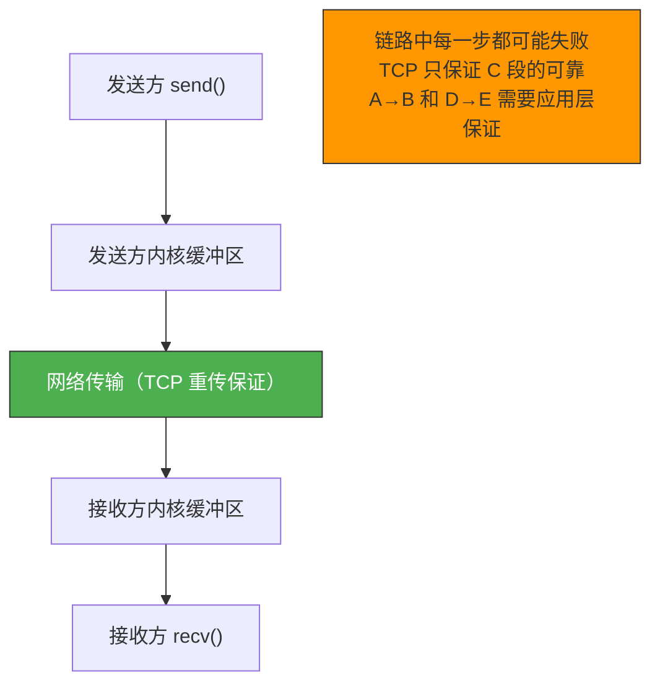
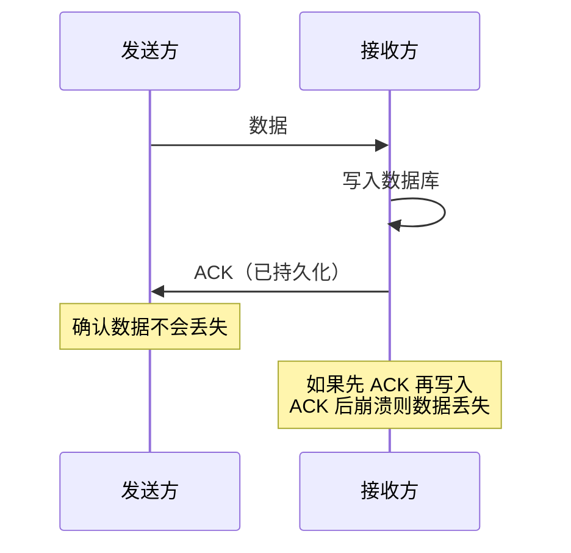

# 用了 TCP 协议数据一定不会丢吗

> TCP 提供可靠传输，但这并不意味着"数据一定不丢"。TCP 的可靠性是有边界的——在网络中断、资源耗尽、程序错误等场景下，数据仍然可能丢失。理解这些边界，才能设计出真正可靠的系统。

## 一、TCP 的可靠性保证

### 1.1 TCP 保证了什么

TCP 的可靠性体现在以下方面：

| 保证 | 机制 |
|------|------|
| 数据不重复 | 序列号去重 |
| 数据不丢失 | 重传机制 |
| 数据按序到达 | 序列号排序 |
| 数据不损坏 | 校验和 |

### 1.2 但 TCP 不保证什么

| 不保证 | 场景 |
|--------|------|
| 数据一定送达对端应用 | 连接断开时发送缓冲区的数据可能丢失 |
| 数据不会延迟 | 网络拥塞时延迟增大 |
| 连接一定存在 | 对端崩溃/断电后连接断开 |
| 写入等于送达 | `send()` 成功只代表数据进入内核缓冲区 |



---

## 二、数据可能丢失的场景

### 2.1 场景一：发送缓冲区满后 close

```c
// 设置 SO_LINGER，close 时不等待数据发完
struct linger ling;
ling.l_onoff = 1;
ling.l_linger = 0;  // 超时为 0
setsockopt(sock, SOL_SOCKET, SO_LINGER, &ling, sizeof(ling));

// 发送数据
send(sock, data, len, 0);

// 立即关闭——如果数据还在发送缓冲区，直接丢弃！
close(sock);
```



::: warning SO_LINGER = 0 的危险
当 `l_linger=0` 时，`close()` 会丢弃发送缓冲区中的所有未发送数据，直接发送 RST。这是 TCP 中数据丢失最常见的编程错误之一。
:::

### 2.2 场景二：进程崩溃未处理完数据

```c
// 进程正常退出，操作系统会等待发送缓冲区数据发完
// 但如果进程收到 SIGKILL（kill -9），行为取决于内核版本

// 大多数情况下，内核会尝试发送缓冲区中的数据
// 但如果对端不可达，数据最终还是可能丢失
```

### 2.3 场景三：接收端不读取数据



```c
// 接收端不读取数据导致的问题
// 1. 接收缓冲区满 → 窗口变为 0
// 2. 发送端停止发送 → 数据积压在发送端
// 3. 发送端零窗口探测 → 持续占用资源
// 4. 如果一直不读取 → 最终 TCP 超时断开
```

### 2.4 场景四：重传超时



```bash
# 重传超时参数
cat /proc/sys/net/ipv4/tcp_retries2
# 默认 15，约 924 秒后超时

# 超时后应用层会收到错误
# errno = ETIMEDOUT
```

### 2.5 场景五：内核资源耗尽



```bash
# 查看文件描述符限制
ulimit -n
# 默认 1024

# 查看当前连接数
ss -ant | wc -l

# 查看内核内存使用
cat /proc/net/sockstat
# sockets: used 1234
# TCP: inuse 567 orphan 0 tw 890 alloc 567 mem 123
```

---

## 三、TCP 的可靠性边界

### 3.1 send() 成功 ≠ 数据送达



::: important 关键理解
`send()` 成功只意味着数据被拷贝到了内核发送缓冲区，**不等于**数据已经到达对端。要确认数据真正送达，需要应用层的确认机制。
:::

### 3.2 ACK 到达 ≠ 应用层已读取

```
发送方 → 网络传输 → 接收方内核缓冲区 → 应用层 recv()

                ↑ ACK 在此确认              ↑ 应用层真正处理在此
```

TCP 的 ACK 只确认数据到达了接收方**内核缓冲区**，不代表应用层已经 `recv()` 了数据。如果接收方进程在 ACK 之后、`recv()` 之前崩溃，数据可能丢失。

### 3.3 可靠性的完整链路



---

## 四、如何实现真正的可靠

### 4.1 应用层确认机制

```c
// 发送方
int send_reliable(int sock, const void *data, int len) {
    // 1. 发送数据
    send_all(sock, data, len);

    // 2. 等待应用层 ACK
    char ack_buf[4];
    int n = recv_all(sock, ack_buf, 4);
    if (n <= 0) return -1;  // 接收方未确认

    uint32_t ack_seq = ntohl(*(uint32_t*)ack_buf);
    if (ack_seq != expected_seq) return -1;  // 确认号不匹配

    return 0;  // 真正确认送达
}

// 接收方
int recv_reliable(int sock, void *buf, int max_len) {
    // 1. 接收数据
    int len = recv_all(sock, buf, max_len);

    // 2. 发送应用层 ACK
    uint32_t ack_seq = htonl(expected_seq);
    send_all(sock, &ack_seq, 4);

    return len;
}
```

### 4.2 持久化确认

对于关键数据，仅应用层 ACK 还不够——需要持久化（写入磁盘/数据库）后再确认：



### 4.3 最佳实践

| 层次 | 机制 | 保证 |
|------|------|------|
| TCP | 重传、序列号 | 网络传输可靠 |
| 应用层 | 消息确认 | 数据送达应用 |
| 持久层 | 写入后再确认 | 数据不因崩溃丢失 |
| 业务层 | 幂等设计 | 重复不造成问题 |

---

## 五、面试速查

::: tip 面试速查
- **Q：用了 TCP 数据一定不会丢吗？**
  A：不是。TCP 保证网络传输的可靠，但数据可能因以下原因丢失——①SO_LINGER=0 时 close 丢弃缓冲区数据；②重传超时后连接断开；③接收端不读取导致零窗口；④内核资源耗尽；⑤进程崩溃时数据在缓冲区未发出。

- **Q：send() 成功是否意味着数据已送达对端？**
  A：不是。send() 成功只代表数据拷贝到了内核发送缓冲区，不等于数据已到达对端。ACK 到达也只代表数据到了对端内核缓冲区，不代表对端应用已处理。

- **Q：如何实现真正的端到端可靠？**
  A：需要应用层确认机制——接收方在 recv() 并处理完数据后，发送应用层 ACK 给发送方。对于关键数据，应先持久化再确认。

- **Q：SO_LINGER=0 时 close 会怎样？**
  A：直接丢弃发送缓冲区中的未发送数据，发送 RST 而不是 FIN。这是数据丢失的常见原因。

- **Q：TCP 的 ACK 保证了什么？**
  A：ACK 只保证数据到达了接收方的内核接收缓冲区，不保证应用层已读取或处理。如果接收方在 ACK 之后、recv() 之前崩溃，数据可能丢失。
:::

---

::: info 原著参考
- 小林coding《图解网络》—— [用了 TCP 协议，数据一定不会丢吗？](https://xiaolincoding.com/network/3_tcp/tcp_data_loss.html)
:::
