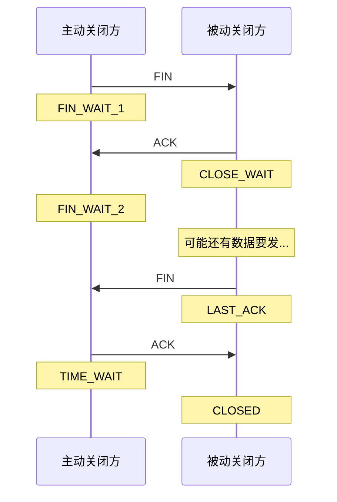
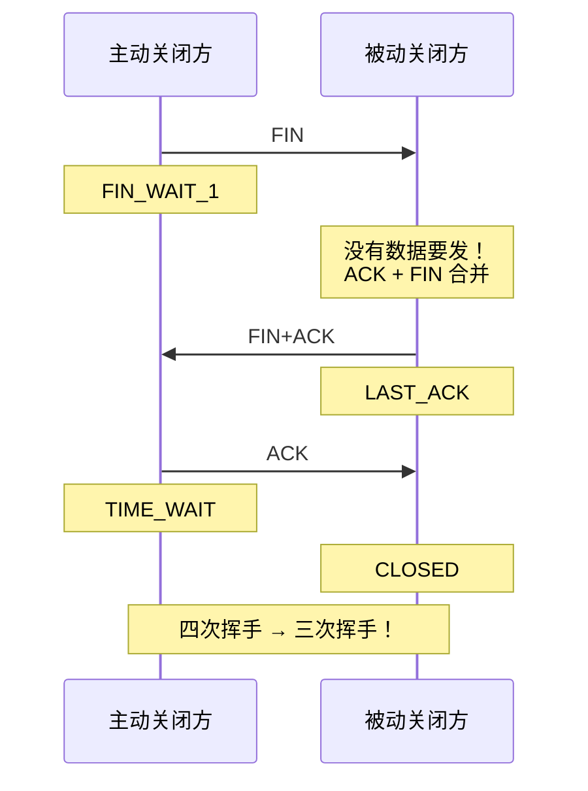
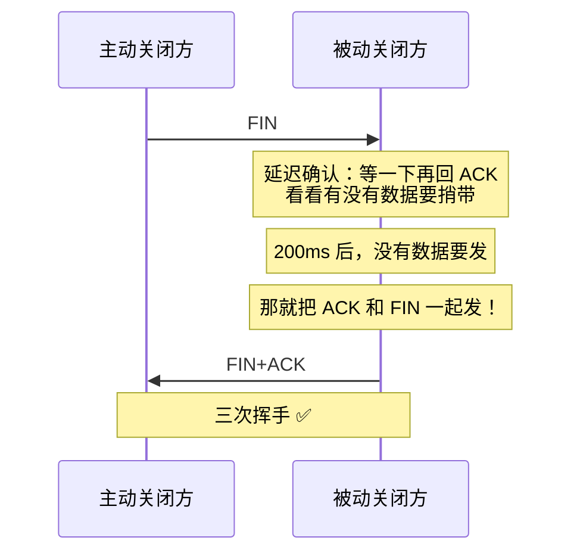
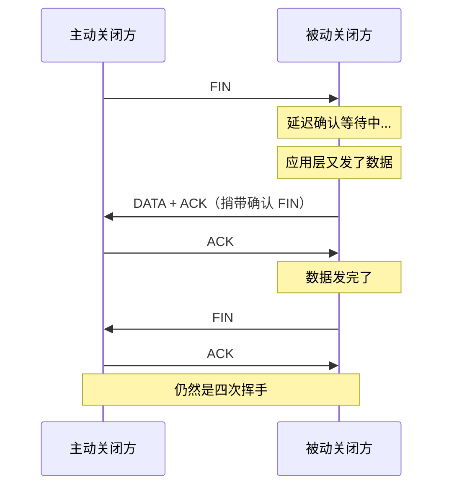
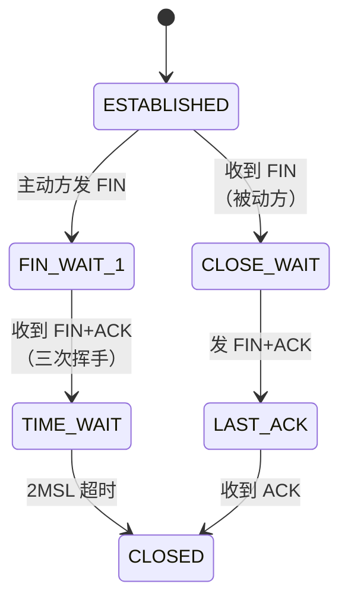

# TCP 四次挥手可以变成三次吗

> 四次挥手的标准流程需要四个报文，但在特定条件下，中间的 ACK 和 FIN 可以合并，变成三次挥手。关键条件是：被动方没有数据要发了，可以在收到 FIN 后直接回复 FIN+ACK。

## 一、四次挥手的标准流程



四次挥手的原因：**FIN 和 ACK 是分开的**。被动方收到 FIN 后，可能还有数据要发，不能立即关闭，所以先回 ACK，等数据发完再发 FIN。

---

## 二、四次变三次的条件

### 2.1 核心条件

当被动方收到 FIN 时，**没有数据要发了**，就可以将 ACK 和 FIN 合并为一个报文：



### 2.2 什么时候没有数据要发

| 场景 | 是否有数据 | 挥手次数 |
|------|----------|---------|
| 被动方已发完所有数据 | 无 | 可变三次 |
| 被动方还有数据在缓冲区 | 有 | 四次 |
| 被动方应用还在处理请求 | 可能有 | 四次 |
| HTTP 短连接（请求-响应模式） | 通常无 | 可变三次 |

::: tip HTTP 短连接常出现三次挥手
HTTP/1.0 短连接中，服务端发完响应后关闭连接，此时发送缓冲区为空。收到客户端 FIN 时，服务端没有数据要发，ACK 和 FIN 合并，变成三次挥手。
:::

---

## 三、延迟确认的影响

### 3.1 延迟确认机制

TCP 有**延迟确认**（Delayed ACK）机制：收到数据后不立即回 ACK，等一小段时间（通常 200ms~500ms），看是否有数据需要捎带发送。



### 3.2 延迟确认可能导致四次挥手

如果被动方在延迟等待期间有数据要发：



### 3.3 内核参数

```bash
# 延迟确认的配置
# 查看是否启用延迟确认
cat /proc/sys/net/ipv4/tcp_delack_min
# 默认 40ms（最小延迟确认时间）

# 快速确认（禁用延迟确认）
# 在应用层设置 TCP_QUICKACK
int quickack = 1;
setsockopt(sock, IPPROTO_TCP, TCP_QUICKACK, &quickack, sizeof(quickack));
```

---

## 四、抓包验证

### 4.1 观察三次挥手

```bash
# 启动一个简单的 HTTP 服务
python3 -m http.server 8080

# 另一个终端抓包
sudo tcpdump -i lo port 8080 -nn -S

# 使用 curl 发起请求（HTTP/1.0 短连接）
curl -0 http://127.0.0.1:8080/

# 可能看到的挥手过程：
# 主动方 → 被动方: FIN, Seq=X
# 被动方 → 主动方: FIN+ACK, Seq=Y, Ack=X+1  ← 合并了！
# 主动方 → 被动方: ACK, Ack=Y+1
# 三次挥手！
```

### 4.2 观察四次挥手

```bash
# 使用 nc 模拟有数据要发的场景
# 终端1：服务端
nc -l 8080

# 终端2：客户端连接
nc 127.0.0.1 8080

# 终端3：抓包
sudo tcpdump -i lo port 8080 -nn -S

# 在客户端输入一些数据
# 然后按 Ctrl+C 关闭客户端

# 如果服务端还有数据要发（在客户端关闭前输入了数据）
# 会看到标准的四次挥手：
# 客户端 → 服务端: FIN
# 服务端 → 客户端: ACK
# 服务端 → 客户端: FIN
# 客户端 → 服务端: ACK
```

---

## 五、三次挥手的完整状态转换



对比标准四次挥手的状态转换：

| 阶段 | 四次挥手 | 三次挥手 |
|------|---------|---------|
| 主动方 FIN 后 | FIN_WAIT_1 → FIN_WAIT_2 | FIN_WAIT_1 → TIME_WAIT（跳过 FIN_WAIT_2） |
| 被动方收到 FIN 后 | CLOSE_WAIT → LAST_ACK | CLOSE_WAIT → LAST_ACK（合并发送） |
| 被动方发送 | 先 ACK，后 FIN | FIN+ACK 一次发 |
| 总报文数 | 4 | 3 |

::: important 三次挥手跳过了 FIN_WAIT_2
在三次挥手中，主动方从 FIN_WAIT_1 直接进入 TIME_WAIT，跳过了 FIN_WAIT_2 状态。因为被动方的 FIN+ACK 同时到达，主动方同时确认了对方的 FIN 和自己的 FIN。
:::

---

## 六、面试速查

::: tip 面试速查
- **Q：TCP 四次挥手可以变成三次吗？**
  A：可以。当被动方收到 FIN 时没有数据要发，会将 ACK 和 FIN 合并为一个报文发送，四次挥手变成三次。

- **Q：什么情况下会变成三次挥手？**
  A：被动方收到 FIN 时发送缓冲区为空（没有数据要发），且延迟确认机制将 ACK 和 FIN 合并。常见于 HTTP 短连接。

- **Q：为什么正常是四次而不是三次？**
  A：因为被动方收到 FIN 后可能还有数据要发，需要先回 ACK 确认，等数据发完再发 FIN。ACK 和 FIN 不能合并是因为中间还有数据传输。

- **Q：延迟确认对挥手有什么影响？**
  A：延迟确认会增加三次挥手的概率——被动方收到 FIN 后不立即回 ACK，等一小段时间，如果没有数据要发就将 ACK 和 FIN 合并发送。

- **Q：三次挥手时主动方的状态变化？**
  A：从 FIN_WAIT_1 直接进入 TIME_WAIT，跳过了 FIN_WAIT_2。因为被动方的 FIN+ACK 同时到达。
:::

---

::: info 原著参考
- 小林coding《图解网络》—— [TCP 四次挥手可以变成三次吗？](https://xiaolincoding.com/network/3_tcp/three_way_handshake.html)
:::
