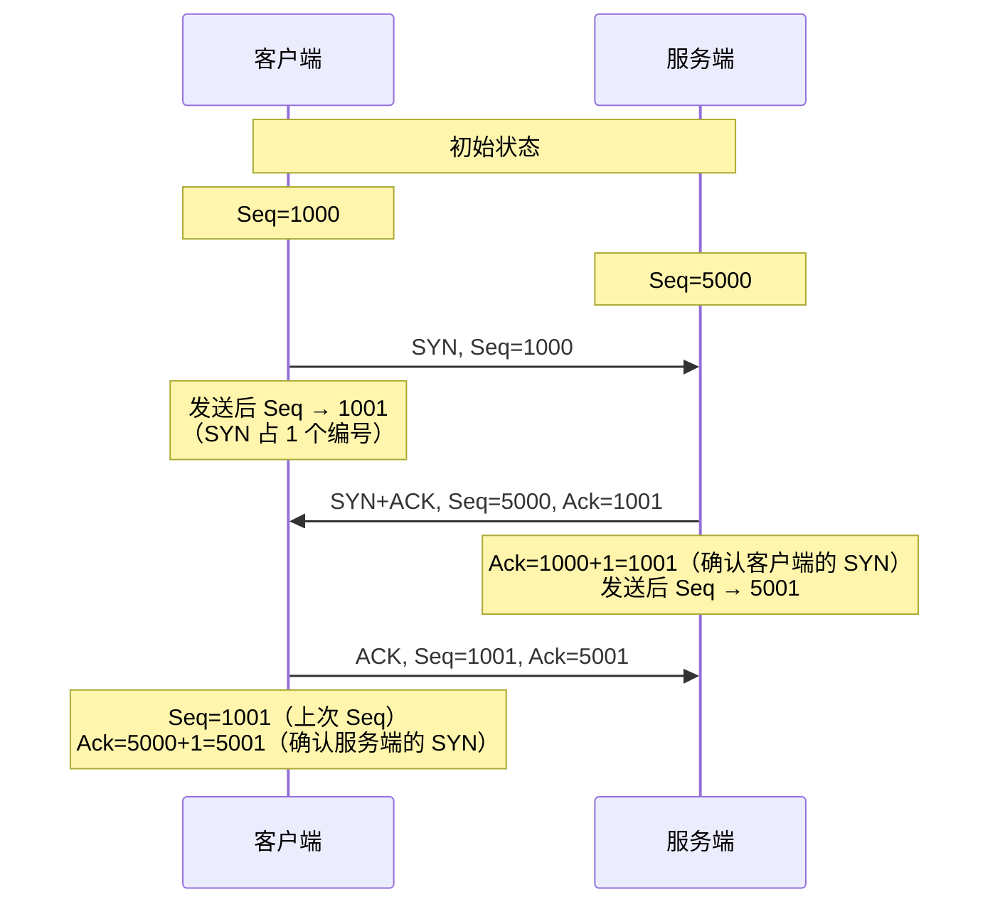
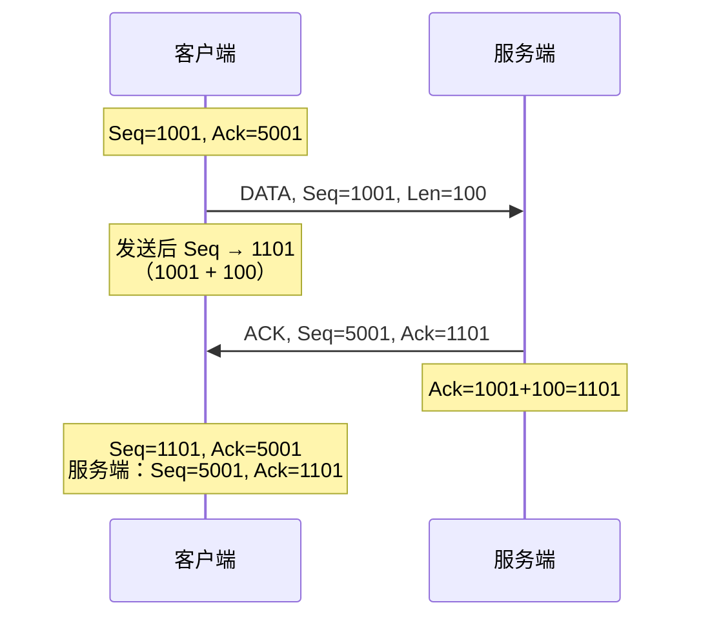
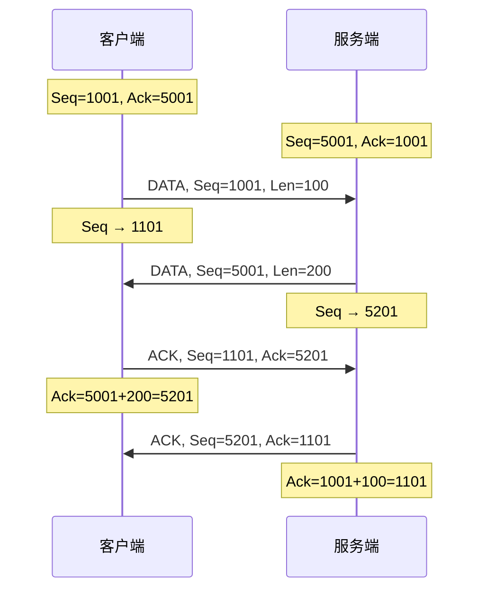
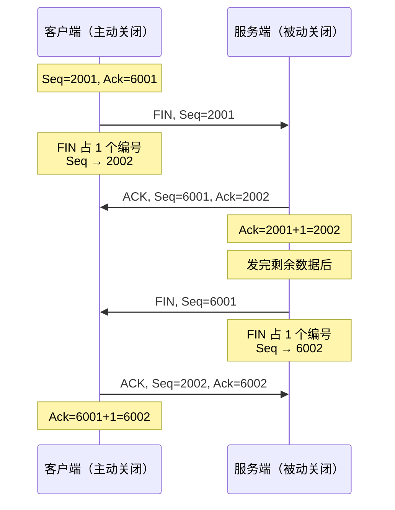
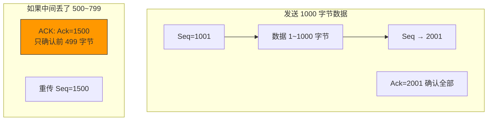
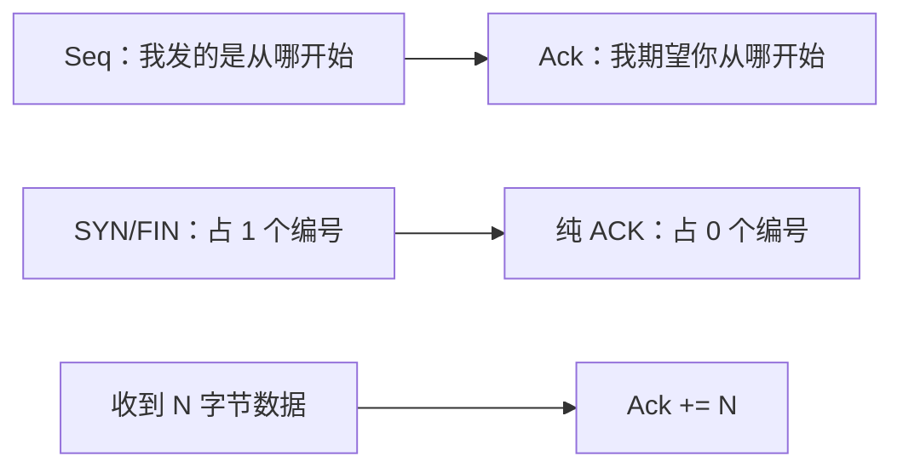

# TCP 序列号和确认号是如何变化的

> 序列号（Seq）和确认号（Ack）是 TCP 可靠传输的基石。理解它们在三次握手、数据传输、四次挥手各阶段的变化规律，是读懂 TCP 抓包、排查网络问题的基础。

## 一、基本规则

### 1.1 核心公式

```
序列号（Seq）：本报文段数据中第一个字节的编号
确认号（Ack）：期望收到的下一个字节的编号

Ack = 对方上一个 Seq + 对方发送的数据长度
    （如果是 SYN/FIN，长度算 1）
```

### 1.2 SYN 和 FIN 各占一个序列号

| 标志 | 占序列号 | 说明 |
|------|---------|------|
| SYN | 占 1 | Seq 消耗一个编号 |
| FIN | 占 1 | Seq 消耗一个编号 |
| DATA | 占 Len | Seq 消耗 Len 个编号 |
| 单独 ACK | 不占 | 不消耗序列号 |

::: important 为什么 SYN 和 FIN 要占序列号？
因为 SYN 和 FIN 都需要被可靠传输。如果 SYN 或 FIN 丢失，需要重传，接收方需要能确认它们。占用序列号才能被确认机制覆盖。
:::

---

## 二、三次握手的序列号变化

### 2.1 完整过程

假设客户端 ISN=1000，服务端 ISN=5000：



### 2.2 逐步分析

| 步骤 | 报文 | Seq | Ack | 说明 |
|------|------|-----|-----|------|
| 1 | SYN | 1000 | 0（忽略） | 客户端 ISN=1000 |
| 2 | SYN+ACK | 5000 | 1001 | 服务端 ISN=5000，Ack=1000+1 |
| 3 | ACK | 1001 | 5001 | Seq=1000+1，Ack=5000+1 |

```
三次握手后：
客户端：Seq=1001, Ack=5001
服务端：Seq=5001, Ack=1001
```

---

## 三、数据传输的序列号变化

### 3.1 单向数据传输

假设三次握手完成后，客户端发送 100 字节数据：



### 3.2 双向数据传输



::: tip 注意：ACK 可以捎带
TCP 的确认可以捎带在数据报文中。上面的第二个报文中，服务端发送数据的同时可以捎带确认客户端的数据（Ack=1101），但这里为了清晰分开展示了。
:::

### 3.3 连续发送多个数据包

```
客户端发送 3 个数据包，每个 100 字节：

包1: Seq=1001, Len=100  → 占用 1001~1100
包2: Seq=1101, Len=100  → 占用 1101~1200
包3: Seq=1201, Len=100  → 占用 1201~1300

服务端确认：
ACK: Ack=1301  → 一次性确认所有数据

客户端收到 ACK 后：
Seq=1301（下一个要发送的字节编号）
```

---

## 四、四次挥手的序列号变化

### 4.1 标准四次挥手

假设挥手前：
- 客户端：Seq=2001, Ack=6001
- 服务端：Seq=6001, Ack=2001



### 4.2 逐步分析

| 步骤 | 报文 | Seq | Ack | 说明 |
|------|------|-----|-----|------|
| 1 | FIN | 2001 | 6001 | 客户端发起关闭 |
| 2 | ACK | 6001 | 2002 | 服务端确认，Ack=2001+1 |
| 3 | FIN | 6001 | 2002 | 服务端也关闭 |
| 4 | ACK | 2002 | 6002 | 客户端确认，Ack=6001+1 |

### 4.3 三次挥手的序列号

如果被动方没有数据要发，步骤 2 和 3 合并：

```
C → S: FIN, Seq=2001
S → C: FIN+ACK, Seq=6001, Ack=2002  ← 合并！
C → S: ACK, Seq=2002, Ack=6002
```

---

## 五、特殊情况

### 5.1 超长数据的序列号



### 5.2 重传的序列号

重传报文的序列号与原始报文**相同**：

```
原始：  Seq=1001, Len=100  → 发送 1001~1100
重传：  Seq=1001, Len=100  → 相同的 Seq

// TCP 重传是原样重传，Seq 不会改变
```

### 5.3 零窗口探测

当接收端窗口为 0 时，发送端定期发送 1 字节的探测包：

```
发送端 → 接收端: DATA, Seq=1001, Len=1  （探测包）
接收端 → 发送端: ACK, Ack=1002, Window=0 （窗口仍为 0）

// 继续探测...
发送端 → 接收端: DATA, Seq=1002, Len=1  （下一个探测）
接收端 → 发送端: ACK, Ack=1003, Window=4096 （窗口恢复！）
```

---

## 六、完整抓包分析

### 6.1 一个完整的 TCP 生命周期

```bash
# 抓取完整的 TCP 连接
sudo tcpdump -i lo port 8080 -nn -S -tt

# 假设：客户端 ISN=3000000, 服务端 ISN=8000000
```

```
=== 三次握手 ===
12:00:01 C → S: [S] Seq=3000000
12:00:01 S → C: [S.] Seq=8000000, Ack=3000001
12:00:01 C → S: [.] Seq=3000001, Ack=8000001

=== 数据传输 ===
12:00:02 C → S: [P.] Seq=3000001, Len=100, Ack=8000001
12:00:02 S → C: [.] Seq=8000001, Ack=3000101
12:00:02 S → C: [P.] Seq=8000001, Len=200, Ack=3000101
12:00:02 C → S: [.] Seq=3000101, Ack=8000201

=== 四次挥手 ===
12:00:05 C → S: [F.] Seq=3000101, Ack=8000201
12:00:05 S → C: [.] Seq=8000201, Ack=3000102
12:00:05 S → C: [F.] Seq=8000201, Ack=3000102
12:00:05 C → S: [.] Seq=3000102, Ack=8000202
```

### 6.2 序列号变化一览表

| 阶段 | 报文 | 客户端 Seq | 客户端 Ack | 服务端 Seq | 服务端 Ack |
|------|------|-----------|-----------|-----------|-----------|
| 初始 | - | 3000000 | - | 8000000 | - |
| SYN | 客户端→服务端 | 3000000 | - | - | - |
| SYN+ACK | 服务端→客户端 | - | - | 8000000 | 3000001 |
| ACK | 客户端→服务端 | 3000001 | 8000001 | - | - |
| DATA | 客户端→服务端 | 3000001 | 8000001 | - | - |
| ACK | 服务端→客户端 | - | - | 8000001 | 3000101 |
| DATA | 服务端→客户端 | - | - | 8000001 | 3000101 |
| ACK | 客户端→服务端 | 3000101 | 8000201 | - | - |
| FIN | 客户端→服务端 | 3000101 | 8000201 | - | - |
| ACK | 服务端→客户端 | - | - | 8000201 | 3000102 |
| FIN | 服务端→客户端 | - | - | 8000201 | 3000102 |
| ACK | 客户端→服务端 | 3000102 | 8000202 | - | - |

---

## 七、序列号变化的规律总结

### 7.1 通用公式

```
发送方：
  下一个 Seq = 当前 Seq + 本次发送的数据长度
  （SYN/FIN 算 1 字节，纯 ACK 算 0 字节）

接收方：
  Ack = 收到的 Seq + 收到的数据长度
  （SYN/FIN 算 1 字节，纯 ACK 算 0 字节）
```

### 7.2 记忆口诀



### 7.3 常见错误

| 错误 | 正确 |
|------|------|
| ACK 不消耗序列号 | ✅ 正确，但 SYN 和 FIN 消耗 |
| Ack 确认的是收到的最后一个字节 | ❌ Ack 是期望的**下一个**字节编号 |
| 重传时 Seq 会变 | ❌ 重传 Seq 不变，与原始报文相同 |
| SYN 不占序列号 | ❌ SYN 占 1 个序列号 |

---

## 八、面试速查

::: tip 面试速查
- **Q：TCP 序列号和确认号是如何变化的？**
  A：Seq = 本报文第一个字节的编号；Ack = 期望收到的下一个字节编号。SYN 和 FIN 各占 1 个序列号，纯 ACK 不占。每次发送数据后 Seq += 数据长度。

- **Q：三次握手的序列号怎么变化？**
  A：①SYN: Seq=客户端ISN；②SYN+ACK: Seq=服务端ISN, Ack=客户端ISN+1；③ACK: Seq=客户端ISN+1, Ack=服务端ISN+1。

- **Q：为什么 SYN 和 FIN 要占序列号？**
  A：因为 SYN 和 FIN 需要被可靠传输（丢失需重传），占用序列号才能被确认机制覆盖。

- **Q：Ack 确认的是什么？**
  A：Ack 确认的是"期望收到的下一个字节编号"，即已正确收到 Ack-1 之前的所有数据。

- **Q：重传报文的序列号会变吗？**
  A：不会。重传报文的 Seq 与原始报文相同，是原样重传。

- **Q：四次挥手的序列号怎么变化？**
  A：①FIN: Seq=X；②ACK: Ack=X+1（FIN 占 1）；③FIN: Seq=Y；④ACK: Ack=Y+1。如果是三次挥手，②③合并为 FIN+ACK。
:::

---

::: info 原著参考
- 小林coding《图解网络》—— [TCP 序列号和确认号是如何变化的？](https://xiaolincoding.com/network/3_tcp/tcp_seq_ack.html)
:::
