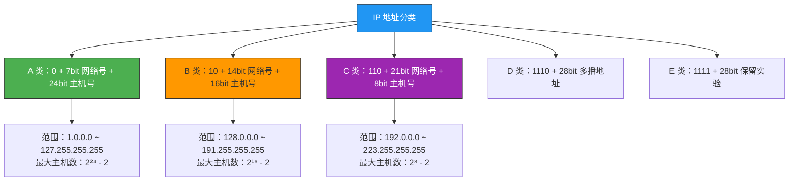
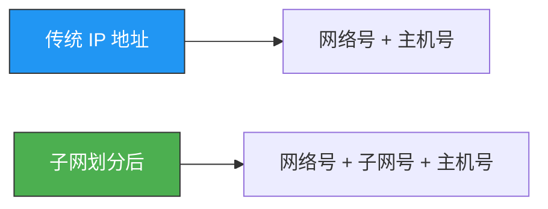
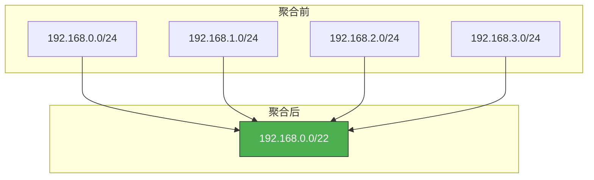
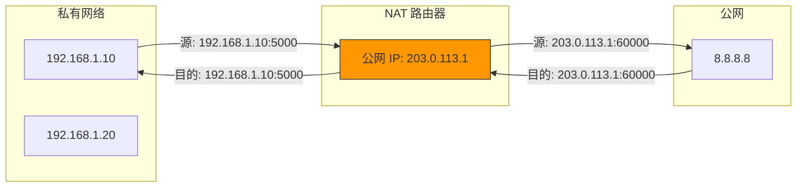
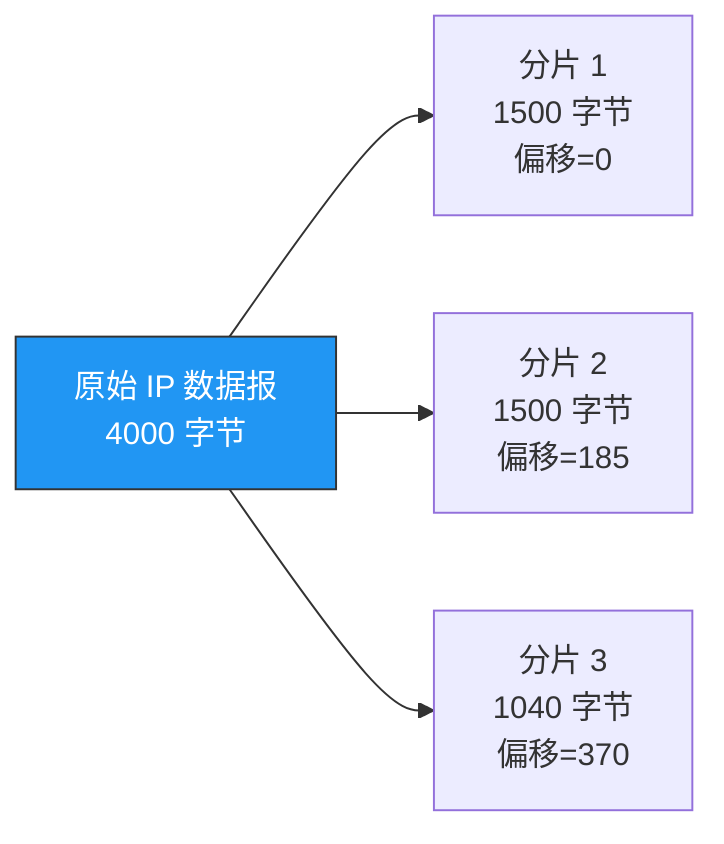

# IP基础知识全家桶

> IP 是整个互联网的基石。理解 IP 地址分类、子网划分、NAT 和 CIDR，是网络层知识的核心，也是面试高频考点。

## 一、IP 地址的分类

### 1.1 为什么要有 IP 地址？

MAC 地址是"身份证号"，标识设备身份；IP 地址是"邮政地址"，标识设备在网络中的位置。MAC 地址不变，IP 地址随网络变化——就像你搬家后身份证号不变，但门牌号变了。

### 1.2 五类 IP 地址

IP 地址 = **网络号** + **主机号**，根据网络号和主机号的位数不同，分为五类：



| 类别 | 首字节范围 | 网络号位数 | 主机号位数 | 最大主机数 | 适用场景 |
|------|-----------|-----------|-----------|-----------|---------|
| A | 1 ~ 126 | 8 | 24 | 16,777,214 | 大型网络 |
| B | 128 ~ 191 | 16 | 16 | 65,534 | 中型网络 |
| C | 192 ~ 223 | 24 | 8 | 254 | 小型网络 |
| D | 224 ~ 239 | — | — | — | 多播 |
| E | 240 ~ 255 | — | — | — | 保留 |

::: important 主机数为什么要减 2？
- 主机号**全 0**：表示网络本身（如 192.168.1.0 表示该网络）
- 主机号**全 1**：表示广播地址（如 192.168.1.255 表示向该网络所有主机广播）
:::

### 1.3 特殊 IP 地址

| 地址 | 含义 |
|------|------|
| `0.0.0.0` | 本机所有 IP 地址的汇总 |
| `127.0.0.1` | 环回地址，指向本机 |
| `255.255.255.255` | 受限广播地址 |
| `10.0.0.0/8` | A 类私有地址 |
| `172.16.0.0/12` | B 类私有地址 |
| `192.168.0.0/16` | C 类私有地址 |

::: tip 面试速查
- **私有地址不能直接出现在公网上**，必须经过 NAT 转换。
- 127.0.0.1 属于 A 类地址的 127 网段，整个 127.0.0.0/8 都是环回地址。
- 广播地址分为直接广播（指向某网络）和受限广播（255.255.255.255，只在本地链路）。
:::

---

## 二、子网划分

### 2.1 为什么需要子网划分？

传统分类地址太粗：一个 A 类网络有 1600 万主机号，太浪费了。子网划分的核心思想是从**主机号中借位**作为**子网号**，将一个大网络切分成若干小网络。



### 2.2 子网掩码

子网掩码用来区分网络号和主机号——掩码为 1 的部分是网络号（含子网号），为 0 的部分是主机号。

```
IP 地址：    192.168.1.100  →  11000000.10101000.00000001.01100100
子网掩码：   255.255.255.0  →  11111111.11111111.11111111.00000000
                               ------------------------------- ========
                               网络号（24位）                    主机号（8位）

网络地址 = IP & 子网掩码 = 192.168.1.0
广播地址 = 网络地址 | ~掩码 = 192.168.1.255
```

### 2.3 子网划分实例

**需求**：将 `192.168.1.0/24` 划分成 4 个子网。

4 个子网需要 2 位子网号（2² = 4），从主机号的 8 位中借 2 位：

| 子网 | 网络地址 | 可用 IP 范围 | 广播地址 | 子网掩码 |
|------|---------|-------------|---------|---------|
| 子网 1 | 192.168.1.0/26 | 192.168.1.1 ~ 192.168.1.62 | 192.168.1.63 | 255.255.255.192 |
| 子网 2 | 192.168.1.64/26 | 192.168.1.65 ~ 192.168.1.126 | 192.168.1.127 | 255.255.255.192 |
| 子网 3 | 192.168.1.128/26 | 192.168.1.129 ~ 192.168.1.190 | 192.168.1.191 | 255.255.255.192 |
| 子网 4 | 192.168.1.192/26 | 192.168.1.193 ~ 192.168.1.254 | 192.168.1.255 | 255.255.255.192 |

```bash
# Linux 下计算子网信息
ipcalc 192.168.1.100/26
# 输出：
# Network:   192.168.1.64/26
# HostMin:   192.168.1.65
# HostMax:   192.168.1.126
# Broadcast: 192.168.1.127
```

::: warning 面试易错点
子网划分后，**每个子网的可用主机数都要减 2**（网络地址和广播地址）。借 n 位产生 2ⁿ 个子网，每个子网有 2^(主机位-n) - 2 个可用主机。
:::

---

## 三、无分类编址 CIDR

### 3.1 CIDR 是什么？

CIDR（Classless Inter-Domain Routing，无分类域间路由选择）打破了传统 A/B/C 类的边界，用**前缀长度**灵活表示网络号位数。

```
192.168.1.0/24  →  前 24 位是网络号
10.0.0.0/8      →  前 8 位是网络号
172.16.0.0/12   →  前 12 位是网络号
```

CIDR 的核心优势：**路由聚合（超网）**，将多个小网络合并为一个大网络条目，减少路由表项。

### 3.2 路由聚合示例

```
192.168.0.0/24
192.168.1.0/24
192.168.2.0/24
192.168.3.0/24
          ↓ 聚合
192.168.0.0/22   （前 22 位相同，合并为一个路由条目）
```



::: tip 面试速查
- **CIDR 与子网划分的区别**：子网划分是"大网变小网"（借主机位），CIDR 路由聚合是"小网变大网"（合并网络位）。
- CIDR 消除了 A/B/C 类的界限，`/8`、`/16`、`/24` 只是常用前缀，不是固定类别。
:::

---

## 四、NAT 网络地址转换

### 4.1 为什么需要 NAT？

IPv4 地址只有 32 位，约 43 亿个，根本不够用。NAT 的核心思路：**私有网络内部使用私有 IP，出口处通过 NAT 转换成公网 IP**。



### 4.2 NAT 的三种类型

| 类型 | 映射方式 | 特点 |
|------|---------|------|
| 静态 NAT | 一对一固定映射 | 内网 IP ↔ 公网 IP 固定绑定 |
| 动态 NAT | 一对一动态分配 | 从公网 IP 池中动态选取 |
| NAPT（PAT） | 多对一端口映射 | 多个内网 IP 共享一个公网 IP，靠端口号区分 |

**NAPT 是最常见的 NAT 类型**，家庭路由器用的就是它：

```
内网主机A: 192.168.1.10:5000  →  路由器: 203.0.113.1:60000
内网主机B: 192.168.1.20:5000  →  路由器: 203.0.113.1:60001
```

通过**端口号**区分不同的内网主机，实现多对一转换。

### 4.3 NAT 的问题与穿透

NAT 打破了端到端通信模型，外网无法主动访问内网主机。常见穿透方案：

- **STUN**：客户端通过 STUN 服务器发现自己的公网映射地址
- **TURN**：无法直连时通过中继服务器转发
- **ICE**：综合 STUN/TURN 的框架

::: warning NAT 的隐患
NAT 虽然缓解了 IPv4 地址不足，但也引入了问题：
1. **破坏了端到端原则**，P2P 应用必须做 NAT 穿透
2. **增加了延迟**，每次转换都要查表修改
3. **NAT 表项有限**，并发连接过多会丢包
:::

---

## 五、IP 分片与重组

### 5.1 MTU 与分片

每个数据链路层都有一个 **MTU**（Maximum Transmission Unit），以太网的 MTU = **1500 字节**。当 IP 数据报超过 MTU 时，就需要分片。



### 5.2 分片关键字段

IP 头部与分片相关的三个字段：

| 字段 | 长度 | 作用 |
|------|------|------|
| 标识（Identification） | 16 位 | 同一数据报的所有分片标识相同 |
| 标志（Flags） | 3 位 | DF=1 禁止分片，MF=1 后面还有分片 |
| 片偏移（Fragment Offset） | 13 位 | 该分片在原数据报中的位置（以 8 字节为单位） |

::: important 面试关键
- **片偏移以 8 字节为单位**，所以每个分片的数据长度必须是 8 的倍数（最后一个分片除外）。
- 分片在**路由器**发生，重组在**目的主机**发生。
- 设置 DF=1 表示不允许分片，如果数据报超过 MTU 就会被丢弃并返回 ICMP 错误。
:::

```bash
# 查看本机 MTU
ifconfig eth0 | grep MTU
# 或
ip link show eth0

# 临时修改 MTU
sudo ip link set eth0 mtu 9000
```

---

## 六、IP 首部格式

```
 0               7 8              15 16             23 24             31
+-+-+-+-+-+-+-+-+-+-+-+-+-+-+-+-+-+-+-+-+-+-+-+-+-+-+-+-+-+-+-+-+
|版本| 首部长度 | 服务类型 |         总长度                   |
+-+-+-+-+-+-+-+-+-+-+-+-+-+-+-+-+-+-+-+-+-+-+-+-+-+-+-+-+-+-+-+-+
|        标识            |标志|   片偏移                  |
+-+-+-+-+-+-+-+-+-+-+-+-+-+-+-+-+-+-+-+-+-+-+-+-+-+-+-+-+-+-+-+-+
|  生存时间  |  协议    |       首部校验和               |
+-+-+-+-+-+-+-+-+-+-+-+-+-+-+-+-+-+-+-+-+-+-+-+-+-+-+-+-+-+-+-+-+
|                    源 IP 地址                              |
+-+-+-+-+-+-+-+-+-+-+-+-+-+-+-+-+-+-+-+-+-+-+-+-+-+-+-+-+-+-+-+-+
|                    目的 IP 地址                           |
+-+-+-+-+-+-+-+-+-+-+-+-+-+-+-+-+-+-+-+-+-+-+-+-+-+-+-+-+-+-+-+-+
```

关键字段解读：

| 字段 | 作用 |
|------|------|
| 版本（4 位） | IPv4 = 4，IPv6 = 6 |
| 首部长度（4 位） | 以 4 字节为单位，最小 5（20 字节），最大 15（60 字节） |
| TTL（8 位） | 每经过一个路由器减 1，减到 0 时丢弃，防止数据报无限循环 |
| 协议（8 位） | 6 = TCP，17 = UDP，1 = ICMP |

::: tip 面试速查
- **IP 首部最小 20 字节**（不含选项），最大 60 字节。
- TTL 是防止路由环路的关键机制，`traceroute` 就是利用 TTL 逐跳递增来探测路径的。
- 首部校验和**只校验首部**，不校验数据部分（TCP/UDP 有自己的校验机制）。
:::

---

::: info 原著参考
本文内容参考自小林 coding《图解网络》网络层相关章节。
:::
