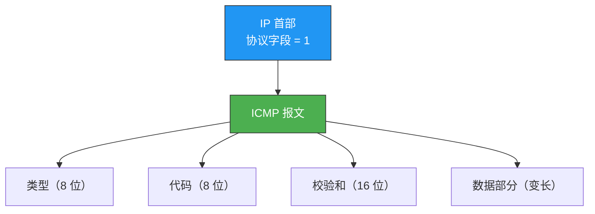
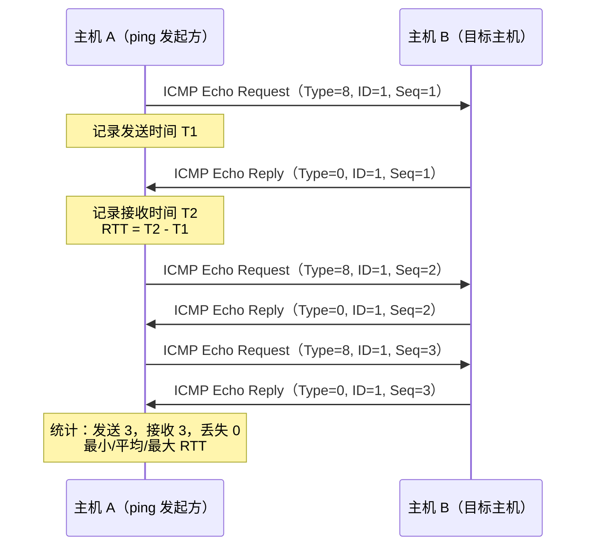
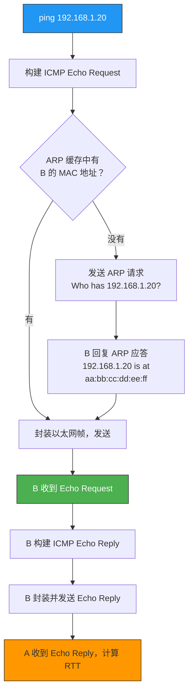
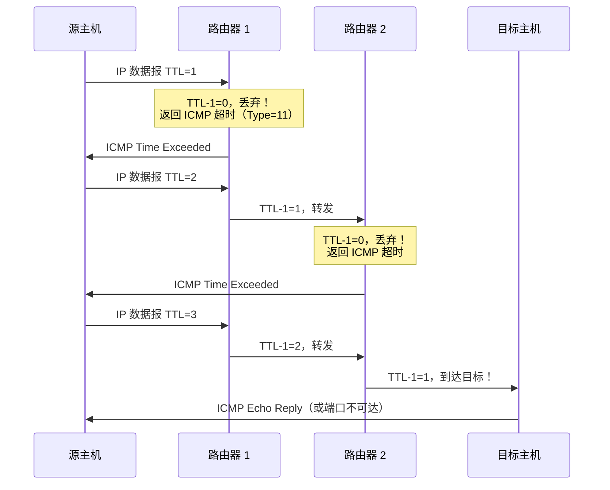
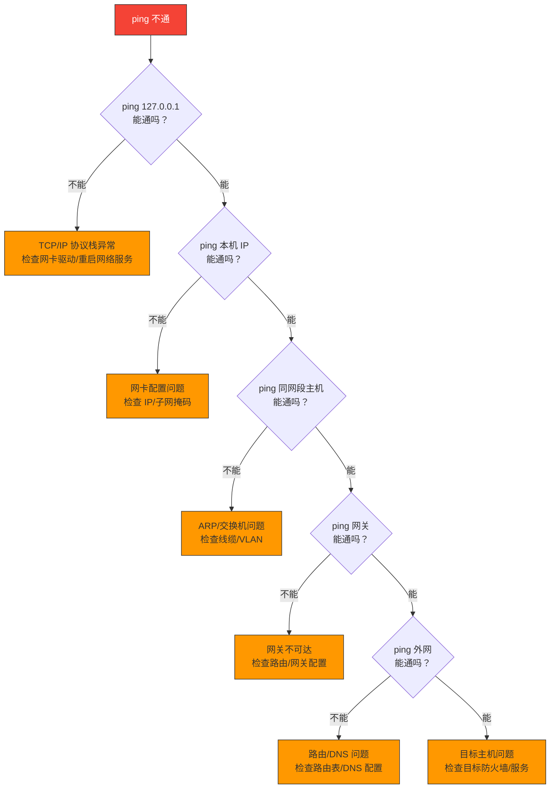

# ping的工作原理

> `ping` 是最常用的网络诊断工具，但它的背后是 ICMP 协议。理解 ICMP 报文格式和 ping 的完整流程，是排查网络问题的基本功。

## 一、ICMP 协议

### 1.1 ICMP 是什么？

ICMP（Internet Control Message Protocol，互联网控制报文协议）是 IP 层的"信使"——它不传输用户数据，而是**报告差错和提供控制信息**。

如果把 IP 协议比作快递系统，ICMP 就是快递系统中的"异常通知单"：包裹丢了、地址不可达、超时了，都会通过 ICMP 通知发送方。

### 1.2 ICMP 报文格式

ICMP 报文封装在 IP 数据报中，格式如下：



### 1.3 ICMP 报文分类

ICMP 报文分为两大类：

| 类别 | 功能 | 常见类型 |
|------|------|---------|
| **查询报文** | 主动探测网络状态 | 类型 8（Echo 请求）、类型 0（Echo 应答） |
| **差错报文** | 报告 IP 数据报传输中的问题 | 类型 3（目的不可达）、类型 11（超时）、类型 5（重定向） |

常用差错报文细表：

| 类型 | 代码 | 含义 |
|------|------|------|
| 3 | 0 | 网络不可达 |
| 3 | 1 | 主机不可达 |
| 3 | 3 | 端口不可达 |
| 3 | 6 | 目的网络未知 |
| 11 | 0 | TTL 超时（传输中） |
| 11 | 1 | 分片重组超时 |
| 5 | 1 | 主机重定向 |

::: important ICMP 的限制
- ICMP 差错报文**不会再产生 ICMP 差错报文**（防止无限循环）。
- 对**分片的第一个之外的分片**不发送 ICMP 差错报文。
- 对**多播地址**不发送 ICMP 差错报文。
:::

---

## 二、ping 的完整流程

### 2.1 ping 做了什么？

`ping` 命令的本质就是发送 ICMP Echo Request（类型 8），然后等待 ICMP Echo Reply（类型 0），并计算往返时间（RTT）。



### 2.2 ping 报文的数据结构

ICMP Echo 报文中除了类型、代码、校验和之外，还有：

| 字段 | 长度 | 作用 |
|------|------|------|
| 标识符（ID） | 16 位 | 区分不同 ping 进程（通常用进程 PID） |
| 序列号（Seq） | 16 位 | 标识同一 ping 进程中的不同请求 |
| 数据 | 变长 | 通常包含发送时间戳，用于计算 RTT |

### 2.3 同局域网 ping 的完整过程

假设主机 A（192.168.1.10）ping 主机 B（192.168.1.20）：



### 2.4 跨网段 ping 的过程

如果目标 IP 不在同一子网，需要经过路由器：

```
A（192.168.1.10）ping B（10.0.0.20）

1. A 发现 10.0.0.20 不在本地子网
2. A 将数据帧发往默认网关（路由器）
3. 路由器查路由表，转发到下一跳
4. 途中每个路由器 TTL 减 1
5. 到达目标网络的路由器，通过 ARP 找到 B 的 MAC 地址
6. B 收到 Echo Request，原路返回 Echo Reply
```

---

## 三、Traceroute 原理

### 3.1 Traceroute 做了什么？

`traceroute`（Linux）/ `tracert`（Windows）用来探测到目标主机经过的所有路由器。原理巧妙地利用了 **TTL 超时**机制。



### 3.2 Linux vs Windows 的区别

| 特性 | Linux traceroute | Windows tracert |
|------|-----------------|-----------------|
| 探测报文 | UDP（默认端口 33434 起） | ICMP Echo Request |
| 目标主机响应 | ICMP 端口不可达（Type=3, Code=3） | ICMP Echo Reply（Type=0） |
| 选项 | `-I` 使用 ICMP，`-T` 使用 TCP | 无选项 |

::: tip 面试速查
- **ping 基于 ICMP Echo**，traceroute 基于 **TTL 递增 + ICMP 超时**。
- traceroute 每一跳通常发 3 个探测包，所以输出中有 3 个 RTT。
- 如果某跳显示 `* * *`，可能是路由器禁用了 ICMP 响应或防火墙过滤。
:::

### 3.3 实战命令

```bash
# 基本 ping
ping 8.8.8.8

# 指定发送次数（Linux）
ping -c 4 8.8.8.8

# 指定包大小
ping -s 1000 8.8.8.8

# traceroute
traceroute 8.8.8.8

# 使用 ICMP 方式（绕过某些防火墙）
traceroute -I 8.8.8.8

# 指定最大跳数
traceroute -m 20 8.8.8.8

# Windows
tracert 8.8.8.8
```

---

## 四、ping 不通的可能原因

### 4.1 排查流程



### 4.2 常见原因汇总

| 现象 | 可能原因 |
|------|---------|
| Request timeout | 目标主机不存在、防火墙屏蔽、路由不可达 |
| Destination Host Unreachable | 本机路由表中无到达目标的路径 |
| TTL Expired in Transit | 存在路由环路 |
| Fragmentation needed and DF set | MTU 问题且设置了不分片标志 |

::: warning 注意
ping 不通 ≠ 网络不可用。很多服务器出于安全考虑**禁用了 ICMP 响应**，但 HTTP 等服务仍然正常。排查时可以用 `curl` 或 `telnet` 验证端口连通性。
:::

---

::: info 原著参考
本文内容参考自小林 coding《图解网络》网络层 ICMP 相关章节。
:::
