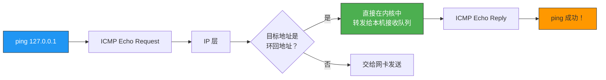
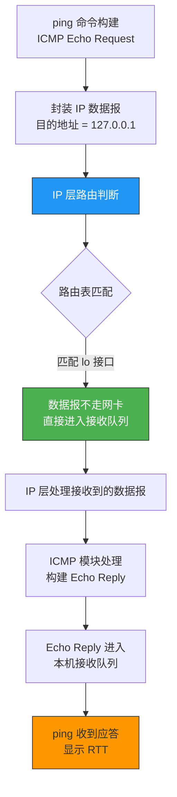
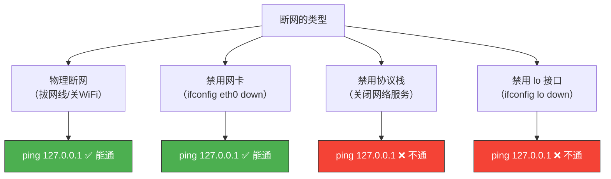

# 断网还能ping通127.0.0.1吗

> 这是一个经典面试题，看似简单，实则考察的是对环回地址、协议栈和网卡工作的理解。答案是：**能**，但为什么？

## 一、先说结论

**断网了依然可以 ping 通 127.0.0.1**。

为什么？因为 ping 127.0.0.1 的数据报**从未离开过本机**，根本不需要网卡和网络。



---

## 二、环回地址详解

### 2.1 127.0.0.1 不是"一个"地址

`127.0.0.1` 只是整个 `127.0.0.0/8` 网段中的一个地址。**整个 A 类网络 127.0.0.0/8 都被保留为环回地址**：

```
127.0.0.1   → 最常用的环回地址
127.0.0.2   → 也可以用
127.1.1.1   → 也可以用
127.255.255.255 → 也可以用（虽然不建议）
```

```bash
# 你可以 ping 任意 127.x.x.x
ping 127.0.0.1    # 能通
ping 127.0.0.2    # 也能通
ping 127.123.45.6  # 还是能通
```

### 2.2 环回接口（lo）

每个操作系统都有一个**虚拟的环回网络接口**（Linux 下是 `lo`），它不依赖任何物理网卡：

```bash
# 查看环回接口
ifconfig lo
# lo: flags=73<UP,LOOPBACK,RUNNING>  mtu 65536
#        inet 127.0.0.1  netmask 255.0.0.0
#        inet6 ::1  prefixlen 128  scopeid 0x10<host>
#        loop  txqueuelen 1000  (Local Loopback)

# 禁用物理网卡后，lo 仍然存在
sudo ifconfig eth0 down
ping 127.0.0.1     # 依然能通！
```

### 2.3 环回接口的特点

| 特性 | 说明 |
|------|------|
| 不经过网卡 | 数据在内核协议栈中直接折返 |
| 不经过网线 | 完全不需要物理网络 |
| MTU = 65536 | 比以太网（1500）大得多，因为不经过链路层 |
| 永远 UP | 除非手动 `ifdown lo`，否则始终可用 |
| 无需 ARP | 目标就是本机，不需要地址解析 |

---

## 三、ping 127.0.0.1 的数据流向

### 3.1 完整路径



关键点：**数据从 IP 层出去后，没有到达数据链路层，而是在 IP 层就被"折返"回来了**。

### 3.2 与正常 ping 的区别

| 对比项 | ping 127.0.0.1 | ping 外部地址 |
|--------|----------------|-------------|
| 是否经过网卡 | 否 | 是 |
| 是否需要网线 | 否 | 是 |
| 是否经过链路层 | 否 | 是 |
| 是否需要 ARP | 否 | 是 |
| 依赖物理网络 | 否 | 是 |
| RTT | 极小（微秒级） | 取决于网络（毫秒级） |

### 3.3 用 tcpdump 验证

```bash
# 在 lo 接口抓包
sudo tcpdump -i lo icmp
# 另一个终端执行
ping -c 2 127.0.0.1

# 输出：
# IP 127.0.0.1 > 127.0.0.1: ICMP echo request, id 1234, seq 1
# IP 127.0.0.1 > 127.0.0.1: ICMP echo reply, id 1234, seq 1
```

注意：在 `eth0` 上抓不到这些包，因为数据根本没到物理网卡。

---

## 四、断网的不同情况

### 4.1 "断网"到底断的是什么？

"断网"在不同场景下含义不同，对 ping 127.0.0.1 的影响也不同：



| 断网方式 | ping 127.0.0.1 | 原因 |
|---------|----------------|------|
| 拔网线 | ✅ 能通 | lo 接口独立，不需要物理介质 |
| 关闭 WiFi | ✅ 能通 | 同上 |
| `ifconfig eth0 down` | ✅ 能通 | 物理网卡和 lo 是独立的 |
| `systemctl stop networking` | ❌ 不通 | 协议栈被关闭，lo 也被禁用 |
| `ifconfig lo down` | ❌ 不通 | 环回接口被手动关闭 |
| 删除网卡驱动 | ✅ 能通 | lo 是虚拟接口，不依赖物理驱动 |

### 4.2 验证实验

```bash
# 实验 1：关闭物理网卡
sudo ifconfig eth0 down
ping -c 2 127.0.0.1      # ✅ 能通
ping -c 2 8.8.8.8        # ❌ 不通

# 实验 2：关闭 lo 接口
sudo ifconfig lo down
ping -c 2 127.0.0.1      # ❌ 不通！connect: Network is unreachable

# 恢复
sudo ifconfig lo up
sudo ifconfig eth0 up
```

::: warning 注意
关闭 lo 接口会影响很多依赖本地通信的服务，比如本机访问本机的数据库、Redis 等都会失败。**生产环境绝对不要关闭 lo 接口**。
:::

---

## 五、ping 本机 IP 和 ping 127.0.0.1 的区别

### 5.1 它们是不同的！

```bash
# 假设本机 IP 是 192.168.1.10
ping 127.0.0.1      # 走 lo 接口
ping 192.168.1.10   # 也走 lo 接口，但路由路径不同
```

### 5.2 路由表决定了走向

```bash
# 查看路由表
route -n
# Kernel IP routing table
# Destination     Gateway     Genmask        Flags Iface
# 127.0.0.0       0.0.0.0     255.0.0.0      U     lo       ← 127 开头的走 lo
# 192.168.1.0     0.0.0.0     255.255.255.0  U     eth0     ← 本地网络走 eth0
```

当 ping 本机 IP（如 192.168.1.10）时：

1. IP 层查路由表，发现 192.168.1.10 属于 eth0 所在的子网
2. 但内核发现这是**本机地址**，所以也走 lo 接口折返
3. **如果 eth0 被 down 掉**，ping 本机 IP 可能不通（因为路由表项被删除了）

```bash
# 关闭 eth0
sudo ifconfig eth0 down
ping 192.168.1.10   # ❌ 可能不通（路由表项没了）
ping 127.0.0.1      # ✅ 仍然能通
```

::: tip 面试速查
- **ping 127.0.0.1**：无论物理网络状态如何，只要 lo 接口和协议栈正常就能通。
- **ping 本机 IP**：依赖对应网卡的路由表项，关闭网卡后可能不通。
- **ping 127.0.0.1 能通只能说明 TCP/IP 协议栈正常**，不能说明网卡和网络正常。
- 诊断顺序：ping 127.0.0.1 → ping 本机 IP → ping 网关 → ping 外网。
:::

---

## 六、localhost 和 127.0.0.1 一样吗？

### 6.1 大部分情况下一样，但有区别

| 对比项 | localhost | 127.0.0.1 |
|--------|-----------|-----------|
| 本质 | 主机名 | IP 地址 |
| 解析方式 | 需要查 hosts 文件或 DNS | 直接使用 |
| IPv6 | 可能解析为 `::1` | 只代表 IPv4 |
| 可修改 | hosts 文件可以改指向 | 固定不变 |

```bash
# 查看 hosts 文件
cat /etc/hosts
# 127.0.0.1   localhost
# ::1         localhost

# 在某些系统中，ping localhost 可能走 IPv6
ping localhost     # 可能解析为 ::1（IPv6 环回地址）
ping 127.0.0.1    # 一定是 IPv4
```

::: important 实际影响
- MySQL 默认绑定 `localhost`，通过 Unix 域套接字通信（不走 TCP）。
- 如果将 MySQL 连接地址从 `localhost` 改为 `127.0.0.1`，会强制走 TCP 连接。
- 开发中遇到"localhost 能连但 127.0.0.1 不能连"或反之，先检查通信方式。
:::

---

::: info 原著参考
本文内容参考自小林 coding《图解网络》网络层 ICMP 及 IP 相关章节。
:::
