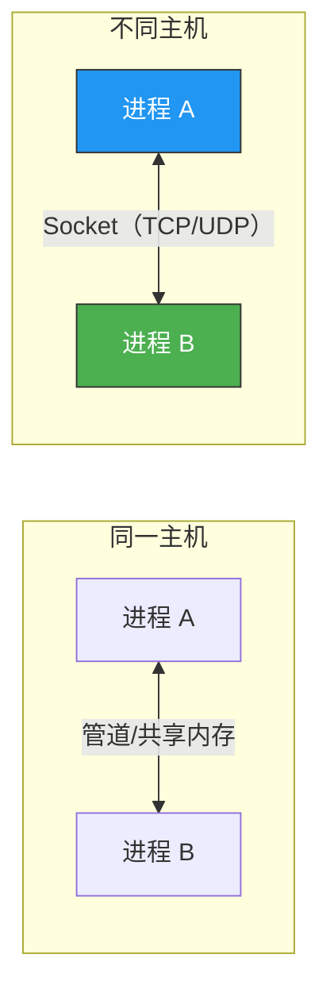
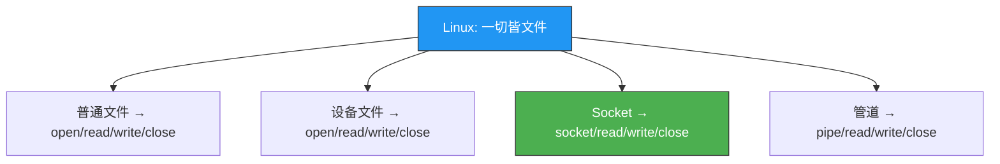
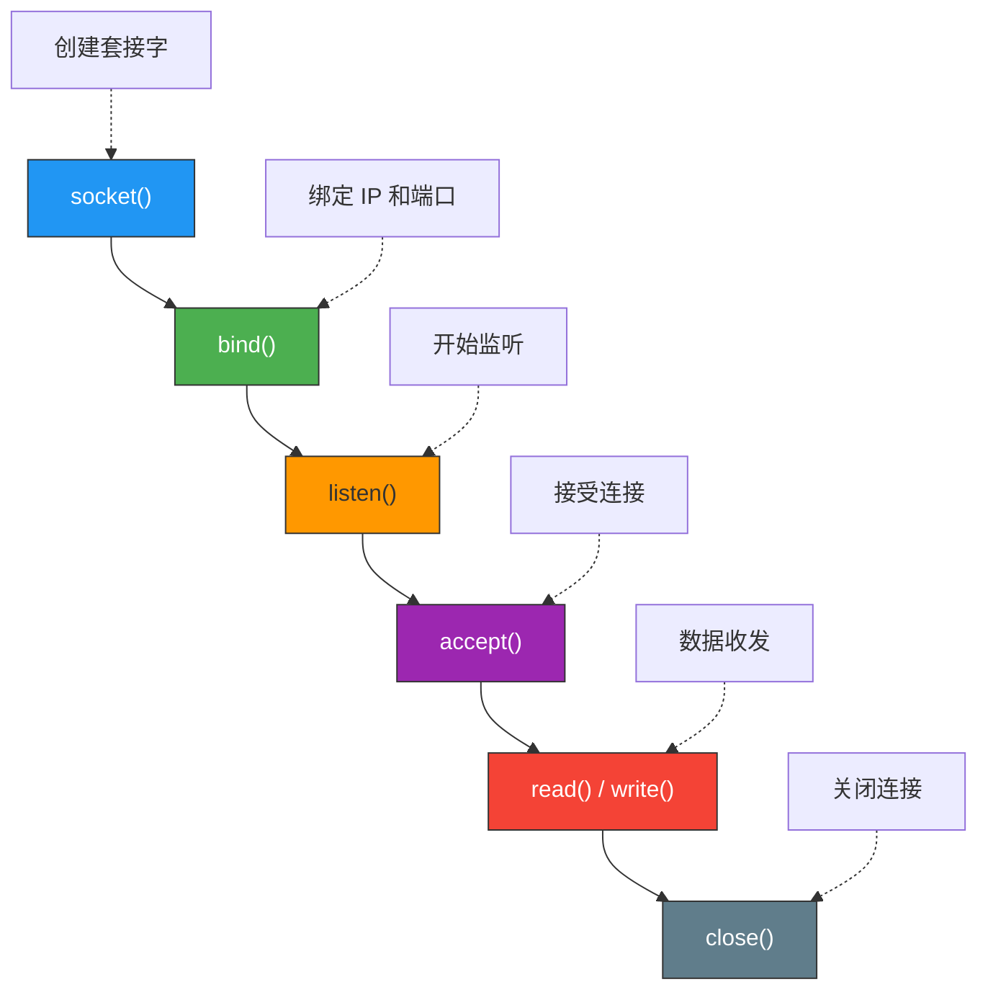
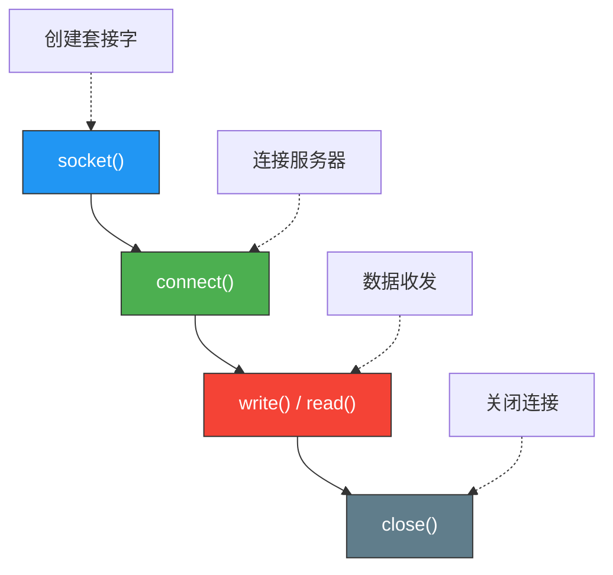
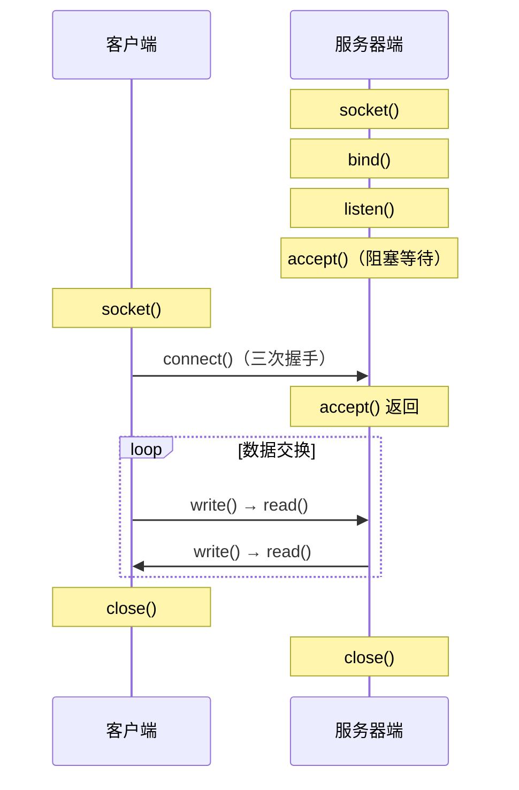

# 理解网络编程和套接字

> 网络编程的本质是"进程间通信"——只不过这两个进程不在同一台机器上。Socket 就是这种跨机器通信的"电话"。

## 一、什么是网络编程？

### 1.1 从进程间通信说起

同一台机器上的两个进程可以通过管道、共享内存等方式通信。但如果两个进程分布在不同机器上呢？这就需要**网络编程**——通过网络协议实现跨主机的数据交换。



### 1.2 网络编程的核心问题

网络编程要解决的核心问题只有一个：**如何让两台机器上的进程互相找到对方并交换数据？**

答案分三步：
1. **找到对方的主机** → IP 地址
2. **找到对方的进程** → 端口号
3. **交换数据** → Socket 提供的读写接口

---

## 二、什么是套接字（Socket）？

### 2.1 Socket 的定义

Socket（套接字）是**网络通信的端点**，是应用层和传输层之间的接口。可以把它想象成电话：

- **创建 Socket** → 买一部电话
- **绑定地址** → 装上电话号码
- **监听连接** → 把电话挂上等待来电
- **建立连接** → 拨号/接听
- **收发数据** → 通话
- **关闭连接** → 挂断

### 2.2 一切皆文件

在 Linux 中，Socket 也是一个**文件描述符**（file descriptor）。网络 I/O 和文件 I/O 使用相同的系统调用：



### 2.3 文件描述符

文件描述符（fd）是操作系统分配的非负整数，用于标识已打开的文件或 Socket：

| fd 值 | 用途 |
|-------|------|
| 0 | 标准输入（stdin） |
| 1 | 标准输出（stdout） |
| 2 | 标准错误（stderr） |
| 3+ | 由 open/socket 等调用返回 |

```c
#include <stdio.h>
#include <fcntl.h>
#include <unistd.h>

int main() {
    // 打开文件，返回文件描述符
    int fd = open("test.txt", O_RDONLY);
    printf("文件描述符: %d\n", fd);  // 通常为 3

    // 创建 socket，返回的也是文件描述符
    int sock = socket(AF_INET, SOCK_STREAM, 0);
    printf("Socket 描述符: %d\n", sock);  // 通常为 4

    close(fd);
    close(sock);
    return 0;
}
```

---

## 三、Socket 编程四步流程

### 3.1 服务器端流程



### 3.2 客户端流程



### 3.3 完整交互时序



---

## 四、核心函数详解

### 4.1 socket() — 创建套接字

```c
#include <sys/socket.h>

int socket(int domain, int type, int protocol);
```

| 参数 | 含义 | 常用值 |
|------|------|-------|
| domain | 协议族 | AF_INET（IPv4）、AF_INET6（IPv6） |
| type | 套接字类型 | SOCK_STREAM（TCP）、SOCK_DGRAM（UDP） |
| protocol | 协议 | 通常设 0，由系统自动选择 |

返回值：成功返回文件描述符（≥0），失败返回 -1。

```c
// 创建 TCP 套接字
int tcp_sock = socket(AF_INET, SOCK_STREAM, 0);

// 创建 UDP 套接字
int udp_sock = socket(AF_INET, SOCK_DGRAM, 0);

if (tcp_sock == -1) {
    perror("socket() failed");
    exit(1);
}
```

### 4.2 bind() — 绑定地址

```c
int bind(int sockfd, const struct sockaddr *addr, socklen_t addrlen);
```

将套接字与特定的 IP 地址和端口号绑定。

```c
struct sockaddr_in serv_addr;
memset(&serv_addr, 0, sizeof(serv_addr));
serv_addr.sin_family = AF_INET;
serv_addr.sin_addr.s_addr = htonl(INADDR_ANY);  // 绑定所有可用接口
serv_addr.sin_port = htons(8080);                // 端口号

if (bind(tcp_sock, (struct sockaddr*)&serv_addr, sizeof(serv_addr)) == -1) {
    perror("bind() failed");
    exit(1);
}
```

::: important INADDR_ANY
`INADDR_ANY`（0.0.0.0）表示绑定本机所有网络接口。服务器通常使用它，这样无论客户端通过哪个 IP 访问都能连接。
:::

### 4.3 listen() — 开始监听

```c
int listen(int sockfd, int backlog);
```

| 参数 | 含义 |
|------|------|
| sockfd | 套接字描述符 |
| backlog | 等待连接队列的最大长度 |

```c
if (listen(tcp_sock, 5) == -1) {
    perror("listen() failed");
    exit(1);
}
```

::: tip 关于 backlog
`backlog` 不是最大连接数，而是**等待 accept 的未完成连接队列长度**。超过此长度的连接请求会被拒绝。Linux 中实际队列长度取 `backlog` 和 `/proc/sys/net/core/somaxconn` 的较小值。
:::

### 4.4 accept() — 接受连接

```c
int accept(int sockfd, struct sockaddr *addr, socklen_t *addrlen);
```

accept() 会**阻塞**直到有客户端连接。返回一个新的套接字描述符，专门用于与该客户端通信。

```c
struct sockaddr_in clnt_addr;
socklen_t clnt_addr_size = sizeof(clnt_addr);

int clnt_sock = accept(tcp_sock, (struct sockaddr*)&clnt_addr, &clnt_addr_size);
if (clnt_sock == -1) {
    perror("accept() failed");
    exit(1);
}

// clnt_sock 是与客户端通信的专用套接字
// tcp_sock 继续监听其他客户端连接
```

::: important 两个套接字的区别
- `tcp_sock`（监听套接字）：负责接受新连接，就像总台电话
- `clnt_sock`（通信套接字）：负责与特定客户端数据交互，就像分机
:::

---

## 五、最小服务器示例

下面是一个最简单的 TCP 服务器，接受连接后发送一条欢迎消息：

```c
#include <stdio.h>
#include <stdlib.h>
#include <string.h>
#include <unistd.h>
#include <sys/socket.h>
#include <arpa/inet.h>

int main() {
    // 1. 创建套接字
    int serv_sock = socket(AF_INET, SOCK_STREAM, 0);
    if (serv_sock == -1) {
        perror("socket() failed");
        exit(1);
    }

    // 2. 绑定地址
    struct sockaddr_in serv_addr;
    memset(&serv_addr, 0, sizeof(serv_addr));
    serv_addr.sin_family = AF_INET;
    serv_addr.sin_addr.s_addr = htonl(INADDR_ANY);
    serv_addr.sin_port = htons(8080);

    if (bind(serv_sock, (struct sockaddr*)&serv_addr, sizeof(serv_addr)) == -1) {
        perror("bind() failed");
        close(serv_sock);
        exit(1);
    }

    // 3. 监听
    if (listen(serv_sock, 5) == -1) {
        perror("listen() failed");
        close(serv_sock);
        exit(1);
    }

    printf("Server listening on port 8080...\n");

    // 4. 接受连接
    struct sockaddr_in clnt_addr;
    socklen_t clnt_len = sizeof(clnt_addr);
    int clnt_sock = accept(serv_sock, (struct sockaddr*)&clnt_addr, &clnt_len);
    if (clnt_sock == -1) {
        perror("accept() failed");
        close(serv_sock);
        exit(1);
    }

    printf("Client connected: %s\n", inet_ntoa(clnt_addr.sin_addr));

    // 5. 发送消息
    char msg[] = "Hello from server!\n";
    write(clnt_sock, msg, strlen(msg));

    // 6. 关闭连接
    close(clnt_sock);
    close(serv_sock);

    return 0;
}
```

```bash
# 编译运行
gcc -o hello_server hello_server.c
./hello_server

# 另一个终端用 nc 测试
nc 127.0.0.1 8080
# 输出：Hello from server!
```

---

## 六、Linux 文件 I/O 回顾

由于 Socket 也是文件描述符，Linux 文件 I/O 函数可以直接用在 Socket 上：

| 文件 I/O | Socket 用法 |
|---------|------------|
| `open()` | `socket()` 替代 |
| `read()` | 从 Socket 读取数据 |
| `write()` | 向 Socket 写入数据 |
| `close()` | 关闭 Socket |

```c
#include <fcntl.h>
#include <unistd.h>

// 文件读写
int fd = open("data.txt", O_RDONLY);
char buf[256];
ssize_t n = read(fd, buf, sizeof(buf));
write(STDOUT_FILENO, buf, n);
close(fd);

// Socket 读写 — 完全相同的接口
char sock_buf[256];
ssize_t m = read(clnt_sock, sock_buf, sizeof(sock_buf));
write(clnt_sock, sock_buf, m);
close(clnt_sock);
```

::: warning read() 的返回值
`read()` 返回值有三种情况：
- **> 0**：实际读取的字节数
- **= 0**：对端关闭连接（EOF）
- **-1**：出错（检查 errno）

很多新手忘记处理返回值为 0 的情况，导致死循环。
:::

---

::: tip 面试速查
- **Socket 的本质**：它是网络通信的端点，在 Linux 中是文件描述符。
- **服务器四步**：socket → bind → listen → accept
- **客户端两步**：socket → connect
- **accept 返回的是新套接字**，原来的监听套接字继续等待其他连接。
- **read 返回 0 表示对端关闭**，不是错误。
:::

---

::: info 原著参考
本文内容参考自尹圣雨《TCP/IP 网络编程》第 1 章"理解网络编程和套接字"。
:::
