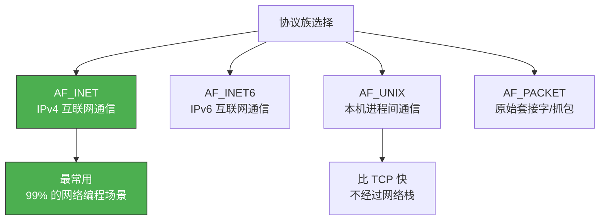
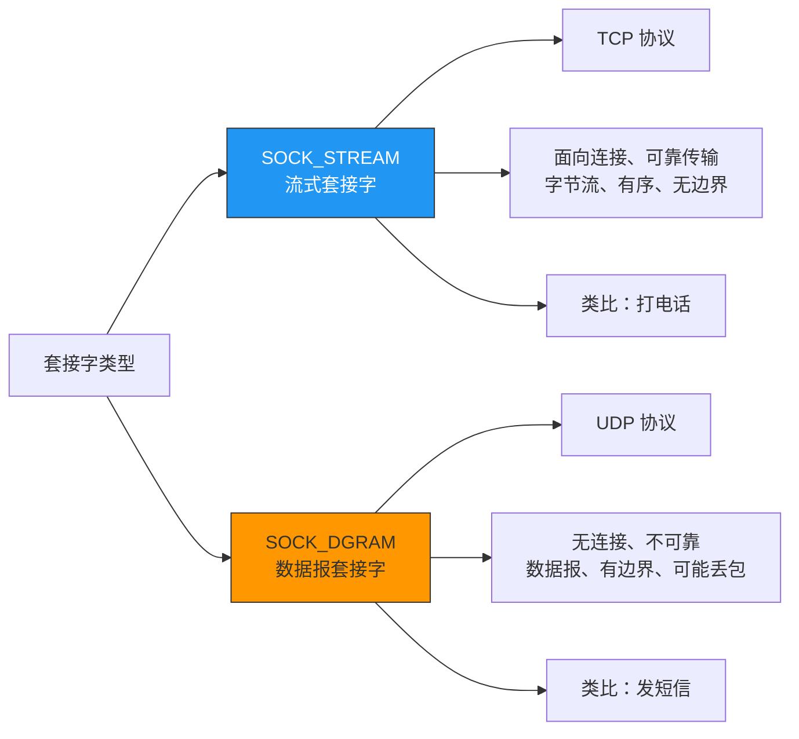

# 套接字类型与协议设置

> 创建套接字时的三个参数——domain、type、protocol——决定了这个 Socket 的"通信方式"。理解它们，才能选择正确的传输协议。

## 一、socket() 函数回顾

```c
int socket(int domain, int type, int protocol);
```

三个参数分别回答了三个问题：

| 参数 | 问题 | 类比 |
|------|------|------|
| domain | 用什么网络协议？ | 用邮政还是快递？ |
| type | 用什么传输方式？ | 用挂号信还是平信？ |
| protocol | 具体用哪个协议？ | 用顺丰还是圆通？ |

---

## 二、协议族（domain）

### 2.1 常见协议族

| 协议族 | 常量 | 含义 |
|--------|------|------|
| IPv4 | `AF_INET` | 最常用的互联网协议 |
| IPv6 | `AF_INET6` | 下一代互联网协议 |
| 本地通信 | `AF_UNIX` / `AF_LOCAL` | 同一机器上的进程间通信 |
| 底层接口 | `AF_PACKET` | 直接访问数据链路层 |



### 2.2 AF_INET vs AF_UNIX

| 对比项 | AF_INET | AF_UNIX |
|--------|---------|---------|
| 通信范围 | 跨主机 | 同一主机 |
| 地址类型 | IP + 端口 | 文件路径 |
| 性能 | 经过完整网络栈 | 内核直接拷贝 |
| 用途 | 网络服务 | 本地高性能 IPC |

::: important AF_UNIX 的妙用
很多数据库（如 MySQL、Redis）在本地连接时默认使用 Unix 域套接字，比走 TCP 的 127.0.0.1 更快。这就是为什么 `mysql -h localhost` 比 `mysql -h 127.0.0.1` 性能更好。
:::

---

## 三、套接字类型（type）

### 3.1 两种主要类型



### 3.2 SOCK_STREAM（TCP）的详细特征

| 特征 | 说明 |
|------|------|
| 面向连接 | 通信前必须建立连接（三次握手） |
| 可靠传输 | 确认重传机制保证数据到达 |
| 有序交付 | 序列号保证数据按序到达 |
| 字节流 | 无消息边界，多次 write 可能被一次 read 读出 |
| 流量控制 | 滑动窗口防止发送方淹没接收方 |
| 拥塞控制 | 避免网络拥塞 |

### 3.3 SOCK_DGRAM（UDP）的详细特征

| 特征 | 说明 |
|------|------|
| 无连接 | 不需要建立连接，直接发送 |
| 不可靠 | 不保证到达、不保证顺序 |
| 有边界 | 每次 sendto 对应一次 recvfrom |
| 无流量控制 | 发送速度不受限制 |
| 无拥塞控制 | 不退让，可能加剧网络拥塞 |

### 3.4 TCP vs UDP 选择指南

| 场景 | 推荐 | 原因 |
|------|------|------|
| Web 服务 | TCP | 数据完整性要求高 |
| 文件传输 | TCP | 不能丢数据 |
| 视频直播 | UDP | 实时性优先，丢几帧无所谓 |
| DNS 查询 | UDP | 查询报文小，快速响应 |
| 游戏同步 | UDP | 延迟敏感，旧数据无价值 |
| 聊天消息 | TCP | 消息不能丢失 |

::: tip 面试速查
- **TCP 的"无边界"**：发送 100 字节分两次 write（50+50），接收方可能一次 read 收到 100 字节。应用层需要自己定义消息边界。
- **UDP 的"有边界"**：每次 sendto 发送的数据对应一次 recvfrom 接收，不会合并也不会拆分。
:::

---

## 四、协议（protocol）

### 4.1 为什么还需要第三个参数？

通常设为 0，让系统根据 domain 和 type 自动选择。但在某些情况下需要显式指定：

| domain | type | protocol=0 对应 | 显式指定 |
|--------|------|-----------------|---------|
| AF_INET | SOCK_STREAM | IPPROTO_TCP（6） | `IPPROTO_TCP` |
| AF_INET | SOCK_DGRAM | IPPROTO_UDP（17） | `IPPROTO_UDP` |
| AF_INET | SOCK_RAW | — | 必须指定 `IPPROTO_ICMP` 等 |

```c
// 以下两种写法等价
int sock1 = socket(AF_INET, SOCK_STREAM, 0);
int sock2 = socket(AF_INET, SOCK_STREAM, IPPROTO_TCP);

// 原始套接字必须指定协议
int raw_sock = socket(AF_INET, SOCK_RAW, IPPROTO_ICMP);  // 用于发送 ICMP
```

### 4.2 SOCK_RAW 原始套接字

原始套接字可以直接访问 IP 层，用于：

- 实现 ping 命令（构造 ICMP 报文）
- 网络抓包工具
- 自定义协议实现

```c
// 创建原始套接字需要 root 权限
int raw_sock = socket(AF_INET, SOCK_RAW, IPPROTO_ICMP);
if (raw_sock == -1) {
    perror("socket() failed — need root?");
    exit(1);
}
```

::: warning 安全警告
原始套接字功能强大但危险，可以伪造 IP 地址和协议头部。大多数操作系统要求 root 权限才能创建。
:::

---

## 五、套接字创建的完整代码

```c
#include <stdio.h>
#include <stdlib.h>
#include <sys/socket.h>
#include <netinet/in.h>

void error_handling(const char *msg) {
    perror(msg);
    exit(1);
}

int main() {
    // 创建 TCP 套接字
    int tcp_sock = socket(AF_INET, SOCK_STREAM, 0);
    if (tcp_sock == -1)
        error_handling("TCP socket() failed");
    printf("TCP socket created: %d\n", tcp_sock);

    // 创建 UDP 套接字
    int udp_sock = socket(AF_INET, SOCK_DGRAM, 0);
    if (udp_sock == -1)
        error_handling("UDP socket() failed");
    printf("UDP socket created: %d\n", udp_sock);

    // 验证套接字类型
    int type;
    socklen_t optlen = sizeof(type);
    getsockopt(tcp_sock, SOL_SOCKET, SO_TYPE, &type, &optlen);
    printf("TCP socket type: %d (SOCK_STREAM=%d)\n", type, SOCK_STREAM);

    getsockopt(udp_sock, SOL_SOCKET, SO_TYPE, &type, &optlen);
    printf("UDP socket type: %d (SOCK_DGRAM=%d)\n", type, SOCK_DGRAM);

    close(tcp_sock);
    close(udp_sock);
    return 0;
}
```

```bash
gcc -o sock_type sock_type.c && ./sock_type
# TCP socket created: 3
# UDP socket created: 4
# TCP socket type: 1 (SOCK_STREAM=1)
# UDP socket type: 2 (SOCK_DGRAM=2)
```

---

## 六、协议族与地址族的关系

| 协议族（Protocol Family） | 地址族（Address Family） | 地址结构体 |
|--------------------------|------------------------|-----------|
| PF_INET | AF_INET | `struct sockaddr_in` |
| PF_INET6 | AF_INET6 | `struct sockaddr_in6` |
| PF_UNIX | AF_UNIX | `struct sockaddr_un` |

::: important PF_ vs AF_
- `PF_` 前缀表示协议族（Protocol Family）
- `AF_` 前缀表示地址族（Address Family）
- 在实际代码中，`PF_INET` 和 `AF_INET` 的值完全相同，可以互换使用
- 语义上，`socket()` 的第一个参数用 `PF_`，地址结构体用 `AF_`，但混用也不会出错
:::

---

::: tip 面试速查
- **SOCK_STREAM vs SOCK_DGRAM**：TCP 可靠字节流 vs UDP 不可靠数据报。
- **protocol 通常设 0**，系统自动选择 TCP 或 UDP。
- **TCP 无消息边界**：应用层需要自己分割消息（如 HTTP 的 Content-Length）。
- **UDP 有消息边界**：每次 sendto 对应一次 recvfrom。
- **原始套接字需要 root 权限**，可以构造 ICMP 等自定义报文。
:::

---

::: info 原著参考
本文内容参考自尹圣雨《TCP/IP 网络编程》第 2 章"套接字类型与协议设置"。
:::
