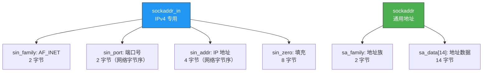
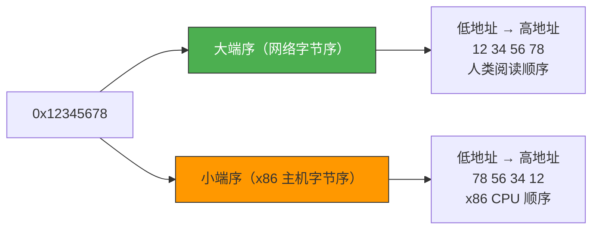

# 地址族与协议族

> 网络通信需要知道"发给谁"——IP 地址和端口号就是网络世界的"收件地址"。但计算机存地址的方式和人看地址的方式不同，字节序和地址转换是必须跨越的鸿沟。

## 一、IPv4 地址结构体

### 1.1 sockaddr_in 结构体

Socket API 统一使用 `struct sockaddr`，但 IPv4 实际使用的是 `struct sockaddr_in`：

```c
struct sockaddr_in {
    sa_family_t    sin_family;   // 地址族：AF_INET
    in_port_t      sin_port;     // 16 位端口号（网络字节序）
    struct in_addr sin_addr;     // 32 位 IPv4 地址（网络字节序）
    char           sin_zero[8];  // 填充，使大小与 sockaddr 一致
};

struct in_addr {
    in_addr_t s_addr;            // 32 位 IPv4 地址
};
```



### 1.2 为什么要两个结构体？

Socket API 设计时为了支持多种协议族，使用了 `struct sockaddr` 作为通用接口。但 IPv4 地址是 `IP + 端口`，IPv6 地址更长，UNIX 域套接字是文件路径——格式各不相同。

**解决方案**：每种协议族定义自己的地址结构体，调用时强制类型转换为 `struct sockaddr*`。

```c
// 定义 IPv4 地址
struct sockaddr_in addr;
addr.sin_family = AF_INET;
addr.sin_port = htons(8080);
addr.sin_addr.s_addr = htonl(INADDR_ANY);

// 强制转换后传给 bind
bind(sockfd, (struct sockaddr*)&addr, sizeof(addr));
```

::: important 强制转换是必须的
`bind()`、`connect()`、`accept()` 等函数的参数类型是 `struct sockaddr*`，必须从 `sockaddr_in*` 强制转换。不转换会编译警告，运行时也可能出问题。
:::

---

## 二、字节序

### 2.1 大端序 vs 小端序

**大端序（Big Endian）**：高位字节存放在低地址
**小端序（Little Endian）**：高位字节存放在高地址

以 `0x12345678` 为例：

```
地址:     0x00  0x01  0x02  0x03
大端序:   0x12  0x34  0x56  0x78   ← 网络字节序
小端序:   0x78  0x56  0x34  0x12   ← x86 主机字节序
```



### 2.2 网络字节序

网络协议规定使用**大端序**（网络字节序）。如果主机是小端序（如 x86），就必须在发送前转换。

### 2.3 字节序转换函数

```c
#include <arpa/inet.h>

// 主机字节序 → 网络字节序
uint32_t htonl(uint32_t hostlong);    // 32 位（IP 地址）
uint16_t htons(uint16_t hostshort);   // 16 位（端口号）

// 网络字节序 → 主机字节序
uint32_t ntohl(uint32_t netlong);     // 32 位
uint16_t ntohs(uint16_t netshort);    // 16 位
```

记忆口诀：**h**ost **to** **n**etwork **l**ong → `htonl`

```c
// 端口号转换
addr.sin_port = htons(8080);     // 主机序 → 网络序

// IP 地址转换
addr.sin_addr.s_addr = htonl(INADDR_ANY);  // 主机序 → 网络序
```

### 2.4 验证本机字节序

```c
#include <stdio.h>

int main() {
    int num = 0x12345678;
    char *p = (char*)&num;

    if (*p == 0x78) {
        printf("小端序（Little Endian）\n");
    } else if (*p == 0x12) {
        printf("大端序（Big Endian）\n");
    }

    // 更简单的方法
    printf("htonl(0x12345678) = 0x%x\n", htonl(0x12345678));
    // x86 上输出：htonl(0x12345678) = 0x78563412
    return 0;
}
```

::: tip 面试速查
- **网络字节序 = 大端序**，x86 主机字节序 = 小端序。
- `htons` 用于端口号（16 位），`htonl` 用于 IP 地址（32 位）。
- 即使主机是大端序，也应该使用转换函数——这样代码可移植。
:::

---

## 三、地址转换函数

### 3.1 人看的 vs 机器看的

人类习惯用点分十进制：`192.168.1.10`
机器使用 32 位整数：`0xC0A8010A`

### 3.2 inet_addr / inet_aton / inet_ntoa

```c
#include <arpa/inet.h>

// 点分十进制 → 网络字节序整数（已废弃，但仍可用）
in_addr_t inet_addr(const char *cp);

// 点分十进制 → 网络字节序整数（推荐，有错误检测）
int inet_aton(const char *cp, struct in_addr *inp);

// 网络字节序整数 → 点分十进制
char *inet_ntoa(struct in_addr in);
```

```c
// inet_addr 用法
addr.sin_addr.s_addr = inet_addr("192.168.1.10");

// inet_aton 用法（推荐）
if (inet_aton("192.168.1.10", &addr.sin_addr) == 0) {
    printf("Invalid IP address\n");
}

// inet_ntoa 用法
struct in_addr addr;
addr.s_addr = htonl(0xC0A8010A);
printf("IP: %s\n", inet_ntoa(addr));  // 输出: 192.168.1.10
```

### 3.3 inet_pton / inet_ntop（更现代）

这两个函数同时支持 IPv4 和 IPv6，推荐使用：

```c
// 字符串 → 二进制
int inet_pton(int af, const char *src, void *dst);

// 二进制 → 字符串
const char *inet_ntop(int af, const void *src, char *dst, socklen_t size);
```

```c
// IPv4
struct sockaddr_in addr4;
inet_pton(AF_INET, "192.168.1.10", &addr4.sin_addr);

char str4[INET_ADDRSTRLEN];  // 16 字节
inet_ntop(AF_INET, &addr4.sin_addr, str4, sizeof(str4));

// IPv6
struct sockaddr_in6 addr6;
inet_pton(AF_INET6, "::1", &addr6.sin6_addr);

char str6[INET6_ADDRSTRLEN];  // 46 字节
inet_ntop(AF_INET6, &addr6.sin6_addr, str6, sizeof(str6));
```

| 函数 | IPv4 | IPv6 | 错误检测 | 推荐 |
|------|------|------|---------|------|
| `inet_addr` | ✅ | ❌ | 差 | ❌ |
| `inet_aton` | ✅ | ❌ | 好 | 可用 |
| `inet_ntoa` | ✅ | ❌ | — | 可用 |
| `inet_pton` | ✅ | ✅ | 好 | ✅ |
| `inet_ntop` | ✅ | ✅ | 好 | ✅ |

::: warning inet_ntoa 的陷阱
`inet_ntoa` 返回的是指向**静态缓冲区**的指针，不是线程安全的。连续调用会覆盖之前的结果：
```c
char *a = inet_ntoa(addr1);  // "192.168.1.10"
char *b = inet_ntoa(addr2);  // "10.0.0.1"
printf("%s %s\n", a, b);     // 可能输出: "10.0.0.1 10.0.0.1"
```
多线程环境请使用 `inet_ntop`。
:::

---

## 四、INADDR_ANY 详解

### 4.1 为什么要绑定所有接口？

一台机器可能有多个网卡，每个网卡有不同的 IP：

```
eth0: 192.168.1.10   （内网）
eth1: 10.0.0.5       （另一个内网）
wlan0: 172.16.0.3    （WiFi）
lo: 127.0.0.1        （环回）
```

如果 bind 到特定 IP（如 192.168.1.10），只有来自该网卡连接才能被接受。绑定 `INADDR_ANY` 则所有网卡的连接都能接受。

```c
// 绑定所有接口
serv_addr.sin_addr.s_addr = htonl(INADDR_ANY);

// 等价于
serv_addr.sin_addr.s_addr = inet_addr("0.0.0.0");
```

### 4.2 客户端不需要 bind？

客户端通常不调用 `bind()`，`connect()` 时操作系统会**自动分配一个临时端口**（ephemeral port）。

```bash
# 查看临时端口范围
cat /proc/sys/net/ipv4/ip_local_port_range
# 32768   60999
```

---

## 五、完整地址初始化示例

```c
#include <stdio.h>
#include <stdlib.h>
#include <string.h>
#include <sys/socket.h>
#include <arpa/inet.h>

int main() {
    struct sockaddr_in addr;
    memset(&addr, 0, sizeof(addr));

    // 方式一：用 INADDR_ANY
    addr.sin_family = AF_INET;
    addr.sin_port = htons(8080);
    addr.sin_addr.s_addr = htonl(INADDR_ANY);

    // 方式二：用 inet_addr
    addr.sin_addr.s_addr = inet_addr("192.168.1.10");

    // 方式三：用 inet_aton（推荐）
    inet_aton("192.168.1.10", &addr.sin_addr);

    // 方式四：用 inet_pton（最推荐，支持 IPv6）
    inet_pton(AF_INET, "192.168.1.10", &addr.sin_addr);

    // 打印地址信息
    printf("Port (host order): %d\n", ntohs(addr.sin_port));
    printf("IP: %s\n", inet_ntoa(addr.sin_addr));

    return 0;
}
```

---

::: tip 面试速查
- **sockaddr_in 是 IPv4 地址结构**，传参时需强转为 `sockaddr*`。
- **网络字节序 = 大端序**，端口号用 `htons`，IP 地址用 `htonl` 转换。
- **inet_pton/inet_ntop** 同时支持 IPv4/IPv6，是推荐做法。
- **INADDR_ANY** 绑定所有网络接口，服务器端推荐使用。
- **inet_ntoa 不是线程安全的**，多线程用 inet_ntop。
:::

---

::: info 原著参考
本文内容参考自尹圣雨《TCP/IP 网络编程》第 3 章"地址族与数据序列"。
:::
