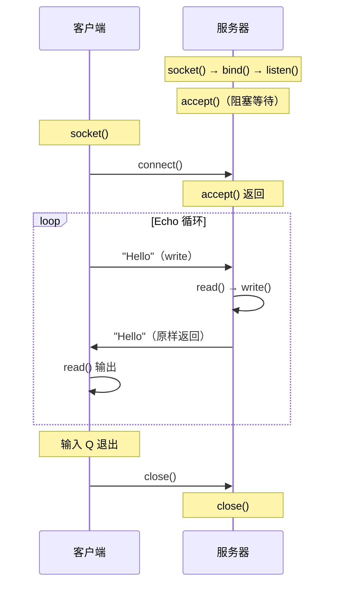
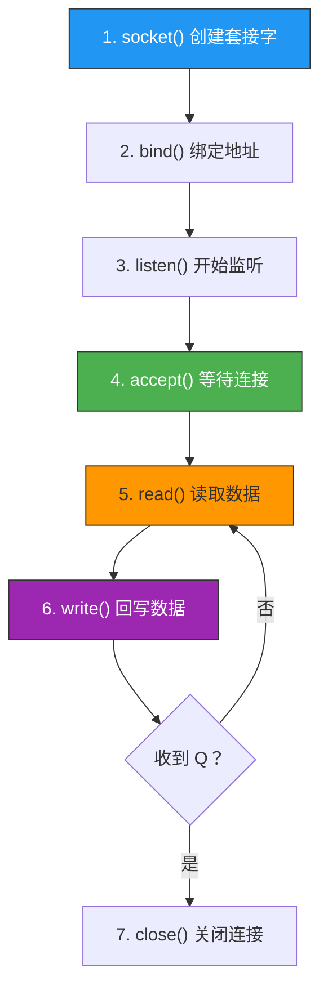

# 基于TCP的服务器端客户端1

> 前三章学了概念，这一章来写真正的代码。我们实现一个完整的 echo 服务器/客户端——客户端发什么，服务器就原样回什么。

## 一、Echo 服务器/客户端模型

### 1.1 交互流程



### 1.2 服务器端实现步骤



---

## 二、完整 Echo 服务器代码

```c
// echo_server.c
#include <stdio.h>
#include <stdlib.h>
#include <string.h>
#include <unistd.h>
#include <sys/socket.h>
#include <arpa/inet.h>

#define BUF_SIZE 1024

void error_handling(const char *msg) {
    perror(msg);
    exit(1);
}

int main(int argc, char *argv[]) {
    if (argc != 2) {
        printf("Usage: %s <port>\n", argv[0]);
        exit(1);
    }

    // 1. 创建套接字
    int serv_sock = socket(AF_INET, SOCK_STREAM, 0);
    if (serv_sock == -1)
        error_handling("socket() failed");

    // 2. 绑定地址
    struct sockaddr_in serv_addr;
    memset(&serv_addr, 0, sizeof(serv_addr));
    serv_addr.sin_family = AF_INET;
    serv_addr.sin_addr.s_addr = htonl(INADDR_ANY);
    serv_addr.sin_port = htons(atoi(argv[1]));

    if (bind(serv_sock, (struct sockaddr*)&serv_addr, sizeof(serv_addr)) == -1)
        error_handling("bind() failed");

    // 3. 监听
    if (listen(serv_sock, 5) == -1)
        error_handling("listen() failed");

    // 4. 接受连接
    struct sockaddr_in clnt_addr;
    socklen_t clnt_addr_size = sizeof(clnt_addr);
    int clnt_sock = accept(serv_sock, (struct sockaddr*)&clnt_addr, &clnt_addr_size);
    if (clnt_sock == -1)
        error_handling("accept() failed");

    printf("Client connected: %s:%d\n",
           inet_ntoa(clnt_addr.sin_addr), ntohs(clnt_addr.sin_port));

    // 5. Echo 循环
    char buf[BUF_SIZE];
    int str_len;
    while ((str_len = read(clnt_sock, buf, BUF_SIZE - 1)) > 0) {
        buf[str_len] = '\0';
        printf("Received: %s", buf);
        write(clnt_sock, buf, str_len);  // 原样回写
    }

    if (str_len == 0)
        printf("Client disconnected\n");
    else
        error_handling("read() failed");

    // 6. 关闭连接
    close(clnt_sock);
    close(serv_sock);

    return 0;
}
```

---

## 三、完整 Echo 客户端代码

```c
// echo_client.c
#include <stdio.h>
#include <stdlib.h>
#include <string.h>
#include <unistd.h>
#include <sys/socket.h>
#include <arpa/inet.h>

#define BUF_SIZE 1024

void error_handling(const char *msg) {
    perror(msg);
    exit(1);
}

int main(int argc, char *argv[]) {
    if (argc != 3) {
        printf("Usage: %s <IP> <port>\n", argv[0]);
        exit(1);
    }

    // 1. 创建套接字
    int sock = socket(AF_INET, SOCK_STREAM, 0);
    if (sock == -1)
        error_handling("socket() failed");

    // 2. 设置服务器地址
    struct sockaddr_in serv_addr;
    memset(&serv_addr, 0, sizeof(serv_addr));
    serv_addr.sin_family = AF_INET;
    serv_addr.sin_port = htons(atoi(argv[2]));
    inet_pton(AF_INET, argv[1], &serv_addr.sin_addr);

    // 3. 连接服务器
    if (connect(sock, (struct sockaddr*)&serv_addr, sizeof(serv_addr)) == -1)
        error_handling("connect() failed");

    printf("Connected to server\n");

    // 4. 数据收发循环
    char buf[BUF_SIZE];
    while (1) {
        fputs("Input message (Q to quit): ", stdout);
        fgets(buf, BUF_SIZE, stdin);

        // 输入 Q 退出
        if (!strcmp(buf, "q\n") || !strcmp(buf, "Q\n"))
            break;

        // 发送消息
        int write_len = write(sock, buf, strlen(buf));
        if (write_len == -1)
            error_handling("write() failed");

        // 接收回显
        int total_read = 0;
        while (total_read < write_len) {
            int read_len = read(sock, buf + total_read, BUF_SIZE - 1 - total_read);
            if (read_len == -1)
                error_handling("read() failed");
            if (read_len == 0)
                break;  // 服务器关闭
            total_read += read_len;
        }
        buf[total_read] = '\0';
        printf("Echo from server: %s", buf);
    }

    // 5. 关闭连接
    close(sock);

    return 0;
}
```

---

## 四、编译与运行

```bash
# 编译
gcc -o echo_server echo_server.c
gcc -o echo_client echo_client.c

# 终端 1：启动服务器
./echo_server 8080

# 终端 2：启动客户端
./echo_client 127.0.0.1 8080
```

运行效果：

```
# 客户端输出
Connected to server
Input message (Q to quit): Hello
Echo from server: Hello
Input message (Q to quit): World
Echo from server: World
Input message (Q to quit): Q

# 服务器输出
Client connected: 127.0.0.1:xxxxx
Received: Hello
Received: World
Client disconnected
```

---

## 五、关键问题：回显客户端的 BUG

### 5.1 问题描述

上面的客户端代码中，有一个常见但容易被忽略的问题：

```c
// 危险写法！
write(sock, buf, strlen(buf));
int str_len = read(sock, buf, BUF_SIZE - 1);  // 可能读不完整
```

**问题**：TCP 是字节流，没有消息边界。一次 `write` 发送 30 字节，对方可能分两次 `read`（先 20 再 10），也可能一次读完。

### 5.2 正确做法

需要循环读取，直到收到的字节数等于发送的字节数：

```c
int write_len = write(sock, buf, strlen(buf));

int total_read = 0;
while (total_read < write_len) {
    int read_len = read(sock, buf + total_read, BUF_SIZE - 1 - total_read);
    if (read_len <= 0) break;
    total_read += read_len;
}
```


::: important TCP 字节流的核心问题
- **write 一次 ≠ read 一次**：TCP 不保留消息边界。
- 多次 write 的数据可能被合并（Nagle 算法），也可能被拆分（TCP 分段）。
- 应用层必须自己处理消息边界，常见方案：
  - 固定长度消息
  - 用分隔符（如 HTTP 的 `\r\n`）
  - 用长度前缀（先发长度，再发数据）
:::

---

## 六、用 telnet/nc 测试服务器

不写客户端也能测试：

```bash
# 方法一：telnet
telnet 127.0.0.1 8080
Hello        ← 你输入的
Hello        ← 服务器回显

# 方法二：nc（netcat）
nc 127.0.0.1 8080
Hello        ← 你输入的
Hello        ← 服务器回显

# 方法三：用 echo 管道
echo "Hello" | nc 127.0.0.1 8080
Hello        ← 服务器回显
```

---

::: tip 面试速查
- **TCP 服务器标准流程**：socket → bind → listen → accept → read/write → close
- **TCP 客户端标准流程**：socket → connect → write/read → close
- **accept 返回新套接字**用于通信，原套接字继续监听
- **TCP 字节流无边界**：一次 write 不等于一次 read，必须循环读取或定义消息边界
- **read 返回 0 = 对端关闭**，返回 -1 = 出错
:::

---

::: info 原著参考
本文内容参考自尹圣雨《TCP/IP 网络编程》第 4 章"基于 TCP 的服务器端/客户端（1）"。
:::
