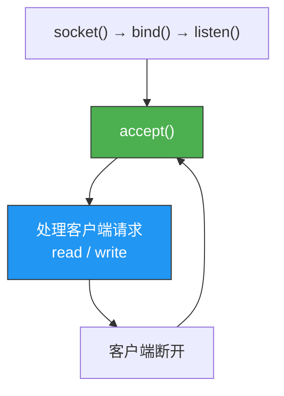
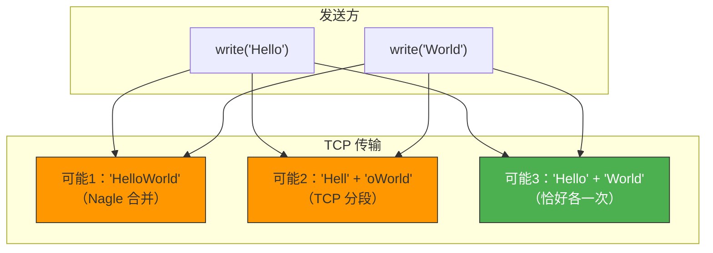
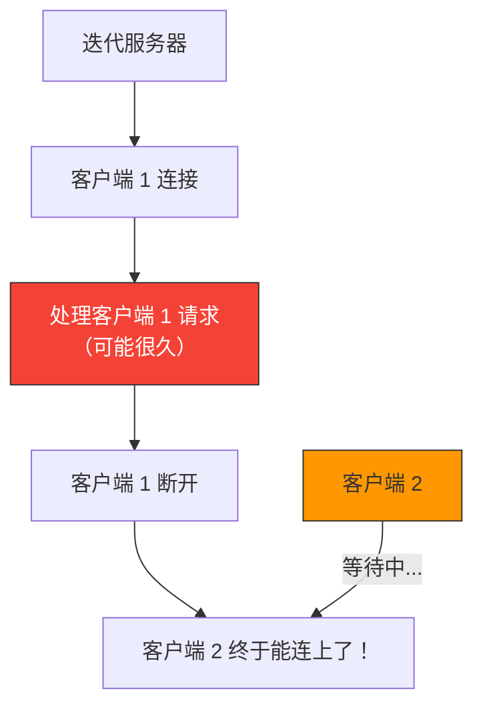

# 基于TCP的服务器端客户端2

> 上一篇的 echo 服务器只能服务一个客户端就退出了。这一篇我们让它变成**迭代服务器**——服务完一个客户端后继续服务下一个，同时解决回显客户端的粘包问题。

## 一、迭代服务器

### 1.1 从单次服务到迭代服务

上一篇的服务器 accept 一次就结束了，实际上服务器应该是**永不停止**的循环：



### 1.2 迭代服务器代码

```c
// iter_server.c — 迭代 echo 服务器
#include <stdio.h>
#include <stdlib.h>
#include <string.h>
#include <unistd.h>
#include <sys/socket.h>
#include <arpa/inet.h>

#define BUF_SIZE 1024

void error_handling(const char *msg) {
    perror(msg);
    exit(1);
}

int main(int argc, char *argv[]) {
    if (argc != 2) {
        printf("Usage: %s <port>\n", argv[0]);
        exit(1);
    }

    int serv_sock = socket(AF_INET, SOCK_STREAM, 0);
    if (serv_sock == -1) error_handling("socket() failed");

    // 设置 SO_REUSEADDR，避免 Address already in use
    int opt = 1;
    setsockopt(serv_sock, SOL_SOCKET, SO_REUSEADDR, &opt, sizeof(opt));

    struct sockaddr_in serv_addr;
    memset(&serv_addr, 0, sizeof(serv_addr));
    serv_addr.sin_family = AF_INET;
    serv_addr.sin_addr.s_addr = htonl(INADDR_ANY);
    serv_addr.sin_port = htons(atoi(argv[1]));

    if (bind(serv_sock, (struct sockaddr*)&serv_addr, sizeof(serv_addr)) == -1)
        error_handling("bind() failed");

    if (listen(serv_sock, 5) == -1)
        error_handling("listen() failed");

    printf("Iterative echo server started on port %s\n", argv[1]);

    // 迭代处理客户端
    while (1) {
        struct sockaddr_in clnt_addr;
        socklen_t clnt_len = sizeof(clnt_addr);
        int clnt_sock = accept(serv_sock, (struct sockaddr*)&clnt_addr, &clnt_len);
        if (clnt_sock == -1) {
            perror("accept() failed");
            continue;
        }

        printf("Client connected: %s:%d\n",
               inet_ntoa(clnt_addr.sin_addr), ntohs(clnt_addr.sin_port));

        // Echo 循环
        char buf[BUF_SIZE];
        int str_len;
        while ((str_len = read(clnt_sock, buf, BUF_SIZE)) > 0) {
            write(clnt_sock, buf, str_len);
        }

        if (str_len == 0)
            printf("Client disconnected\n");

        close(clnt_sock);
        printf("Waiting for next client...\n");
    }

    close(serv_sock);
    return 0;
}
```

::: important 迭代服务器的局限
迭代服务器一次只能服务一个客户端。如果客户端 A 正在传输大文件，客户端 B 就必须等待。这是后续引入多进程/多线程/I/O 复用服务器的动机。
:::

---

## 二、回显客户端优化

### 2.1 之前的 BUG 回顾

TCP 是字节流，`write` 一次发 30 字节，`read` 可能分多次收到。上一篇的解决方案是循环 `read` 直到收齐，但这有个假设：**收到的数据恰好等于发送的数据**。

实际上，如果客户端连续发多条消息，回传的数据可能**粘在一起**。

### 2.2 更健壮的回显客户端

```c
// echo_client2.c — 优化回显客户端
#include <stdio.h>
#include <stdlib.h>
#include <string.h>
#include <unistd.h>
#include <sys/socket.h>
#include <arpa/inet.h>

#define BUF_SIZE 1024

void error_handling(const char *msg) {
    perror(msg);
    exit(1);
}

int main(int argc, char *argv[]) {
    if (argc != 3) {
        printf("Usage: %s <IP> <port>\n", argv[0]);
        exit(1);
    }

    int sock = socket(AF_INET, SOCK_STREAM, 0);
    if (sock == -1) error_handling("socket() failed");

    struct sockaddr_in serv_addr;
    memset(&serv_addr, 0, sizeof(serv_addr));
    serv_addr.sin_family = AF_INET;
    serv_addr.sin_port = htons(atoi(argv[2]));
    inet_pton(AF_INET, argv[1], &serv_addr.sin_addr);

    if (connect(sock, (struct sockaddr*)&serv_addr, sizeof(serv_addr)) == -1)
        error_handling("connect() failed");

    printf("Connected to server\n");

    char buf[BUF_SIZE];
    while (1) {
        fputs("Input message (Q to quit): ", stdout);
        fgets(buf, BUF_SIZE, stdin);

        if (!strcmp(buf, "q\n") || !strcmp(buf, "Q\n"))
            break;

        int write_len = write(sock, buf, strlen(buf));

        // 循环读取，直到读回与发送等长的数据
        int recv_len = 0;
        while (recv_len < write_len) {
            int read_len = read(sock, buf + recv_len, BUF_SIZE - 1 - recv_len);
            if (read_len == -1) error_handling("read() failed");
            if (read_len == 0) break;
            recv_len += read_len;
        }
        buf[recv_len] = '\0';
        printf("Echo: %s", buf);
    }

    close(sock);
    return 0;
}
```

---

## 三、TCP 的数据流特性

### 3.1 粘包问题

"粘包"不是 TCP 的 bug，而是 TCP 字节流特性的必然结果：



### 3.2 解决粘包的常见方案

| 方案 | 原理 | 示例 |
|------|------|------|
| 固定长度 | 每条消息固定 N 字节，不足补齐 | 每条消息 100 字节 |
| 分隔符 | 用特殊字符分隔消息 | HTTP 用 `\r\n\r\n` |
| 长度前缀 | 先发消息长度，再发消息内容 | `[4]Hello` |
| TLV 格式 | Type-Length-Value | `[0x01][0x04][Hello]` |

### 3.3 长度前缀方案实现

```c
// 发送带长度前缀的消息
int send_msg(int sock, const char *msg) {
    int len = strlen(msg);
    // 先发 4 字节长度（网络字节序）
    int net_len = htonl(len);
    if (write(sock, &net_len, 4) != 4) return -1;
    // 再发消息内容
    if (write(sock, msg, len) != len) return -1;
    return 0;
}

// 接收带长度前缀的消息
int recv_msg(int sock, char *buf, int buf_size) {
    int net_len;
    // 先读 4 字节长度
    if (read(sock, &net_len, 4) != 4) return -1;
    int len = ntohl(net_len);
    if (len >= buf_size) return -1;
    // 再读消息内容
    int total = 0;
    while (total < len) {
        int n = read(sock, buf + total, len - total);
        if (n <= 0) return -1;
        total += n;
    }
    buf[len] = '\0';
    return len;
}
```

---

## 四、计算器服务器实战

用长度前缀方案实现一个简单的"计算器"：客户端发送 `操作数1 运算符 操作数2`，服务器计算后返回结果。

```c
// calc_server.c
#include <stdio.h>
#include <stdlib.h>
#include <string.h>
#include <unistd.h>
#include <sys/socket.h>
#include <arpa/inet.h>

#define BUF_SIZE 1024
#define OPSZ 4

void error_handling(const char *msg) {
    perror(msg);
    exit(1);
}

int calculate(int opnum, int opnds[], char op) {
    int result = opnds[0];
    switch (op) {
        case '+': for (int i = 1; i < opnum; i++) result += opnds[i]; break;
        case '-': for (int i = 1; i < opnum; i++) result -= opnds[i]; break;
        case '*': for (int i = 1; i < opnum; i++) result *= opnds[i]; break;
        default: result = 0; break;
    }
    return result;
}

int main(int argc, char *argv[]) {
    if (argc != 2) {
        printf("Usage: %s <port>\n", argv[0]);
        exit(1);
    }

    int serv_sock = socket(AF_INET, SOCK_STREAM, 0);
    if (serv_sock == -1) error_handling("socket() failed");

    int opt = 1;
    setsockopt(serv_sock, SOL_SOCKET, SO_REUSEADDR, &opt, sizeof(opt));

    struct sockaddr_in serv_addr;
    memset(&serv_addr, 0, sizeof(serv_addr));
    serv_addr.sin_family = AF_INET;
    serv_addr.sin_addr.s_addr = htonl(INADDR_ANY);
    serv_addr.sin_port = htons(atoi(argv[1]));

    if (bind(serv_sock, (struct sockaddr*)&serv_addr, sizeof(serv_addr)) == -1)
        error_handling("bind() failed");
    if (listen(serv_sock, 5) == -1)
        error_handling("listen() failed");

    printf("Calculator server started on port %s\n", argv[1]);

    while (1) {
        struct sockaddr_in clnt_addr;
        socklen_t clnt_len = sizeof(clnt_addr);
        int clnt_sock = accept(serv_sock, (struct sockaddr*)&clnt_addr, &clnt_len);
        if (clnt_sock == -1) continue;

        // 读取操作数个数
        char op_count;
        read(clnt_sock, &op_count, 1);

        // 读取所有操作数
        int operands[OPSZ];
        int recv_len = 0;
        while (recv_len < op_count * OPSZ) {
            int n = read(clnt_sock, (char*)operands + recv_len,
                        op_count * OPSZ - recv_len);
            if (n <= 0) break;
            recv_len += n;
        }

        // 读取运算符
        char operator;
        read(clnt_sock, &operator, 1);

        // 计算结果
        int result = calculate(op_count, operands, operator);
        result = htonl(result);
        write(clnt_sock, &result, OPSZ);

        close(clnt_sock);
    }

    close(serv_sock);
    return 0;
}
```

---

## 五、迭代服务器的局限性



迭代服务器的根本问题：**accept 之后的处理是阻塞的**，处理一个客户端时其他客户端只能等待。

解决方案预告：

| 方案 | 原理 | 章节 |
|------|------|------|
| 多进程 | 每个客户端 fork 一个子进程 | 第 10 章 |
| I/O 复用 | select/poll/epoll 同时监控多个 fd | 第 12、17 章 |
| 多线程 | 每个客户端创建一个线程 | 第 18 章 |

---

::: tip 面试速查
- **迭代服务器**：处理完一个客户端再服务下一个，简单的 accept → read/write → close 循环。
- **TCP 粘包**：不是 bug，是字节流特性。应用层必须定义消息边界（固定长度/分隔符/长度前缀）。
- **SO_REUSEADDR**：让服务器重启时能立即绑定同一端口，避免 TIME_WAIT 导致的 Address already in use。
- **迭代服务器无法并发**，是引入多进程/多线程/I/O 复用的动机。
:::

---

::: info 原著参考
本文内容参考自尹圣雨《TCP/IP 网络编程》第 5 章"基于 TCP 的服务器端/客户端（2）"。
:::
