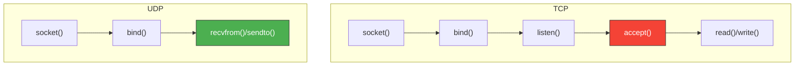
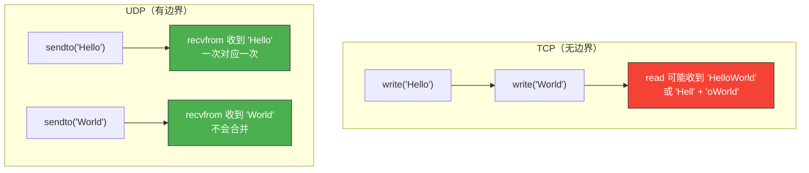
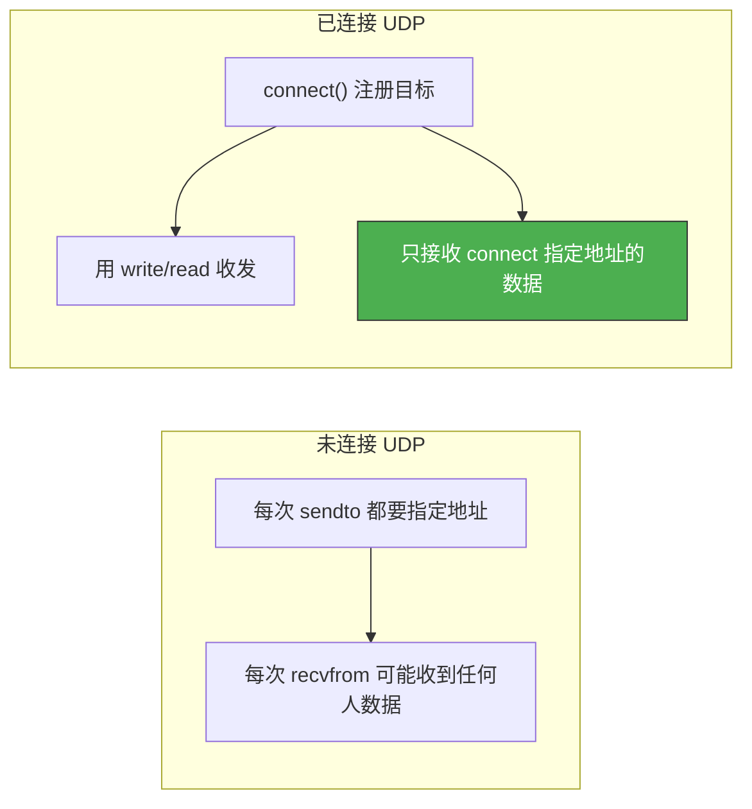

# 基于UDP的服务器端客户端

> UDP 不需要建立连接，就像发短信——不用拨号，直接发。这使得 UDP 编程比 TCP 简单得多，但也有独特的注意事项。

## 一、UDP 与 TCP 编程的区别

### 1.1 流程对比



| 对比项 | TCP | UDP |
|--------|-----|-----|
| 建立连接 | 需要（listen/accept/connect） | 不需要 |
| 收发函数 | read/write | recvfrom/sendto |
| 地址信息 | 建立连接时确定 | 每次收发都要指定 |
| 数据边界 | 无（字节流） | 有（数据报） |
| 可靠性 | 内核保证 | 应用层负责 |

### 1.2 UDP 的收发函数

```c
#include <sys/socket.h>

// 发送数据
ssize_t sendto(int sockfd, const void *buf, size_t len, int flags,
               const struct sockaddr *dest_addr, socklen_t addrlen);

// 接收数据
ssize_t recvfrom(int sockfd, void *buf, size_t len, int flags,
                 struct sockaddr *src_addr, socklen_t *addrlen);
```

| 参数 | sendto | recvfrom |
|------|--------|----------|
| dest_addr/src_addr | 目标地址（必须指定） | 发送方地址（输出参数，可填 NULL） |
| addrlen | 目标地址长度 | 发送方地址长度（输入输出参数） |

---

## 二、未连接 UDP 的 Echo 服务器/客户端

### 2.1 服务器代码

```c
// uecho_server.c — UDP echo 服务器
#include <stdio.h>
#include <stdlib.h>
#include <string.h>
#include <unistd.h>
#include <sys/socket.h>
#include <arpa/inet.h>

#define BUF_SIZE 1024

void error_handling(const char *msg) {
    perror(msg);
    exit(1);
}

int main(int argc, char *argv[]) {
    if (argc != 2) {
        printf("Usage: %s <port>\n", argv[0]);
        exit(1);
    }

    int serv_sock = socket(AF_INET, SOCK_DGRAM, 0);
    if (serv_sock == -1) error_handling("socket() failed");

    struct sockaddr_in serv_addr;
    memset(&serv_addr, 0, sizeof(serv_addr));
    serv_addr.sin_family = AF_INET;
    serv_addr.sin_addr.s_addr = htonl(INADDR_ANY);
    serv_addr.sin_port = htons(atoi(argv[1]));

    if (bind(serv_sock, (struct sockaddr*)&serv_addr, sizeof(serv_addr)) == -1)
        error_handling("bind() failed");

    printf("UDP echo server started on port %s\n", argv[1]);

    char buf[BUF_SIZE];
    struct sockaddr_in clnt_addr;
    socklen_t clnt_len;

    while (1) {
        clnt_len = sizeof(clnt_addr);
        int str_len = recvfrom(serv_sock, buf, BUF_SIZE, 0,
                               (struct sockaddr*)&clnt_addr, &clnt_len);
        if (str_len < 0) continue;

        buf[str_len] = '\0';
        printf("Received from %s:%d - %s",
               inet_ntoa(clnt_addr.sin_addr), ntohs(clnt_addr.sin_port), buf);

        sendto(serv_sock, buf, str_len, 0,
               (struct sockaddr*)&clnt_addr, clnt_len);
    }

    close(serv_sock);
    return 0;
}
```

### 2.2 客户端代码

```c
// uecho_client.c — UDP echo 客户端
#include <stdio.h>
#include <stdlib.h>
#include <string.h>
#include <unistd.h>
#include <sys/socket.h>
#include <arpa/inet.h>

#define BUF_SIZE 1024

void error_handling(const char *msg) {
    perror(msg);
    exit(1);
}

int main(int argc, char *argv[]) {
    if (argc != 3) {
        printf("Usage: %s <IP> <port>\n", argv[0]);
        exit(1);
    }

    int sock = socket(AF_INET, SOCK_DGRAM, 0);
    if (sock == -1) error_handling("socket() failed");

    struct sockaddr_in serv_addr;
    memset(&serv_addr, 0, sizeof(serv_addr));
    serv_addr.sin_family = AF_INET;
    serv_addr.sin_port = htons(atoi(argv[2]));
    inet_pton(AF_INET, argv[1], &serv_addr.sin_addr);

    char buf[BUF_SIZE];
    while (1) {
        fputs("Input message (Q to quit): ", stdout);
        fgets(buf, BUF_SIZE, stdin);

        if (!strcmp(buf, "q\n") || !strcmp(buf, "Q\n"))
            break;

        // 发送到服务器
        sendto(sock, buf, strlen(buf), 0,
               (struct sockaddr*)&serv_addr, sizeof(serv_addr));

        // 接收回显
        struct sockaddr_in from_addr;
        socklen_t from_len = sizeof(from_addr);
        int str_len = recvfrom(sock, buf, BUF_SIZE, 0,
                               (struct sockaddr*)&from_addr, &from_len);
        if (str_len < 0) continue;

        buf[str_len] = '\0';
        printf("Echo: %s", buf);
    }

    close(sock);
    return 0;
}
```

```bash
# 编译运行
gcc -o uecho_server uecho_server.c
gcc -o uecho_client uecho_client.c

./uecho_server 9090
./uecho_client 127.0.0.1 9090
```

---

## 三、UDP 的数据边界

### 3.1 与 TCP 的关键区别

TCP 是字节流，UDP 是数据报——**UDP 保留消息边界**：



::: important UDP 的边界保证
- 一次 `sendto` 的数据，对端一次 `recvfrom` 就能完整收到
- 不会出现 TCP 那样的"粘包"问题
- 但如果 `recvfrom` 的缓冲区小于数据报大小，**多余数据会被丢弃**
:::

### 3.2 验证 UDP 边界

```c
// sender.c — 连续发送 3 条消息
int sock = socket(AF_INET, SOCK_DGRAM, 0);
// ... 设置地址 ...
for (int i = 1; i <= 3; i++) {
    char msg[64];
    sprintf(msg, "Message %d", i);
    sendto(sock, msg, strlen(msg), 0,
           (struct sockaddr*)&serv_addr, sizeof(serv_addr));
}

// receiver.c — 每次 recvfrom 收到一条
while (1) {
    char buf[64];
    int n = recvfrom(sock, buf, sizeof(buf) - 1, 0, NULL, NULL);
    buf[n] = '\0';
    printf("Got: %s\n", buf);  // 一定输出 "Message 1" "Message 2" "Message 3"
}
```

---

## 四、已连接 UDP（Connected UDP）

### 4.1 为什么要"连接"UDP？

UDP 本身不需要连接，但调用 `connect()` 可以：

1. **注册目标地址**，之后用 `write/read` 代替 `sendto/recvfrom`
2. **提高效率**，内核不用每次查路由
3. **过滤来源**，只接收来自指定地址的数据报



### 4.2 已连接 UDP 的代码

```c
// connected_uecho_client.c
#include <stdio.h>
#include <stdlib.h>
#include <string.h>
#include <unistd.h>
#include <sys/socket.h>
#include <arpa/inet.h>

#define BUF_SIZE 1024

void error_handling(const char *msg) {
    perror(msg);
    exit(1);
}

int main(int argc, char *argv[]) {
    if (argc != 3) {
        printf("Usage: %s <IP> <port>\n", argv[0]);
        exit(1);
    }

    int sock = socket(AF_INET, SOCK_DGRAM, 0);
    if (sock == -1) error_handling("socket() failed");

    struct sockaddr_in serv_addr;
    memset(&serv_addr, 0, sizeof(serv_addr));
    serv_addr.sin_family = AF_INET;
    serv_addr.sin_port = htons(atoi(argv[2]));
    inet_pton(AF_INET, argv[1], &serv_addr.sin_addr);

    // "连接"到服务器（不会真正发握手包）
    if (connect(sock, (struct sockaddr*)&serv_addr, sizeof(serv_addr)) == -1)
        error_handling("connect() failed");

    printf("Connected UDP socket (no handshake)\n");

    char buf[BUF_SIZE];
    while (1) {
        fputs("Input message (Q to quit): ", stdout);
        fgets(buf, BUF_SIZE, stdin);
        if (!strcmp(buf, "q\n") || !strcmp(buf, "Q\n")) break;

        // 使用 write/send 代替 sendto
        write(sock, buf, strlen(buf));

        // 使用 read/recv 代替 recvfrom
        int str_len = read(sock, buf, BUF_SIZE - 1);
        if (str_len < 0) continue;
        buf[str_len] = '\0';
        printf("Echo: %s", buf);
    }

    close(sock);
    return 0;
}
```

### 4.3 已连接 vs 未连接

| 特性 | 未连接 UDP | 已连接 UDP |
|------|-----------|-----------|
| 收发函数 | sendto / recvfrom | write / read（或 send / recv） |
| 目标地址 | 每次发送都要指定 | connect 时注册 |
| 来源过滤 | 接收任何人数据 | 只接收 connect 指定地址 |
| 性能 | 稍慢（每次查路由） | 稍快（路由缓存） |
| 适用场景 | 服务器端 | 客户端 |

::: tip 面试速查
- **UDP 不需要 listen/accept**，bind 之后直接 recvfrom。
- **UDP 保留消息边界**，一次 sendto 对应一次 recvfrom，不存在粘包。
- **UDP 的 connect 不发握手包**，只是注册目标地址，提高效率。
- **recvfrom 缓冲区太小会丢数据**，多余部分直接丢弃。
- UDP 服务器天然支持并发：每次 recvfrom 可以收到不同客户端的数据。
:::

---

::: info 原著参考
本文内容参考自尹圣雨《TCP/IP 网络编程》第 6 章"基于 UDP 的服务器端/客户端"。
:::
