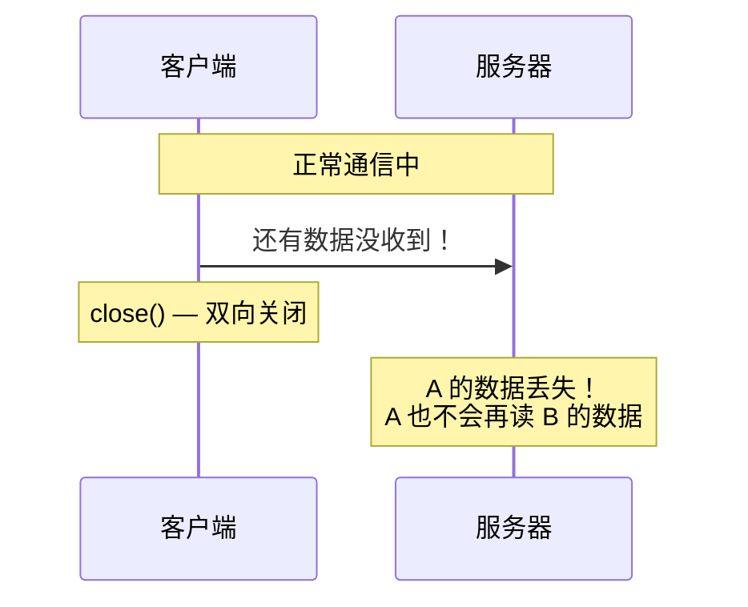
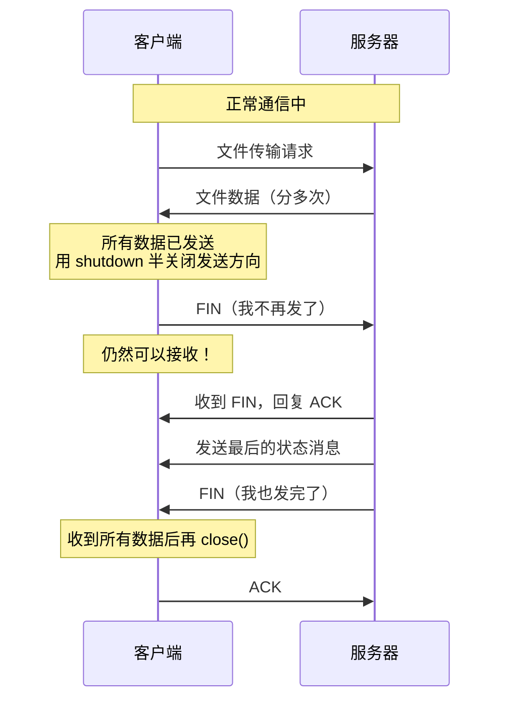
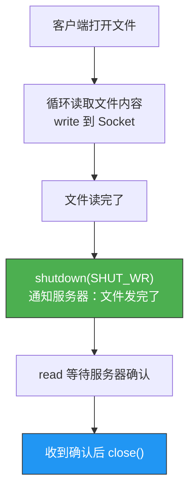
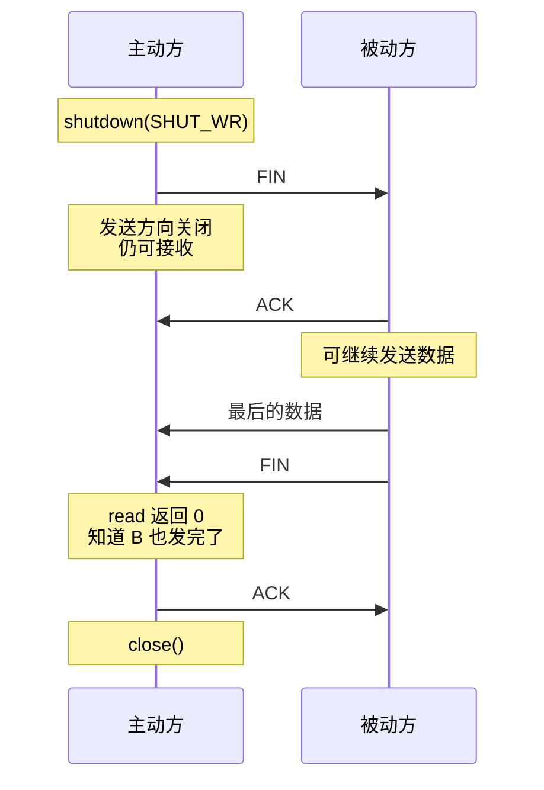

# 优雅地断开套接字连接

> 调用 `close()` 会同时关闭读和写两个方向。但如果一方还有数据没发完呢？这就需要"半关闭"——只关一个方向，保留另一个方向。

## 一、TCP 的全双工与半关闭

### 1.1 全双工意味着两个独立方向

TCP 是全双工的，两个方向的数据流是独立的：


关闭连接时，理想情况是：
1. A 说"我发完了"→ 关闭 A→B 方向
2. B 继续发送剩余数据
3. B 也说"我发完了"→ 关闭 B→A 方向
4. 连接完全关闭

### 1.2 close() 的问题

`close()` 同时关闭两个方向，相当于"我不发了，我也不听了"：



如果 B 还有数据没发完，A 就收不到了。

### 1.3 半关闭的正确场景



---

## 二、shutdown() 函数

### 2.1 函数原型

```c
#include <sys/socket.h>

int shutdown(int sockfd, int how);
```

| how 值 | 含义 | 关闭方向 | 仍可操作 |
|--------|------|---------|---------|
| `SHUT_RD`（0） | 关闭读 | 对方 → 我 | write |
| `SHUT_WR`（1） | 关闭写 | 我 → 对方 | read |
| `SHUT_RDWR`（2） | 关闭读写 | 双向 | 无 |

### 2.2 shutdown vs close

| 对比项 | close() | shutdown(SHUT_WR) |
|--------|---------|-------------------|
| 关闭方向 | 双向 | 单向（仅写方向） |
| 引用计数 | 减 1，到 0 才真正关闭 | 忽略引用计数，直接发 FIN |
| 适用场景 | 彻底关闭连接 | 优雅地半关闭 |

::: important 引用计数的区别
如果通过 `fork()` 或 `dup()` 复制了文件描述符，`close()` 只是减引用计数，不会发 FIN。而 `shutdown()` 不管引用计数，直接发送 FIN。
:::

### 2.3 半关闭代码示例

```c
// half_close.c — 演示半关闭
#include <stdio.h>
#include <stdlib.h>
#include <string.h>
#include <unistd.h>
#include <sys/socket.h>
#include <arpa/inet.h>

#define BUF_SIZE 1024

void error_handling(const char *msg) {
    perror(msg);
    exit(1);
}

int main(int argc, char *argv[]) {
    if (argc != 3) {
        printf("Usage: %s <IP> <port>\n", argv[0]);
        exit(1);
    }

    int sock = socket(AF_INET, SOCK_STREAM, 0);
    if (sock == -1) error_handling("socket() failed");

    struct sockaddr_in serv_addr;
    memset(&serv_addr, 0, sizeof(serv_addr));
    serv_addr.sin_family = AF_INET;
    serv_addr.sin_port = htons(atoi(argv[2]));
    inet_pton(AF_INET, argv[1], &serv_addr.sin_addr);

    if (connect(sock, (struct sockaddr*)&serv_addr, sizeof(serv_addr)) == -1)
        error_handling("connect() failed");

    // 发送数据
    char buf[BUF_SIZE];
    fputs("Input message: ", stdout);
    fgets(buf, BUF_SIZE, stdin);
    write(sock, buf, strlen(buf));

    // 半关闭：我不再发了，但还能收
    shutdown(sock, SHUT_WR);
    printf("Send direction closed, waiting for server response...\n");

    // 仍然可以读取服务器的响应
    int str_len = read(sock, buf, BUF_SIZE - 1);
    if (str_len > 0) {
        buf[str_len] = '\0';
        printf("Server response: %s", buf);
    }

    close(sock);
    return 0;
}
```

---

## 三、TCP 半关闭的实际应用

### 3.1 文件传输协议

半关闭最经典的场景是文件传输：



### 3.2 文件传输服务器

```c
// file_server.c — 接收文件的服务器
#include <stdio.h>
#include <stdlib.h>
#include <string.h>
#include <unistd.h>
#include <sys/socket.h>
#include <arpa/inet.h>

#define BUF_SIZE 1024

void error_handling(const char *msg) {
    perror(msg);
    exit(1);
}

int main(int argc, char *argv[]) {
    if (argc != 2) {
        printf("Usage: %s <port>\n", argv[0]);
        exit(1);
    }

    int serv_sock = socket(AF_INET, SOCK_STREAM, 0);
    if (serv_sock == -1) error_handling("socket() failed");

    int opt = 1;
    setsockopt(serv_sock, SOL_SOCKET, SO_REUSEADDR, &opt, sizeof(opt));

    struct sockaddr_in serv_addr;
    memset(&serv_addr, 0, sizeof(serv_addr));
    serv_addr.sin_family = AF_INET;
    serv_addr.sin_addr.s_addr = htonl(INADDR_ANY);
    serv_addr.sin_port = htons(atoi(argv[1]));

    if (bind(serv_sock, (struct sockaddr*)&serv_addr, sizeof(serv_addr)) == -1)
        error_handling("bind() failed");
    if (listen(serv_sock, 5) == -1)
        error_handling("listen() failed");

    struct sockaddr_in clnt_addr;
    socklen_t clnt_len = sizeof(clnt_addr);
    int clnt_sock = accept(serv_sock, (struct sockaddr*)&clnt_addr, &clnt_len);
    if (clnt_sock == -1) error_handling("accept() failed");

    // 接收文件数据
    FILE *fp = fopen("received.txt", "w");
    char buf[BUF_SIZE];
    int read_len;
    while ((read_len = read(clnt_sock, buf, BUF_SIZE)) > 0) {
        fwrite(buf, 1, read_len, fp);
    }

    printf("File received successfully\n");
    fclose(fp);

    // 发送确认消息
    char ack[] = "File received OK\n";
    write(clnt_sock, ack, strlen(ack));

    close(clnt_sock);
    close(serv_sock);
    return 0;
}
```

### 3.3 文件传输客户端

```c
// file_client.c — 发送文件的客户端
#include <stdio.h>
#include <stdlib.h>
#include <string.h>
#include <unistd.h>
#include <sys/socket.h>
#include <arpa/inet.h>

#define BUF_SIZE 1024

void error_handling(const char *msg) {
    perror(msg);
    exit(1);
}

int main(int argc, char *argv[]) {
    if (argc != 3) {
        printf("Usage: %s <IP> <port>\n", argv[0]);
        exit(1);
    }

    int sock = socket(AF_INET, SOCK_STREAM, 0);
    if (sock == -1) error_handling("socket() failed");

    struct sockaddr_in serv_addr;
    memset(&serv_addr, 0, sizeof(serv_addr));
    serv_addr.sin_family = AF_INET;
    serv_addr.sin_port = htons(atoi(argv[2]));
    inet_pton(AF_INET, argv[1], &serv_addr.sin_addr);

    if (connect(sock, (struct sockaddr*)&serv_addr, sizeof(serv_addr)) == -1)
        error_handling("connect() failed");

    // 发送文件数据
    FILE *fp = fopen("send.txt", "r");
    if (fp == NULL) error_handling("fopen() failed");

    char buf[BUF_SIZE];
    int read_len;
    while ((read_len = fread(buf, 1, BUF_SIZE, fp)) > 0) {
        write(sock, buf, read_len);
    }
    fclose(fp);

    // 半关闭：文件发完了，但还要等确认
    shutdown(sock, SHUT_WR);

    // 接收服务器确认
    int ack_len = read(sock, buf, BUF_SIZE - 1);
    if (ack_len > 0) {
        buf[ack_len] = '\0';
        printf("Server: %s", buf);
    }

    close(sock);
    return 0;
}
```

---

## 四、半关闭的底层原理

### 4.1 shutdown(SHUT_WR) 发生了什么？



### 4.2 为什么不能用 close 替代 shutdown？

```c
// 错误示范
write(sock, file_data, len);
close(sock);  // 双向关闭！
// 服务器可能还有确认消息要发，但我们已经收不到了
```

```c
// 正确做法
write(sock, file_data, len);
shutdown(sock, SHUT_WR);    // 只关闭发送方向
// 还能读取服务器的确认
read(sock, buf, sizeof(buf));
close(sock);
```

---

::: tip 面试速查
- **close() 双向关闭**，shutdown() 可以单向关闭。
- **shutdown(SHUT_WR)** 发送 FIN，但保留接收能力——这就是"半关闭"。
- **半关闭的典型场景**：文件传输完毕后通知对方，同时等待确认。
- **shutdown 忽略引用计数**，即使 fd 被 dup 多次也会立即发 FIN。
- TCP 四次挥手中，第一次 FIN 就是主动方的"半关闭"。
:::

---

::: info 原著参考
本文内容参考自尹圣雨《TCP/IP 网络编程》第 7 章"优雅地断开套接字连接"。
:::
