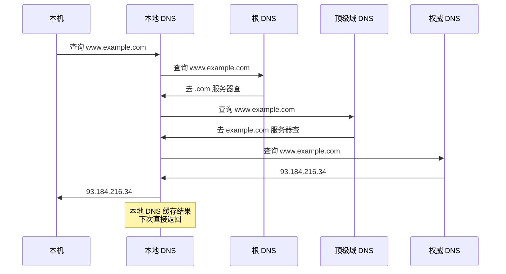

# 域名及网络地址

> 人记名字，机器记地址。DNS 就是互联网的"电话簿"——把 `www.example.com` 翻译成 `93.184.216.34`。网络编程中，我们需要用代码完成这个翻译。

## 一、DNS 域名系统

### 1.1 为什么需要 DNS？

IP 地址不好记，域名好记。DNS 的作用就是 **域名 → IP 地址** 的映射。


### 1.2 DNS 查询流程



---

## 二、gethostbyname() — 域名转 IP

### 2.1 函数原型

```c
#include <netdb.h>

struct hostent *gethostbyname(const char *hostname);
```

### 2.2 hostent 结构体

```c
struct hostent {
    char  *h_name;       // 官方域名
    char **h_aliases;    // 别名列表（以 NULL 结尾）
    int    h_addrtype;   // 地址类型（AF_INET）
    int    h_length;     // 地址长度（IPv4 为 4）
    char **h_addr_list;  // IP 地址列表（网络字节序）
};

// 便捷宏
#define h_addr h_addr_list[0]  // 第一个 IP 地址
```

### 2.3 获取域名 IP 的完整代码

```c
// gethostbyname.c
#include <stdio.h>
#include <stdlib.h>
#include <netdb.h>
#include <arpa/inet.h>

int main(int argc, char *argv[]) {
    if (argc != 2) {
        printf("Usage: %s <domain>\n", argv[0]);
        exit(1);
    }

    struct hostent *host = gethostbyname(argv[1]);
    if (host == NULL) {
        printf("gethostbyname() failed for %s\n", argv[1]);
        exit(1);
    }

    printf("Official name: %s\n", host->h_name);

    // 打印别名
    printf("Aliases:\n");
    for (int i = 0; host->h_aliases[i] != NULL; i++) {
        printf("  %s\n", host->h_aliases[i]);
    }

    // 打印地址类型
    printf("Address type: %s\n",
           (host->h_addrtype == AF_INET) ? "AF_INET" : "AF_INET6");

    // 打印所有 IP 地址
    printf("IP Addresses:\n");
    for (int i = 0; host->h_addr_list[i] != NULL; i++) {
        printf("  %s\n", inet_ntoa(*(struct in_addr*)host->h_addr_list[i]));
    }

    return 0;
}
```

```bash
gcc -o dns_lookup gethostbyname.c && ./dns_lookup www.baidu.com
# Official name: www.a.shifen.com
# Aliases:
#   www.baidu.com
# IP Addresses:
#   180.101.50.242
#   180.101.50.188
```

::: warning gethostbyname 已过时
`gethostbyname` 是旧接口，不支持 IPv6，且不是线程安全的（使用静态缓冲区）。现代代码应该使用 `getaddrinfo`，但 `gethostbyname` 仍广泛用于教学和遗留代码。
:::

---

## 三、getaddrinfo() — 现代方案

### 3.1 函数原型

```c
#include <sys/types.h>
#include <sys/socket.h>
#include <netdb.h>

int getaddrinfo(const char *node, const char *service,
                const struct addrinfo *hints, struct addrinfo **res);

void freeaddrinfo(struct addrinfo *res);
```

### 3.2 addrinfo 结构体

```c
struct addrinfo {
    int              ai_flags;     // AI_PASSIVE 等
    int              ai_family;    // AF_INET, AF_INET6
    int              ai_socktype;  // SOCK_STREAM, SOCK_DGRAM
    int              ai_protocol;  // 0
    socklen_t        ai_addrlen;   // 地址长度
    struct sockaddr *ai_addr;      // 地址
    char            *ai_canonname; // 官方名称
    struct addrinfo *ai_next;      // 链表下一项
};
```

### 3.3 getaddrinfo 使用示例

```c
// getaddrinfo_demo.c
#include <stdio.h>
#include <stdlib.h>
#include <string.h>
#include <sys/socket.h>
#include <netdb.h>
#include <arpa/inet.h>

int main(int argc, char *argv[]) {
    if (argc != 2) {
        printf("Usage: %s <domain>\n", argv[0]);
        exit(1);
    }

    struct addrinfo hints, *res, *p;
    memset(&hints, 0, sizeof(hints));
    hints.ai_family = AF_INET;       // 只查 IPv4
    hints.ai_socktype = SOCK_STREAM; // 只查 TCP

    int status = getaddrinfo(argv[1], "80", &hints, &res);
    if (status != 0) {
        printf("getaddrinfo: %s\n", gai_strerror(status));
        exit(1);
    }

    printf("IP addresses for %s:\n\n", argv[1]);

    char ipstr[INET_ADDRSTRLEN];
    for (p = res; p != NULL; p = p->ai_next) {
        struct sockaddr_in *ipv4 = (struct sockaddr_in*)p->ai_addr;
        inet_ntop(p->ai_family, &ipv4->sin_addr, ipstr, sizeof(ipstr));
        printf("  %s\n", ipstr);
    }

    freeaddrinfo(res);
    return 0;
}
```

### 3.4 getaddrinfo 的优势

| 对比项 | gethostbyname | getaddrinfo |
|--------|--------------|-------------|
| IPv6 支持 | ❌ | ✅ |
| 线程安全 | ❌ | ✅ |
| 协议无关 | ❌ | ✅ |
| 返回可直接用于 bind/connect 的地址 | ❌ | ✅ |
| 推荐 | ❌ | ✅ |

::: important getaddrinfo 的妙用
`getaddrinfo` 返回的 `ai_addr` 可以直接传给 `bind()` 或 `connect()`，不需要手动填充 `sockaddr_in`。这让代码天然支持 IPv4/IPv6 双栈。
:::

---

## 四、利用 DNS 的网络编程实例

### 4.1 自动获取 IP 的客户端

```c
// dns_client.c — 通过域名连接服务器
#include <stdio.h>
#include <stdlib.h>
#include <string.h>
#include <unistd.h>
#include <sys/socket.h>
#include <netdb.h>
#include <arpa/inet.h>

#define BUF_SIZE 1024

int main(int argc, char *argv[]) {
    if (argc != 3) {
        printf("Usage: %s <domain> <port>\n", argv[0]);
        exit(1);
    }

    // 通过域名解析地址
    struct addrinfo hints, *res;
    memset(&hints, 0, sizeof(hints));
    hints.ai_family = AF_INET;
    hints.ai_socktype = SOCK_STREAM;

    int status = getaddrinfo(argv[1], argv[2], &hints, &res);
    if (status != 0) {
        printf("getaddrinfo: %s\n", gai_strerror(status));
        exit(1);
    }

    // 创建套接字并连接
    int sock = socket(res->ai_family, res->ai_socktype, res->ai_protocol);
    if (sock == -1) {
        freeaddrinfo(res);
        perror("socket() failed");
        exit(1);
    }

    if (connect(sock, res->ai_addr, res->ai_addrlen) == -1) {
        freeaddrinfo(res);
        close(sock);
        perror("connect() failed");
        exit(1);
    }

    // 打印解析到的 IP
    char ipstr[INET_ADDRSTRLEN];
    struct sockaddr_in *addr = (struct sockaddr_in*)res->ai_addr;
    inet_ntop(AF_INET, &addr->sin_addr, ipstr, sizeof(ipstr));
    printf("Connected to %s (%s):%s\n", argv[1], ipstr, argv[2]);

    freeaddrinfo(res);

    // 发送 HTTP 请求
    char request[BUF_SIZE];
    snprintf(request, BUF_SIZE,
             "GET / HTTP/1.1\r\nHost: %s\r\nConnection: close\r\n\r\n",
             argv[1]);
    write(sock, request, strlen(request));

    // 读取响应
    char buf[BUF_SIZE];
    int read_len;
    while ((read_len = read(sock, buf, BUF_SIZE - 1)) > 0) {
        buf[read_len] = '\0';
        printf("%s", buf);
    }

    close(sock);
    return 0;
}
```

```bash
gcc -o dns_client dns_client.c
./dns_client www.example.com 80
# Connected to www.example.com (93.184.216.34):80
# HTTP/1.1 200 OK
# ...
```

---

## 五、gethostbyaddr() — IP 反查域名

```c
#include <netdb.h>

struct hostent *gethostbyaddr(const void *addr, socklen_t len, int type);
```

```c
// IP 反查域名
struct in_addr addr;
inet_pton(AF_INET, "93.184.216.34", &addr);

struct hostent *host = gethostbyaddr(&addr, sizeof(addr), AF_INET);
if (host != NULL) {
    printf("Domain: %s\n", host->h_name);
}
```

::: warning 反向 DNS 不可靠
不是所有 IP 都能反查到域名，很多服务器没有配置 PTR 记录。反向 DNS 常被用于邮件服务器验证和日志分析。
:::

---

::: tip 面试速查
- **DNS 的作用**：域名 → IP 地址的映射，互联网的"电话簿"。
- **gethostbyname**：旧接口，不支持 IPv6，不是线程安全的。
- **getaddrinfo**：现代接口，支持 IPv4/IPv6，线程安全，返回可直接用于 bind/connect 的地址。
- **一个域名可能对应多个 IP**（负载均衡），一个 IP 也可能对应多个域名（虚拟主机）。
- **getaddrinfo 返回的是链表**，需要遍历，用完后调用 freeaddrinfo 释放。
:::

---

::: info 原著参考
本文内容参考自尹圣雨《TCP/IP 网络编程》第 8 章"域名及网络地址"。
:::
