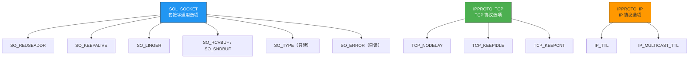
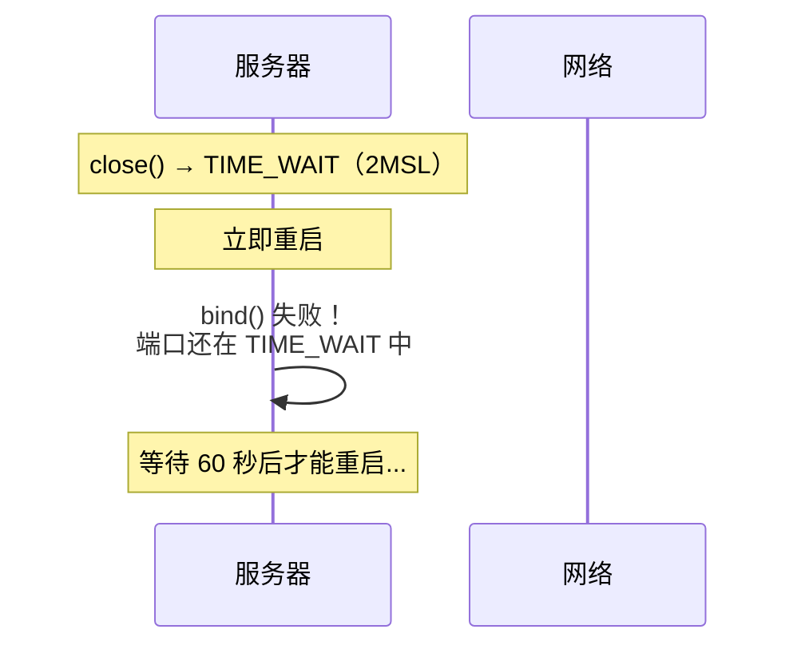
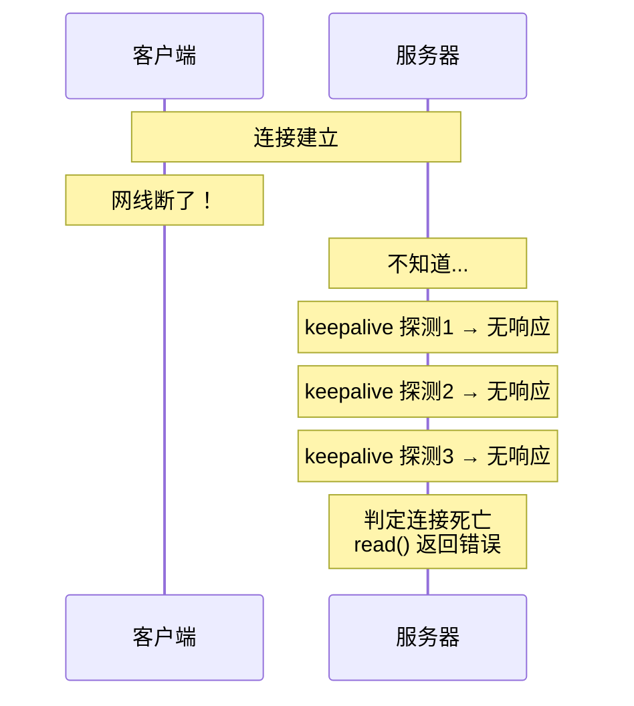

# 套接字的多种可选项

> 套接字就像一台可调参数的机器——默认设置适合大多数场景，但遇到端口复用、心跳检测、延迟关闭等需求时，就需要调节"旋钮"。

## 一、getsockopt / setsockopt

### 1.1 函数原型

```c
#include <sys/socket.h>

int getsockopt(int sockfd, int level, int optname,
               void *optval, socklen_t *optlen);

int setsockopt(int sockfd, int level, int optname,
               const void *optval, socklen_t optlen);
```

| 参数 | 含义 |
|------|------|
| sockfd | 套接字描述符 |
| level | 选项所属协议层（SOL_SOCKET、IPPROTO_TCP、IPPROTO_IP） |
| optname | 选项名称 |
| optval | 选项值的缓冲区 |
| optlen | 选项值的长度 |

### 1.2 选项层级



---

## 二、SO_REUSEADDR — 地址复用

### 2.1 为什么需要地址复用？

服务器重启时经常遇到 `Address already in use` 错误：



### 2.2 使用方法

```c
int opt = 1;
setsockopt(serv_sock, SOL_SOCKET, SO_REUSEADDR, &opt, sizeof(opt));

// 必须在 bind() 之前调用
bind(serv_sock, ...);
```

### 2.3 完整示例

```c
// reuseaddr_server.c
#include <stdio.h>
#include <stdlib.h>
#include <string.h>
#include <unistd.h>
#include <sys/socket.h>
#include <arpa/inet.h>

void error_handling(const char *msg) {
    perror(msg);
    exit(1);
}

int main(int argc, char *argv[]) {
    if (argc != 2) {
        printf("Usage: %s <port>\n", argv[0]);
        exit(1);
    }

    int serv_sock = socket(AF_INET, SOCK_STREAM, 0);
    if (serv_sock == -1) error_handling("socket() failed");

    // 关键：设置地址复用
    int opt = 1;
    if (setsockopt(serv_sock, SOL_SOCKET, SO_REUSEADDR, &opt, sizeof(opt)) == -1)
        error_handling("setsockopt() failed");

    struct sockaddr_in serv_addr;
    memset(&serv_addr, 0, sizeof(serv_addr));
    serv_addr.sin_family = AF_INET;
    serv_addr.sin_addr.s_addr = htonl(INADDR_ANY);
    serv_addr.sin_port = htons(atoi(argv[1]));

    if (bind(serv_sock, (struct sockaddr*)&serv_addr, sizeof(serv_addr)) == -1)
        error_handling("bind() failed");

    if (listen(serv_sock, 5) == -1)
        error_handling("listen() failed");

    printf("Server with SO_REUSEADDR on port %s\n", argv[1]);

    struct sockaddr_in clnt_addr;
    socklen_t clnt_len = sizeof(clnt_addr);
    int clnt_sock = accept(serv_sock, (struct sockaddr*)&clnt_addr, &clnt_len);
    if (clnt_sock == -1) error_handling("accept() failed");

    char buf[1024];
    int str_len = read(clnt_sock, buf, sizeof(buf));
    if (str_len > 0) write(clnt_sock, buf, str_len);

    close(clnt_sock);
    close(serv_sock);
    return 0;
}
```

::: important SO_REUSEADDR 的作用
- 允许绑定处于 TIME_WAIT 状态的地址
- 服务器重启时无需等待 2MSL
- **几乎所有服务器都应该设置这个选项**
:::

---

## 三、SO_KEEPALIVE — 心跳检测

### 3.1 为什么需要心跳？

TCP 连接可能因为网络故障变成"半开连接"——一端已经断开，另一端不知道。SO_KEEPALIVE 让内核自动发送探测包：



### 3.2 使用方法

```c
int opt = 1;
setsockopt(sock, SOL_SOCKET, SO_KEEPALIVE, &opt, sizeof(opt));

// 可选：调整 TCP 层的 keepalive 参数（Linux）
int idle = 30;   // 30 秒无数据后开始探测
setsockopt(sock, IPPROTO_TCP, TCP_KEEPIDLE, &idle, sizeof(idle));

int interval = 5; // 探测间隔 5 秒
setsockopt(sock, IPPROTO_TCP, TCP_KEEPINTVL, &interval, sizeof(interval));

int count = 3;    // 探测 3 次无响应则判定死亡
setsockopt(sock, IPPROTO_TCP, TCP_KEEPCNT, &count, sizeof(count));
```

### 3.3 系统级默认值

```bash
# 查看系统 keepalive 参数
cat /proc/sys/net/ipv4/tcp_keepalive_time     # 7200（2小时）
cat /proc/sys/net/ipv4/tcp_keepalive_intvl    # 75（75秒）
cat /proc/sys/net/ipv4/tcp_keepalive_probes   # 9（9次）
```

::: warning 默认值太长
系统默认 2 小时才开始探测，这对大多数应用来说太长了。生产环境通常将 `TCP_KEEPIDLE` 设为 30~60 秒。
:::

---

## 四、SO_LINGER — 延迟关闭

### 4.1 close() 的默认行为

默认情况下，`close()` 立即返回，内核在后台发送缓冲区中剩余的数据。

### 4.2 SO_LINGER 结构体

```c
struct linger {
    int l_onoff;   // 开关（0=关闭，1=开启）
    int l_linger;  // 等待时间（秒）
};
```

| l_onoff | l_linger | 行为 |
|---------|----------|------|
| 0 | — | 默认行为，close 立即返回 |
| 1 | 0 | **硬关闭**：close 立即返回，丢弃未发送数据，发 RST |
| 1 | >0 | **优雅关闭**：close 阻塞等待数据发完或超时 |

### 4.3 使用示例

```c
// 优雅关闭：等待最多 5 秒
struct linger ling;
ling.l_onoff = 1;
ling.l_linger = 5;
setsockopt(sock, SOL_SOCKET, SO_LINGER, &ling, sizeof(ling));

// 硬关闭：直接发 RST，跳过 TIME_WAIT
struct linger ling_rst;
ling_rst.l_onoff = 1;
ling_rst.l_linger = 0;
setsockopt(sock, SOL_SOCKET, SO_LINGER, &ling_rst, sizeof(ling_rst));
```

::: warning RST 关闭的副作用
设置 `l_linger=0` 会发送 RST 而非 FIN，连接直接进入 CLOSED 状态，跳过 TIME_WAIT。但对方会收到连接重置错误，这是非常规做法，只在特殊场景使用。
:::

---

## 五、SO_RCVBUF / SO_SNDBUF — 缓冲区大小

### 5.1 查看和设置缓冲区

```c
// 获取接收缓冲区大小
int rcv_buf;
socklen_t optlen = sizeof(rcv_buf);
getsockopt(sock, SOL_SOCKET, SO_RCVBUF, &rcv_buf, &optlen);
printf("Receive buffer: %d bytes\n", rcv_buf);  // 默认约 87380

// 设置发送缓冲区大小
int snd_buf = 65536;
setsockopt(sock, SOL_SOCKET, SO_SNDBUF, &snd_buf, sizeof(snd_buf));
```

### 5.2 注意事项

- 设置值是"建议值"，内核可能会调整为其他值（通常是设置的 2 倍）
- 缓冲区太小会导致频繁阻塞，太大会占用内存
- 高吞吐场景（如大文件传输）应适当增大

---

## 六、TCP_NODELAY — 禁用 Nagle 算法

### 6.1 Nagle 算法

Nagle 算法为了减少小包数量：**只有收到前一个包的 ACK 后才发送下一个包**。这会导致延迟：


### 6.2 禁用 Nagle

```c
int opt = 1;
setsockopt(sock, IPPROTO_TCP, TCP_NODELAY, &opt, sizeof(opt));
```

| 场景 | Nagle 算法 | TCP_NODELAY |
|------|-----------|-------------|
| 大文件传输 | 开启（减少小包） | 无所谓 |
| 实时游戏 | 关闭（延迟敏感） | 开启 ✅ |
| SSH/Telnet | 关闭（交互式） | 开启 ✅ |
| HTTP 流水线 | 开启 | 可关闭 |

---

## 七、查看套接字类型和错误

```c
// 查看 Socket 类型
int type;
socklen_t len = sizeof(type);
getsockopt(sock, SOL_SOCKET, SO_TYPE, &type, &len);
printf("Socket type: %s\n",
       type == SOCK_STREAM ? "TCP" : "UDP");

// 获取待处理错误
int err;
len = sizeof(err);
getsockopt(sock, SOL_SOCKET, SO_ERROR, &err, &len);
if (err != 0) {
    printf("Socket error: %d (%s)\n", err, strerror(err));
}
```

---

::: tip 面试速查
- **SO_REUSEADDR**：允许绑定 TIME_WAIT 状态的端口，服务器必设。
- **SO_KEEPALIVE**：自动心跳检测，默认 2 小时才触发，建议缩短。
- **SO_LINGER**：控制 close 行为，l_linger=0 会发 RST 跳过 TIME_WAIT。
- **TCP_NODELAY**：禁用 Nagle 算法，减少小包延迟，实时应用必设。
- **getsockopt/setsockopt** 必须在合适的时机调用（如 SO_REUSEADDR 要在 bind 前）。
:::

---

::: info 原著参考
本文内容参考自尹圣雨《TCP/IP 网络编程》第 9 章"套接字的多种可选项"。
:::
