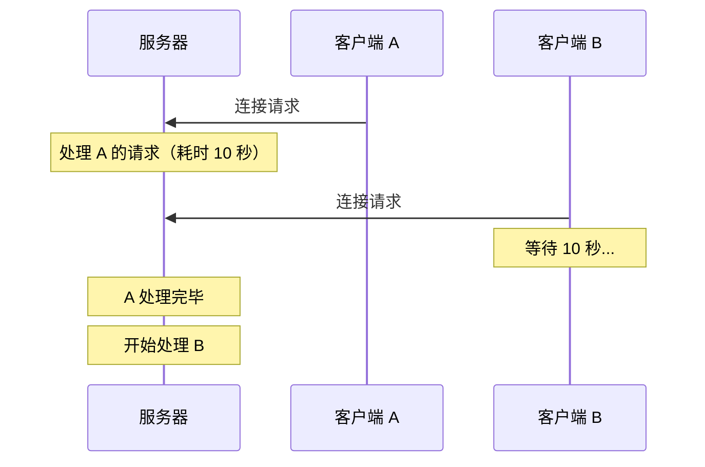
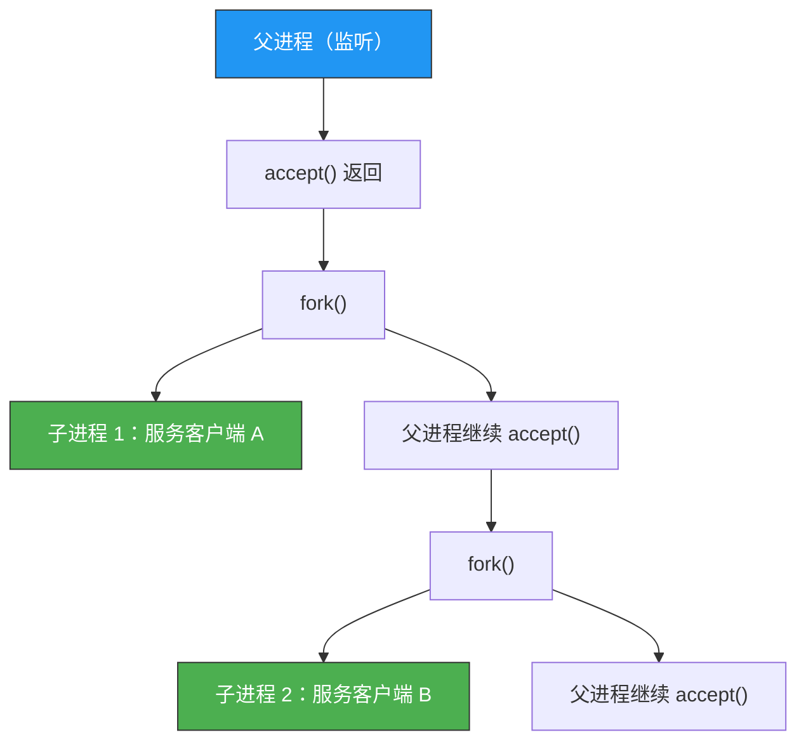
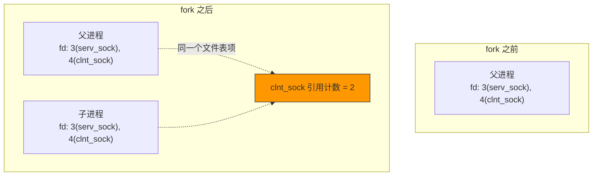
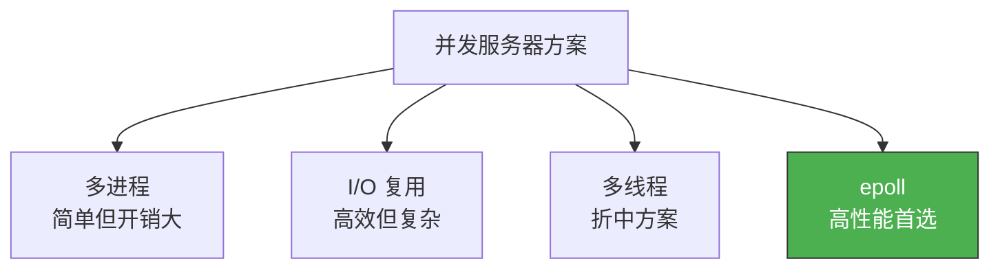

# 多进程服务器端

> 迭代服务器一次只能服务一个客户端。用 `fork()` 为每个客户端创建子进程，就能实现真正的并发服务。

## 一、并发服务器的必要性

### 1.1 迭代服务器的问题



### 1.2 多进程服务器的思路



---

## 二、fork() 系统调用

### 2.1 函数原型

```c
#include <unistd.h>

pid_t fork(void);
```

`fork()` 创建当前进程的副本。调用一次，返回两次：

| 返回值 | 含义 |
|--------|------|
| > 0 | 父进程中，返回值是子进程的 PID |
| = 0 | 子进程中 |
| -1 | 失败 |

```c
pid_t pid = fork();

if (pid == 0) {
    // 子进程执行的代码
    printf("I am child, pid=%d\n", getpid());
} else if (pid > 0) {
    // 父进程执行的代码
    printf("I am parent, child pid=%d\n", pid);
} else {
    perror("fork() failed");
}
```

### 2.2 fork 后的文件描述符

fork 后，子进程**继承父进程的所有文件描述符**，且引用计数加 1：



::: important fork 后必须关闭不需要的 fd
- 父进程：关闭 `clnt_sock`（交给子进程处理）
- 子进程：关闭 `serv_sock`（不需要接受新连接）
- 否则文件描述符永远不会被完全释放
:::

---

## 三、僵尸进程

### 3.1 什么是僵尸进程？

子进程退出后，父进程必须调用 `wait()` 或 `waitpid()` 来"收尸"。如果父进程不收尸，子进程就变成**僵尸进程**（Z 状态），占用 PID 和内核资源。

```bash
# 查看僵尸进程
ps aux | grep Z
# user  1234  0.0  0.0   0  0 ?  Z  10:00  0:00 [echo_server] <defunct>
```

### 3.2 僵尸进程的危害

- 每个 PID 都占一个进程表项，PID 数量有限
- 大量僵尸进程会导致 `fork()` 失败（Cannot allocate memory）
- 僵尸进程无法用 `kill -9` 消灭

### 3.3 消灭僵尸进程的方法

**方法一：wait()**

```c
#include <sys/wait.h>

pid_t wait(int *status);  // 阻塞等待任意子进程退出
```

问题：`wait()` 是阻塞的，调用时父进程无法继续 accept。

**方法二：waitpid() 非阻塞**

```c
pid_t waitpid(pid_t pid, int *status, int options);
// pid = -1：等待任意子进程
// options = WNOHANG：非阻塞，没有子进程退出时返回 0
```

```c
// 非阻塞收尸
int status;
pid_t pid = waitpid(-1, &status, WNOHANG);
if (pid > 0) {
    printf("Child %d terminated\n", pid);
}
```

**方法三：信号处理（最佳方案）**

```c
#include <signal.h>
#include <sys/wait.h>

void child_handler(int sig) {
    int status;
    // 循环收尸，处理多个同时退出的子进程
    while (waitpid(-1, &status, WNOHANG) > 0) {
        printf("Child terminated\n");
    }
}

// 注册信号处理函数
struct sigaction act;
act.sa_handler = child_handler;
sigemptyset(&act.sa_mask);
act.sa_flags = 0;
sigaction(SIGCHLD, &act, NULL);
```

---

## 四、完整多进程 Echo 服务器

```c
// mp_echo_server.c
#include <stdio.h>
#include <stdlib.h>
#include <string.h>
#include <unistd.h>
#include <signal.h>
#include <sys/wait.h>
#include <sys/socket.h>
#include <arpa/inet.h>

#define BUF_SIZE 1024

void error_handling(const char *msg) {
    perror(msg);
    exit(1);
}

// SIGCHLD 信号处理函数
void read_childproc(int sig) {
    int status;
    pid_t pid;
    while ((pid = waitpid(-1, &status, WNOHANG)) > 0) {
        printf("Child process %d terminated\n", pid);
    }
}

int main(int argc, char *argv[]) {
    if (argc != 2) {
        printf("Usage: %s <port>\n", argv[0]);
        exit(1);
    }

    // 注册 SIGCHLD 处理函数
    struct sigaction act;
    act.sa_handler = read_childproc;
    sigemptyset(&act.sa_mask);
    act.sa_flags = 0;
    sigaction(SIGCHLD, &act, NULL);

    int serv_sock = socket(AF_INET, SOCK_STREAM, 0);
    if (serv_sock == -1) error_handling("socket() failed");

    int opt = 1;
    setsockopt(serv_sock, SOL_SOCKET, SO_REUSEADDR, &opt, sizeof(opt));

    struct sockaddr_in serv_addr;
    memset(&serv_addr, 0, sizeof(serv_addr));
    serv_addr.sin_family = AF_INET;
    serv_addr.sin_addr.s_addr = htonl(INADDR_ANY);
    serv_addr.sin_port = htons(atoi(argv[1]));

    if (bind(serv_sock, (struct sockaddr*)&serv_addr, sizeof(serv_addr)) == -1)
        error_handling("bind() failed");
    if (listen(serv_sock, 5) == -1)
        error_handling("listen() failed");

    printf("Multi-process echo server on port %s\n", argv[1]);

    while (1) {
        struct sockaddr_in clnt_addr;
        socklen_t clnt_len = sizeof(clnt_addr);
        int clnt_sock = accept(serv_sock, (struct sockaddr*)&clnt_addr, &clnt_len);
        if (clnt_sock == -1) continue;

        printf("New client: %s:%d\n",
               inet_ntoa(clnt_addr.sin_addr), ntohs(clnt_addr.sin_port));

        pid_t pid = fork();
        if (pid == -1) {
            close(clnt_sock);
            continue;
        }

        if (pid == 0) {
            // 子进程：处理客户端
            close(serv_sock);  // 子进程不需要监听套接字

            char buf[BUF_SIZE];
            int str_len;
            while ((str_len = read(clnt_sock, buf, BUF_SIZE)) > 0) {
                write(clnt_sock, buf, str_len);
            }

            close(clnt_sock);
            printf("Client disconnected\n");
            return 0;  // 子进程退出
        } else {
            // 父进程：继续接受新连接
            close(clnt_sock);  // 父进程不需要通信套接字
        }
    }

    close(serv_sock);
    return 0;
}
```

```bash
gcc -o mp_server mp_echo_server.c
./mp_server 8080

# 多个终端同时连接
nc 127.0.0.1 8080 &
nc 127.0.0.1 8080 &
nc 127.0.0.1 8080 &
```

---

## 五、信号处理详解

### 5.1 SIGCHLD 信号

当子进程终止时，内核向父进程发送 `SIGCHLD` 信号。默认行为是忽略，所以必须注册处理函数。

### 5.2 sigaction vs signal

| 对比项 | signal() | sigaction() |
|--------|----------|-------------|
| 可移植性 | 各系统行为不一致 | POSIX 标准 |
| 信号屏蔽 | 不支持 | 支持 |
| 一次性 | 某些系统触发后重置 | 持续有效 |
| 推荐 | ❌ | ✅ |

### 5.3 为什么循环 waitpid？

多个子进程同时退出时，内核可能只发送一次 SIGCHLD 信号。循环 `waitpid` 确保一次信号处理中收完所有僵尸：

```c
void read_childproc(int sig) {
    int status;
    pid_t pid;
    // 循环直到没有更多僵尸进程
    while ((pid = waitpid(-1, &status, WNOHANG)) > 0) {
        printf("Removed child %d\n", pid);
    }
}
```

---

## 六、多进程服务器的优劣

| 优点 | 缺点 |
|------|------|
| 实现简单 | 进程开销大（内存、上下文切换） |
| 隔离性好（子进程崩溃不影响父进程） | 进程数有限（受 PID 和内存限制） |
| 天然利用多核 | 进程间通信复杂 |



---

::: tip 面试速查
- **fork 返回两次**：父进程返回子进程 PID，子进程返回 0。
- **fork 后必须关闭不需要的 fd**：父关 clnt_sock，子关 serv_sock。
- **僵尸进程**：子进程退出但父进程未调用 wait/waitpid。用 `ps aux | grep Z` 查看。
- **消灭僵尸**：注册 SIGCHLD 信号处理函数，循环 waitpid(WNOHANG)。
- **sigaction 比 signal 更可靠**，推荐使用。
:::

---

::: info 原著参考
本文内容参考自尹圣雨《TCP/IP 网络编程》第 10 章"多进程服务器端"。
:::
