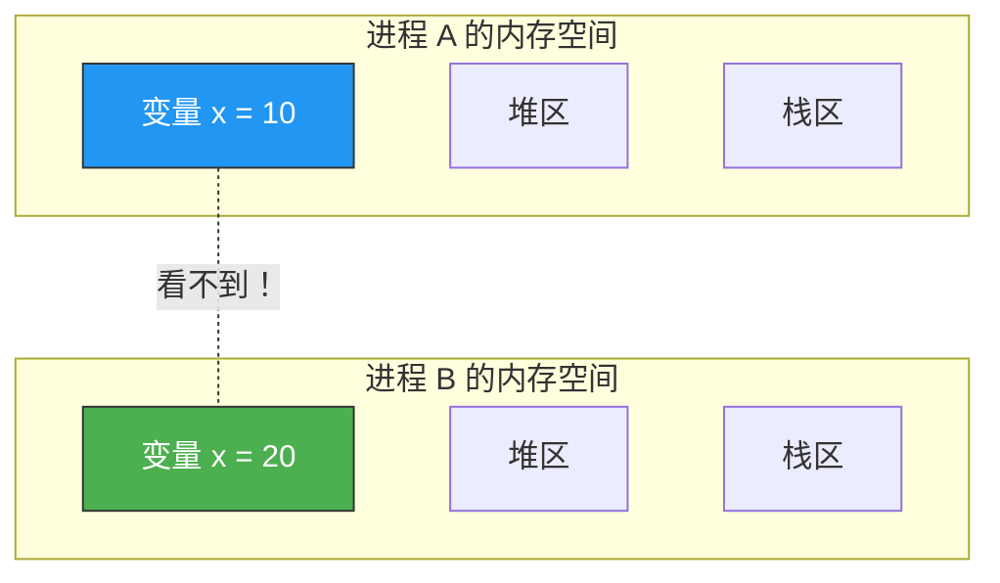
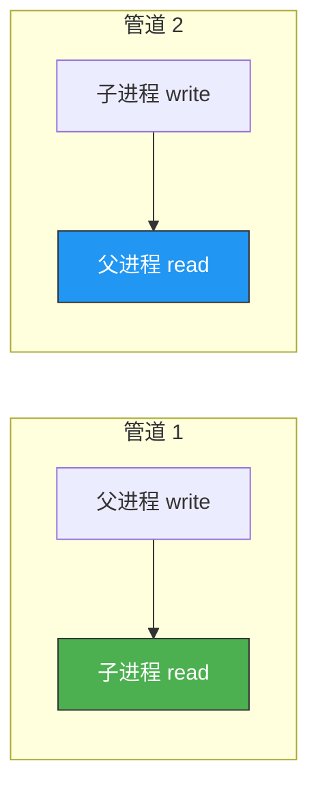
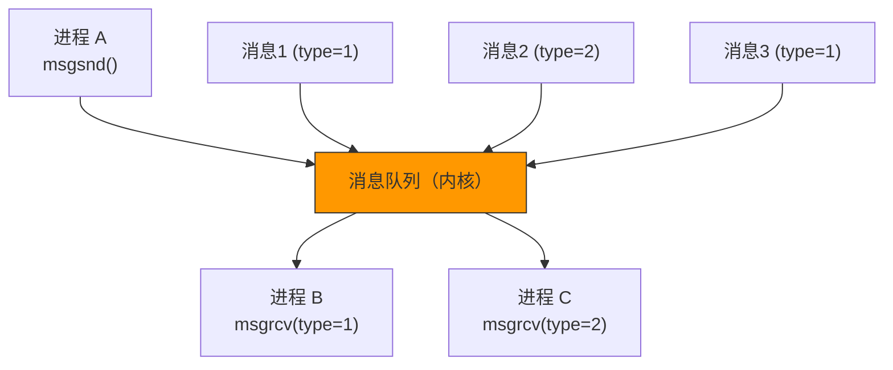
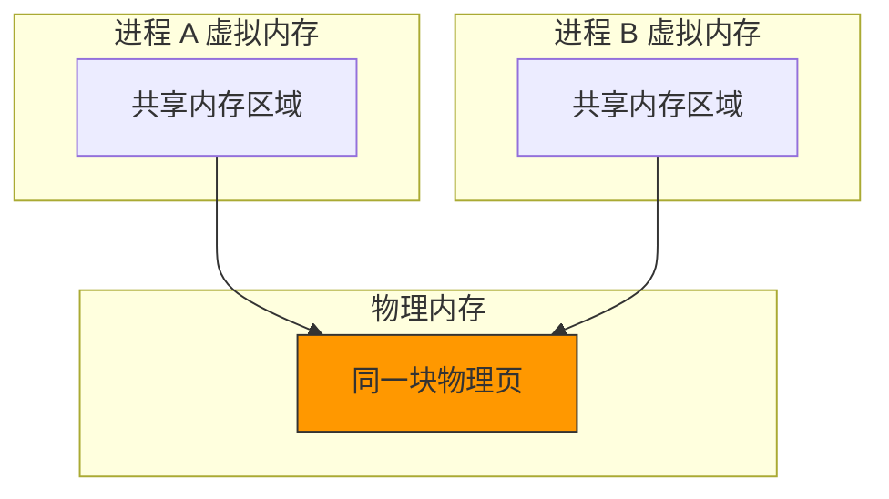

# 进程间通信

> 多进程服务器中，子进程之间需要交换数据。但进程的内存是隔离的——一个进程看不到另一个进程的变量。这就需要 IPC（Inter-Process Communication）机制。

## 一、为什么需要 IPC？

### 1.1 进程内存隔离



进程 A 修改 x 不会影响进程 B 的 x——它们是完全独立的内存空间。

### 1.2 常见 IPC 方式

| 方式 | 原理 | 特点 |
|------|------|------|
| 管道（pipe） | 内核缓冲区，单向字节流 | 简单，只能父子进程间使用 |
| 命名管道（FIFO） | 文件系统中的管道 | 无亲缘关系进程也能用 |
| 消息队列 | 内核中的消息链表 | 按类型读取，有边界 |
| 共享内存 | 映射同一块物理内存 | 最快，需配合同步机制 |
| 信号量 | 计数器 | 用于同步，不传数据 |
| Socket | 网络通信 | 可跨主机 |

---

## 二、管道（pipe）

### 2.1 管道的基本原理

管道是一个**内核缓冲区**，一端写入，另一端读出，单向传输：


### 2.2 pipe() 函数

```c
#include <unistd.h>

int pipe(int fd[2]);
// fd[0]: 读端
// fd[1]: 写端
```

### 2.3 父子进程通信

```c
// pipe_demo.c
#include <stdio.h>
#include <stdlib.h>
#include <string.h>
#include <unistd.h>

#define BUF_SIZE 1024

int main() {
    int fds[2];
    if (pipe(fds) == -1) {
        perror("pipe() failed");
        exit(1);
    }

    pid_t pid = fork();
    if (pid == -1) {
        perror("fork() failed");
        exit(1);
    }

    if (pid == 0) {
        // 子进程：写入数据
        close(fds[0]);  // 关闭读端
        char msg[] = "Hello from child!";
        write(fds[1], msg, strlen(msg) + 1);
        close(fds[1]);
    } else {
        // 父进程：读取数据
        close(fds[1]);  // 关闭写端
        char buf[BUF_SIZE];
        read(fds[0], buf, BUF_SIZE);
        printf("Parent received: %s\n", buf);
        close(fds[0]);
    }

    return 0;
}
```

### 2.4 管道的注意事项

- **单向**：数据只能从 fd[1] 写，从 fd[0] 读
- **必须关闭不用的端**：否则读端不知道写端何时结束
- **只能用于有亲缘关系的进程**（fork 后共享 fd）
- 读端关闭后写端写数据会收到 SIGPIPE 信号

---

## 三、双向通信的实现

### 3.1 用两个管道实现双向通信



### 3.2 双向管道代码

```c
// pipe_bidir.c
#include <stdio.h>
#include <stdlib.h>
#include <string.h>
#include <unistd.h>

#define BUF_SIZE 1024

int main() {
    int fds1[2], fds2[2];  // fds1: 父→子, fds2: 子→父
    pipe(fds1);
    pipe(fds2);

    pid_t pid = fork();
    if (pid == 0) {
        // 子进程
        close(fds1[1]);  // 关闭管道1写端
        close(fds2[0]);  // 关闭管道2读端

        char buf[BUF_SIZE];
        // 接收父进程消息
        int len = read(fds1[0], buf, BUF_SIZE);
        buf[len] = '\0';
        printf("Child received: %s\n", buf);

        // 回复父进程
        char reply[] = "Thank you, parent!";
        write(fds2[1], reply, strlen(reply) + 1);

        close(fds1[0]);
        close(fds2[1]);
    } else {
        // 父进程
        close(fds1[0]);  // 关闭管道1读端
        close(fds2[1]);  // 关闭管道2写端

        // 发送消息给子进程
        char msg[] = "Hello from parent!";
        write(fds1[1], msg, strlen(msg) + 1);

        // 接收子进程回复
        char buf[BUF_SIZE];
        int len = read(fds2[0], buf, BUF_SIZE);
        buf[len] = '\0';
        printf("Parent received: %s\n", buf);

        close(fds1[1]);
        close(fds2[0]);
    }

    return 0;
}
```

---

## 四、消息队列

### 4.1 System V 消息队列

消息队列是内核中的消息链表，按类型区分消息：



### 4.2 消息队列 API

```c
#include <sys/msg.h>

// 创建或获取消息队列
int msgget(key_t key, int msgflg);

// 发送消息
int msgsnd(int msqid, const void *msgp, size_t msgsz, int msgflg);

// 接收消息
ssize_t msgrcv(int msqid, void *msgp, size_t msgsz,
               long msgtyp, int msgflg);

// 控制操作（删除等）
int msgctl(int msqid, int cmd, struct msqid_ds *buf);
```

### 4.3 消息队列示例

```c
// msg_queue.c
#include <stdio.h>
#include <stdlib.h>
#include <string.h>
#include <sys/msg.h>

#define MAX_TEXT 512

struct my_msg {
    long msg_type;       // 消息类型（必须 > 0）
    char msg_text[MAX_TEXT];
};

int main() {
    // 创建消息队列
    key_t key = ftok(".", 'A');
    int msgid = msgget(key, 0666 | IPC_CREAT);
    if (msgid == -1) {
        perror("msgget() failed");
        exit(1);
    }

    pid_t pid = fork();
    if (pid == 0) {
        // 子进程：发送消息
        struct my_msg msg;
        msg.msg_type = 1;
        strcpy(msg.msg_text, "Hello from child via message queue!");
        msgsnd(msgid, &msg, strlen(msg.msg_text) + 1, 0);
        printf("Child sent: %s\n", msg.msg_text);
    } else {
        // 父进程：接收消息
        sleep(1);  // 等子进程发送
        struct my_msg msg;
        msgrcv(msgid, &msg, MAX_TEXT, 1, 0);
        printf("Parent received: %s\n", msg.msg_text);

        // 删除消息队列
        msgctl(msgid, IPC_RMID, NULL);
    }

    return 0;
}
```

---

## 五、共享内存

### 5.1 最快的 IPC 方式

共享内存让两个进程映射同一块物理内存，**零拷贝**，是速度最快的 IPC：



### 5.2 共享内存 API

```c
#include <sys/shm.h>

// 创建共享内存
int shmget(key_t key, size_t size, int shmflg);

// 连接共享内存
void *shmat(int shmid, const void *shmaddr, int shmflg);

// 分离共享内存
int shmdt(const void *shmaddr);

// 控制操作
int shmctl(int shmid, int cmd, struct shmid_ds *buf);
```

### 5.3 共享内存示例

```c
// shm_demo.c
#include <stdio.h>
#include <stdlib.h>
#include <string.h>
#include <unistd.h>
#include <sys/shm.h>

#define SHM_SIZE 1024

int main() {
    key_t key = ftok(".", 'B');
    int shmid = shmget(key, SHM_SIZE, 0666 | IPC_CREAT);
    if (shmid == -1) {
        perror("shmget() failed");
        exit(1);
    }

    pid_t pid = fork();
    if (pid == 0) {
        // 子进程：写入共享内存
        char *shm = (char*)shmat(shmid, NULL, 0);
        strcpy(shm, "Hello from child via shared memory!");
        printf("Child wrote: %s\n", shm);
        shmdt(shm);
    } else {
        // 父进程：读取共享内存
        sleep(1);
        char *shm = (char*)shmat(shmid, NULL, SHM_RDONLY);
        printf("Parent read: %s\n", shm);
        shmdt(shm);
        shmctl(shmid, IPC_RMID, NULL);  // 删除共享内存
    }

    return 0;
}
```

::: warning 共享内存的同步问题
共享内存没有同步机制——两个进程同时写就会冲突。必须配合信号量或互斥锁使用。
:::

---

## 六、IPC 方式对比

| 对比项 | 管道 | 消息队列 | 共享内存 |
|--------|------|---------|---------|
| 速度 | 慢（内核拷贝） | 中等 | 快（零拷贝） |
| 方向 | 单向 | 双向 | 双向 |
| 数据边界 | 无（字节流） | 有（消息类型） | 无 |
| 同步 | 自带阻塞 | 自带阻塞 | 需额外机制 |
| 适用 | 父子进程 | 任意进程 | 高速数据交换 |

---

::: tip 面试速查
- **管道**：单向字节流，只能用于有亲缘关系的进程，fd[0] 读 fd[1] 写。
- **双向通信需要两个管道**。
- **消息队列**：按类型收发，有消息边界，无需亲缘关系。
- **共享内存**：最快的 IPC，但需要同步机制（信号量/互斥锁）。
- 进程间通信选择的考量：速度、方向、是否需要同步、是否有亲缘关系。
:::

---

::: info 原著参考
本文内容参考自尹圣雨《TCP/IP 网络编程》第 11 章"进程间通信"。
:::
