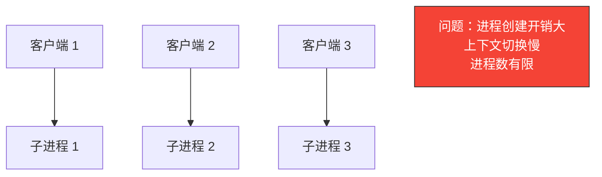
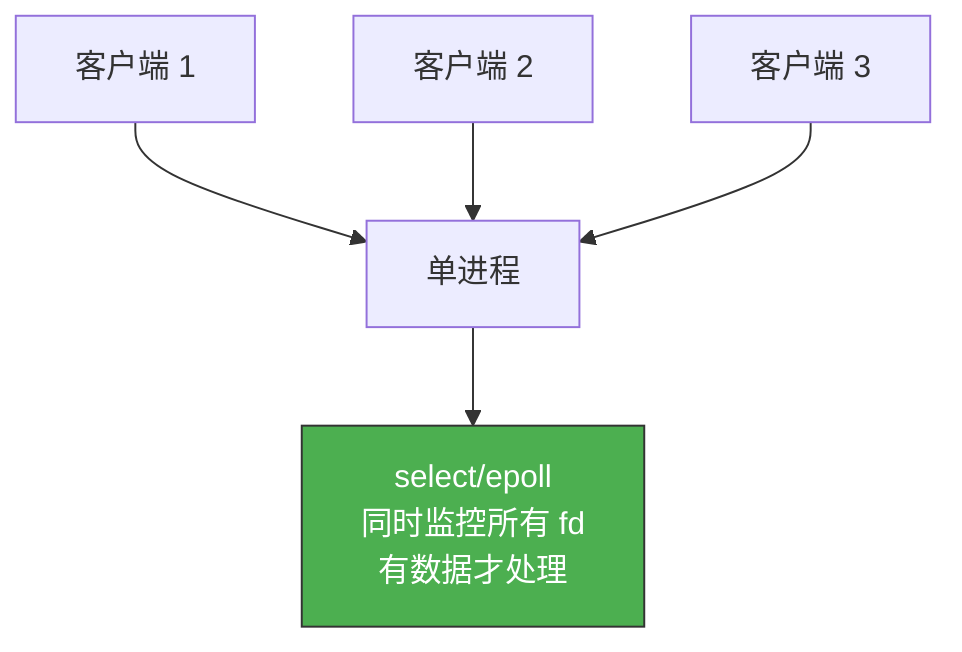
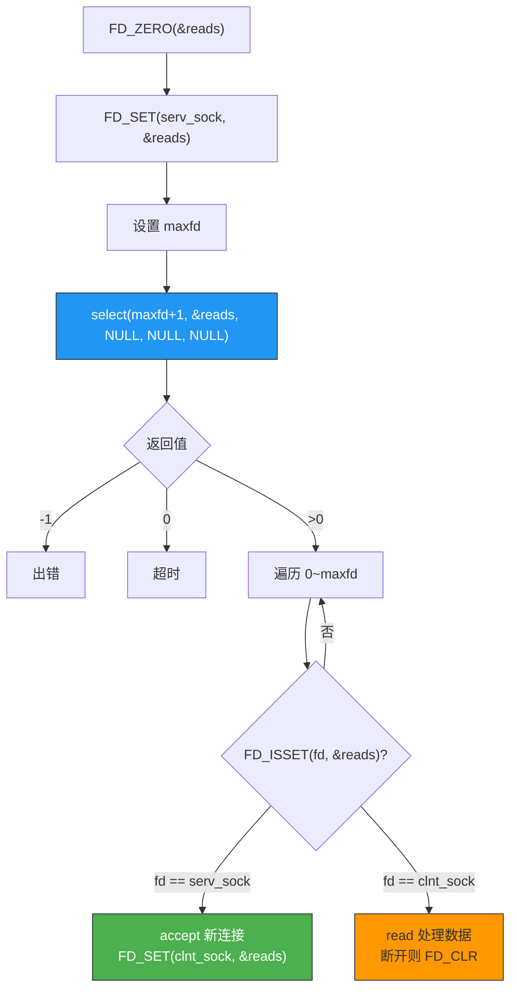
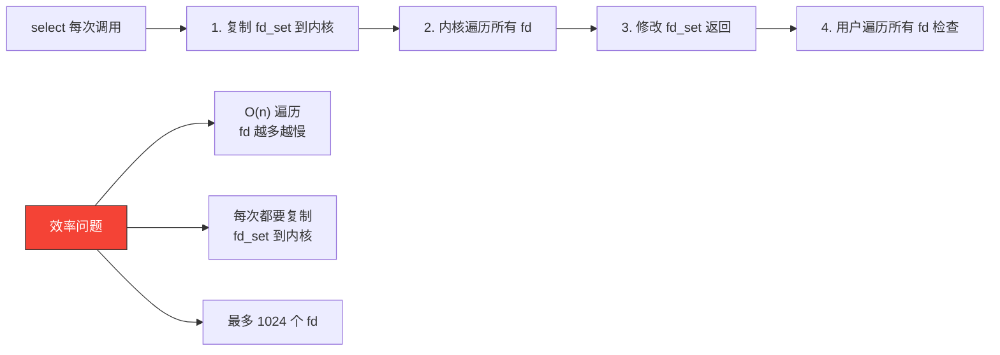

# I/O复用

> 多进程服务器为每个客户端 fork 一个子进程，开销太大。I/O 复用让一个进程同时监控多个文件描述符——谁有数据就处理谁，效率高得多。

## 一、为什么需要 I/O 复用？

### 1.1 多进程的问题



### 1.2 I/O 复用的思路

一个进程同时"盯着"多个 fd，哪个 fd 有数据到达就处理哪个：



---

## 二、select 函数

### 2.1 函数原型

```c
#include <sys/select.h>

int select(int nfds, fd_set *readfds, fd_set *writefds,
           fd_set *exceptfds, struct timeval *timeout);
```

| 参数 | 含义 |
|------|------|
| nfds | 监控的 fd 数量 + 1（最大 fd 值 + 1） |
| readfds | 关注可读的 fd 集合 |
| writefds | 关注可写的 fd 集合（可为 NULL） |
| exceptfds | 关注异常的 fd 集合（可为 NULL） |
| timeout | 超时时间（NULL = 永久阻塞） |

返回值：就绪的 fd 数量，0 = 超时，-1 = 出错。

### 2.2 fd_set 操作宏

```c
FD_ZERO(fd_set *set);         // 清空集合
FD_SET(int fd, fd_set *set);  // 将 fd 加入集合
FD_CLR(int fd, fd_set *set);  // 将 fd 从集合移除
FD_ISSET(int fd, fd_set *set); // 检查 fd 是否在集合中
```

### 2.3 select 的工作流程



---

## 三、select 版 Echo 服务器

```c
// select_echo_server.c
#include <stdio.h>
#include <stdlib.h>
#include <string.h>
#include <unistd.h>
#include <sys/socket.h>
#include <sys/select.h>
#include <arpa/inet.h>

#define BUF_SIZE 1024

void error_handling(const char *msg) {
    perror(msg);
    exit(1);
}

int main(int argc, char *argv[]) {
    if (argc != 2) {
        printf("Usage: %s <port>\n", argv[0]);
        exit(1);
    }

    int serv_sock = socket(AF_INET, SOCK_STREAM, 0);
    if (serv_sock == -1) error_handling("socket() failed");

    int opt = 1;
    setsockopt(serv_sock, SOL_SOCKET, SO_REUSEADDR, &opt, sizeof(opt));

    struct sockaddr_in serv_addr;
    memset(&serv_addr, 0, sizeof(serv_addr));
    serv_addr.sin_family = AF_INET;
    serv_addr.sin_addr.s_addr = htonl(INADDR_ANY);
    serv_addr.sin_port = htons(atoi(argv[1]));

    if (bind(serv_sock, (struct sockaddr*)&serv_addr, sizeof(serv_addr)) == -1)
        error_handling("bind() failed");
    if (listen(serv_sock, 5) == -1)
        error_handling("listen() failed");

    fd_set reads, cpy_reads;
    FD_ZERO(&reads);
    FD_SET(serv_sock, &reads);
    int maxfd = serv_sock;

    printf("Select echo server on port %s\n", argv[1]);

    while (1) {
        cpy_reads = reads;  // 复制，因为 select 会修改集合
        int fd_num = select(maxfd + 1, &cpy_reads, NULL, NULL, NULL);
        if (fd_num == -1) {
            perror("select() failed");
            break;
        }
        if (fd_num == 0) continue;

        for (int i = 0; i <= maxfd; i++) {
            if (!FD_ISSET(i, &cpy_reads)) continue;

            if (i == serv_sock) {
                // 新连接
                struct sockaddr_in clnt_addr;
                socklen_t clnt_len = sizeof(clnt_addr);
                int clnt_sock = accept(serv_sock,
                                       (struct sockaddr*)&clnt_addr, &clnt_len);
                if (clnt_sock == -1) continue;

                FD_SET(clnt_sock, &reads);
                if (clnt_sock > maxfd) maxfd = clnt_sock;
                printf("New client fd=%d\n", clnt_sock);
            } else {
                // 客户端数据
                char buf[BUF_SIZE];
                int str_len = read(i, buf, BUF_SIZE - 1);
                if (str_len <= 0) {
                    // 客户端断开
                    FD_CLR(i, &reads);
                    close(i);
                    printf("Client fd=%d disconnected\n", i);
                } else {
                    buf[str_len] = '\0';
                    write(i, buf, str_len);  // echo
                }
            }
        }
    }

    close(serv_sock);
    return 0;
}
```

```bash
gcc -o select_server select_echo_server.c
./select_server 8080

# 多个客户端同时连接测试
nc 127.0.0.1 8080 &
nc 127.0.0.1 8080 &
```

---

## 四、select 的局限性

### 4.1 三大问题

| 问题 | 说明 |
|------|------|
| **fd 数量限制** | 默认 FD_SETSIZE = 1024，修改需重编译内核 |
| **线性扫描** | 每次遍历 0~maxfd，即使大部分 fd 未就绪 |
| **重复初始化** | 每次调用都要重新设置 fd_set（select 会修改它） |



### 4.2 select vs poll vs epoll

| 对比项 | select | poll | epoll |
|--------|--------|------|-------|
| fd 数量限制 | 1024（FD_SETSIZE） | 无限制 | 无限制 |
| 内核遍历方式 | 线性扫描 | 线性扫描 | 事件驱动 |
| 返回就绪 fd | 需要遍历检查 | 需要遍历检查 | 只返回就绪的 fd |
| fd_set 修改 | 每次需重建 | 不需要 | 不需要 |
| 性能 | O(n) | O(n) | O(1) |
| 适用场景 | 少量 fd | 中等 fd | 大量 fd |

::: important select 的适用场景
虽然 select 有局限，但在 fd 数量不多（几十个）的场景下，select 完全够用，且跨平台兼容性最好（Windows 也有 select）。epoll 是 Linux 专属。
:::

---

## 五、select 同时处理键盘输入和网络连接

select 的一个实用场景：同时监控标准输入和 Socket。

```c
// select_stdin.c
#include <stdio.h>
#include <stdlib.h>
#include <string.h>
#include <unistd.h>
#include <sys/socket.h>
#include <sys/select.h>
#include <arpa/inet.h>

#define BUF_SIZE 1024

int main(int argc, char *argv[]) {
    if (argc != 3) {
        printf("Usage: %s <IP> <port>\n", argv[0]);
        exit(1);
    }

    int sock = socket(AF_INET, SOCK_STREAM, 0);
    struct sockaddr_in serv_addr;
    memset(&serv_addr, 0, sizeof(serv_addr));
    serv_addr.sin_family = AF_INET;
    serv_addr.sin_port = htons(atoi(argv[2]));
    inet_pton(AF_INET, argv[1], &serv_addr.sin_addr);

    if (connect(sock, (struct sockaddr*)&serv_addr, sizeof(serv_addr)) == -1) {
        perror("connect() failed");
        exit(1);
    }

    fd_set reads;
    int maxfd = (STDIN_FILENO > sock) ? STDIN_FILENO : sock;

    while (1) {
        FD_ZERO(&reads);
        FD_SET(STDIN_FILENO, &reads);  // 监控键盘输入
        FD_SET(sock, &reads);          // 监控 Socket

        int fd_num = select(maxfd + 1, &reads, NULL, NULL, NULL);
        if (fd_num == -1) break;

        if (FD_ISSET(STDIN_FILENO, &reads)) {
            // 键盘有输入
            char buf[BUF_SIZE];
            fgets(buf, BUF_SIZE, stdin);
            write(sock, buf, strlen(buf));
        }

        if (FD_ISSET(sock, &reads)) {
            // 服务器有数据
            char buf[BUF_SIZE];
            int str_len = read(sock, buf, BUF_SIZE - 1);
            if (str_len <= 0) break;
            buf[str_len] = '\0';
            printf("Server: %s", buf);
        }
    }

    close(sock);
    return 0;
}
```

---

::: tip 面试速查
- **select 的作用**：同时监控多个 fd 的可读/可写/异常事件。
- **fd_set 操作**：FD_ZERO 清空，FD_SET 添加，FD_ISSET 检查，FD_CLR 移除。
- **select 会修改 fd_set**，所以每次调用前必须复制一份。
- **select 的限制**：最多 1024 个 fd，线性扫描 O(n)，每次需重建集合。
- **epoll 是 select 的升级版**：无 fd 限制，事件驱动 O(1)，适合高并发。
:::

---

::: info 原著参考
本文内容参考自尹圣雨《TCP/IP 网络编程》第 12 章"I/O 复用"。
:::
