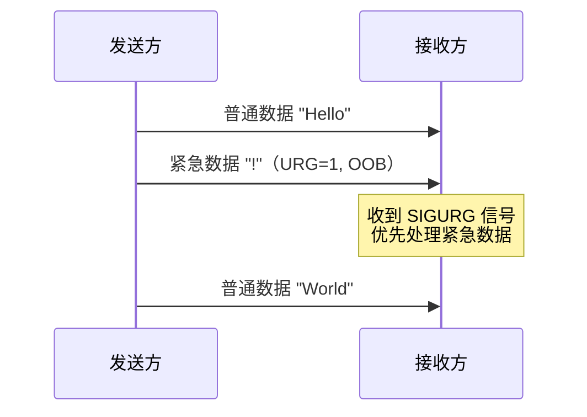
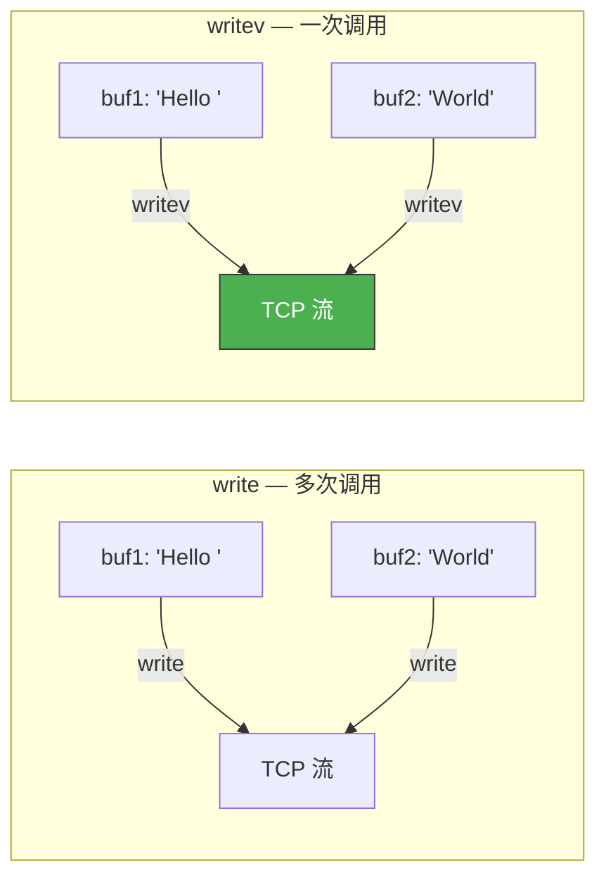

# 多种I/O函数

> `read/write` 是最基础的 I/O 函数，但在特定场景下不够用：紧急数据怎么收发？散布/聚集 I/O 怎么实现？send/recv 提供了更丰富的控制。

## 一、send / recv 函数

### 1.1 函数原型

```c
#include <sys/socket.h>

ssize_t send(int sockfd, const void *buf, size_t len, int flags);
ssize_t recv(int sockfd, void *buf, size_t len, int flags);
```

与 `write/read` 的区别就是多了 `flags` 参数。`flags = 0` 时等价于 `write/read`。

### 1.2 常用 flags

| flag | 含义 |
|------|------|
| `MSG_OOB` | 发送/接收紧急数据（Out-of-Band） |
| `MSG_PEEK` | 查看数据但不从缓冲区移除 |
| `MSG_DONTWAIT` | 非阻塞操作 |
| `MSG_WAITALL` | 等待读满指定字节数（除非出错或信号中断） |

---

## 二、MSG_OOB — 紧急数据

### 2.1 什么是 OOB 数据？

TCP 的 URG 标志位用于标记"紧急数据"。紧急数据不走普通数据流，接收方可以优先处理。



### 2.2 发送紧急数据

```c
// 发送 OOB 数据
send(sock, "!", 1, MSG_OOB);
```

发送 OOB 数据时，TCP 报文头部的 URG 标志位置 1，紧急指针指向 OOB 数据的位置。

### 2.3 接收紧急数据

```c
// 接收 OOB 数据
char urg_buf;
recv(sock, &urg_buf, 1, MSG_OOB);
```

### 2.4 SIGURG 信号处理

当收到紧急数据时，内核向进程发送 `SIGURG` 信号：

```c
// oob_server.c — 接收紧急数据的服务器
#include <stdio.h>
#include <stdlib.h>
#include <string.h>
#include <unistd.h>
#include <signal.h>
#include <sys/socket.h>
#include <arpa/inet.h>

#define BUF_SIZE 1024

int urg_sock;  // 全局变量，信号处理函数中需要

void urg_handler(int sig) {
    char urg_buf;
    int n = recv(urg_sock, &urg_buf, 1, MSG_OOB);
    if (n > 0) {
        printf("URGENT data received: %c\n", urg_buf);
    }
}

int main(int argc, char *argv[]) {
    if (argc != 2) {
        printf("Usage: %s <port>\n", argv[0]);
        exit(1);
    }

    int serv_sock = socket(AF_INET, SOCK_STREAM, 0);
    int opt = 1;
    setsockopt(serv_sock, SOL_SOCKET, SO_REUSEADDR, &opt, sizeof(opt));

    struct sockaddr_in serv_addr;
    memset(&serv_addr, 0, sizeof(serv_addr));
    serv_addr.sin_family = AF_INET;
    serv_addr.sin_addr.s_addr = htonl(INADDR_ANY);
    serv_addr.sin_port = htons(atoi(argv[1]));

    bind(serv_sock, (struct sockaddr*)&serv_addr, sizeof(serv_addr));
    listen(serv_sock, 5);

    struct sockaddr_in clnt_addr;
    socklen_t clnt_len = sizeof(clnt_addr);
    int clnt_sock = accept(serv_sock, (struct sockaddr*)&clnt_addr, &clnt_len);
    urg_sock = clnt_sock;  // 保存给信号处理函数

    // 注册 SIGURG 处理函数
    struct sigaction act;
    act.sa_handler = urg_handler;
    sigemptyset(&act.sa_mask);
    act.sa_flags = 0;
    sigaction(SIGURG, &act, NULL);

    // 注意：必须用 fcntl 设置套接字属主
    fcntl(clnt_sock, F_SETOWN, getpid());

    char buf[BUF_SIZE];
    int str_len;
    while ((str_len = recv(clnt_sock, buf, BUF_SIZE - 1, 0)) > 0) {
        buf[str_len] = '\0';
        printf("Normal data: %s", buf);
    }

    close(clnt_sock);
    close(serv_sock);
    return 0;
}
```

::: important OOB 的真相
TCP 的 OOB 并非真正"带外"——紧急数据仍然在普通数据流中传输。URG 标志和紧急指针只是告诉接收方"这个位置的数据很紧急"。实际上，TCP 只支持**1 字节**的 OOB 数据，后发的 OOB 会覆盖前面的。
:::

---

## 三、MSG_PEEK — 偷看数据

### 3.1 不消费数据的读取

`MSG_PEEK` 读取数据但**不从接收缓冲区移除**，下次 `recv` 还能读到同样的数据：

```c
char buf[BUF_SIZE];
// 偷看一眼数据
int peek_len = recv(sock, buf, BUF_SIZE - 1, MSG_PEEK);
buf[peek_len] = '\0';
printf("Peeked: %s\n", buf);

// 真正读取（数据还在缓冲区中）
int read_len = recv(sock, buf, BUF_SIZE - 1, 0);
```

### 3.2 典型场景

- 判断协议类型（HTTP vs WebSocket vs 自定义协议）
- 检查是否收到完整消息头

```c
// 检查是否有完整的 HTTP 请求头
char buf[BUF_SIZE];
int len = recv(sock, buf, BUF_SIZE - 1, MSG_PEEK);
buf[len] = '\0';
if (strstr(buf, "\r\n\r\n") != NULL) {
    // 有完整头部，正式读取
    recv(sock, buf, len, 0);
}
```

---

## 四、readv / writev — 散布/聚集 I/O

### 4.1 为什么需要 readv/writev？

有时候数据分散在多个缓冲区中，用 `write` 需要多次调用。`writev` 可以一次调用将多个缓冲区的数据合并发送：



### 4.2 函数原型

```c
#include <sys/uio.h>

ssize_t readv(int fd, const struct iovec *iov, int iovcnt);
ssize_t writev(int fd, const struct iovec *iov, int iovcnt);

struct iovec {
    void  *iov_base;  // 缓冲区起始地址
    size_t iov_len;   // 缓冲区大小
};
```

### 4.3 writev 示例

```c
// writev_demo.c
#include <stdio.h>
#include <stdlib.h>
#include <string.h>
#include <sys/uio.h>

int main() {
    // 两个分散的缓冲区
    char head[] = "HTTP/1.1 200 OK\r\nContent-Length: 5\r\n\r\n";
    char body[] = "Hello";

    struct iovec iov[2];
    iov[0].iov_base = head;
    iov[0].iov_len = strlen(head);
    iov[1].iov_base = body;
    iov[1].iov_len = strlen(body);

    // 一次调用写入两个缓冲区
    // 等价于：write(fd, head, ...) + write(fd, body, ...)
    // 但只有一次系统调用
    ssize_t total = writev(STDOUT_FILENO, iov, 2);
    printf("\nTotal written: %zd bytes\n", total);

    return 0;
}
```

### 4.4 readv 示例

```c
// readv_demo.c — 将数据读入多个缓冲区
#include <stdio.h>
#include <stdlib.h>
#include <string.h>
#include <sys/uio.h>

#define BUF_SIZE 32

int main() {
    char buf1[BUF_SIZE];
    char buf2[BUF_SIZE];

    struct iovec iov[2];
    iov[0].iov_base = buf1;
    iov[0].iov_len = 8;    // 第一个缓冲区读 8 字节
    iov[1].iov_base = buf2;
    iov[1].iov_len = BUF_SIZE;  // 第二个缓冲区读剩余

    int str_len = readv(STDIN_FILENO, iov, 2);

    buf1[8] = '\0';
    buf2[str_len > 8 ? str_len - 8 : 0] = '\0';
    printf("buf1: %s\n", buf1);
    printf("buf2: %s\n", buf2);

    return 0;
}
```

---

## 五、readv/writev 在网络编程中的应用

### 5.1 HTTP 响应的构建

HTTP 响应通常由状态行、头部、空行、消息体组成，它们在不同变量中：

```c
// 用 writev 发送 HTTP 响应
void send_http_response(int clnt_sock, const char *status,
                        const char *headers, const char *body) {
    char status_line[128];
    snprintf(status_line, sizeof(status_line), "HTTP/1.1 %s\r\n", status);

    struct iovec iov[3];
    iov[0].iov_base = status_line;
    iov[0].iov_len = strlen(status_line);
    iov[1].iov_base = (void*)headers;
    iov[1].iov_len = strlen(headers);
    iov[2].iov_base = (void*)body;
    iov[2].iov_len = strlen(body);

    writev(clnt_sock, iov, 3);
}
```

### 5.2 readv 接收定长头部 + 变长消息体

```c
struct iovec iov[2];
iov[0].iov_base = header_buf;     // 固定长度的头部
iov[0].iov_len = HEADER_SIZE;
iov[1].iov_base = body_buf;       // 变长的消息体
iov[1].iov_len = BODY_MAX_SIZE;

readv(sock, iov, 2);
```

---

::: tip 面试速查
- **send/recv** 的 flags=0 等价于 write/read，flags 提供额外控制。
- **MSG_OOB**：发送/接收紧急数据，TCP 只支持 1 字节 OOB，接收时触发 SIGURG 信号。
- **MSG_PEEK**：偷看数据但不移除，常用于协议判断。
- **writev/readv**：散布/聚集 I/O，一次系统调用处理多个缓冲区，减少系统调用开销。
- **SIGURG 处理需要 fcntl(F_SETOWN)** 设置套接字属主进程。
:::

---

::: info 原著参考
本文内容参考自尹圣雨《TCP/IP 网络编程》第 13 章"多种 I/O 函数"。
:::
