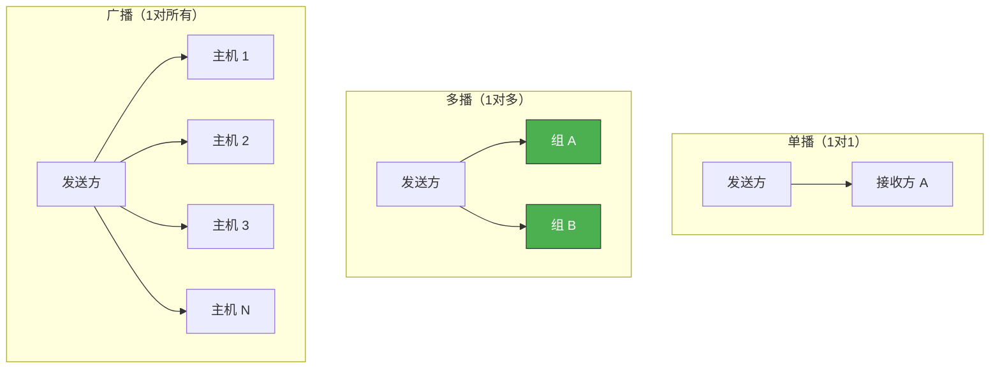
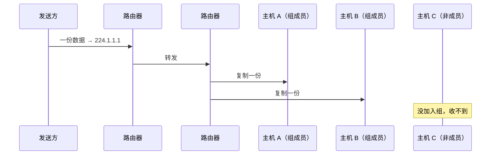

# 多播与广播

> 一对一通信是单播，一对所有是广播，一对多是多播。视频会议、直播推送等场景需要多播和广播来提高效率。

## 一、单播 vs 多播 vs 广播



| 类型 | 地址范围 | 接收方 | 效率 |
|------|---------|-------|------|
| 单播 | 普通 IP | 1 个 | 每个接收方要发一份 |
| 多播 | 224.0.0.0 ~ 239.255.255.255 | 加入组的成员 | 发一次，路由器复制 |
| 广播 | 255.255.255.255 或子网广播 | 同一子网所有主机 | 发一次，所有人收到 |

---

## 二、多播（Multicast）

### 2.1 多播的工作原理

发送方向一个**多播组地址**发送一份数据，网络中的路由器负责复制并转发给所有加入该组的成员：



### 2.2 多播套接字设置

发送方和接收方的设置不同：

**发送方**：设置 TTL（Time To Live），控制多播数据包能经过多少路由器。

```c
// 发送方设置
int send_sock = socket(AF_INET, SOCK_DGRAM, 0);

// 设置多播 TTL
int ttl = 64;  // 可经过 64 个路由器
setsockopt(send_sock, IPPROTO_IP, IP_MULTICAST_TTL, &ttl, sizeof(ttl));

// 发送到多播组地址
struct sockaddr_in mul_addr;
memset(&mul_addr, 0, sizeof(mul_addr));
mul_addr.sin_family = AF_INET;
mul_addr.sin_addr.s_addr = inet_addr("224.1.1.1");  // 多播组地址
mul_addr.sin_port = htons(9090);

char msg[] = "Multicast message";
sendto(send_sock, msg, strlen(msg), 0,
       (struct sockaddr*)&mul_addr, sizeof(mul_addr));
```

**接收方**：加入多播组，声明要接收发往该组的数据。

```c
// 接收方设置
int recv_sock = socket(AF_INET, SOCK_DGRAM, 0);

// 绑定本地地址
struct sockaddr_in local_addr;
memset(&local_addr, 0, sizeof(local_addr));
local_addr.sin_family = AF_INET;
local_addr.sin_addr.s_addr = htonl(INADDR_ANY);
local_addr.sin_port = htons(9090);
bind(recv_sock, (struct sockaddr*)&local_addr, sizeof(local_addr));

// 加入多播组
struct ip_mreq join_addr;
join_addr.imr_multiaddr.s_addr = inet_addr("224.1.1.1");  // 多播组地址
join_addr.imr_interface.s_addr = htonl(INADDR_ANY);        // 本机接口
setsockopt(recv_sock, IPPROTO_IP, IP_ADD_MEMBERSHIP,
           &join_addr, sizeof(join_addr));

// 接收数据
char buf[1024];
recvfrom(recv_sock, buf, sizeof(buf) - 1, 0, NULL, NULL);
```

### 2.3 ip_mreq 结构体

```c
struct ip_mreq {
    struct in_addr imr_multiaddr;  // 多播组地址
    struct in_addr imr_interface;  // 本机网络接口（INADDR_ANY = 任意）
};
```

### 2.4 多播 TTL

| TTL 值 | 范围 |
|--------|------|
| 0 | 限制在本机 |
| 1 | 限制在本子网（默认） |
| 32 | 限制在本站点 |
| 64 | 限制在本地区 |
| 128 | 限制在本大陆 |
| 255 | 不受限制 |

---

## 三、多播发送方完整代码

```c
// news_sender.c — 多播新闻发送方
#include <stdio.h>
#include <stdlib.h>
#include <string.h>
#include <unistd.h>
#include <sys/socket.h>
#include <arpa/inet.h>

#define BUF_SIZE 1024

int main(int argc, char *argv[]) {
    if (argc != 3) {
        printf("Usage: %s <multicast_addr> <port>\n", argv[0]);
        exit(1);
    }

    int send_sock = socket(AF_INET, SOCK_DGRAM, 0);
    if (send_sock == -1) {
        perror("socket() failed");
        exit(1);
    }

    // 设置 TTL
    int ttl = 64;
    setsockopt(send_sock, IPPROTO_IP, IP_MULTICAST_TTL, &ttl, sizeof(ttl));

    struct sockaddr_in mul_addr;
    memset(&mul_addr, 0, sizeof(mul_addr));
    mul_addr.sin_family = AF_INET;
    mul_addr.sin_addr.s_addr = inet_addr(argv[1]);
    mul_addr.sin_port = htons(atoi(argv[2]));

    char buf[BUF_SIZE];
    while (1) {
        fputs("Input news (Q to quit): ", stdout);
        fgets(buf, BUF_SIZE, stdin);
        if (!strcmp(buf, "q\n") || !strcmp(buf, "Q\n")) break;

        sendto(send_sock, buf, strlen(buf), 0,
               (struct sockaddr*)&mul_addr, sizeof(mul_addr));
    }

    close(send_sock);
    return 0;
}
```

---

## 四、多播接收方完整代码

```c
// news_receiver.c — 多播新闻接收方
#include <stdio.h>
#include <stdlib.h>
#include <string.h>
#include <unistd.h>
#include <sys/socket.h>
#include <arpa/inet.h>

#define BUF_SIZE 1024

int main(int argc, char *argv[]) {
    if (argc != 3) {
        printf("Usage: %s <multicast_addr> <port>\n", argv[0]);
        exit(1);
    }

    int recv_sock = socket(AF_INET, SOCK_DGRAM, 0);
    if (recv_sock == -1) {
        perror("socket() failed");
        exit(1);
    }

    struct sockaddr_in local_addr;
    memset(&local_addr, 0, sizeof(local_addr));
    local_addr.sin_family = AF_INET;
    local_addr.sin_addr.s_addr = htonl(INADDR_ANY);
    local_addr.sin_port = htons(atoi(argv[2]));

    if (bind(recv_sock, (struct sockaddr*)&local_addr, sizeof(local_addr)) == -1) {
        perror("bind() failed");
        exit(1);
    }

    // 加入多播组
    struct ip_mreq join_addr;
    join_addr.imr_multiaddr.s_addr = inet_addr(argv[1]);
    join_addr.imr_interface.s_addr = htonl(INADDR_ANY);
    setsockopt(recv_sock, IPPROTO_IP, IP_ADD_MEMBERSHIP,
               &join_addr, sizeof(join_addr));

    printf("Joined multicast group %s, listening on port %s\n", argv[1], argv[2]);

    char buf[BUF_SIZE];
    while (1) {
        int str_len = recvfrom(recv_sock, buf, BUF_SIZE - 1, 0, NULL, NULL);
        if (str_len <= 0) break;
        buf[str_len] = '\0';
        printf("News: %s", buf);
    }

    close(recv_sock);
    return 0;
}
```

```bash
# 启动多个接收方
./news_receiver 224.1.1.1 9090 &
./news_receiver 224.1.1.1 9090 &

# 启动发送方
./news_sender 224.1.1.1 9090
# 输入的消息会被所有接收方同时收到
```

---

## 五、广播（Broadcast）

### 5.1 广播的类型

| 类型 | 地址 | 范围 |
|------|------|------|
| 直接广播 | 子网广播地址（如 192.168.1.255） | 指定子网 |
| 受限广播 | 255.255.255.255 | 只在本子网 |

### 5.2 广播套接字设置

广播使用 UDP，发送方需要设置 `SO_BROADCAST` 选项：

```c
// broadcast_sender.c
#include <stdio.h>
#include <stdlib.h>
#include <string.h>
#include <unistd.h>
#include <sys/socket.h>
#include <arpa/inet.h>

#define BUF_SIZE 1024

int main(int argc, char *argv[]) {
    if (argc != 3) {
        printf("Usage: %s <broadcast_addr> <port>\n", argv[0]);
        exit(1);
    }

    int send_sock = socket(AF_INET, SOCK_DGRAM, 0);

    // 开启广播权限
    int bcast = 1;
    setsockopt(send_sock, SOL_SOCKET, SO_BROADCAST, &bcast, sizeof(bcast));

    struct sockaddr_in bcast_addr;
    memset(&bcast_addr, 0, sizeof(bcast_addr));
    bcast_addr.sin_family = AF_INET;
    bcast_addr.sin_addr.s_addr = inet_addr(argv[1]);
    bcast_addr.sin_port = htons(atoi(argv[2]));

    char buf[BUF_SIZE];
    while (1) {
        fputs("Input message (Q to quit): ", stdout);
        fgets(buf, BUF_SIZE, stdin);
        if (!strcmp(buf, "q\n") || !strcmp(buf, "Q\n")) break;

        sendto(send_sock, buf, strlen(buf), 0,
               (struct sockaddr*)&bcast_addr, sizeof(bcast_addr));
    }

    close(send_sock);
    return 0;
}
```

### 5.3 广播接收方

```c
// broadcast_receiver.c
#include <stdio.h>
#include <stdlib.h>
#include <string.h>
#include <unistd.h>
#include <sys/socket.h>
#include <arpa/inet.h>

#define BUF_SIZE 1024

int main(int argc, char *argv[]) {
    if (argc != 2) {
        printf("Usage: %s <port>\n", argv[0]);
        exit(1);
    }

    int recv_sock = socket(AF_INET, SOCK_DGRAM, 0);

    int opt = 1;
    setsockopt(recv_sock, SOL_SOCKET, SO_REUSEADDR, &opt, sizeof(opt));

    struct sockaddr_in local_addr;
    memset(&local_addr, 0, sizeof(local_addr));
    local_addr.sin_family = AF_INET;
    local_addr.sin_addr.s_addr = htonl(INADDR_ANY);
    local_addr.sin_port = htons(atoi(argv[1]));

    bind(recv_sock, (struct sockaddr*)&local_addr, sizeof(local_addr));

    char buf[BUF_SIZE];
    while (1) {
        int str_len = recvfrom(recv_sock, buf, BUF_SIZE - 1, 0, NULL, NULL);
        if (str_len <= 0) break;
        buf[str_len] = '\0';
        printf("Broadcast: %s", buf);
    }

    close(recv_sock);
    return 0;
}
```

```bash
# 接收方
./broadcast_receiver 9090

# 发送方（用子网广播地址）
./broadcast_sender 192.168.1.255 9090
# 或者用受限广播
./broadcast_sender 255.255.255.255 9090
```

---

## 六、多播 vs 广播

| 对比项 | 多播 | 广播 |
|--------|------|------|
| 接收方 | 只有所属组的成员 | 子网内所有主机 |
| 范围 | 可跨路由器 | 通常限制在子网内 |
| 效率 | 高（只有组成员处理） | 低（所有主机都收到并处理） |
| 地址 | 224.x.x.x ~ 239.x.x.x | 255.255.255.255 或子网广播 |
| 应用 | 视频会议、IPTV | ARP、DHCP 发现 |

::: warning 广播的代价
广播会占用子网内所有主机的 CPU——即使不需要数据，网卡也会接收并交给内核处理，内核检查端口号后才丢弃。这就是为什么广播应该尽量少用。
:::

---

::: tip 面试速查
- **多播**：发往组地址（224~239.x.x.x），只有加入组的成员收到，路由器负责复制。
- **广播**：发往 255.255.255.255 或子网广播地址，子网内所有主机收到。
- **多播发送方**：设置 IP_MULTICAST_TTL。
- **多播接收方**：设置 IP_ADD_MEMBERSHIP 加入组。
- **广播发送方**：设置 SO_BROADCAST。
- **多播可跨路由，广播通常不行**。
:::

---

::: info 原著参考
本文内容参考自尹圣雨《TCP/IP 网络编程》第 14 章"多播与广播"。
:::
